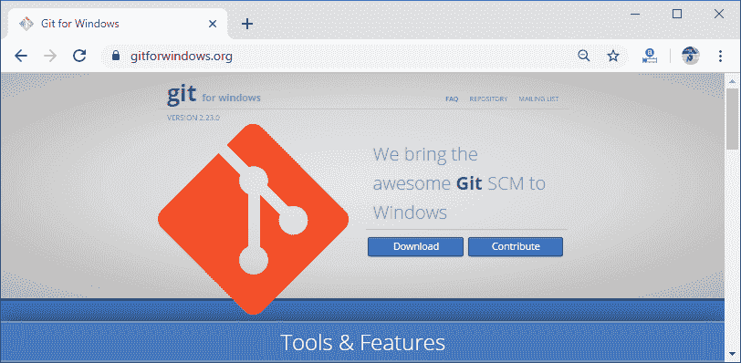
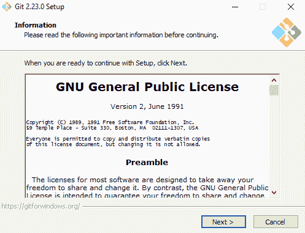
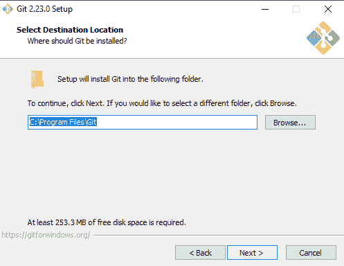
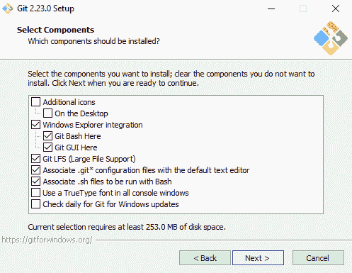
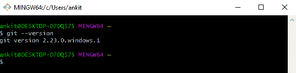
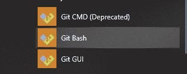

# 去吧，巴什

> 原文：<https://www.javatpoint.com/git-bash>

Git 可以定义为一组命令行实用程序，设计用于在 Windows 环境中执行。许多操作系统，如 Linux 和 macOS，都包含内置的 UNIX 命令行终端。它使 Linux 和 macOS 在与 Git 一起工作时成为互补的操作系统。Windows 没有 UNIX 风格的命令界面。取而代之的是，微软视窗使用视窗命令提示符，一种非 UNIX 终端。因此，Git for Windows 提供了一个 Bash 仿真来从命令行运行 Git。

换句话说，Git Bash 是一个应用程序，它在微软 Windows 环境中添加了一个仿真层，以使用 Git 命令行体验。它就像一个在 Windows 操作系统上安装一些常见 bash 实用程序的包。它允许我们在 Windows 的命令行界面中使用所有的 Git 特性以及大多数标准的 UNIX 命令。

## 如何安装 Git Bash

Git Bash 包含在“Git For Windows”包中。从官网下载最新版本的 Git Bash 包，和其他 Windows 应用一样安装。以下是下载“视窗 Git”的链接:

下载链接:[点击此处](https://gitforwindows.org/)



下载软件包后，运行可执行文件:



选择您想要安装 Git Bash 的有效路径:



选择要安装的适当组件，然后点击“下一步”按钮:



按照屏幕上的下一个说明完成安装。

要检查窗口的 Git 版本，请使用以下命令:

```

git --version

```

运行此命令后，输出如下所示:



## 启动 Git Bash

安装完成后，搜索名为“Git Bash”的图标，双击它启动 Git Bash。它将启动一个与 Git 集成的“bash shell”。



Git bash 的工作方式与标准 Bash 类似，对于回顾 Bash 的基本用法非常有用。它包括完整的 Git 核心命令集。它还与其他命令打包在一起，这些命令可以在 Git Bash 仿真的 **/usr/bin** 目录中找到。

这就是我们如何在 Windows 操作系统上使用 Bash Shell 脚本的方法。

* * *