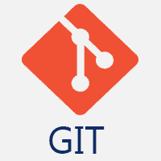
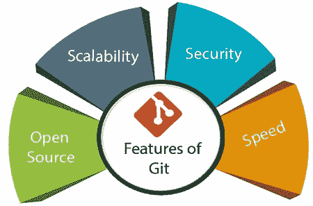
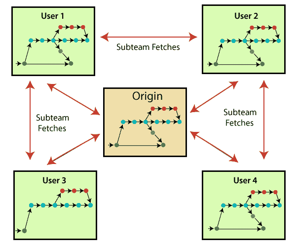
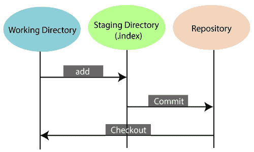
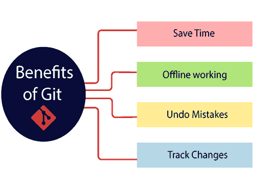
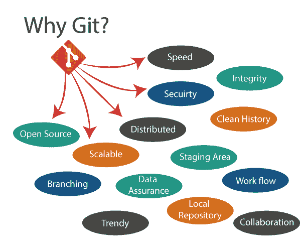

# Git 教程

> 哎哎哎:# t0]https://www . javatppoint . com/git

**Git 教程**提供了 Git 和 GitHub 的基本概念和高级概念。我们的 Git 教程是为初学者和专业人士设计的。

Git 是当今世界上应用广泛的现代**分布式版本控制**系统。开发它是为了高速高效地管理项目。版本控制系统允许我们在同一个工作区监控团队成员并与其一起工作。

本教程将帮助您通过命令行以及 [GitHub](https://www.javatpoint.com/what-is-github) 了解分布式版本控制系统 Git。本教程中的示例在**视窗**上执行，但我们也可以在其他操作系统上执行相同的操作，如 **Linux (Ubuntu)** 和 **MacOS** 。

## Git 是什么？

**Git** 是一个**开源分布式版本控制系统**。它旨在高速高效地处理小到大项目。开发它是为了协调开发者之间的工作。版本控制允许我们在同一个工作区跟踪团队成员并与其一起工作。

Git 是很多服务的基础，比如 **GitHub** 和 **GitLab** ，但是我们可以使用 Git 而不使用任何其他 Git 服务。Git 可以私下**使用**公开**使用**。

Git 是由 Linus Torvalds 在 2005 年的 T2 为了开发 Linux 内核而创建的。它也被用作重要的分布式版本控制工具**的 DevOps** 。

Git 易学，性能快。它优于其他配置管理工具，如 Subversion、CVS、Perforce 和 ClearCase。

## Git 的特点

Git 的一些显著特征如下:

*   **开源**
    Git 是一个**开源工具**。它是在 **GPL** (通用公共许可证)许可下发布的。
*   **可伸缩**
    Git 是**可伸缩**，这意味着当用户数量增加时，Git 可以轻松处理这种情况。
*   **分布式**
    Git 的一大特色就是它是**分布式**。分布式意味着我们可以创建整个存储库的“克隆”，而不是将项目切换到另一台机器上。此外，每个用户都有自己的存储库，包含项目的整个提交历史，而不是只有一个中央存储库来发送更改。我们不需要连接到远程存储库；更改只是存储在我们的本地存储库中。如果需要，我们可以将这些更改推送到远程存储库。

*   **安全**T2【Git】是安全的。它使用 **SHA1(安全散列函数)**来命名和识别其存储库中的对象。文件和提交在签出时通过其校验和进行检查和检索。它以这样一种方式存储其历史，即特定提交的标识依赖于导致该提交的完整开发历史。一旦发布，就不能对旧版本进行更改。
*   **速度**
    Git 非常**快**，所以一会就能完成所有任务。git 的大部分操作都是在本地存储库完成的，所以它提供了**的巨大速度**。此外，集中式版本控制系统不断地与某处的服务器通信。
    Mozilla 进行的性能测试显示，与其他 VCS 相比，**速度极快。从本地存储的存储库中获取版本历史比从远程服务器获取要快得多。Git** 的**核心部分是用 C 语言**编写的**，其**忽略了与其他高级语言相关的**运行时开销。
    Git 是为了在 Linux 内核上工作而开发的；因此**有能力**足以**有效处理大型** **存储库**。从一开始，**速度**和**性能**一直是 Git 的首要目标。**
*   **支持非线性开发**
    Git 支持**无缝分支和合并**，这有助于可视化和导航非线性开发。Git 中的一个分支代表一次提交。我们可以在它的父提交的帮助下构建全分支结构。
*   **分支合并**
    **分支合并**是 Git 的**大特色** s，使其区别于其他 SCM 工具。Git 允许**创建多个分支**，而不会相互影响。我们可以在分支上执行**创建**、**删除**、**合并**等任务，这些任务只需要几秒钟。以下是一些可以通过分支实现的功能:
    *   我们可以**为项目的一个新模块创建一个单独的分支**，随时提交和删除它。
    *   我们可以有一个**生产分支**，总是有什么投入生产，可以在测试分支合并测试。
    *   我们可以为实验创建一个**演示分支**，并检查它是否工作。如果需要，我们也可以移除它。
    *   分支的核心好处是，如果我们想将一些东西推送到远程存储库，我们不必推所有的分支。我们可以选择我们的几个分支，或者全部一起选择。
*   **数据保证**
    Git 数据模型保证了**我们项目每个单元的密码完整性**。它通过 **SHA 算法**为每个提交提供一个**唯一的提交标识**。我们可以通过提交标识**检索**和**更新**提交。大多数集中式版本控制系统默认不提供这种完整性。
*   **集结地**
    **集结地**也是 Git 的**独特功能**。它可以被认为是我们下一个提交的**预览，此外，一个**中间区域**，在那里提交可以在完成之前被格式化和检查。当您提交时，Git 接受暂存区中的更改，并将其作为新的提交。我们可以在临时区域中添加和删除更改。集结地可以被认为是 Git 存储变更的地方。
    虽然，Git 没有一个专用的暂存目录，可以存储一些表示文件变化的对象(blobs)。相反，它使用一个名为 index 的文件。**

**it is possible to quickly stage some of our files and commit them without committing other modified files in our working directory.**

*   **维护干净的历史**
    Git 用 Git Rebase 方便；这是 Git 最有用的特性之一。它从主分支获取最新的提交，并将我们的代码放在上面。因此，它保持了项目的干净历史。

## Git 的优势

版本控制应用程序允许我们跟踪我们在项目文件中所做的所有更改。每次我们对现有项目的文件进行更改时，我们都可以将这些更改推送到存储库。允许其他开发人员从存储库中提取您的更改，并继续使用您添加到项目文件中的更新。

使用 Git 的一些**显著好处**如下:

*   **节省时间**T2【Git】是闪电般快的技术。每个命令只需要几秒钟就可以执行，所以与登录 GitHub 帐户并了解其功能相比，我们可以节省大量时间。
*   **离线工作**
    Git 最重要的一个好处就是支持**离线工作**。如果我们面临互联网连接问题，它不会影响我们的工作。在 Git 中，我们几乎可以在本地做任何事情。相比之下，像 SVN 这样的其他 CVS 是有限的，更喜欢与中央存储库的连接。
*   **撤销错误**
    Git 的另一个好处是我们可以**撤销**的错误。有时候撤销对我们来说是一个拯救的选择。Git 提供了几乎所有的撤销选项。
*   **跟踪变更**
    Git 提供了一些令人兴奋的功能，如 **Diff、Log、**和 **Status** ，允许我们跟踪变更，以便我们可以**检查状态，比较**我们的文件或分支。

## 你为什么要走？

我们已经讨论了 Git 的许多**特性**和**优势**，这无疑证明了 Git 是**领先的版本控制系统**。现在，我们将讨论为什么我们应该选择 Git 的其他一些要点。

*   **Git Integrity**
    Git 是**为确保****安全**和**内容完整性**被版本控制而开发的。它在传输或篡改文件系统期间使用校验和来确认信息没有丢失。在内部，它根据文件内容创建校验和值，然后在传输或存储数据时进行验证。
*   **新潮版本控制系统**
    Git 是**应用最广泛的版本控制系统**。在所有版本控制系统中，它有**个最大项目**。由于其**惊人的工作流程**和特性，是开发者的首选。
*   **一切都是本地的**
    Git 几乎所有的操作都可以在本地进行；这是使用 Git 的一个重要原因。我们不必确保互联网连接。
*   **合作开展公共项目**
    GitHub 上有很多公共项目。我们可以在这些项目上合作，向世界展示我们的创造力。许多开发商在公共项目上进行合作。这种合作使我们能够与有经验的开发人员站在一起，并从他们身上学到很多东西；因此，它使我们的编程技能更上一层楼。
*   **打动招聘人员**
    我们可以通过在简历中提到 Git 和 GitHub 来打动招聘人员。将您的 GitHub 个人资料链接发送到您想要加入的组织的人力资源部门。展示你的技能，并通过你的工作影响他们。这增加了被雇用的机会。

## 先决条件

Git 不是编程语言，所以你应该只对 Windows 命令有基本的了解。

## 观众

我们已经为初学者和专业人士开发了这个 Git 教程，因为我们已经从头开始了这个教程。所以它会帮助你快速学习 Git。

## 问题

我们向您保证，您不会在我们的 Git 教程中发现任何困难。但是，如果你发现任何错误，你可以在我们的评论区发布。

* * *