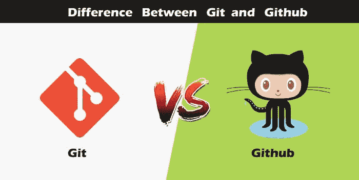
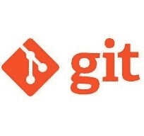

# git 和 gitHub 的区别

> 哎哎哎:1230【https://www . javatppoint . com/git-vs-github】

如今编程语言的措辞非常直观。通过听到一种特定语言的名字，我们开始想象它会是什么。

[Java](https://www.javatpoint.com/java-tutorial)[Javascript](https://www.javatpoint.com/javascript-tutorial)与火腿和仓鼠的名字非常相似，[蟒蛇](https://www.javatpoint.com/python-tutorial)的 logo 与蛇的形象交织在一起。

因此，有人看 git 和 github 会发现它们之间有任何明显的联系。让我们详细看看 git 和 github 以及它们之间的区别。

## Git

定义 [git](https://www.javatpoint.com/git) 的词很多，但用更简单的话来说就是一个开源的分布式版本控制系统。

让我们分解定义中的每个组成部分并理解它。

*   **开源-** 在特定许可下发布的一类计算机软件。用户被授予使用代码、修改代码、给出建议、克隆代码以添加新功能的权限。换句话说，如果软件是开源的，它是以公开的方式合作开发的。开源软件比权威机构或公司更便宜、更灵活、持续时间更长。源代码中的产品包括代码、文档、格式，供用户理解和贡献。使用开源项目可以扩展以更新或修改当前功能。Unix 和 Linux 是开源软件的例子。
*   **控制系统-** 一个控制系统的工作就是对内容进行跟踪。换句话说，git 用于存储内容，为用户提供服务和功能。
*   **版本控制系统-** 就像一个 app 因为 bug 和附加功能添加、版本变更而有不同的更新一样，git 也支持这个功能。许多开发人员可以并行添加他们的代码。因此，版本控制系统可以轻松管理之前完成的所有更新。
    Git 提供了分支的特性，其中更新的代码可以被完成，然后它可以与主分支合并，使其对用户可用。它不仅使一切井然有序，而且保持开发人员之间的同步，以避免任何事故。版本控制系统的其他例子有 Helix core、微软 TFS 等。
*   **分布式版本控制系统-** 这里的分布式版本控制系统是指如果一个开发者贡献了开源，那么代码也会在他的远程存储库中可用。开发人员更改他的本地存储库，然后创建一个拉请求，将他的更改合并到中央存储库中。因此，单词 distributed 意味着代码存储在中央服务器中，并存储在每个开发人员的远程系统中。

**为什么需要 git？**

当团队在实际项目中工作时，git 有助于确保开发人员之间没有代码冲突。此外，项目需求经常变化。所以 git 管理所有的版本。如果需要，我们还可以回到原始代码。分支的概念允许几个项目在同一个代码库中运行。

## 开源代码库

通过名称，我们可以想象它是一个枢纽、项目、社区等。 [GitHub](https://www.javatpoint.com/github) 是一个 [Git 资源库](https://www.javatpoint.com/git-repository)托管服务，提供基于网络的图形界面。它是世界上最大的社区。每当一个项目是开源的，这个特定的存储库就会向公众公开，并邀请几个人来贡献。

github 上有几个项目的源代码，开发者可以用任何方式使用。

使用 github，许多开发人员可以远程处理单个项目，因为它促进了协作。

**gitHub 的特点**

*   使用 github，项目经理可以就任何变更进行协作、审查和指导开发人员。这使得项目管理变得容易。
*   github 存储库可以是公共的，也可以是私有的。从而在项目中保证组织的安全。
*   GitHub 有一个拉请求和拉问题的特性，在这个特性中，所有的开发人员都可以呆在同一个页面上进行组织。
*   所有代码及其文档都在同一个存储库中的一个位置。因此，它使代码托管变得容易。
*   github 使用一些特殊的工具来识别代码中的漏洞，而其他软件没有这些工具。因此，从代码开始到启动，开发人员都很安全。
*   Github 可用于移动和桌面。用户界面是如此的友好，以至于很容易适应和使用它。

* * *