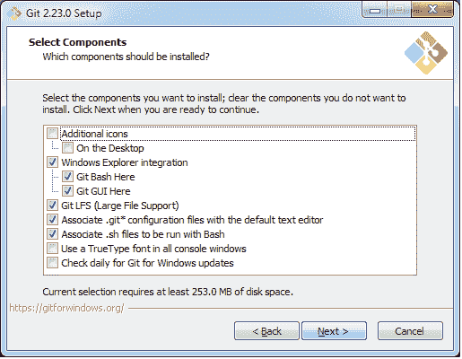
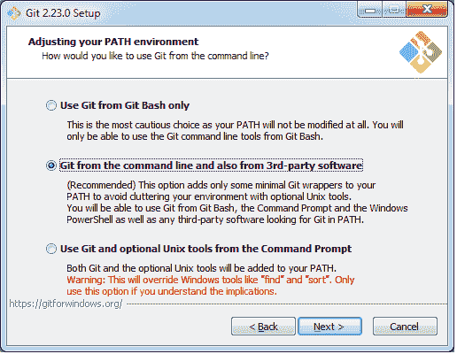
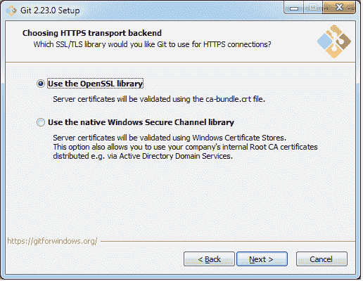
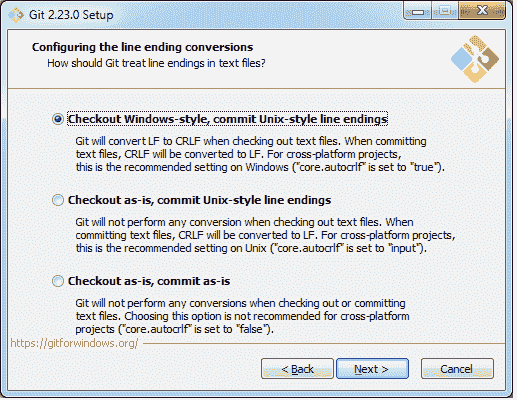
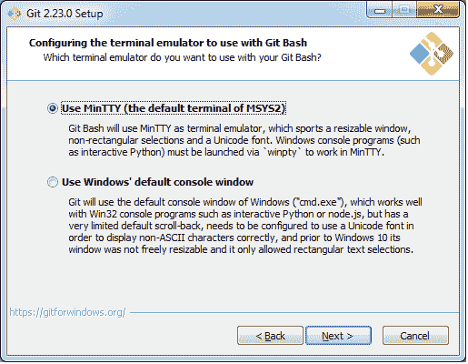
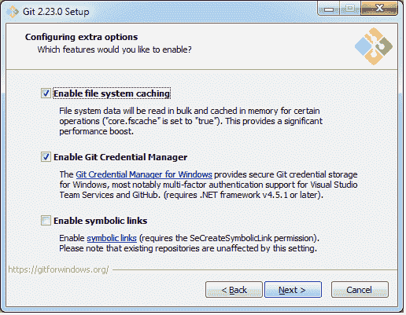
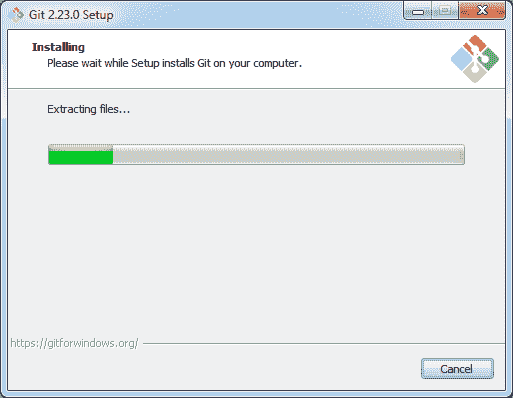
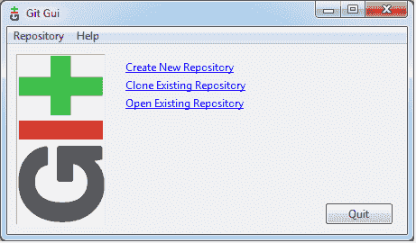
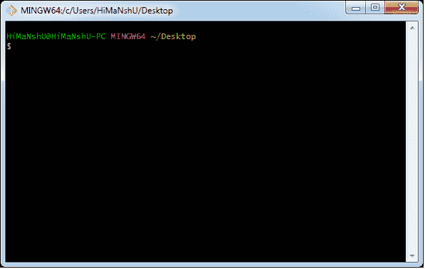

# 如何在 Windows 上安装 Git

> 原文：<https://www.javatpoint.com/how-to-install-git-on-windows>

要使用 Git，你必须把它安装在你的电脑上。即使您已经安装了 Git，将其升级到最新版本也可能是个好主意。您可以将它作为一个软件包安装，或者通过另一个安装程序安装，或者从其官方网站下载。

现在问题来了，如何下载 Git 安装程序包。下面是帮助您下载和安装 Git 的分步安装过程。

## 如何下载 Git？

**第一步**

要下载 Git 安装程序，请访问 Git 的官方网站并转到下载页面。下载页面的链接是[https://git-scm.com/downloads](https://git-scm.com/downloads)。该页面看起来像

点击页面上给出的包**下载 windows 2 . 23 . 0**。选择软件包后，下载将开始。

现在，已经下载了 Git 安装程序包。

## 安装 Git

**第二步**

点击下载的安装程序文件，选择**是**继续。选择**是**后，安装开始，屏幕显示如下

点击**下一步**继续。

**第三步**

在此步骤中，会自动选择默认组件。您也可以选择所需的零件。

单击“下一步”继续。

**第四步**

默认的 Git 命令行选项是自动选择的。你可以选择你的首选。点击**下一步**继续。

**第五步**

默认传输后端选项在此步骤中选择。点击**下一步**继续。

**第六步**

选择所需的行结束选项，然后单击“下一步”继续。

**第七步**

选择首选终端仿真器点击**下一步**继续。

**第八步**

这是提供一些额外功能的最后一步，如系统缓存、凭据管理和符号链接。选择需要的特征，点击下一个选项**。**

**第九步**

在此步骤中，将提取文件。

因此，Git 安装完成了。现在你可以访问 **Git Gui** 和 **Git Bash** 。

**Git Gui** 看起来像

它有三个特点。

*   创建新存储库
*   克隆现有存储库
*   打开现有存储库

Git Bash 看起来像

* * *