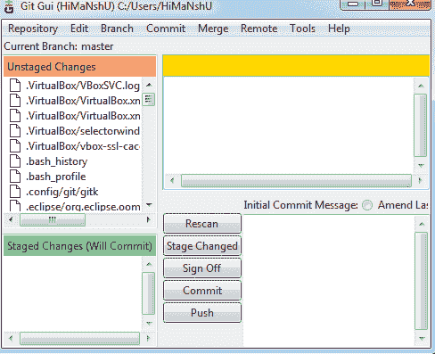
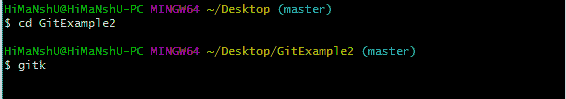
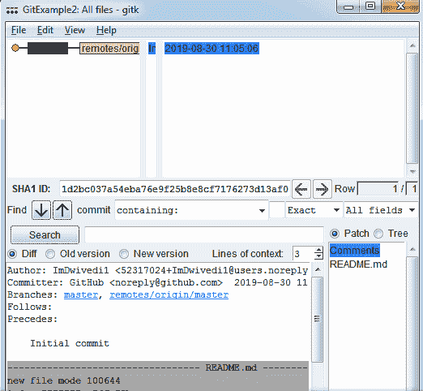

# 转到工具

> 原文：<https://www.javatpoint.com/git-tools>

为了探索 Git 的强大功能，我们需要一些工具。Git 自带一些工具，比如 Git Bash、Git GUI 等，提供机器和用户之间的接口。它支持内置和第三方工具。

Git 自带内置的 GUI 工具，如 **git bash** 、 **git-gui** 、 **gitk** 用于提交和浏览。它还支持几个第三方工具，供寻求特定平台体验的用户使用。

## Git 包工具

Git 提供了强大的功能来探索它。我们需要很多工具，比如命令、命令行、Git GUI。让我们了解一些基本的打包工具。

### 命令行

Git Bash 是一个适用于 Windows 环境的应用程序。它被用作窗口的 Git 命令行。Git Bash 为 Git 命令行体验提供了一个仿真层。Bash 是**伯恩再次外壳**的缩写。Git 包安装程序包含 bash、Bash 实用程序和 Windows 操作系统上的 Git。

Bash 是 Linux 和 macOS 上的标准默认外壳。shell 是一个终端应用程序，用于通过命令创建与操作系统的接口。

默认情况下，Git 窗口包包含 Git Bash 工具。我们可以通过右键单击窗口资源管理器中的文件夹来访问它。

#### Git Bash 命令

Git Bash 附带了一些存储在 Git Bash 仿真的 **/usr/bin** 目录中的附加命令。Git Bash 可以在 Windows 上提供强大的外壳体验。Git Bash 附带了一些基本的 shell 命令，如 **Ssh** 、 **scp** 、 **cat** 、 **find** 。

git Bash 还包括全套 git 核心命令，如 **git 克隆、Git 提交、Git 结账、Git 推送**等。

### Git GUI

Git GUI 是 Git BASH 的强大替代品。它提供了 Git 命令行函数的图形化版本，以及全面的可视化 diff 工具。我们可以通过在 windows 资源管理器中的文件夹或位置上单击鼠标右键来访问它。此外，我们可以通过命令行输入下面的命令来访问它。

```

$ git gui

```


一个弹出窗口将作为 Git gui 工具打开。Git 图形用户界面的界面如下所示:



Git 通过一些用于提交(git-gui)和浏览(gitk)的内置 GUI 工具来提供便利，但是也有许多第三方工具供寻求特定平台体验的用户使用。

### 吉特克

gitk 是一个图形化的历史查看工具。这是一个强大的图形用户界面外壳，覆盖了 **git log** 和 **git grep** 。此工具用于查找过去发生的事情或可视化项目的历史。

Gitk 可以从命令行调用。只需将目录更改为 Git 存储库，然后键入:

```

$ gitk [git log options]

```



该命令调用 gitk 图形界面并显示项目历史。Gitk 界面如下所示:



Gitk 支持几个命令行选项，其中大部分被传递给底层的 git 日志操作。

## Git 第三方工具

市场上有许多第三方工具可以用来增强 Git 的功能，并提供改进的用户界面。这些工具可用于不同的平台，如视窗、苹果、Linux、安卓、iOS。

流行的第三方 Git 工具列表如下:

| 工具 | 平台 | 价格 | 许可证类型 |
| Windows 操作系统 | 苹果个人计算机 | Linux 操作系统 | 机器人 | ios |
| sourcetree(资源分区) | 是 | 是 | 不 | 不 | 不 | 自由的 | 所有人 |
| GitHub 台式机 | 是 | 是 | 不 | 不 | 不 | 自由的 | 用它 |
| 乌龟大师 | 是 | 不 | 不 | 不 | 不 | 自由的 | GNU GPL 协议 |
| Git 扩展 | 是 | 是 | 是 | 不 | 不 | 自由的 | GNU GPL 协议 |
| 吉克拉肯 | 是 | 是 | 是 | 不 | 不 | 免费/$29/$49 | 所有人 |
| 智能 Git | 是 | 是 | 是 | 不 | 不 | 79 美元/用户/非商业用途免费 | 所有人 |
| 塔 | 是 | 是 | 不 | 不 | 不 | 79 美元/用户(30 天免费试用) | 所有人 |
| 快起来 | 不 | 是 | 不 | 不 | 不 | 自由的 | GNU GPL 协议 |
| 老大 | 是 | 是 | 是 | 不 | 不 | 自由的 | 所有人 |
| gitg | 是 | 不 | 是 | 不 | 不 | 自由的 | GNUGPL |
| 吉塔 2 号 | 不 | 不 | 不 | 不 | 是 | 应用内购买免费 | 所有人 |
| 取驱动器号 | 不 | 不 | 不 | 不 | 是 | 应用内购买免费 | 所有人 |
| giftfinder | 不 | 是 | 不 | 不 | 不 | $24.95 | 所有人 |
| SnailGit | 不 | 是 | 不 | 不 | 不 | &9.99/Lite 版本 | 所有人 |
| 口袋旅游 | 不 | 不 | 不 | 是 | 不 | 1.99€ | 所有人 |
| 崇高的融合 | 是 | 是 | 是 | 不 | 不 | 99 美元/用户，75 美元年度商务套餐，免费评估 | 所有人 |

* * *