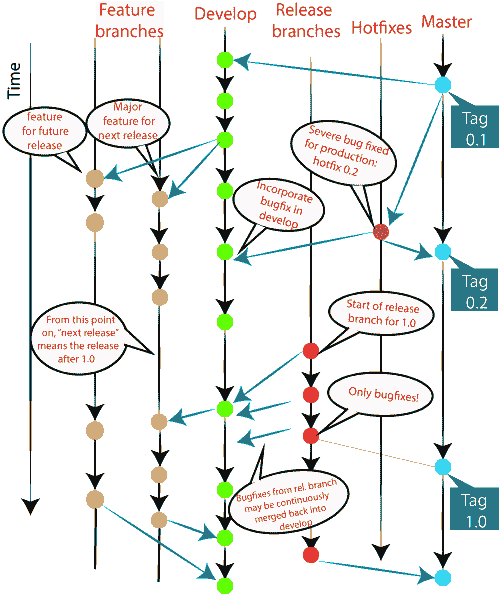
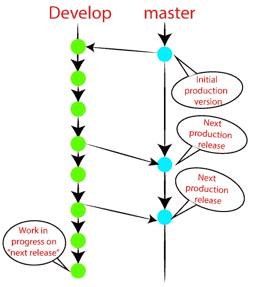
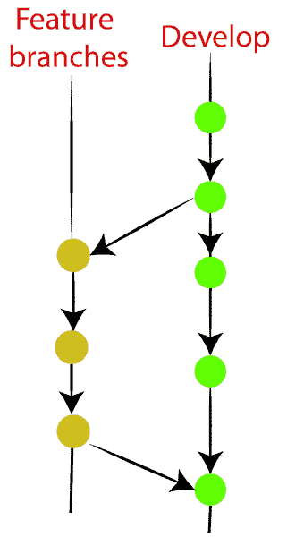
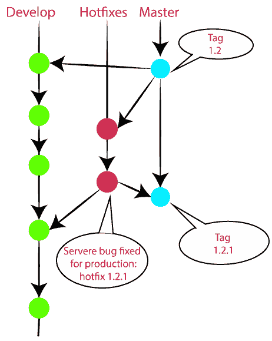

# Git 流/ Git 分支模型

> 原文：<https://www.javatpoint.com/git-flow>

Git 流是开发人员在使用 Git 时可以遵循的一组准则。我们不能把这些准则说成是规则。这些不是规则；这是理想项目的标准。这样开发人员就可以很容易地理解这些事情。

它被开发人员称为**分支模型**，并作为项目的中央存储库。开发人员工作并将他们的工作推送到主存储库的不同分支。

项目中有不同类型的分支。根据标准的分支策略和发布管理，可以有以下类型的分支:

*   **大师**
*   **开发**
*   **修复补丁**
*   **释放分支**
*   **特征分支**

每个分支都有它的意义和标准。让我们了解每个分支及其用法。

## 主要分支

分支模型的两个分支被认为是项目的主要分支。这些分支如下:

*   **主**
*   **开发**

### 主分支

主分支是项目的主要分支，包含最终变更的所有历史。每个开发人员都必须习惯于主分支。主分支包含 HEAD 的源代码，它总是反映项目的最终版本。

本地存储库的主分支总是与远程存储库的主分支保持同步。

建议不要惹主人。如果您编辑了组项目的主分支，您的更改会影响其他所有人，并且很快会出现合并冲突。

### 发展分部

它与主分支平行。它也被认为是项目的主要分支。这个分支包含下一个版本的最新开发变更。它有这个版本的最终源代码。也称为“**整合分支**”

当开发分支达到一个稳定点并准备发布时，它应该与 master 合并，并用发布版本进行标记。

## 支持分支机构

开发模型需要各种支持分支来进行并行开发、跟踪特性、帮助快速修复和发布以及其他问题。这些分支的寿命有限，使用后会被移除。

我们可能使用的不同类型的支持分支如下:

*   **特征分支**
*   **释放分支**
*   **修复分支**

这些分支中的每一个都是为了特定的目的而建立的，并且都有一些合并目标。从技术角度来看，这些分支非常重要。

### 特征分支

特征分支可视为主题分支。它用于为项目的下一个版本开发新功能。这个分支的存在是有限的；在它的功能与开发分支合并后，它将被删除。

要了解如何创建功能分支[请访问此处](https://www.javatpoint.com/git-branch)。

### 释放分支

版本分支是为支持新版本版本而创建的。高级开发人员将创建一个发布分支。释放分支将包含预定数量的特征分支。发布分支应该部署到临时服务器上进行测试。

允许开发人员修复小的错误，并为这个分支上的发布准备元数据。完成所有这些任务后，它可以与开发分支合并。

当所有目标特征被创建后，它可以与开发分支合并。发布分支的一些常用标准如下:

*   通常，高级开发人员会创建一个发布分支。
*   释放分支将包含预定数量的特征分支。
*   发布分支应该部署到临时服务器上进行测试。
*   任何需要改进的 bug 都必须在发布分支解决。
*   发布分支必须与主分支合并回开发中。
*   合并后，发布分支和开发分支必须用版本号标记。

要创建发布分支，请访问 [Git 分支](https://www.javatpoint.com/git-branch)。

要在合并发布分支后标记分支，请访问 [Git 标记](https://www.javatpoint.com/git-tags)。

### 修复分支

修复分支类似于发布分支；两者都是为新的生产版本而创建的。

修复分支是由于对项目的即时操作而产生的。在生产版本中出现关键错误的情况下，修复分支可能会在您的项目中分支。修复错误后，这个分支可以用一个标记与主分支合并。

* * *