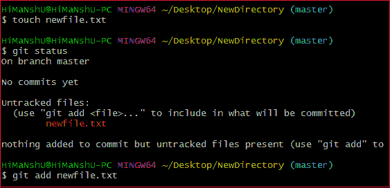
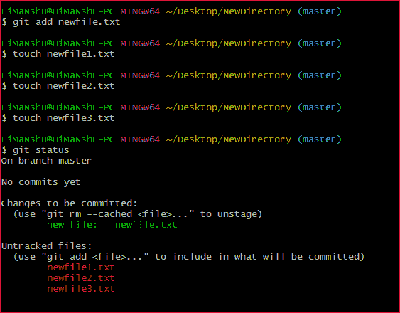
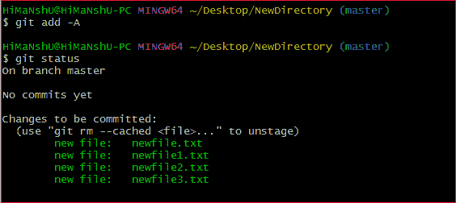
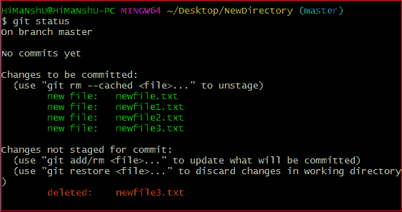
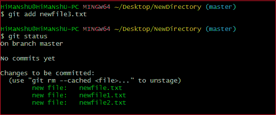

# 去把它给我

> 原文：<https://www.javatpoint.com/git-add>

git add 命令用于将文件内容添加到[索引(临时区域)](https://www.javatpoint.com/git-index)中。此命令将工作树的当前内容更新到临时区域。它还为下一次提交准备暂存的内容。每次我们在项目中添加或更新任何文件时，都需要将更新转发到临时区域。

git add 命令是 git 技术的核心部分。它通常一次添加一个文件，但是有一些选项可以同时添加多个文件。

“索引”包含工作树数据的快照。该快照将被转发用于下一次提交。

git add 命令可以在提交之前运行多次。所有这些添加操作都可以放在一个提交下。add 命令添加在命令行中指定的文件。

git 添加命令不添加[。默认情况下 gitignore](https://www.javatpoint.com/git-ignore) 文件。事实上，我们可以通过这个命令忽略这些文件。

让我们了解一下如何在 Git 上添加文件？

## Git 添加文件

Git add 命令是一个直接的命令。它将文件添加到临时区域。我们可以在临时区域一次添加一个或多个文件。它将运行为:

```

$ git add <File name>

```

上面的命令被添加到 git 临时区域，但是它不能在版本控制系统上共享。需要提交操作来共享它。让我们理解下面的场景。

我们已经在**新目录**中为新创建的存储库创建了一个文件。要创建文件，请按如下方式使用 touch 命令:

```

$ touch newfile.txt

```

并通过 git status 命令检查状态是否未被跟踪，如下所示:

```

$ git status

```

上面的命令将显示存储库中未跟踪的文件。这些文件可以添加到我们的存储库中。我们知道我们已经创建了一个 newfile.txt，所以要添加这个文件，运行下面的命令:

```

$ git add newfile.txt

```

考虑以下输出:



从上面的输出中，我们可以看到 **newfile.txt** 已经添加到我们的存储库中。现在，我们必须承诺在 Git 上共享它。

## 去把所有东西都拿来

我们可以在 Git 中添加多个文件，但是我们必须重复运行 add 命令。Git 为我们提供了一个独特的 add 命令选项，通过它我们可以一次添加所有可用的文件。要添加存储库中的所有文件，请使用 **-A** 选项运行添加命令。我们可以用“.”而不是**-一个**选项。该命令将一次转移所有文件。它将按如下方式运行:

```

$ git add -A

```

或者

```

$ git add .

```

上述命令将添加存储库中所有可用的文件。考虑以下场景:

我们可以创建四个新文件，也可以复制它，然后一次添加所有这些文件。考虑以下输出:



在上面的输出中，Git 将所有文件显示为未跟踪的文件。要同时跟踪所有这些文件，请运行以下命令:

```

$ git add -A

```

上述命令会将所有文件添加到临时区域。请记住， **-A** 选项区分大小写。考虑以下输出:



在上面的输出中，所有文件都已添加。所有文件的状态显示为暂存。

## 从临时区域删除文件

git add 命令也用于从临时区域删除文件。如果我们从存储库中删除一个文件，那么它就可以作为一个未跟踪的文件被存储库使用。add 命令用于将其从临时区域中删除。这听起来很奇怪，但 Git 可以做到。考虑以下场景:

我们已经从存储库中删除了 **newfile3.txt** 。删除文件后存储库的状态如下:



从上面的输出中我们可以看到，删除的文件在暂存区中仍然可用。要将其从索引中删除，请按如下方式运行以下命令:

```

$ git add newfile3.txt

```

考虑以下输出:



从上面的输出中，我们可以看到文件已经从暂存区中移除。

## 仅添加所有新文件和更新文件:

Git 允许我们一次只存放更新的和新创建的文件。我们将使用忽略删除选项来实现这一点。它将按如下方式使用:

```

$ git add --ignore-removal .

```

## 添加所有修改和删除的文件

Git add 为我们提供了多种选择。Git 中还有另一个选项，允许我们只存放修改和删除的文件。它不会暂存新创建的文件。要仅暂存所有已修改和已删除的文件，请运行以下命令:

```

$ git add -u

```

## 通过通配符添加文件

Git 允许我们一次添加所有相同的模式文件。这是将多个文件添加到一起的另一种方法。假设我想添加所有的 java 文件或文本文件，那么我们可以使用模式。为此，我们将运行如下命令:

```

$ git add *.java

```

上面的命令将暂存所有的 Java 文件。相同的模式将应用于文本文件。

添加文件后的下一步是承诺在 Git 上共享它。

## 去把它给我

我们可以撤销 git 添加操作。但是，它不是 git add 命令的一部分，但是我们可以通过 git reset 命令来实现。

要撤消添加操作，请运行以下命令:

```

$ git reset <filename>

```

要了解更多 git 复位命令，请访问 [Git 复位](https://www.javatpoint.com/git-reset)。

* * *