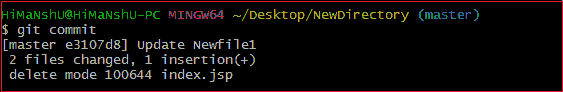
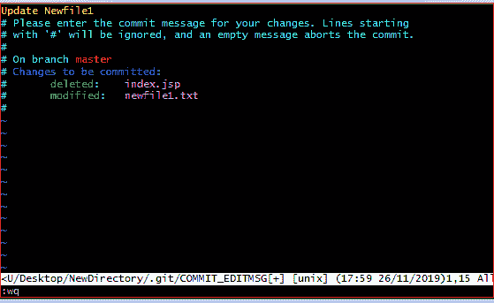
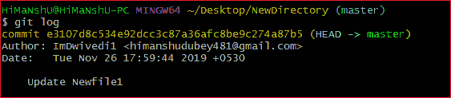
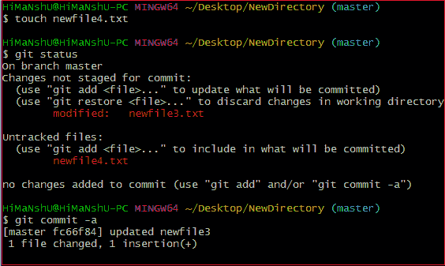
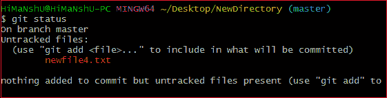
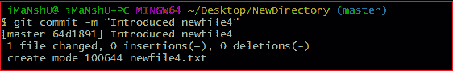

# 去吧，Committee

> 原文：<https://www.javatpoint.com/git-commit>

它用于记录存储库中的更改。这是 [git add](https://www.javatpoint.com/git-add) 之后的下一个命令。每次提交都包含索引数据和提交消息。每个提交都会形成一个父子关系。当我们在 Git 中添加一个文件时，它将发生在临时区域。提交命令用于将更新从临时区域提取到存储库。

登台和提交是相互关联的。暂存允许我们继续对存储库进行更改，当我们想要将这些更改共享给版本控制系统时，提交允许我们记录这些更改。

提交是项目的快照。每次提交都记录在存储库的主分支中。我们可以撤回提交或将其恢复到旧版本。两个不同的提交永远不会覆盖，因为每个提交都有自己的提交 id。这个提交标识是由 **SHA(安全散列算法)**算法创建的密码。

让我们看看不同类型的提交。

## git 提交命令

commit 命令将提交更改并生成一个 commit-id。没有任何参数的 commit 命令将打开默认文本编辑器并请求提交消息。我们可以在文本编辑器中指定我们的提交消息。它将按如下方式运行:

```

$ git commit

```

上面的命令将提示一个默认编辑器，并要求提交消息。我们已经对 **newfile1.txt** 进行了更改，希望它提交。可以通过以下方式完成:

考虑以下输出:



当我们运行该命令时，它将提示一个默认的文本编辑器并要求提交消息。文本编辑器如下所示:



按下 **Esc** 键，然后按下 **I** 进入插入模式。键入您想要的提交消息。之后按下**Esc**:**:wq**保存并退出编辑器。因此，我们成功地做出了承诺。

我们可以通过 git 日志命令检查提交。考虑以下输出:



在上面的输出中，我们可以看到日志选项正在显示提交 id、作者详细信息、日期和时间以及提交消息。

要了解更多关于日志选项的信息，请访问 [Git 日志](https://www.javatpoint.com/git-log)。

## Git commit -a

提交命令还提供了**-一个**选项来指定一些提交。它用于提交所有更改的快照。这个选项只考虑 Git 中已经添加的文件。它不会提交新创建的文件。考虑以下场景:

我们已经对已经暂存的文件 newfile3 进行了一些更新，并创建了一个文件 newfile4.txt。检查存储库的状态，并按如下方式运行 commit 命令:

```

$ git commit -a

```

考虑输出:



上面的命令将提示我们的默认文本编辑器，并要求提交消息。键入提交消息，然后保存并退出编辑器。此过程将只提交已经添加的文件。它不会提交尚未暂存的文件。考虑以下输出:



正如我们在上面的输出中看到的，newfile4.txt 还没有提交。

## 去吧，委员

commit 命令的-m 选项允许您在命令行上编写 commit 消息。该命令不会提示文本编辑器。它将按如下方式运行:

```

$ git commit -m "Commit message."

```

上面的命令将使用给定的提交消息进行提交。考虑以下输出:



在上面的输出中，一个 **newfile4.txt** 通过提交消息提交给我们的存储库。

我们也可以对已经暂存的文件使用 **-am** 选项。此命令将立即用提交消息提交已转移的文件。它将按如下方式运行:

```

$ git commit -am "Commit message."

```

## Git 提交修改(更改提交消息)

修改选项允许我们编辑最后一次提交。如果我们不小心提交了错误的提交消息，那么这个特性对我们来说是一个野蛮的选择。它将按如下方式运行:

```

$ git commit -amend

```

上述命令将提示默认文本编辑器，并允许我们编辑提交消息。

我们可能需要一些与提交相关的其他基本操作，如恢复提交、撤消提交等，但这些操作不是提交命令的一部分。我们可以用其他命令来完成。一些基本操作如下:

*   Git 撤销提交:访问 [Git 重置](https://www.javatpoint.com/git-reset)
*   Git 恢复提交:访问 [Git 恢复](https://www.javatpoint.com/git-revert)
*   git 移除提交:访问 [Git Rm](https://www.javatpoint.com/git-rm)

* * *