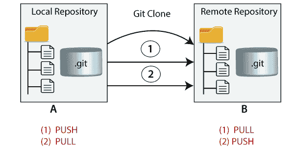
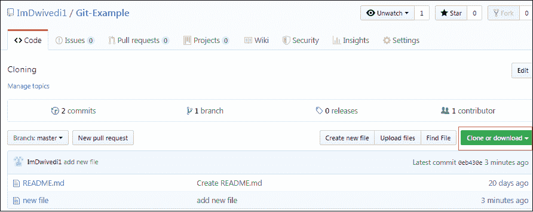
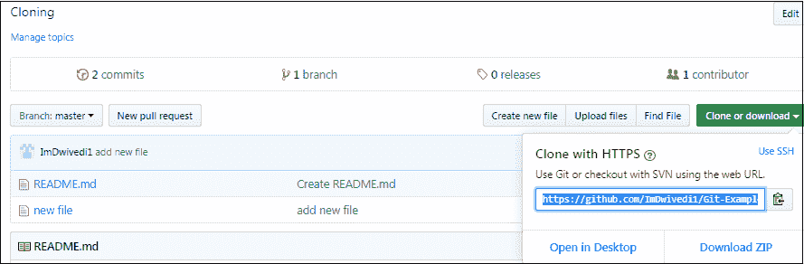
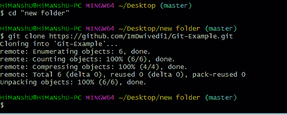
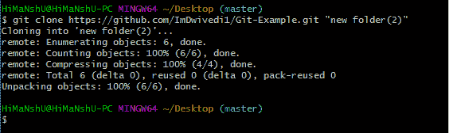
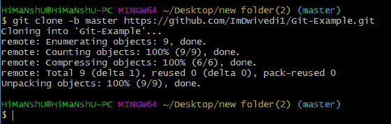

# Git 克隆

> 原文：<https://www.javatpoint.com/git-clone>

在 Git 中，克隆是复制任何目标存储库的行为。目标存储库可以是远程的或本地的。您可以从远程存储库中克隆您的存储库，以便在您的系统上创建本地副本。此外，您可以在两个位置之间同步。



## Git 克隆命令

**git 克隆**是一个命令行工具，用于制作远程存储库的本地副本。它通过远程网址访问存储库。

通常，原始存储库位于远程服务器上，通常来自 GitHub、Bitbucket 或 GitLab 等 Git 服务。远程存储库网址指的是**原点**。

**语法:**

```

$ git clone <repository URL>

```

* * *

## Git 克隆存储库

假设，您想要从 GitHub 克隆一个存储库，或者让一个现有的存储库归您想要贡献的任何其他用户所有。克隆存储库的步骤如下:

第一步:

打开 GitHub，导航到存储库的主页。

第二步:

在存储库名称下，点击**克隆或下载**。



第三步:

选择**用 HTTPs 克隆部分**和**复制存储库的克隆网址**。对于空的存储库，您可以从浏览器中复制存储库页面网址并跳到下一步。



第四步:

打开 Git Bash，将当前工作目录更改到您想要创建存储库本地副本的位置。

第五步:

使用带有存储库 URL 的 git clone 命令来创建远程存储库的副本。请参见下面的命令:

```

$ git clone https://github.com/ImDwivedi1/Git-Example.git

```

现在，按回车键。因此，您的本地克隆存储库将被创建。请参见以下输出:



## 将存储库克隆到特定的本地文件夹中

Git 允许将存储库克隆到一个特定的目录，而无需切换到那个特定的目录。您可以在 git clone 命令中将该目录指定为下一个命令行参数。请参见下面的命令:

```

$ git clone https://github.com/ImDwivedi1/Git-Example.git "new folder(2)"

```



给定的命令执行与前一个命令相同的操作，但是目标目录被切换到指定的目录。

Git 还有另一个传输协议，叫做 SSH 协议。上面的例子使用的是 git://协议，但是也可以使用 http(s)://或者[【email protected】](/cdn-cgi/l/email-protection):/path . git，使用的是 SSH 传输协议。

* * *

## 吉特克隆分公司

Git 只允许从存储库中复制一个特定的分支。您可以使用 git clone 命令为各个分支创建一个目录。要创建克隆分支，您需要使用-b 命令指定分支名称。以下是克隆特定 git 分支的命令语法:

**语法:**

```

$ git clone -b <Branch name><Repository URL>

```

请参见下面的命令:

```

$ git clone -b master https://github.com/ImDwivedi1/Git-Example.git "new folder(2)"

```



在给定的输出中，只有主分支是从主体存储库 Git-Example 克隆的。

* * *