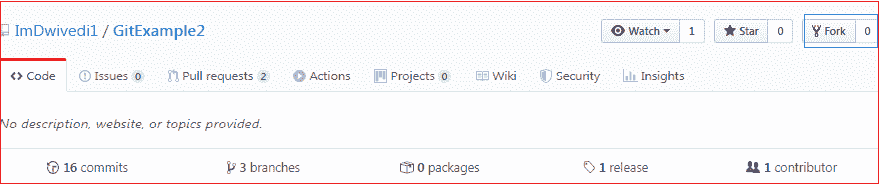
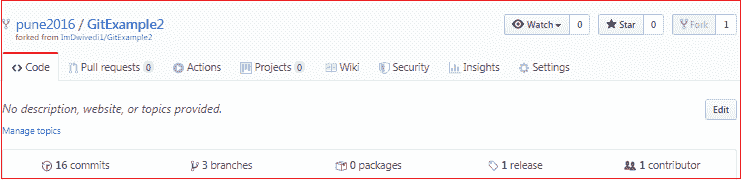

# 去吧福克

> 哎哎哎:# t0]https://www . javatppoint . com/git-fork

分叉是存储库的粗略副本。分叉存储库允许您在不影响原始项目的情况下自由地测试和调试变更。分叉的一个过度使用是建议修改错误修复。要解决您发现的 bug 问题，您可以:

*   分叉存储库。
*   搞定它。
*   将请求转发给项目负责人。

分叉不是 Git 函数；这是 Git 服务的一个特性，就像 GitHub 一样。

**何时使用 Git 叉**

一般来说，分叉存储库允许我们在不影响原始项目的情况下对项目进行实验。以下是分叉存储库的原因:

*   对别人的项目提出修改建议。
*   使用现有项目作为起点。

让我们理解如何在 GitHub 上分叉一个存储库？

## 如何分叉存储库？

分叉和分支是为开源项目做贡献的好方法。Git 的这两个特性允许在项目上增强协作。

分叉是一种安全的贡献方式。它允许我们粗略地复制这个项目。我们可以自由地试验这个项目。在项目的最终版本之后，我们可以创建一个请求合并的请求。

这是一个直截了当的过程。划分存储库的步骤如下:

*   登录 GitHub 帐户。
*   找到您想要分叉的 GitHub 存储库。
*   单击存储库页面右上角的分叉按钮。

我们不能分叉我们自己的仓库。只有共享存储库可以分叉。如果有人想要分叉存储库，那么他必须用他的帐户登录。让我们理解下面的场景，其中一个用户 pune2016 想为我们的项目 **GitExample2** 做贡献。当他搜索或放置我们的存储库地址时，我们的存储库将如下所示:

上图显示了来自其他贡献者的我的存储库的用户界面。我们可以在存储库页面的右上角看到 fork 选项。点击它，分叉过程将开始。为其他用户制作项目副本需要一段时间。分叉完成后，存储库的副本将被复制到您的 GitHub 帐户。它不会影响原始存储库。我们可以自由地进行更改，然后为主项目创建一个拉请求。项目的所有者将会看到你的建议，并决定他是否想要合并变更。分叉副本如下所示:

如您所见，分叉的存储库看起来像 **pune2016/GitExample2** 。在存储库名称的底部，我们可以看到存储库的描述。在右上角，选项叉增加了一个数字。

因此，人们可以从 GitHub 中提取存储库。

## 分叉与克隆

有时人们认为分叉是克隆命令，因为它们的属性。这两个命令都用于创建存储库的另一个副本。但是显著的区别是分叉用于创建服务器端副本，而克隆用于创建存储库的本地副本。

没有用于分叉存储库的特定命令；相反，它是由像 GitHub 这样的第三方 Git 服务提供的服务。相比之下，git clone 是一个命令行工具，用于创建项目的本地副本。

一般来说，在同一个项目中工作的人克隆存储库，外部贡献者分叉存储库。

拉取请求可以合并在 fork 存储库中所做的更改。我们可以创建一个请求来提议对项目进行更改。相比之下，对克隆的存储库所做的更改可以通过推送进行合并。我们可以将更改推送到我们的远程存储库。

* * *