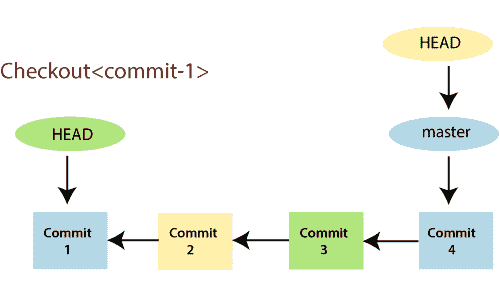
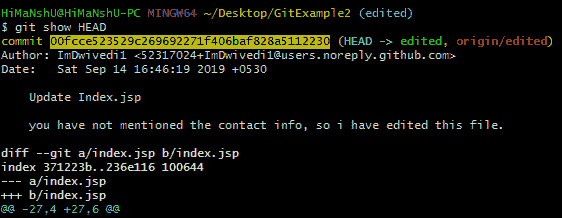
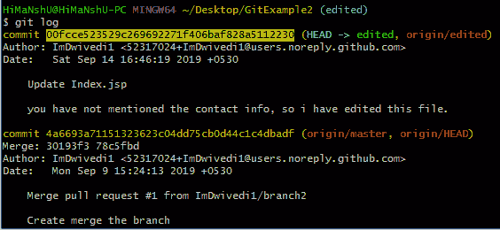
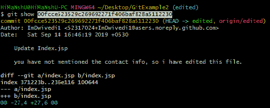
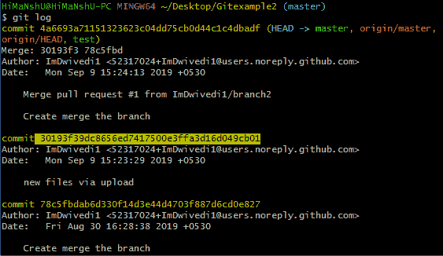
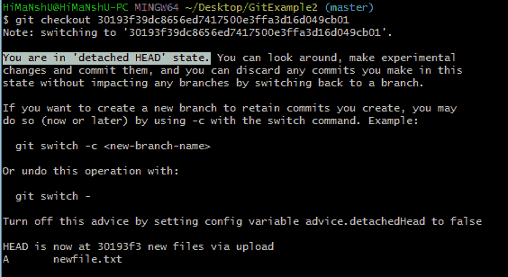

# Git头

> 原文：<https://www.javatpoint.com/git-head>

**HEAD** 指出当前检出分支中的最后一个提交。它就像一个指向任何引用的指针。HEAD 可以理解为“**电流支路**当您使用“结帐”切换分支时，HEAD 会转移到新的分支。



上图显示了引用提交-1 的 HEAD，因为“签出”是在提交-1 时完成的。当您进行新的提交时，它会转移到新的提交。git head 命令用于查看具有不同参数的 head 的状态。它在**中存储 Head 的状态。git\refs\heads** 目录。让我们看看下面的例子:

## Git 显示头部

**git 显示头**用于检查头的状态。该命令将显示头部的位置。

**语法:**

```

$ git show HEAD

```

**输出:**



在上面的输出中，您可以看到 Head 的提交 id 已经给出。这意味着头部在给定的提交上。

现在，检查项目的提交历史。您可以使用 git 日志命令来检查提交历史。请参见以下输出:



正如我们在上面的输出中看到的，最近一次提交和 Head 的提交 id 是相同的。因此，很明显，最后一次提交具有 Head。

我们还可以通过提交 id 来检查 Head 的状态。从上面的输出中复制提交 id，并用 **git show** 命令粘贴。如果提交 id 是最后一个提交的 id，其结果与 **git show head** 命令相同。请参见以下输出:



以上输出与 git show 输出相同。

The HEAD is capable of referring to a specific revision that is not associated with a branch name. This situation is called a detached HEAD.

## Git 分离头

GitHub 会随着时间的推移跟踪所有提交或快照。如果您在终端中查看“git 日志”，您可以显示直到第一次提交之前的所有提交。分离头模式允许您发现存储库的旧状态。这是 Git 中的自然状态。

当 **Head 没有指向最近一次提交时，这种状态称为分离 Head** 。如果您使用较旧的提交进行签出，它将承受分离的头部条件。请参见下面的示例:



我已经复制了旧的提交 id。现在我要用这个身份证结账。



正如您在给定示例中看到的，Head 不指向最近的提交。这叫超然的元首。建议不要在分离头上提交。

* * *