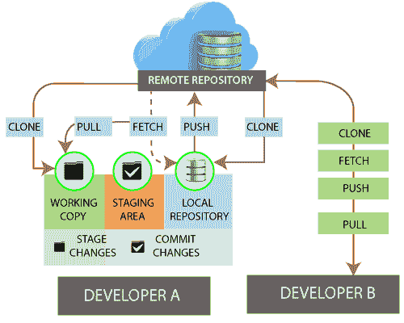
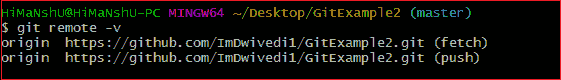
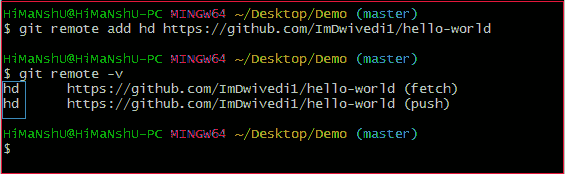
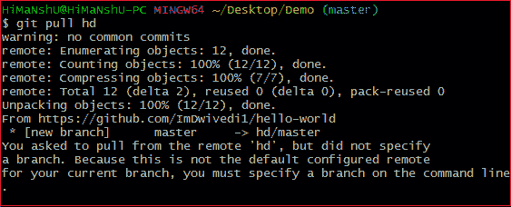
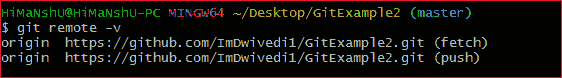
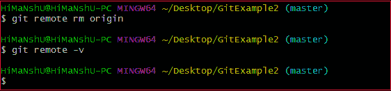
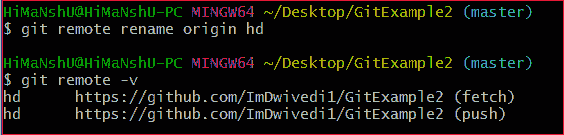
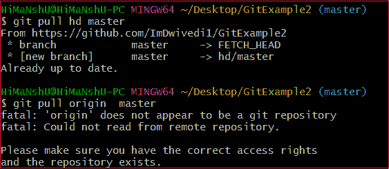
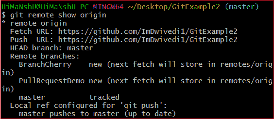
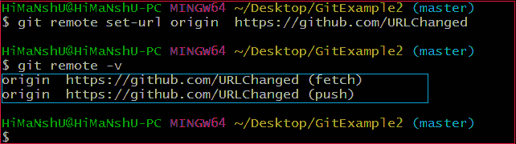

# Git Remote

> 原文：<https://www.javatpoint.com/git-remote>

在 Git 中，术语远程与远程存储库有关。这是一个共享的存储库，所有团队成员都可以使用它来交换他们的更改。远程存储库存储在代码托管服务上，如内部服务器、GitHub、Subversion 等。在本地存储库的情况下，远程通常不提供项目当前状态的文件树；作为替代，它只包含。git 版本数据。

开发人员可以使用远程服务器执行许多操作。这些操作可以是克隆、提取、推送、拉取等等。请考虑下图:



## 检查你的遥控器

要检查远程服务器的配置，运行 **git remote** 命令。git remote 命令允许访问远程和本地之间的连接。如果您想看到您的克隆存储库的原始存在，请使用 git remote 命令。它可以用作:

**语法:**

```

$ git remote

```

**输出:**


给定的命令提供远程名称作为**原点**。Origin 是远程服务器的默认名称，由 Git 给出。

**Git remote -v:**

Git remote 支持一个特定的选项-v 来显示 Git 以短名称存储的 URL。这些简称在读写操作中使用。这里，-v 代表**啰嗦**。我们可以用 **- verbose** 代替-v，用作:

**语法:**

```

$ git remote -v

```

或者

```

$ git remote --verbose

```

**输出:**



以上输出提供了可用的远程连接。如果存储库包含多个远程连接，此命令将列出所有远程连接。

## Git 远程添加

当我们隐式获取存储库时，git 为存储库添加了一个远程。此外，我们可以显式地为存储库添加一个遥控器。我们可以添加一个遥控器作为拍摄昵称或简称。要将 remote 添加为短名称，请执行以下命令:

**语法:**

```

$ git remote add <short name><remote URL>

```

**输出:**



在上面的输出中，我添加了一个远程存储库，现有存储库的简称为“ **hd** ”。现在，您可以在命令行上使用“ **hd** ”来代替整个网址。例如，您想要提取存储库，请考虑以下输出:



我已经使用它的短名称而不是它的远程 URL 提取了一个存储库。现在，可以通过一个短名称来访问存储库主分支。

## 获取和拉取远程分支

您可以从远程存储库中获取和提取数据。提取和拉取命令到达远程服务器，并从远程项目中提取您还没有的所有数据。这些命令让我们从远程获取所有分支的引用。

要从远程项目中获取数据，请运行以下命令:

```

$ git fetch <remote>

```

要从远程项目克隆远程存储库，请运行以下命令:

```

$ git clone<remote>

```

当我们克隆一个存储库时，远程存储库会被添加一个默认名称“ **origin** ”因此，大多数情况下，该命令被用作 git 获取源。

git 获取源获取自您克隆以来对远程服务器所做的更新。git fetch 命令只将数据下载到本地存储库；它不会合并或修改数据，直到你不操作。需要时，您必须手动将其合并到存储库中。

要提取存储库，请运行以下命令:

```

$ git pull <remote>

```

git pull 命令自动获取远程数据，然后将其合并到当前分支中。拉取是一个比抓取更容易和舒适的工作流程。因为 git clone 命令设置您的本地主分支来跟踪您克隆的服务器上的远程主分支。

## 推送到远程分支

如果你想分享你的项目，你必须把它推向上游。git push 命令用于共享项目或向远程服务器发送更新。它用作:

```

$ git push <remote><branch>

```

要更新项目的主要分支，请使用以下命令:

```

$ git push origin master

```

这是一个特殊的命令行工具，用于指定远程分支和目录。当您在远程服务器上有多个分支时，此命令可以帮助您指定主分支和存储库。

一般术语 **origin** 代表远程存储库，master 被认为是主分支。所以，整个声明“ **git 推原点主**”将本地内容推送到了远程位置的主分支上。

## Git 移除远程

您可以从存储库中删除远程连接。要删除连接，使用**删除**或 **rm** 选项执行 git 远程命令。可以通过以下方式完成:

**语法:**

```

$ git remote rm <destination>

```

或者

```

$ git remote remove <destination>

```

**考虑下面的例子:**

假设您与默认远程服务器“ **origin** 相连。”要口头检查遥控器，请执行以下命令:

```

$ git remote -v

```

**输出:**



上面的输出将列出可用的远程服务器。现在，执行上面提到的删除操作。考虑以下输出:



在上面的输出中，我已经从我的存储库中删除了远程服务器“origin”。

## Git 远程重命名

Git 允许重命名远程服务器名称，这样您就可以使用一个短名称来代替远程服务器名称。以下命令用于重命名远程服务器:

**语法:**

```

$ git remote rename <old name><new name>

```

**输出:**



在上面的输出中，我已经将我的默认服务器名 origin 重命名为 hd。现在，我可以在原产地使用这个名字进行操作。考虑以下输出:



在上面的输出中，我已经使用服务器名 hd 提取了远程存储库。但是，当我使用旧的服务器名称时，它抛出了一个错误消息“**‘origin’似乎不是 git 存储库**”这意味着 Git 没有识别旧名称，因此所有操作都将由新名称执行。

## Git 显示遥控器

要查看特定遥控器的其他信息，请使用 git remote 命令和 show 子命令。它用作:

**语法:**

```

$ git remote show <remote>

```

它将产生关于远程服务器的信息。它包含与远程相关的分支列表，以及为获取和推送而附加的端点。

**输出:**



上面的输出列出了远程存储库的 URL 以及跟踪分支信息。这些信息在各种情况下都会有帮助。

## Git 更改远程(更改远程的网址)

我们可以更改远程存储库的网址。git 远程设置命令用于更改存储库的 URL。它会更改现有的远程存储库网址。

**Git 远程设置:**

我们可以简单地通过使用 git remote set 命令来更改远程 URL。假设我们想要为我们的项目指定一个唯一的名称。Git 允许我们这样做。这是一个简单的过程。要更改远程网址，请使用以下命令:

```

$ git remote set-url <remote name><newURL>

```

**远程设置 url** 命令接受两种类型的参数。第一个是<远程名称>，这是你当前的服务器名称。第二个参数是<新网址>，这是你的新网址名称。<新网址>应为以下格式:**https://github.com/URLChanged**

请考虑下图:



在上面的输出中，我已经将我现有的存储库网址从**https://github.com/ImDwivedi1/GitExample2**更改为**https://github.com/URLChanged**。从我的网址名称可以理解为我改了这个。要检查最新的网址，请执行以下命令:

```

$ git remote -v

```

* * *