# Git 标签

> 哎哎哎:# t0]https://www . javatppoint . com/git 标签

标签使一个点成为 Git 历史中的一个特定点。标签用于将提交阶段标记为相关。我们可以标记一个提交供将来参考。它主要用于标记项目的起始点，如 v1.1。

标签很像分支，一旦启动就不会改变。我们可以在一个分支或不同的分支上有任意数量的标签。下图展示了不同分支上的标签。

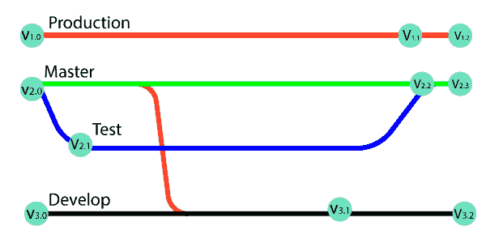

在上图中，一个分支有很多版本。所有这些版本都是存储库中的标签。

标签有两种类型。

*   带注释的标签
*   轻量标签

这两个标签是相似的，但是它们在元数据存储的数量方面是不同的。

### 何时创建标签:

*   当您想要为代码的稳定版本创建发布点时。
*   当你想创建一个历史点，你可以参考以后重用。

## Git 创建标签

若要先创建标记，请签出到要创建标记的分支。要签出分支，请运行以下命令:

```

$ git checkout <Branch name>

```

现在，你在你想要的分支上，说，主人。考虑以下输出:


您可以使用 git 标记命令来创建标记。创建一个标签，上面有一些名字，比如 **v1.0、v1.1、**或者任何你想要的其他名字。要创建标记，请按如下方式运行命令:

**语法:**

```

$ git tag <tag name>

```

上述命令将标记项目的当前状态。考虑下面的例子:

```

$ git tag projectv1.0

```

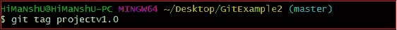

上述命令将在主分支上创建一个标记点作为**投影 v1.0** 。

## Git 列表标记

我们可以在存储库中列出可用的标签。有三个选项可用于列出存储库中的标签。它们如下:

*   git 标签
*   去表演" T0 "
*   git tag -l " <tag pattern="">。* "</tag>

### “git 标签”:

列出存储库中所有可用的标签是最常用的选项。它用作:

```

$ git tag

```

**输出:**

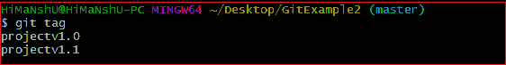

从上面的输出中我们可以看到，git tag 命令列出了存储库中可用的标签。

### git 标签显示<tagname>:</tagname>

这是一个用于显示特定标签细节的特定命令。它用作:

**语法:**

```

$ git tag show <tagname>

```

上面的命令将显示标签描述，考虑下面的命令:

```

$ git tag show projectv1.0

```

**输出:**

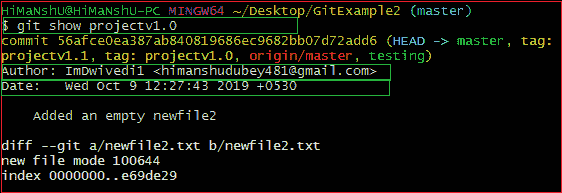

在上面的输出中，git show 标签正在显示标签 **projectv1.0** 的描述，例如作者姓名和日期。

### git 标签-l " <tag pattern="">。*:</tag>

它也是一个特定的命令行工具。它使用通配符模式显示可用的标签。假设我们有十个标签，如 v1.0、v1.1、v1.2 到 v1.10。然后，我们可以使用标签模式 v 列出所有 v 模式。它被用作:

**语法:**

```

$ git tag -l ".*" 
```

上面的命令将显示所有包含通配符的标签。考虑以下命令:

```

$ git tag -l "pro*"

```

**输出:**

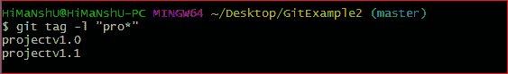

上面的命令显示了以单词 **pro** 开头的标签列表。

## Git 标签的类型

git 中有两种类型的标签。它们是:

*   带注释的标签
*   轻量标签

让我们详细了解这两个标签。

### 带注释的标签

带注释的标签是存储额外元数据的标签，如开发人员姓名、电子邮件、日期等。它们作为一组对象存储在 Git 数据库中。

如果您指向并保存任何项目的最终版本，则建议创建一个带注释的标记。但是如果你想做一个临时的标记点或者不想分享信息，那么你可以创建一个轻量级的标签。注释标签中提供的数据对于项目的公开发布是必不可少的。有更多的选项可用于注释，比如您可以为项目的注释添加一条消息。

要创建带注释的标签，请运行以下命令:

**语法:**

```

$ git tag -m "< Tag message> 
```

上面的命令将创建一个带有消息的标签。带注释的标签包含一些附加信息，如作者姓名和其他项目相关信息。请考虑下图:

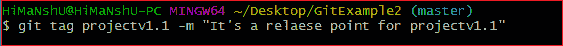

上面的命令将在我的项目库的主分支中创建一个带注释的标签**project 1.1**。

当我们显示一个带注释的标签时，它会显示更多关于标签的信息。考虑以下输出:

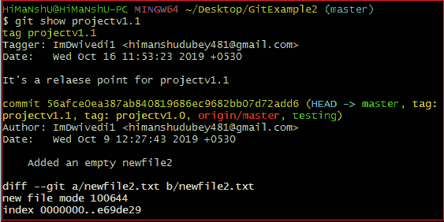

### 轻质标签:

Git 支持多种类型的标记；它被称为轻量级标签。这两个标签的动机与在存储库中标记一个点是一样的。通常，它是存储在文件中的提交。它不会存储不必要的信息，以保持轻量级。轻量标签中没有提供 **-a、-s** 或 **-m** 等命令行选项，请传递标签名称。

**语法:**

```

$ git tag <tag name>

```

上面的命令将创建一个轻量级标签。考虑下面的例子:

```

$ git tag projectv1.0

```


给定的输出将创建一个名为 **projectv1.0** 的轻量级标签。

它将显示比带注释的标签更少的输出。考虑以下输出:

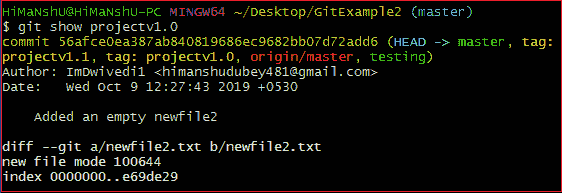

## Git 推送标记

我们可以将标签推送到远程服务器项目。这将帮助其他团队成员知道在哪里挑选更新。它将在远程服务器帐户上显示为**发布点**。git push 命令通过一些特定的选项来推动标签。它们如下:

*   Git 推送原点<tagname></tagname>
*   Git push origin 标签/ Git push 标签

### git 推送原点 <tagname>:</tagname>

我们可以通过使用 git push 命令来推送任何特定的标签。它的用法如下:

**语法:**

```

$ git push origin <tagname>

```

上面的命令将把指定的标签名作为发布点。考虑下面的例子:

我已经在我的本地存储库中创建了一些标签，我想在我的 GitHub 帐户上推送它。然后，我要操作上面的命令。考虑下图；这是我的远程存储库的当前状态。

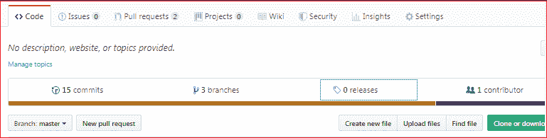

上图为 **0 释放**时的释放点。现在，执行上面的命令。考虑以下输出:

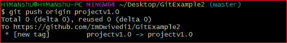

我已经将我的 projectv1.0 标记推送到远程存储库。它将改变存储库的当前状态。请考虑下图:

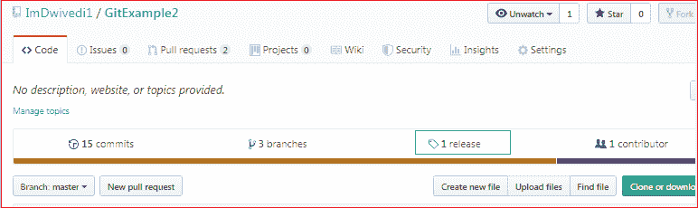

通过刷新存储库，它显示发布点为 **1 发布**。我们可以通过点击来查看这个版本。它将显示为:

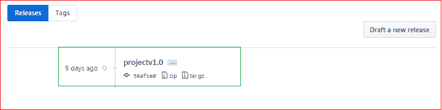

我们可以把它作为 zip 和 tar 文件下载。

### git 推送原点标签/ git 推送标签:

给定的命令将一次推送所有可用的标签。它将创建与存储库中可用标签数量一样多的发布点。它的用法如下:

**语法:**

```

$ git push origin --tags

```

或者

```

$ git push --tags

```

上面的命令将把所有可用的标签从本地存储库推送到远程存储库。考虑以下输出:

**输出:**

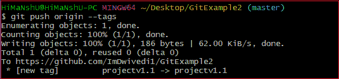

标签已被推送到远程服务器源；因此，发布点也会更新。考虑下面的存储库快照:

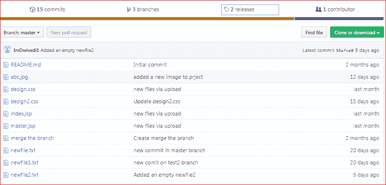

在上面的输出中，发布点根据标签进行了更新。可以看到版本更新为 **2 版本**。

## Git 删除标记

Git 允许随时从存储库中删除标签。要删除标签，请运行以下命令:

**语法:**

```

$git tag --d <tagname>

```

或者

```

$ git tag --delete <tagname>

```

上述命令将从本地存储库中删除一个特定的标签。假设我想删除我的标签**project 1.0**，那么过程如下:

```

$ git tag --d projectv1.0

```

考虑以下输出:

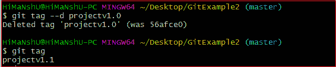

标记 projectv1.0 已从存储库中删除。

### 删除远程标签:

我们还可以从远程服务器上删除一个标签。要从远程服务器删除标签，请运行以下命令:

**语法:**

```

$ git push origin -d <tagname>

```

或者

```

$ git push origin --delete<tag name>

```

上述命令将从远程服务器删除指定的标记。考虑以下输出:

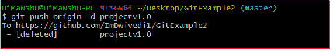

**projectv1.0** 标签已从远程服务器原点删除。

### 删除多个标签:

我们可以从一个命令中删除多个标签。要同时删除多个标签，请运行以下命令:

**语法:**

```

$ git tag -d <tag1> <tag2>

```

**输出:**

上面的命令将从本地存储库中删除这两个标签。

我们还可以从远程服务器上删除多个标签。要从服务器原点删除标签，请运行以下命令:

```

$ git push origin -d <tag1> <tag2>

```

上面的命令将从服务器上删除这两个标签。

## Git 签出标记

在 git 中没有检查标签的实际概念。然而，我们可以通过从一个标签创建一个新的分支来实现。要签出标签，请运行以下命令:

**语法:**

```

$ git checkout -b < new branch name> <tag name>

```

上面的命令将创建一个新的分支，其存储库的状态与标签中的状态相同。考虑以下输出:


上面的命令将创建一个新的分支，并将存储库的状态转移到 **new_branchv1.1** ，因为它位于标记项目 v1.1 上。

**从旧提交创建标记:**

如果你想回到你的历史，并想在这一点上创建一个标签。Git 允许您这样做。要从旧提交创建标记，请运行以下命令:

```

< git tag <tagname> < reference of commit>

```

在上面的命令中，不要求给出所有的 40 位数；你可以给一部分。

假设我想为我的旧提交创建一个标签，那么过程如下:

**检查较旧的提交:**

要检查较旧的提交，请运行 git status 命令。它将按如下方式运作:

```

$ git status

```

考虑以下输出:

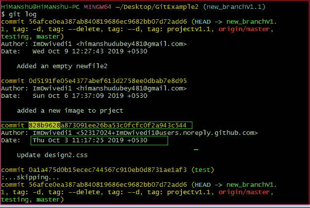

上面的输出显示了较旧的提交。假设我想为我的提交创建一个标签，从 **828b9628** 开始。复制提交的特定引用。并在上面的命令中将其作为参数传递。考虑以下输出:

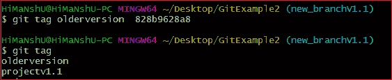

在上面的输出中，存储库的早期版本被标记为**旧版本**。

* * *