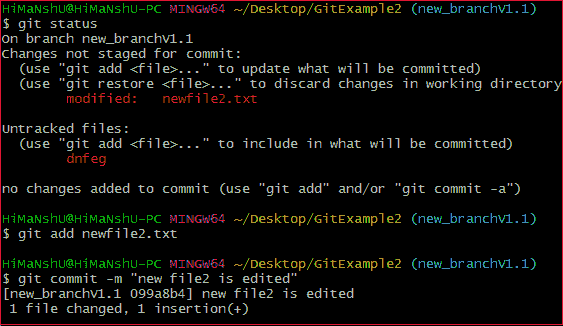
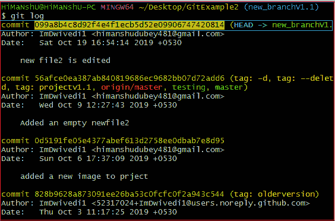
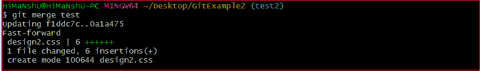
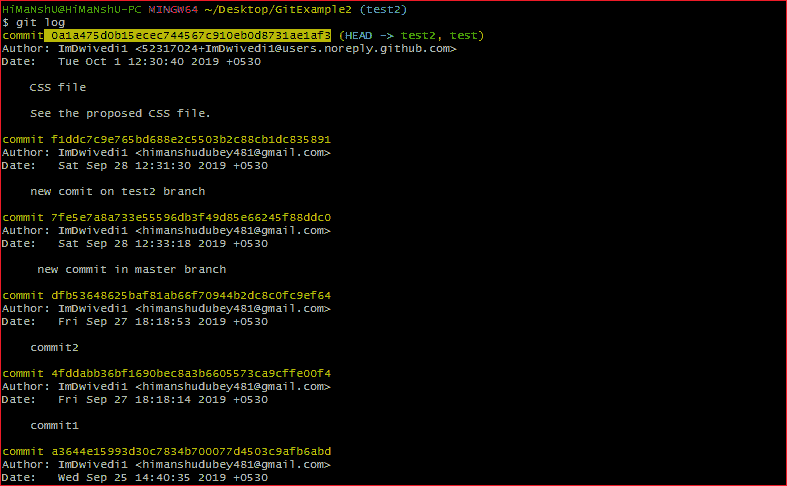
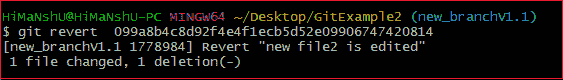

# Git 还原

> 哎哎哎:# t0]https://www . javatppoint . com/git-revert

在 Git 中，术语“恢复”用于恢复一些更改。git revert 命令用于应用还原操作。这是一个撤消类型的命令。然而，它不是传统的撤销选项。它不会删除此过程中的任何数据；相反，它将创建一个具有相反效果的新更改，从而撤消指定的提交。一般来说，git revert 是一个提交。

它对于跟踪项目中的 bug 非常有用。如果你想从历史中删除一些东西，那么 git revert 是一个错误的选择。

此外，我们可以说 git revert 记录了一些与之前提交相反的新更改。要撤消更改，请运行以下命令:

**语法:**

```

$ git revert 

```

## Git 返回选项:

Git revert 允许一些额外的操作，比如编辑、不编辑、清理等等。让我们简单了解一下这些选项:

**<提交> :** 提交选项用于恢复提交。要恢复提交，我们需要提交引用 id。git 日志命令可以访问它。

```

$ git revert <commit-ish>

```

**< -编辑> :** 用于在恢复提交前编辑提交消息。这是 git revert 命令中的默认选项。

```

$ git revert -e <commit-ish>

```

**-m 母号/ -主线母号:**用于还原合并。通常，我们不能恢复合并，因为我们不知道合并的哪一方应该被视为主线。我们可以指定父编号，并允许 revert 反转相对于指定父编号的更改。

**-n/ -无编辑:**此选项不会打开文本编辑器。它将直接恢复上次提交。

```

$ git revert -n <commit-ish>

```

**-清理= <模式> :** 清理选项决定如何从消息中去除空格和注释。

**-n/ - no-commit:** 通常，默认情况下，revert 命令提交。不提交选项不会自动提交。此外，如果使用此选项，您的索引不必与 HEAD 提交匹配。

不提交选项有利于在一行中向索引恢复多个提交效果。

让我们了解如何恢复以前的提交。

## Git 恢复到上一次提交

假设您对一个文件进行了更改，比如项目的 **newfile2.txt** 。之后，你会提醒自己在错误的文件或错误的分支中犯了错误。现在，您想要撤销更改，您可以这样做。Git 允许你改正错误。请考虑下图:



从上面的输出可以看出，我已经在 newfile2.txt 中做了更改。要撤销更改，我们需要提交。要检查提交情况，请运行以下命令:

```

$ git log

```

考虑以下输出:



在上面的输出中，我复制了最近的提交来恢复。现在，我将对这个提交执行恢复操作。它将作为:

```

$ git revert 099a8b4c8d92f4e4f1ecb5d52e09906747420814

```

上面的命令将恢复我上次提交的内容。考虑以下输出:


从上面的输出可以看出，对存储库所做的更改已经被还原。

## Git 还原合并

在 Git 中，合并也是一个至少有两个父级的提交。它连接分支和代码来创建一个完整的项目。

Git 中的合并是至少有两个父级的提交。它汇集了多条发展路线。在工作流中，功能在分支中开发，然后合并到主线中，合并提交通常有两个父项。

## 如何恢复合并

通常，恢复合并被认为是一个复杂的过程。如果做得不正确，可能会很复杂。我们将在 git revert 命令的帮助下撤销合并操作。虽然其他一些命令如 git reset 可以做到这一点。让我们了解如何恢复合并。考虑下面的例子。

我在测试中对我的文件 **design2.css** 做了一些更改，并将其与**测试 2** 合并。考虑以下输出:



要恢复合并，我们必须得到它的参考号。要检查提交历史记录，请运行以下命令:

```

$ git log 

```

上面的命令将显示提交历史。考虑以下输出:



从上面的输出中，复制要恢复的合并提交，并运行以下命令:

```

$ git revert <commit reference> -m 1

```

上述命令将恢复合并操作。这里，-m 1 用于作为主线的第一个父节点。合并提交有多个父级。恢复需要额外的信息来决定合并的哪一个父项应被视为主线。在这种情况下，使用参数-m。考虑以下输出:



从上面的输出中，我们可以看到之前的合并已经被还原了。

* * *