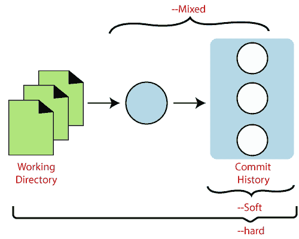
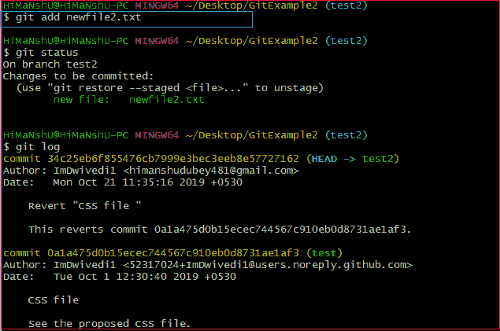
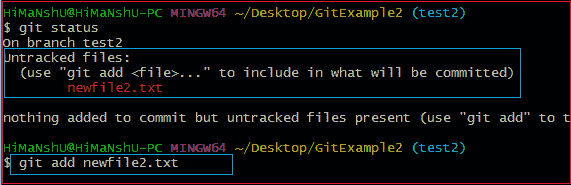
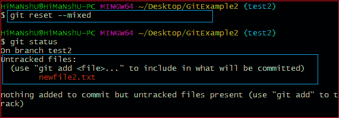
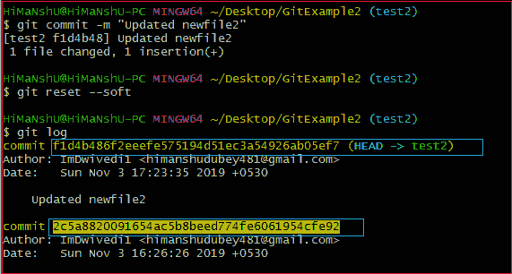
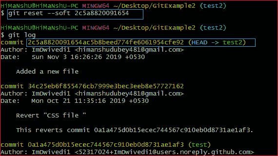

# 去重置

> 哎哎哎:# t0]https://www . javatppoint . com/git 重置

术语“重置”代表撤消更改。git reset 命令用于重置更改。git reset 命令有三种核心调用形式。这些表格如下。

*   **软**
*   **混合**
*   **硬**

如果我们用 Git 来表示，那么 Git 是一个将 HEAD 的当前状态重置为指定状态的工具。这是一个复杂而通用的撤销变更的工具。它充当 Git 的**时光机。您可以在各种提交之间来回跳转。这些重置变体都会影响 git 用来处理文件内容的特定树。**

此外，git reset 可以对整个提交对象进行操作，也可以在单个文件级别进行操作。这些重置变体都会影响 git 用来处理文件及其内容的特定树。



Git 使用索引(临时区域)、HEAD 和工作目录来创建和恢复提交。如果你不知道什么是头，树，指数，那么一定要访问这里 [Git Index](git-index) 和 [Git Head](git-head) 。

工作目录允许您更改文件，并且可以转移到索引中。暂存区使您能够选择要放入下一个提交中的内容。提交对象是内容的加密散列版本。它有一些元数据和点，用于打开以前的提交。

让我们理解 git reset 命令的不同用法。

## Git 硬重置

它将首先移动 Head，并用提交的内容更新索引。这是最直接、最不安全、最常用的选项。- hard 选项更改提交历史记录，引用指针更新到指定的提交。然后，需要重置临时索引和工作目录，以匹配指定提交的索引和工作目录。对临时索引和工作目录的任何以前挂起的提交都会被重置以匹配提交树。这意味着任何等待的工作都将丢失。

让我们通过一个例子来理解- hard 选项。假设我向现有的存储库中添加了一个新文件。要将新文件添加到存储库中，请运行以下命令:

```

$ git add <file name>

```

要检查存储库的状态，请运行以下命令:

```

$ git status

```

要检查 Head 和以前提交的状态，请运行以下命令:

```

$ git log

```

请考虑下图:



在上面的输出中，我添加了一个名为 **newfile2.txt** 的文件。我已经检查了存储库的状态。我们可以看到，目前的头部位置还没有改变，因为我还没有提交更改。现在，我将执行**重置硬**选项。git 重置硬命令将按如下方式执行:

```

$ git reset --hard

```

考虑以下输出:


正如您在上面的输出中看到的，在可用的存储库中操作-hard 选项。此选项将重置更改，并与上次更改前的头部位置相匹配。它将从临时区域中删除可用的更改。考虑以下输出:


上面的输出显示了硬重置后存储库的状态。我们可以看到在我的存储库中没有要提交的内容，因为所有的更改都被重置硬选项删除，以匹配当前 Head 和前一个 Head 的状态。所以文件 **newfile2.txt** 已经从存储库中移除。

在 [git stash](git-stash) 的帮助下，有一种更安全的方式来重置更改。

通常，硬复位模式执行以下操作:

*   它会移动头部指针。
*   它会用 HEAD 指向的内容更新临时区域。
*   它将更新工作目录以匹配临时区域。

## Git 重置混合

混合选项是 git reset 命令的默认选项。如果我们不传递任何参数，那么 git reset 命令被认为是 **-混合**作为默认选项。混合选项更新引用指针。临时区域也重置为指定提交的状态。撤消的更改转移到工作目录。我们用一个例子来理解。

让我们创建一个新文件，比如 **newfile2.txt** 。检查存储库的状态。要检查存储库的状态，请运行以下命令:

```

$ git status

```

它将显示临时区域中未跟踪的文件。将其添加到索引中。要将文件添加到阶段索引中，运行 git add 命令如下:

```

$ git add <filename>

```

上述命令会将文件添加到分段索引中。考虑以下输出:



在上面的输出中，我在我的本地存储库中添加了一个 **newfile2.txt** 。现在，我们将在这个存储库中执行重置混合命令。它将作为:

```

$ git reset --mixed

```

或者我们可以只用 git reset 命令代替这个命令。

```

$ git reset

```

上述命令将重置磁头的状态，并且不会从暂存区删除任何数据来匹配磁头的位置。考虑以下输出:



从上面的输出中，我们可以看到我们已经通过执行 git reset -mixed 命令重置了 Head 的位置。此外，我们已经检查了存储库的状态。我们可以看到，这个命令并没有改变存储库的状态。因此很明显，混合模式不会从临时区域清除任何数据。

通常，复位混合模式执行以下操作:

*   它会移动头部指针
*   它将使用 HEAD 所指向的内容更新临时区域。

它不会像 git 硬模式那样更新工作目录。它只会重置索引，而不会重置工作树，然后它会生成未更新文件的报告。

如果在命令行中指定了-N，那么这些语句将被 Git 视为意图添加。

## 转到重置头

软选项根本不会接触索引文件或工作树，但它会像所有选项一样重置 Head。当软模式运行时，参考指针更新，复位停止。它将作为 git 修改命令。这不是一个权威的命令。有时候开发者认为这是浪费时间。

一般用于改变头部的位置。让我们了解它将如何改变头部的位置。它将用作:

```

$ git reset--soft <commit-sha>

```

上面的命令将把 HEAD 移动到特定的提交。我们用一个例子来理解。

我已经在我的文件 newfile2.txt 中进行了更改并提交了它。因此，Head 的当前位置在最近一次提交时发生了移动。要检查 Head 的状态，请运行以下命令:

```

$ git log

```

考虑以下输出:



从上面的输出可以看到，HEAD 的当前位置在 f1 D4 b 486 F2 ee EFE 575194d 51 E3 a 54926 ab 05 ef 7 commit 上。但是，我想在我的旧 commit 2c 5a 8820091654 ac5b 8 beed 774 Fe 6061954 cfe 92 上切换它。因为提交 sha 号是由 sha 算法提供的唯一号。要切换 HEAD，请运行以下命令:

```

$ git reset --soft  2c5a8820091654

```

上面的命令将把我的头转移到一个特定的提交。考虑以下输出:



从上面的输出可以看出，通过 git reset - soft 模式，HEAD 已经被转移到一个特定的提交。

## Git 重置为提交

有时我们需要重置一个特定的提交；Git 允许我们这样做。我们可以重置为特定的提交。要重置它，git reset 命令可以与 reset 命令支持的任何选项一起使用。它将采用特定命令的默认行为，并重置给定的提交。重置提交的语法如下:

```

$ git reset <option> <commit-sha>

```

这些选项可以是

*   -柔软
*   -混合
*   -辛苦了

* * *