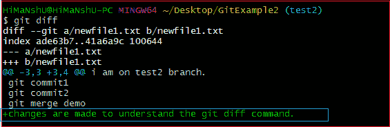
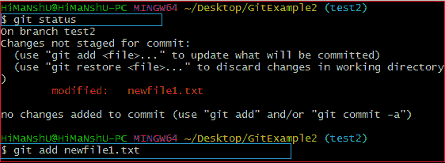
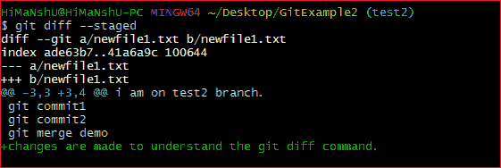
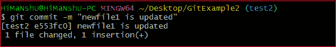
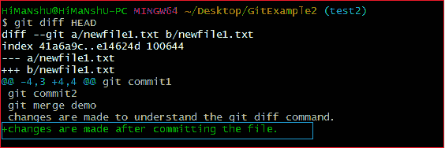
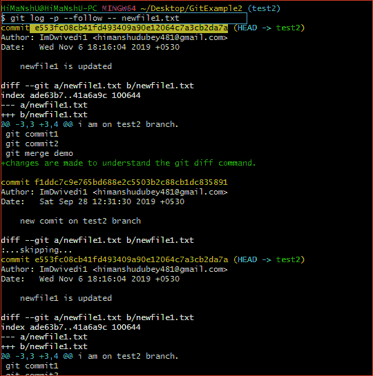
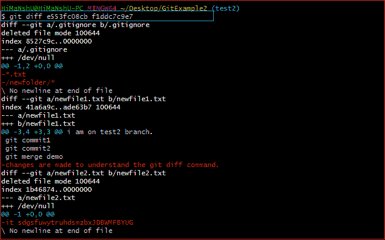
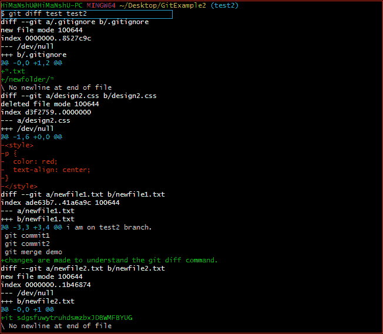

# Git Diff

> 哎哎哎:# t0]https://www . javatppoint . com/git-diff

Git diff 是一个命令行实用程序。这是一个多用户 Git 命令。当它被执行时，它在 Git 数据源上运行一个 diff 函数。这些数据源可以是文件、分支、提交等等。它用于显示提交、提交和工作树等之间的变化。

它比较不同版本的数据源。版本控制系统代表使用文件的修改版本。因此，diff 命令是使用 Git 的有用工具。

然而，我们也可以借助带有选项-p 的 git 日志命令来跟踪这些变化。

让我们了解一下可以使用 git diff 命令的不同场景。

**场景 1:跟踪尚未上演的变更。**

git diff 命令的常见用法是，我们可以跟踪尚未转移的更改。

假设我们已经编辑了 newfile1.txt 文件。现在，我们想跟踪哪些变化尚未上演。然后我们可以通过 git diff 命令来实现。考虑以下输出:



从上面的输出中，我们可以看到在 newfile1.txt 上所做的更改是由 git diff 命令显示的。因为我们已经将它编辑为“为了理解 git diff 命令而进行了更改。”因此，输出显示了其内容的变化。上述输出的突出显示部分是更新文件中的更改。现在，我们可以通过预览更改来决定是否像这样暂存该文件。

**场景 2:跟踪已转移但未提交的更改:**

git diff 命令允许我们跟踪已转移但未提交的更改。我们可以追踪集结地的变化。要检查已经转移的更改，请使用- staged 选项和 git diff 命令。

要检查未跟踪的文件，运行 git status 命令如下:

```

$ git status

```

上面的命令将显示存储库中未跟踪的文件。现在，我们将把它添加到集结地。要在临时区域中添加文件，请运行 git add 命令，如下所示:

```

$ git add < file name>

```

上面的命令将文件添加到临时区域。考虑以下输出:



现在，该文件被添加到临时区域，但尚未提交。因此，我们也可以跟踪集结地的变化。要检查分段更改，运行 git diff 命令和 **-分段**选项。它将用作:

```

$ git diff --staged

```

上述命令将显示已暂存文件的更改。考虑以下输出:



给定的输出显示的是 newfile1.txt 的更改，该更改已经被转移。

**场景 3:提交文件后跟踪更改:**

Git，让我们在提交文件后跟踪更改。假设我们已经为存储库提交了一个文件，并在提交后做了一些额外的更改。所以我们也可以在这个阶段跟踪文件。

在下面的输出中，我们已经提交了在 newfile1.txt 上所做的更改。



现在，我们再次更改了 newfile.txt 文件，因为“更改是在提交文件后进行的。”要跟踪该文件的更改，运行带有 **HEAD** 参数的 git diff 命令。它将按如下方式运行:

```

 $ git diff HEAD

```

上述命令将显示终端中的变化。考虑以下输出:



上面的命令在突出显示的部分显示文件 newfile1.txt 的更新。

**场景 4:跟踪两次提交之间的变化:**

我们可以跟踪两个不同提交之间的变化。Git 允许我们跟踪两次提交之间的变化，无论是最新的提交还是旧的提交。但这需要的是，我们必须有一个提交列表，以便进行比较。在 git 日志命令中列出提交的常用命令。要显示最近的提交，我们可以运行以下命令:

```

$ git log

```

上面的命令将列出最近的提交。

假设，我们希望跟踪来自早期提交的指定的更改。为此，我们必须需要该指定文件的提交。要显示任何指定的提交，运行 git 日志命令如下:

```

$ git log -p --follow -- filename

```

上面的命令将显示指定文件的所有提交。考虑以下输出:



上面的输出显示了 newfile1.txt 的所有提交，假设我们想要跟踪提交 **e553fc08cb** 和 **f1ddc7c9e7** 之间的变化。git diff 命令允许跟踪两次提交之间的变化。它将被命令为:

```

$ git diff <commit1-sha> <commit2-sha>

```

上面的命令将显示两次提交之间的更改。考虑以下输出:



上面的输出显示了从提交 **e553fc08cb** (最近)到提交 **f1ddc7c9e7** (上一次)在 **newfile1.txt** 上所做的所有更改。

## Git 差异分支

Git 允许比较分支。如果你是分支的高手，那么你就能理解在合并之前分析分支的重要性。如果不进行比较就合并分支，可能会产生许多冲突。因此为了避免这些冲突，Git 允许许多方便的命令来预览、比较和编辑更改。

我们可以使用 git status 命令跟踪分支的变化，但是很少有其他命令可以详细解释它。git diff 命令是一个广泛使用的跟踪变化的工具。

git diff 命令允许我们比较不同版本的分支和存储库。要获得分支之间的差异，请按如下方式运行 git diff 命令:

```

$ git diff <branch 1> < branch 2>

```

上述命令将显示分支 1 和分支 2 之间的差异。以便您可以决定是否要合并分支。考虑以下输出:



上面的输出显示了我的存储库分支**测试**和**测试 2** 之间的差异。git diff 命令给出了这两个分支的预览。所以，在分支上执行任何操作都是有帮助的。

* * *