# Git 合并和合并冲突

> 原文：<https://www.javatpoint.com/git-merge-and-merge-conflict>

在 Git 中，合并是连接分叉历史的过程。它将两个或多个发展历史连接在一起。git merge 命令便于您获取 git 分支创建的数据，并将它们集成到单个分支中。Git 合并将把一系列提交关联到一个统一的历史中。一般来说，git 合并用于合并两个分支。

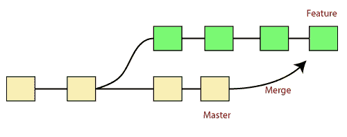

它用于保持不同的发展路线；在某个阶段，您希望将更改合并到一个分支中。理解 Git 中的合并是如何工作的是至关重要的。

上图中有两个分支**主**和**特征**。我们可以看到，我们在功能和主分支中进行了一些提交，并将它们合并。它作为一个指针。它将在分支之间找到一个公共的基本提交。一旦 Git 找到一个共享的基本提交，它将创建一个新的“合并提交”它结合了每个排队的合并提交序列的变化。

## “git 合并”命令

git merge 命令用于合并分支。

git 合并命令的语法如下:

```

$ git merge <query>

```

它可以用于各种环境。其中一些如下:

**场景 1:将指定的提交合并到当前活动的分支:**

使用下面的命令将指定的提交合并到当前活动的分支。

```

$ git merge <commit>

```

上面的命令将把指定的提交合并到当前活动的分支。您也可以通过在<commit>中传递分支名称，将指定的提交合并到指定的分支。让我们看看如何提交到当前活动的分支。</commit>

见下面的例子。我在我的项目文件 **newfile1.txt** 中做了一些更改，并提交到我的**测试**分支中。

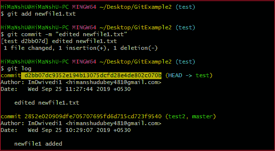

在活动分支上复制要合并的特定提交，并执行合并操作。请参见以下输出:

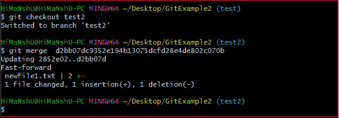

在上面的输出中，我们已经合并了活动分支 test2 中的前一个提交。

**场景 2:将提交合并到主分支中:**

要将指定的提交合并到 master 中，首先要发现它的提交 id。使用 log 命令查找特定的提交 id。

```

$git log

```

请参见以下输出:

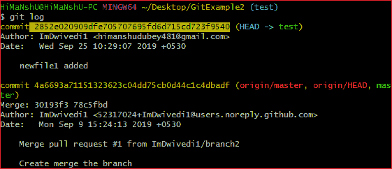

要将提交合并到主分支，请切换到主分支。

```

$ git checkout master

```

现在，切换到分支“主”对提交执行合并操作。使用 git 合并命令和主分支名称。其语法如下:

```

$ git merge master

```

请参见以下输出:

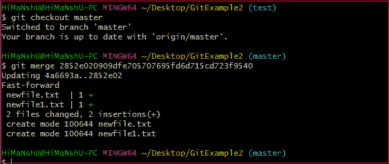

如上图所示，提交 id***2852 e 020909 dfe 705707695 FD 6d 715 CD 723 f 9540***的提交已经合并到主分支中。主分支中的两个文件已更改。然而，我们已经在**测试**分支中做出了这个承诺。因此，可以合并任何分支中的任何提交。

打开新文件，您会注意到我们提交给测试分支的新行现在被复制到了主分支上。

**场景三:Git 合并分支。**

Git 允许将整个分支合并到另一个分支中。假设您对一个分支进行了许多更改，并且希望一次合并所有这些更改。Git 允许您这样做。请参见下面的示例:


在给定的输出中，我在测试分支的 newfile1 中进行了更改。现在，我已经在测试分支中提交了这个变更。

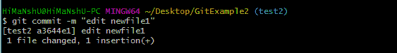

现在，切换到想要合并的分支。在给定的示例中，我已经切换到主分支。执行以下命令，合并活动分支中的整个分支。

```

$ git merge <branchname>

```

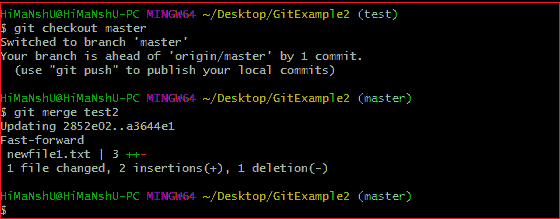

从给定的输出可以看出，分支 test2 的所有提交都合并到了分支 master。

## Git 合并冲突

当两个分支试图合并，并且两个分支同时被编辑在同一个文件中时，Git 将无法识别哪个版本将接受更改。这样的情况叫做合并冲突。如果出现这种情况，它会在合并提交之前停止，以便您可以手动解决冲突。


我们举个例子来理解一下。

假设我的远程存储库已经被我的两个团队成员**用户 1** 和**用户 2** 克隆了。用户 1 在我的项目索引文件中做了如下更改。

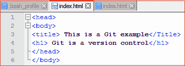

在 git add 命令的帮助下，在本地存储库中更新它。


现在提交更改，并用远程存储库更新它。请参见以下输出:

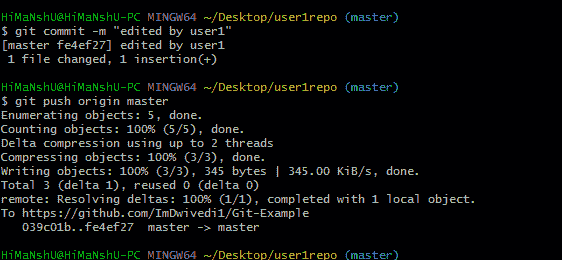

现在，我的远程存储库将如下所示:

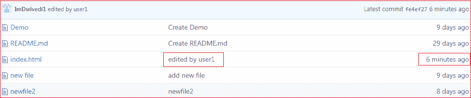

它将显示文件的状态，如由谁编辑以及何时编辑。

现在，与此同时， **user2** 也更新了索引文件，如下所示。

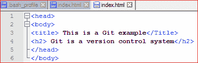

User2 已经在本地存储库中添加并提交了更改。但是当他试图将其推送到远程服务器时，就会抛出错误。请参见以下输出:

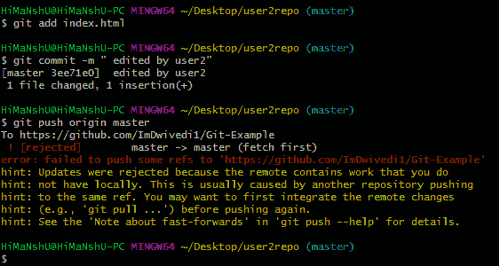

在上面的输出中，服务器知道该文件已经更新，并且没有与其他分支合并。因此，推送请求被远程服务器拒绝。会抛出**【拒绝】未能将部分参考文献推送到<远程 URL >** 这样的错误信息。它会建议您在推送之前先拉存储库。请参见下面的命令:

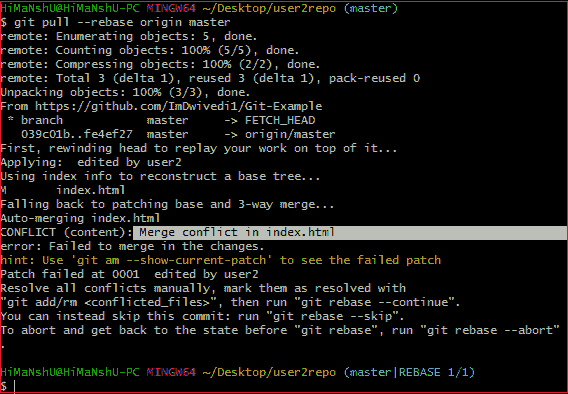

在给定的输出中，git rebase 命令用于从远程 URL 中提取存储库。在这里，它会在<文件名> 中显示类似**合并冲突的错误信息。**

## 解决冲突:

要解决冲突，就要知道冲突是否发生，为什么会发生。Git 合并工具命令用于解决冲突。合并命令的用法如下:

```

$ git mergetool

```

在我的存储库中，它将导致:

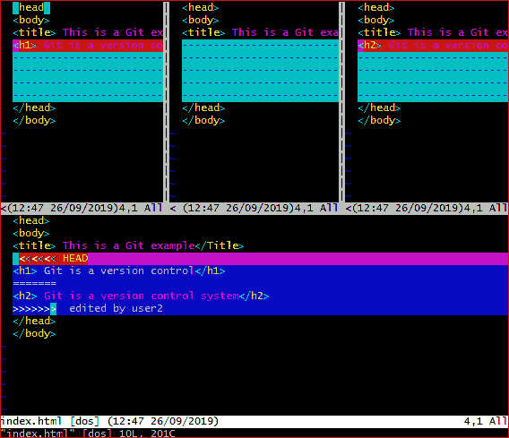

上面的输出显示了冲突文件的状态。要解决冲突，只需按下 **I 键**进入插入模式，并根据需要进行更改。按下 **Esc 键**，退出插入模式。输入: **w！**在编辑器底部保存并退出修改。要接受更改，请使用 rebase 命令。它将按如下方式使用:

```

$ git rebase --continue

```

因此，冲突已经解决。请参见以下输出:

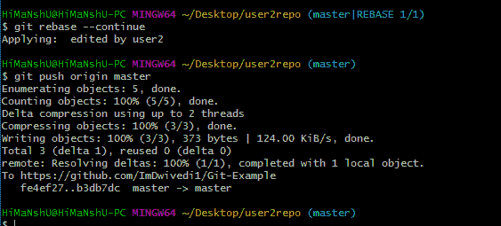

在上面的输出中，冲突已经解决，本地存储库与远程存储库同步。

要查看文件中合并冲突的第一个编辑文本，请搜索带有冲突标记**<<<<<<<**的文件。你可以在你的文本编辑器中看到 **HEAD** 或基支后行**<<<<<<<HEAD**的变化。接下来，您可以看到类似**= = = = = = = =**的分割线。它把你的变化和另一个分支的变化分开，**后面跟着>>>>>【T39】>BRANCH-NAME**。在上例中，user1 在 base 或 HEAD 分支中写了“< h1 > Git 是版本控制< /h1 >”，user2 写了“< h2 > Git 是版本控制< /h2 >”。

决定是只保留您分支机构的更改，还是保留其他分支机构的更改，或者创建新的更改。删除冲突标记 **< < < < < < <，=====，>>>>>>>**并创建您想要合并的最终更改。

* * *