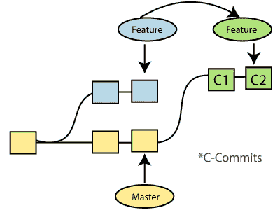
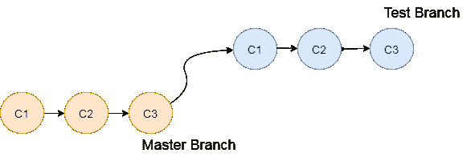
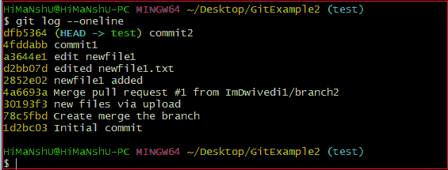
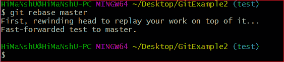
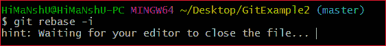
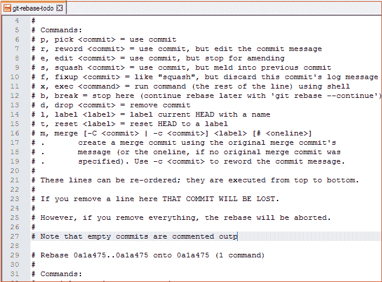

# 吉特·福克斯

> 哎哎哎:# t0]https://www . javatppoint . com/git-rebate

重定基是在另一个基行程之上重新应用提交的过程。它用于将不同分支的一系列提交应用到最终提交中。它是 git 合并命令的替代。这是一个线性的合并过程。

在 Git 中，术语 rebase 指的是将一系列提交移动或组合成一个新的基本提交的过程。重定基础是非常有益的，并且它在特征分支工作流的环境中可视化了过程。

在合并之前，最好重新调整你的分支机构。



一般来说，它是 git 合并命令的替代。合并总是一个向前变化的记录。相比之下，rebase 是 git 中一个引人注目的历史重写工具。它一个接一个地合并不同的提交。

假设您在主分支中进行了三次提交，在另一个名为 test 的分支中进行了三次提交。如果您合并它，那么它将在一段时间内合并所有提交。但是如果你重定它的基础，那么它将以线性方式合并。请考虑下图:



上图描述了 git rebase 的工作原理。主分支的三个提交与测试分支的提交线性合并。

合并是集成分支的最直接的方法。它在两个最新的分支提交之间执行三方合并。

## 如何重置基础

当您在特性分支(测试分支)和主分支中进行一些提交时。您可以重新设置这些分支的基础。使用 git 日志命令跟踪更改(提交历史)。签出到您想要重定基础的分支。现在按如下方式执行 rebase 命令:

**语法:**

```

$git rebase <branch name>

```

如果分支中存在一些冲突，请解决它们，并执行以下命令继续更改:

```

$ git status

```

它用于检查状态，

```

$git rebase --continue

```

上述命令用于继续您所做的更改。如果您想跳过更改，可以按如下方式跳过:

```

$ git rebase --skip

```

当重铺完成时。将存储库推到原点。考虑下面的例子来理解 git 合并命令。

假设你有一个分支，说 **test2** 你正在工作。您现在在 test2 分支上，对项目文件 **newfile1.txt** 进行了一些更改。

将此文件添加到存储库:

```

$ git add newfile1.txt

```

现在，提交更改。使用以下命令:

```

$ git commit -m "new commit for test2 branch."

```

输出如下所示:

```
[test2 a835504] new commitfor test2 branch
 1 file changed, 1 insertion(+)

```

将分支切换到主节点:

```

$ git checkout master

```

**输出:**

```
Switched to branch 'master.'
Your branch is up to date with 'origin/master.'

```

现在你在主分支。我已经将更改添加到我的文件中，上面写着 **newfile.txt** 。下面的命令用于将文件添加到存储库中。

```

$ git add newfile.txt

```

现在提交文件进行更改:

```

$ git commit -m " new commit made on the master branch."

```

**输出:**

```
[master 7fe5e7a]  new commit made on master
 1 file changed, 1 insertion(+)
[email protected] MINGW64 ~/Desktop/GitExample2 (master)

```

要检查日志历史记录，请执行以下命令。

```

$ git log --oneline

```

**输出:**



正如我们在日志历史中看到的，在主分支中有一个新的提交。如果我想重定 test2 分支的基础，我应该怎么做？请参见下面的基础分支场景:

## Rebase 分支

如果我们有许多来自不同分支的提交，并希望将其合并为一个。为此，我们有两个选择，要么合并它，要么重定它的基础。给你的分支重新定基是很好的。

从上面的例子中，我们已经提交了主分支，并希望在 test2 分支上对其进行重定基。让我们看看下面的命令:

```

$ git checkout test2

```

该命令将从主节点切换到 test2 分支。

**输出:**

```
Switched to branch 'test2.'

```

现在你在 test2 分支。因此，您可以用主分支重新调整 test2 分支的基础。请参见下面的命令:

```

$ git rebase master

```

该命令将重新设置 test2 分支的基础，并显示为**应用:test2 分支**上的新提交。考虑以下输出:

**输出:**



## Git 交互式 Rebase

Git 通过交互式 Rebase 提供便利；它是一个强大的工具，允许对现有提交进行各种操作，如**编辑、重写、重新排序、**等。交互式基础只能在当前已签出的分支上操作。因此，在侧边栏设置您的本地 HEAD 分支。

Git 交互式 rebase 可以用 rebase 命令调用，只需在 rebase 命令的同时输入 **-i** 。这里的 **i** 代表互动。该命令的语法如下:

**语法:**

```

$ git rebase -i

```

它将列出所有可用的交互选项。

**输出:**



给定输出后，它将打开一个带有可用选项的编辑器。考虑以下输出:

**输出:**



当我们执行 git interactive rebase 命令时，它将打开带有上述输出的默认文本编辑器。

它包含的选项如下所示:

*   挑选
*   重述
*   编辑
*   壁球
*   固定
*   高级管理人员
*   破裂
*   滴
*   标签
*   重置
*   合并

上述选项使用 git-rebase 执行它们的特定任务。让我们简单了解一下这些选项。

**Pick (-p):**

选择此处包含提交的位置。提交的顺序取决于重定基准期间拾取命令的顺序。如果您不想添加提交，您必须删除整个行。

**重新措辞(-r):**

重新措辞与 pick 命令非常相似。重绕选项暂停了重绕过程，并提供了更改提交消息的机会。它不影响提交所做的任何更改。

**编辑(-e):**

编辑选项允许修改提交。修改手段、承诺可以全部增加或改变。我们也可以在 rebase continue 命令之前进行额外的提交。它允许我们将一个大的提交拆分成较小的提交；此外，我们可以删除提交中的错误更改。

**南瓜(-s):**

挤压选项允许您将两个或多个提交合并为一个提交。它还允许我们编写一个新的提交消息来描述更改。

**修复(-f):**

这与挤压命令非常相似。它丢弃了要合并的提交消息。旧的提交消息用于描述这两种变化。

**执行 （-x）：**

exec 选项允许您针对提交运行任意 shell 命令。

**Break (-b):**

break 选项会在适当的位置停止重定基准。稍后，它将使用“ **git rebase - continue** ”命令继续重定基准。

**下降(-d):**

删除选项用于删除提交。

标签(-l):

标签选项用于用名称标记当前的头部位置。

**重置(-t):**

复位选项用于将磁头复位到标签上。

## 吉他等等。蕾贝萨

对于 git 用户来说，什么时候使用 merge 命令，什么时候使用 rebase 是一个最常见的令人困惑的问题。这两个命令是相似的，都用于合并由存储库的不同分支进行的提交。

不建议在共享分支中重新设置基础，因为重新设置基础的过程会创建不一致的存储库。对于个人来说，重定基础可能比合并更有用。如果你想看到完整的历史，你应该使用合并。合并跟踪整个提交历史，而 rebase 重写一个新的。

Git rebase 命令作为 Git 合并的一种替代。然而，它们有一些关键的区别:

| Git Merge | 吉特·福克斯 |
| 合并会在合并时创建最终提交。 | Git rebase 不会在 rebase 时创建任何提交。 |
| 它将所有提交合并为一个提交。 | 它创建提交的线性轨迹。 |
| 它创建了一个图形历史，理解起来可能有点复杂。 | 它创造了一个易于理解的线性历史。 |
| 合并两个分支是安全的。 | git“rebase”处理严格的操作。 |
| 合并可以在公共和私有分支上执行。 | 在公共分支上使用 rebasing 是错误的选择。 |
| 合并将要素分支的内容与主分支整合在一起。因此，主分支被改变，特征分支历史保持一致。 | 主分支的重新调整可能会影响特征分支。 |
| 合并保留了历史。 | 重写历史。 |
| Git 合并一次显示所有冲突。 | Git rebase 逐个呈现冲突。 |

* * *