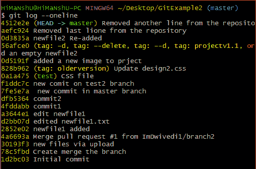
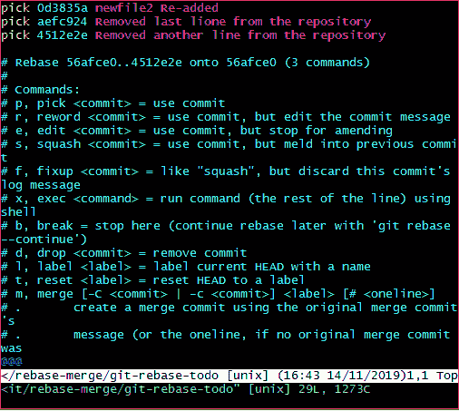
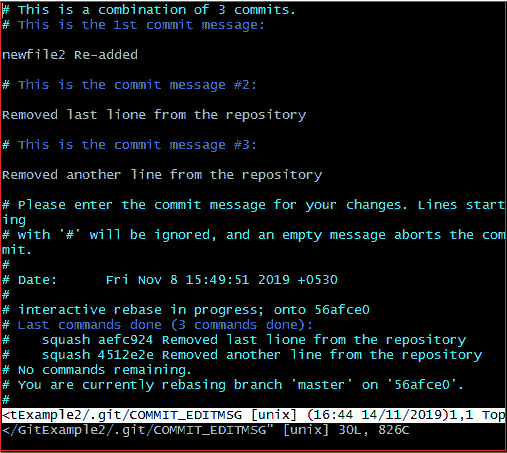
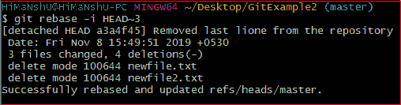
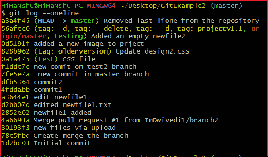
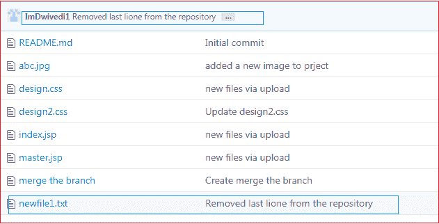

# Git 壁球

> 原文：<https://www.javatpoint.com/git-squash>

在 Git 中，术语挤压用于将之前的提交挤压成一个。这不是命令；相反，它是一个关键字。挤压是一种优秀的技术，可以在将特定组的更改转发给其他人之前进行更改。您可以使用引人注目的交互式 rebase 命令将多个提交合并为一个提交。

如果你是一个 Git 用户，那么你一定已经意识到了压缩提交的重要性。尤其是如果你是一个开源贡献者，那么很多时候，你必须用压扁的提交来创建一个 PR(拉请求)。如果已经创建了公共关系，也可以挤压提交。

让我们了解如何挤压承诺？

## Git 挤压提交

作为 Git 的负责任的贡献者，有必要使协作过程高效且有意义。Git 允许以不同的方式使用一些强大的协作工具。git puck 是一个强大的工具，可以促进高效和不那么痛苦的协作。

壁球不是任何命令；相反，它是 git 交互式 rebases 下您可以使用的众多选项之一。壁球让我们改写历史。假设我们在项目工作期间进行了多次提交，将所有的提交压缩成一个大的提交是比推更正确的选择。让我们了解如何挤压两个提交。

**步骤 1:检查提交历史**

要检查提交历史记录，请运行以下命令:

```

$ git log --oneline

```

给定的命令将在一行中显示历史。我们可以跟踪历史并选择我们想要挤压的提交。考虑以下输出:



**第二步:选择要挤压的提交。**

假设我们想要压制最后的提交。要压缩提交，请运行以下命令:

```

$ git rebase -i HEAD ~3

```

上面的命令将打开您的默认文本编辑器，并挤压最后三个提交。编辑器将如下打开:



从上图中，我们可以看到编辑器顶部显示的以前的提交。如果我们想将它们合并成一个提交，那么我们必须将编辑器顶部的 **pick** 替换为**南瓜**。要在编辑器上书写，按下“ **i** 按钮进入**插入模式**。编辑完文档后，按 **:wq** 保存并退出编辑器。

**步骤 3:更新提交**

按下**进入**键，将打开文本编辑器的新窗口确认提交。我们可以在此屏幕上编辑提交消息。

我正在编辑我的第一个提交消息，因为它将是所有三个提交的组合。请考虑下图:



上图是确认提交合并的编辑器屏幕。在这里，我们可以更新提交消息。要在该编辑器上进行编辑，按下插入模式下的“ **i** 按钮并编辑所需的文本。按下 **:wq** 键，保存并退出编辑器。

当我们退出编辑器时，它会显示更新的描述。考虑以下输出:



上面的输出列出了对存储库所做更改的描述。现在，提交被压扁了。在 git 日志的帮助下，检查提交历史以进行确认。考虑以下输出:



**第四步:按下挤压的提交**

现在，我们可以在远程服务器上推送这个被挤压的提交。要推动这个被挤压的提交，请运行以下命令:

```

$ git push origin master

```

或者

```

$ git push -f origin master

```

上述命令将在远程服务器上推送更改。我们可以在远程存储库中检查这个提交。请考虑下图:



从上图可以看出。我的远程存储库中添加了一个新的提交。

## 挤压的缺点

挤压没有明显的缺点。但是我们可以考虑一些可能影响项目的事实。这些事实如下:

挤压提交和重定基础会改变存储库的历史。如果任何贡献者不关注更新的历史，那么它可能会产生冲突。我建议一个干净的历史，因为它比另一个更有价值。虽然我们可以在参考日志中查看原始历史。

还有一个缺点，我们可能会因为挤压而失去粒度。在使用 Git 时，尽量减少挤压。所以，如果你是 Git 新手，那就尽量远离壁球。

* * *