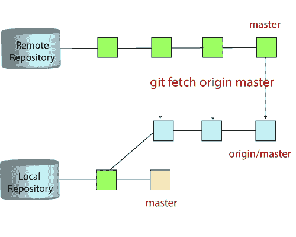
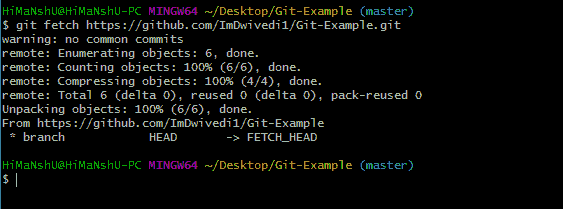
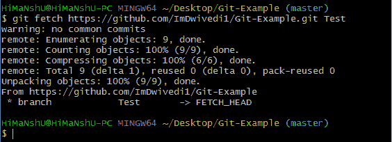
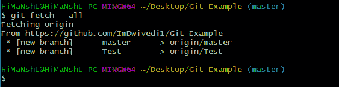
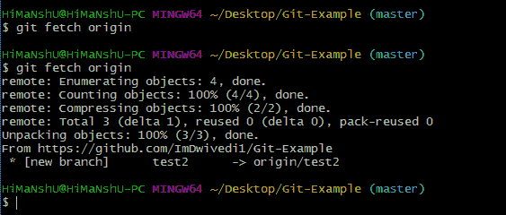

# Git Fetch

> 原文：<https://www.javatpoint.com/git-fetch>

Git“提取”从另一个存储库中下载提交、对象和引用。它从一个或多个存储库中获取分支和标签。它保存着存储库以及完成它们的历史以保持更新的远程跟踪分支所必需的对象。



## “git fetch”命令

“**git fetch**”**命令**用于从远程跟踪分支获取更新。此外，我们可以将推送到远程分支的更新发送到本地机器。正如我们所知，分支是我们的存储库主代码的变体，所以远程跟踪分支是已经被设置为从远程存储库拉和推的分支。

## 如何获取 Git 存储库

对于特定的数据提取，我们可以使用带有许多参数的 fetch 命令。请参见以下场景，了解 fetch 命令的用法。

### 场景 1:要获取远程存储库:

我们可以像拉命令一样，在 fetch 命令的帮助下从存储库 URL 中获取完整的存储库。请参见以下输出:

**语法:**

```

$ git fetch< repository Url>

```

**输出:**



在上面的输出中，完整的存储库是从远程网址获取的。

### 场景 2:要获取特定的分支:

我们可以从存储库中获取特定的分支。它将只从特定的分支访问元素。请参见以下输出:

**语法:**

```

$ git fetch <branch URL><branch name>

```

**输出:**



在给定的输出中，特定的分支**测试**已经从远程网址获取。

### 场景 3:要同时获取所有分支:

git fetch 命令允许从远程存储库中同时获取所有分支。请参见下面的示例:

**语法:**

```

$ git fetch -all

```

**输出:**



在上面的输出中，所有的分支都是从存储库 Git-Example 中获取的。

### 场景 4:要同步本地存储库:

假设您的团队成员向您的远程存储库添加了一些新功能。因此，要将这些更新添加到您的本地存储库中，请使用 git fetch 命令。它的用法如下。

**语法:**

```

$ git fetch origin

```

**输出:**



在上面的输出中，远程存储库的新特性已经更新到我的本地系统。在这个输出中，分支 **test2** 及其对象被添加到本地存储库中。

git fetch 可以从单个命名存储库或 URL 中获取，也可以同时从多个存储库中获取。它可以被认为是 git pull 命令的安全版本。

git fetch 下载远程内容，但不更新本地 repo 的工作状态。当没有指定远程服务器时，默认情况下，它将获取源远程服务器。

## git 提取和 git 提取之间的区别

为了理解提取和拉取之间的区别，让我们了解这两个命令之间的相似之处。这两个命令都用于从远程存储库中下载数据。但是这两个命令的工作方式不同。就像您进行 git 拉取一样，它从远程或中央存储库中获取所有更改，并使其可用于本地存储库中相应的分支。当您执行 git 提取时，它会从远程存储库中提取所有更改，并将其存储在本地存储库中的一个单独的分支中。您可以通过合并在相应的分支中反映这些变化。

所以基本上，

```

git pull = git fetch + git merge

```

### Git 提取与拉取

这两个命令之间的一些主要区别如下:

| git fetch | git pull |
| Fetch 仅从远程存储库中下载新数据。 | Pull 用于使用远程服务器的最新更改更新您当前的 HEAD 分支。 |
| Fetch 用于获取远程存储库中发生的所有事情的新视图。 | Pull 下载新数据，并将其直接集成到您当前的工作副本文件中。 |
| Fetch 从不操纵或破坏数据。 | Pull 下载数据并将其与当前工作文件集成。 |
| 它保护您的代码免受合并冲突的影响。 | 在 git pull 中，有更多的机会创建**合并冲突**。 |
| 最好在提取的存储库上使用 git fetch 命令和 git merge 命令。 | 如果您已经提取了任何存储库，那么使用 git pull 并不是一个很好的选择。 |

* * *