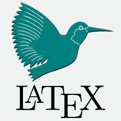

# LATEX教程

> 原文：<https://www.javatpoint.com/latex>

Latex 教程提供了 Latex 的核心和高级概念。我们的LATEX教程是为初学者和工作专业人士设计的。

Latex 是一个高质量的排版系统，用于科技文件的文档化。在**学术界**广泛用于经济学、社会学、数学、化学、物理学、工程学等领域科学论文的传播和发表。它还处理不同结构的格式布局。名字被程式化为**LATEX**。

我们的 latex 教程包括文件类型、latex 编辑器、如何使用 Latex、符号、列表、字体、表格、格式等主题。

#### 注:学术界是世界性的团体，由更高层次的研究所的研究人员和教授组成。这是一所高等教育和中等教育学院。

## 先决条件

Latex 是用于技术文档排版的标记语言。要学习 Latex，您必须对 MS Word 以及您想要设计文档的方式或方法有一个很好的了解。它还需要理解数学和相关的命令。

## 观众

LATEX主要被科学家、数学家、作家等使用。它还旨在帮助初学者以及专业人士简洁，使他们的文档看起来更有吸引力。这是一个快速、省时的文档编写过程。

## 问题

你在本教程中不会发现任何问题，但如果你发现了任何问题，你可以在联系表格中发布问题。

* * *