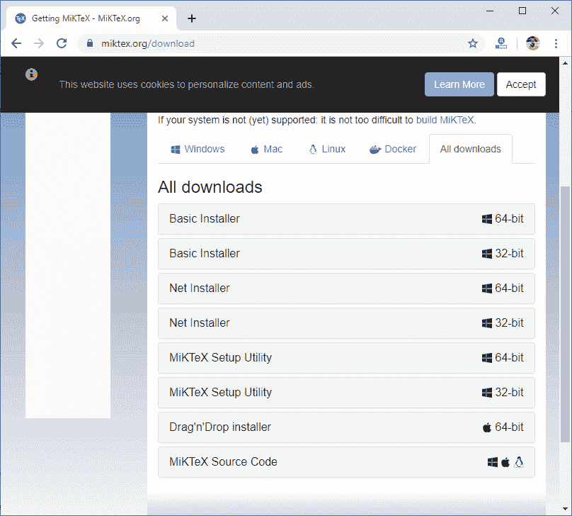
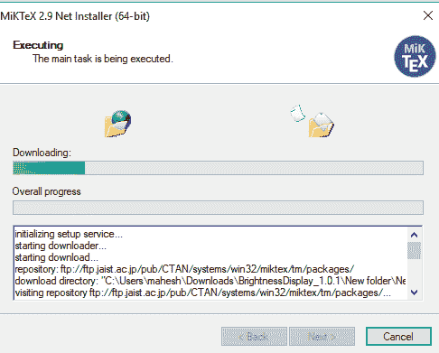
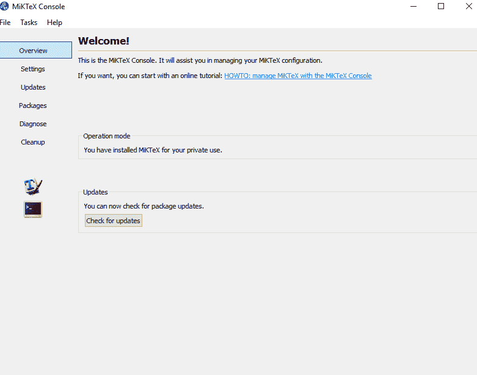
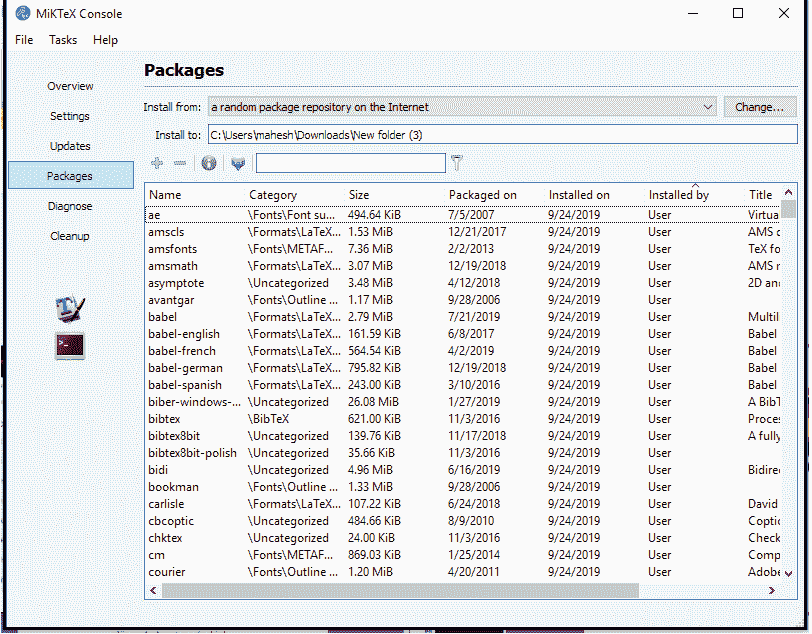
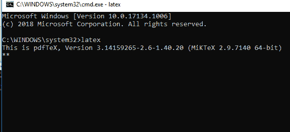

# 乳胶安装

> 原文：<https://www.javatpoint.com/installation-of-latex>

对于 LaTeX，需要下载 **MiKTeX** 和 **Texmaker** 。MiKTeX 是 Latex 发行版，是一个庞大的文件集合，对于 Latex 来说是必不可少的。Texmaker 被称为专门的编辑器，在 Latex 工作流程中提供帮助。安装编辑器是可选的，但它使 Latex 更容易。这个过程需要一些时间。以下是 Latex 的下载和安装步骤:

*   在任何浏览器中搜索 MiKTeX。
*   当页面打开时，点击 MiKTeX.org 并选择顶部给出的“下载”选项。
*   现在，点击“所有下载”选项。您将看到窗口如下图所示:

*   选择“网络安装程序”，并根据您的系统配置选择 64 位或 32 位，然后单击下载选项。下载将开始。
*   之后，关闭浏览器。在这种情况下，MiKTeX 下载分为两步。
*   第一步，在网络安装程序的帮助下，我们下载文件，第二步，我们安装这些下载的文件。
*   现在，打开这个文件并接受条件。
*   选择“下载麦克风”选项单击下一步，然后选择“完成 MiKTeX”，再次单击下一步。
*   然后选择 FTP 作为下载源。单击浏览选项，在下载类别下，用任何名称创建一个新文件夹，单击“确定”，然后单击下一步。您也可以根据需要选择任何其他文件夹。
*   点击“开始”选项，下载过程将开始，这将需要一段时间。等待进程下载。下载对话框如下图所示:

之后，再次转到麦克风，然后选择“安装麦克风”这仍然需要一些时间，现在，这个过程已经完成。

如果出现错误，请关闭窗口，从列表中选择另一台服务器，重新开始下载过程。

*   如果您选择了“基本安装程序”选项，则在下载后，您可以开始该过程。下载将在很短的时间内完成。下载完成后，打开软件。
*   现在你必须下载 Texmaker。为此，在浏览器或任何其他搜索引擎中搜索它。点击它并安装软件。它将在安装后出现在桌面上。

## MIKTEX 概述

该过程完成后，MiKTeX 将显示为“MiKTeX 控制台”当您打开此文件时，它看起来像下面给出的图像:

MiKTeX 控制台是我们与 MiKTeX 相关的所有活动的主要维护界面。

在**更新**部分，你可以更新所有已经安装的软件包。

在**包**下，可以管理单个包。但是，在添加或删除任何单个软件包之前，请确保首先单击“**更新数据库**”。您也可以单击“-”和“+”号来添加或删除任何包。更新数据库代表更新**数据库**。术语“**包存储库**在本文中经常被用作更新数据库的同义词。这个“更新数据库”会同步您计算机上的本地数据库，该数据库对于互联网上的最新数据库来说已经过时。该选项如下图所示:

在上图中，上的“**包装”一栏表示数据包添加到互联网的日期。“安装时间”列显示数据包被添加到本地目的地的日期。**

在上图中，点击左侧显示的 **cmd** 窗口。将出现命令提示符窗口。此步骤仅用于验证安装。键入“latex ”,您将看到如下所示的输出:

* * *