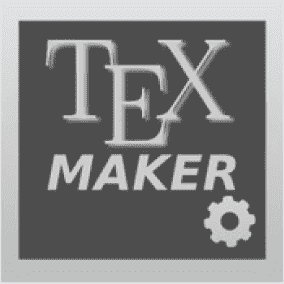
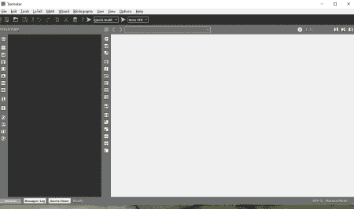
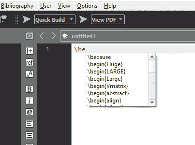

# 德州仪器概述

> 原文：<https://www.javatpoint.com/latex-texmaker-overview>

它被称为 Latex 编辑器，简化了工作。有了这个，我们以后就不需要使用‘命令提示符’了。你也可以制作一个文件夹，把所有的 LATEX 文件放在一个地方。

打开 Texmaker，查看下面给出的图像:

**Textmaker**是一个带有文本窗口、结构窗口、工具栏、函数和状态栏的编辑器。

白色部分显示文本或书写窗口，黑色部分显示结构窗口。它包含到章节、章节、表格、等式等的链接。

点击链接会将您转到特定的文档。文本窗口下方的区域是状态栏，所有编译操作都显示在那里。

单击菜单栏上的“选项”，然后选择“配置纹理生成器”转到“Pdf 查看器”并激活“嵌入”选项。然后去左栏的编辑器，根据你的要求改变字体大小。通过选择相应的词典文件，您可以在不同的语言之间进行选择。“编辑器字体编码”是必不可少的，但对于大多数用户来说，它是 **UTF-8** 。

底部的四个按钮改变了文本生成器窗口的布局。运行代码时，右侧会出现一个嵌入 PDF Viewer 的窗口名称。您也可以通过单击底部的 PDF 查看器来启用和禁用它。

“ **tex** ”是 Latex 文件的默认文件扩展名。通过这个，你可以通过在窗口上输入代码来制作相应的文件。将进一步详细解释编写代码的过程以及如何运行程序/代码。

## TEXMAKER 的特点

德州仪器的特点如下:

*   包括打字时的**拼写检查**。
*   在打字时可以快速插入 Latex 命令。例如，如果您键入一个单词，将显示与该单词对应的所有命令。您可以根据需要从该下拉列表中选择任何命令。此示例的图像如下所示:

*   它支持多种编码。
*   它包含一个“结构视图”，在键入时会自动更新。
*   在 Texmaker 中，通过使用键盘触发器，您可以定义无限数量的代码片段。
*   它给你完全的渐近支持。
*   它包括**内置 PDF 查看器**和“**快速构建**命令。
*   Texmaker 包括 37O 个数学符号，只需点击一下就可以插入。
*   德州仪器提供了大量的 LATEX 文件。
*   它会在编译后用相应的行号自动检测警告和错误。它还包含每个错误的细节。
*   它还允许我们使用“主模式”高效地处理分隔在几个文件中的文档。

* * *