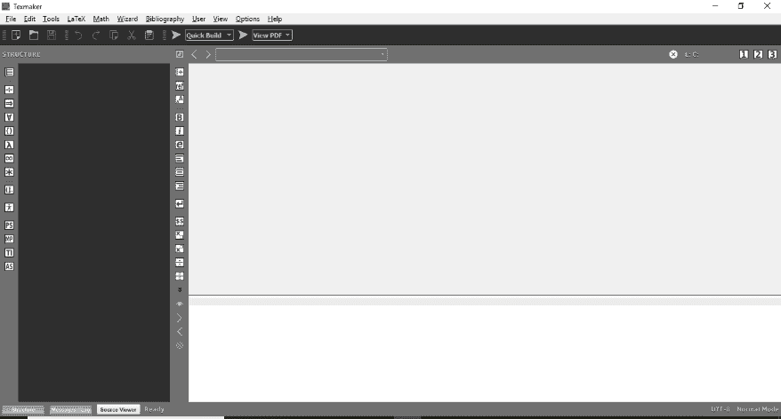
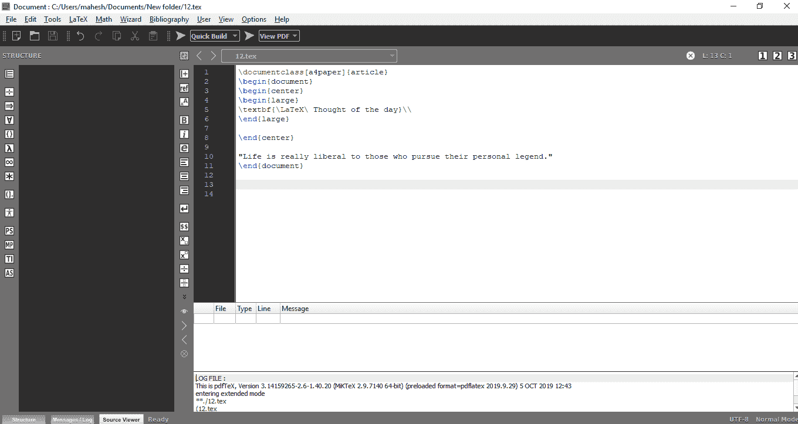
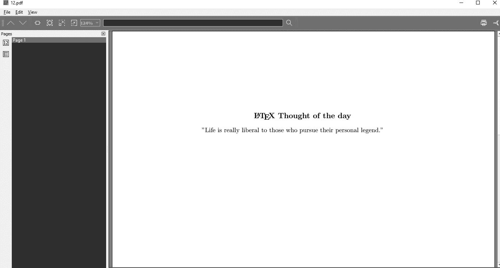
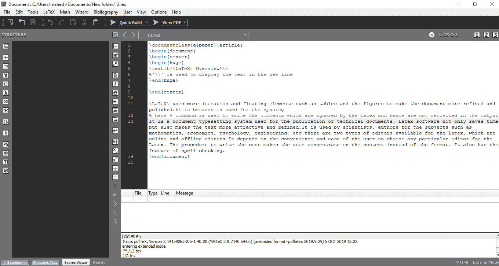
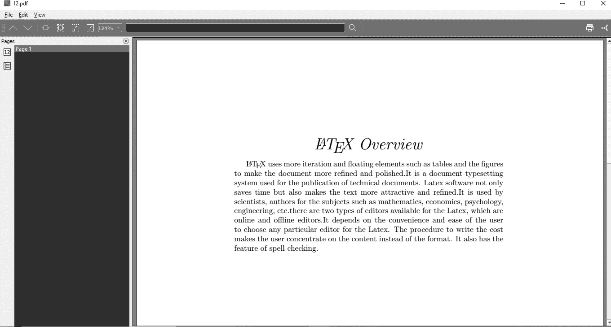
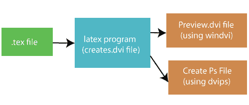
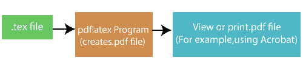

# 如何使用乳胶

> 原文：<https://www.javatpoint.com/how-to-use-latex>

软件 **MikTex** 和 **Texmaker** 一下载，你就可以开始你的 Latex 了。这里使用 Texmaker 是因为它被认为是作为 Latex 编辑器使用的最好的软件。通过编辑器**纹理器**使用**乳胶**的步骤如下:

*   Latex 中的所有命令都以反斜杠“ **\** ”开头
*   第一步是打开 Texmaker 或任何相应的编辑器，你正在使用的乳胶。
*   在这里，我们使用了文本生成器，它看起来像下图:



可以点击**文件**菜单，选择**新建**文件。现在你可以开始编程或者在屏幕上写代码了。

*   让我们通过一个例子来理解 Latex 编程或代码。我们将在屏幕上写代码，并在代码编译后打印相应的输出。如果有错误，那么在白色的底部窗口，如上所示，错误将显示行号。
*   例子是打印一份“当天的想法”同样的代码写在 Texmaker 屏幕上。

代码如下:

```

\documentclass[a4paper]{article}
\begin{document}
\begin{center}
\begin{large}
\textbf{\LaTeX\ Thought of the day}\\
\end{large}

\end{center}

"Life is really liberal to those who pursue their personal legend."
\end{document}

```

**说明:**

{center}用于将文本居中对齐。
\textbf 用于以粗体显示文本。
{大号}是字体大小的一种类型。

Texmaker 屏幕上的相同代码如下图所示:



写完代码后，**保存**文件，然后点击顶部的**快速构建**选项查看输出。

该代码的输出如下图所示:



同样，您可以编写尽可能多的数据和命令来格式化文档。

这取决于用户，他/她希望在特定文档中使用哪种类型和风格。另一个写段落的例子如下所示:

```

\documentclass[a4paper]{article}
\begin{document}
\begin{center}
\begin{huge}
\textit{\LaTeX\ Overview}\\
%'\\' is used to display the text in the new line
\end{huge}

\end{center}

\LaTeX\ uses more iteration and floating elements such as tables and the figures to make the document more refined and polished.%\ In between is used for the spacing
% here % command is used to write the comments which are ignored by the Latex and hence are not reflected in the output
It is a document typesetting system used for the publication of technical documents. Latex software not only saves time but also makes the text more attractive and refined. It is used by scientists, authors for the subjects such as mathematics, economics, psychology, engineering, etc. there are two types of editors available for the Latex, which are online and offline editors. It depends on the convenience and ease of the user to choose any particular editor for the Latex. The procedure to write the cost makes the user concentrate on the content instead of the format. It also has the feature of spell checking.
\end{document}.

```

Texmaker 屏幕上的相同代码如下图所示:



该代码的输出如下图所示:



## Latex 是如何工作的？

使用 Latex 的第一步是使用编辑器创建文件，并给出以**结尾的名称。特克斯**。在该文件中，您可以键入文档的文本以及格式化文档的命令。

打印你的**有两种方式。特克斯**文件。方法如下:

1)传统方式是创建一个**。dvi 文件**(设备无关)，二进制格式，不能直接查看。为了便于查看，您可以运行预览程序或**后记**程序，并且可以通过 **GSView** 进行打印。



第二种方法很直接，但不如第一种快。

2)另一种方法是运行最近的相对 pdflatex 程序，创建一个 PDF 文件进行查看或打印。



* * *