# LATEX 桌

> 原文：<https://www.javatpoint.com/latex-table>

表格是学术写作中常用的特征。本主题将解释创建表和在表中执行不同功能的步骤。表格是表示信息的有效方式，通常用于大多数文档或文件中。当讨论科学论文时，表格被用来表示数据。

与其他表相比，在 Latex 中创建表有点复杂。但是在这里，从基础创建表的步骤和过程将使该过程更加容易。

Latex 不是电子表格，但它是构建表格并将这些表格导出到文档的专用工具。

Latex 中的表格是由*表格*环境和**表格**环境组合而成的。表格环境包含表格的实际内容，而其他环境包含标题。

用于创建**表**环境的命令有:

**\begin{table}{** *所在* **}**

桌子

**\end{table}**

用于创建**表格**环境的命令有:

**\ begin { table } { LCR }**

桌子

**\ end {列表式}**

在这里，表格与**\标题**命令一起表示表格环境。命令*用于确定桌子的位置。例如， **\begin{table}{t}** 表示该表将出现在页面的**顶部**。*

 *表格环境使用 **&** (与符号)符号进行列分隔。

用于将内容向左、中、右对齐的字母分别是******c****和** **r** 。传递的对齐命令是**\ begin { table } { l c r }。******

 ****用于绘制分隔表格列的垂直线的命令是**\ begin { table } { l | c | r }，**，其中( **|** )作为参数传递。 **|** 符号用于绘制立柱之间的垂直线。

也可以使用 **\vline** 命令绘制垂直线。 **\vline** 命令沿着行的高度绘制垂直线。

如果我们想画一条水平线作为行分隔符，那么我们可以使用 **\hline** 命令。

命令 **\cline{** i-j **}** 用于绘制以 *i* 开始，以 *j* 结束的部分水平线。

让我们考虑几个使用上面讨论的命令的表的例子。

**1。**

```

\documentclass{article}
\begin{document}
\begin{center}
TABLE
\end{center}
\begin{tabular}{lcr}
a&b&c\\
d&e&f\\
g&h&i
\end{tabular}
\end{document}

```

**输出:**

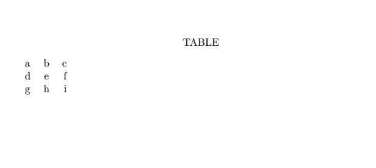

**2。**

```

\documentclass{article}
\begin{document}
\begin{center}
\begin{tabular}{|l|c|r|}
\hline
a&b&c\\ \hline
d&e&f\\ \hline
g&h&i\\ \hline
\end{tabular}
\end{center}
\end{document}

```

**输出:**

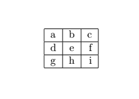

**3。**

```

\documentclass{article}
\begin{document}
\begin{tabular}{|r|l|}
\hline
I, II, III, IV...& uppercase Roman
i, ii, iii... & lowercase roman numerals \\ \cline{2-2}
1, 2, 3.. & Arabic format \\
\hline \hline
1684 & decimal digits \\
\hline
\end{tabular}
\end{document}

```

**输出:**

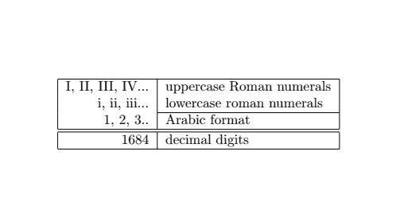

现在，看看下面创建基本表的代码:

**4。**

```

\documentclass{article}
\begin{document}
\begin{table}[h!]
\begin{center}
\caption{ the basic table}
\label{tab:Table1}
\begin{tabular}{|l|c|r|}
\textbf{heading 1} & \textbf{heading 2} & \textbf{heading 3}\\
$\alpha$ & $\beta$ & $\gamma$ \\
\hline
1 & 1.34 & a\\
2 & 18.54 & b\\
3 & 735.765231 & c\\
\end{tabular}
\end{center}
\end{table}
\end{document}

```

**说明:**

*   **\label** 命令用作表格的标记或标记表格。
*   **\题注**包含在表格本身中。

可以使用文档\表格开头的**\居中**命令代替**\开始{中心}…\结束{中心}，**。

**输出:**

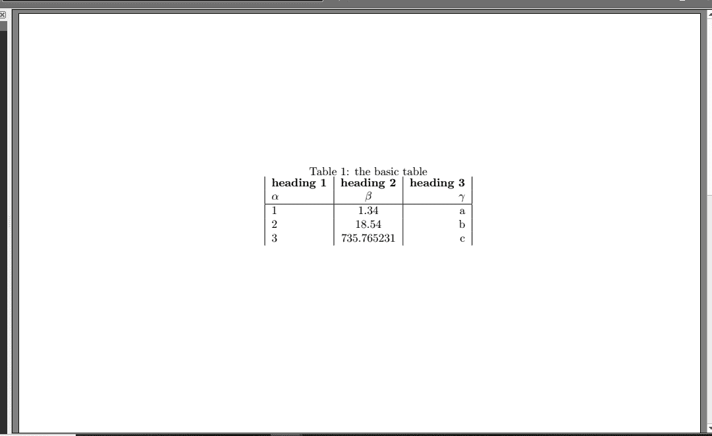

## 组合行和列

对于组合列，使用**\多列{**num**} {**col**} {**text**}**命令。 ***num*** 命令用于将 ***num*** 列与宽度合并为一列。命令 ***列*** 包含符号 l、c 或 r。***文本*** 包含该列的内容。

对于组合行**\ raisedbox {**lift**} {**text**}**命令被使用。它打印 ***文本*** ，该文本比当前基线高出 ***提升*** 的量。对于行与行之间的单个空格，使用 **[-lex]** 命令。对于第一行和第二行之间的双空格，使用**【1ex】**命令。

您也可以通过使用 ***{num}{str}** 语法**来对齐许多相同的列。**当您的表有很多列时，它很有用。该命令将写成:

**\ begin { table } { 1 * { 6 } { c } r }**

让我们考虑一个例子。代码写在下面:

```

\documentclass{article}
\begin{document}
\begin{table}[h]
\caption{Marks after exams} % title name of the table
\centering % centering table
\begin{tabular}{l c c rrrrrrr} % creating 10 columns
\hline\hline 
 Subject &No. of Students &category  &\multicolumn{7}{c}{the list of marks}
\\ [0.5ex]
\hline 
% Entering 1st row
 & &lowest &43 & 34 & 65 & 41 &  33 & 46 & 51 \\[-1ex]
\raisebox{1.5ex}{Science} & \raisebox{1.5ex}{32}&highest
& 88 & 94 & 93 & 89 & 91 & 90 & 88 \\[1ex]
% Entering 2nd row
& &lowest & 41 & 33 & 42 & 35 & 36 & 40 & 31 \\[-1ex]
\raisebox{1ex}{Maths} & \raisebox{1.5ex}{32}& highest
&87 & 89 & 87 & 98 & 96 & 94 & 90 \\[1ex]
% Entering 3rd row
& &lowest & 43 & 41 & 37 & 34 & 39 & 41 & 44 \\[-1ex]
\raisebox{1ex}{English} & \raisebox{1.5ex}{32}& highest
&79 & 87 & 85 & 91 & 84 & 83 & 90 \\[1ex]
% [1ex] adds vertical space
\hline % inserts single-line
\end{tabular}
\end{table}
\end{document}

```

**输出:**

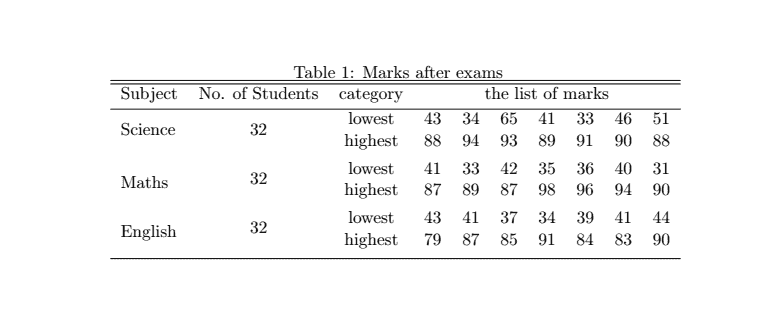

您也可以使用 **\usepackage{adjustbox}** 命令将模式更改为**横向**模式。

此处的表格以 **\begin{adjustbox}** 开始，以\ **end{adjustbox}结束。**

让我们考虑一个简单的表格示例来理解这一点。

代码如下:

```

\documentclass{article}
\usepackage{adjustbox}
\begin{document}
\begin{adjustbox}{angle=90}
\begin{tabular}{l|c|r}
\textbf{heading 1} & \textbf{heading 2} & \textbf{heading 3}\\
$\alpha$ & $\beta$ & $\gamma$ \\
\hline
1 & 11.34 & a\\
2 & 10.5 & b\\
3 & 765.5231 & c\\

\end{tabular}
\end{adjustbox}
\end{document}

```

**输出:**

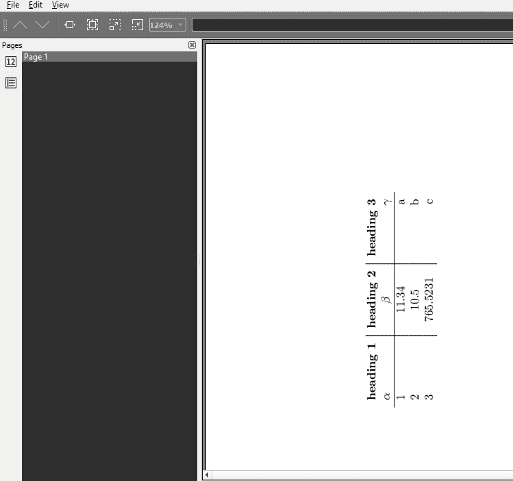

例如，如果我们在上面提到的相同代码中将角度设置为 150 度，输出将如下图所示:

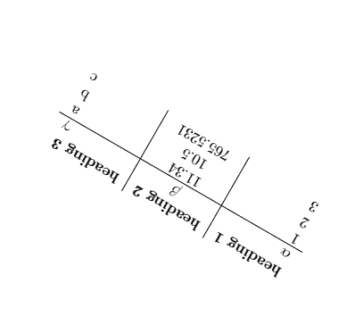

用于创建表格的一些常见命令解释如下:

*   **阵**:与 **p** 命令类似，增加了 **m** { < *宽度* > }和 **b** { < *宽度* > }两列，但垂直向中心或底部对齐。
*   **book tab**:为上下间距的水平线提供创意命令。
*   **table rx**:引入了列类型 **X** ，其工作方式类似于带有自动宽度计算功能的 p 命令。
*   **\ rag right**:被识别为表行的末尾。
*   **\白板线**:此命令代替 **\\。**
*   **\arraybackslash** :用于还原过程。

对于列之间的**间距，使用**\ setlength { tabcolsep } { 5pt }**命令。默认尺寸为 **6pt** 。此命令插入列之间以确定间距。**

对于行之间的**间隔**，使用**\ arraystritch**命令。

## 表格中的文本换行

Latex 算法有一些缺点。如果文本超出页面宽度，Latex 不会自动调整/换行。为此，使用特殊命令 **p (** 预定义宽度 **)** 来设置宽度。

下面给出了例子。

此示例解释了不设置宽度和设置宽度的两个过程。你可以注意到这两种方法的区别。

*   第一个过程(不指定宽度)

代码如下:

```

\documentclass{article}
\begin{document}
Without specifying the width.
\begin{center}
\begin{tabular}{| l | l | l | l |}
\hline
Name & Type & popular in & Explanation \\ \hline
Orange & Fruit & Vitamin C & It is fruit, which is full of nutrients and low in calories. They can promote clear, healthy skin and also lowers the risk for many diseases. It reduces cholesterol and also helps in building a healthy immune system.\\ \hline
Cauliflower & vegetable & B-Vitamins & It is the vegetable, which is high in fiber and B-Vitamins. It also provides antioxidants, which help in fighting or protect against cancer. It enhances digestion and has many other nutrients.\\ \hline
\end{tabular}
\end{center}
\end{document}

```

**输出:**

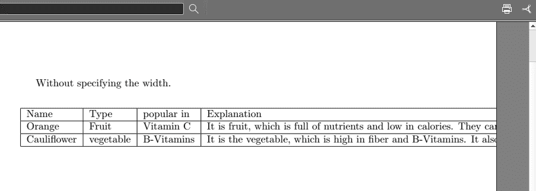

您可以注意到，因为没有指定宽度，所以不会显示信息。

*   现在考虑第二个过程，使用 **p** 指定宽度。代码如下:

```

\documentclass{article}
\begin{document}

specifying with the width.
\begin{center}
\begin{tabular}{ | l | l | l | p{5cm} |} % you can change the dimension according to the spacing requirements
\hline
Name & Type & popular in & Explanation \\ \hline
Orange & Fruit & Vitamin C & It is fruit, which is full of nutrients and low in calories. They can promote clear, healthy skin and also lowers the risk for many diseases. It reduces cholesterol and also helps in building a healthy immune system.\\ \hline

Cauliflower & vegetable & B-Vitamins & It is the vegetable, which is high in fiber and B-Vitamins. It also provides antioxidants, which help in fighting or protect against cancer. It enhances digestion and has many other nutrients.\\ \hline

\end{tabular}
\end{center}
\end{document}

```

**输出:**

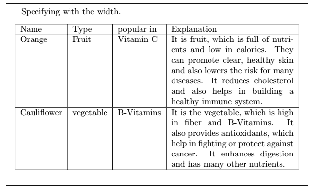

## 多行和多列

它用于格式化包含若干行和列的数据。在这种情况下，使用多行包将多行拆分为子行。

#### 注意:多行环境中的列换行不会使用所使用的语法。

让我们用一个例子来理解。代码如下:

```

\documentclass{article}
\usepackage{multirow}
\begin{document}
\begin{table}
\begin{tabular}{c|lp{1.1in}|lp{1in}|l|}
\hline
Name& Occupation & salary & Children & Savings percentage \\\hline
\multirow{3}{*}{Henry}&\multirow{3}{*}{$\$150,000$}&windsurfing&lisa&\multirow{3}{*}{20}\\
~&~&jumping on&John&~\\
~&~&a trampoline & tia &~\\\hline
\multirow{3}{*}{Shefy} & $\multirow{3}{*}{\$70,000} $ &heavy metal music&\multirow{3}{*}{Tyra}
&15\\
~&~&Paris&~&\multirow{2}{*}{12}\\
~&~& dancing with pop music &~&~\\\hline
\multirow{3}{*}{Ben} & $\multirow{3}{*}{\$35,000}$ &chocolate & \multirow{3}{*}{None}&18\\
~&~&fast cars &~&\multirow{2}{*}{ 22}\\
~&~&Ramen&~&~\\\hline
\multirow{3}{*}{Sam} & $\multirow{3}{*}{\$40,000}$ & paintingit&Donal & \multirow{3}{*}{11}\\ 
~&~&motorcycles&\multirow{2}{*}{Peter}&~\\ 
~&~&Reddit&~&~ \\ \hline
\end{tabular}
\end{table}
\end{document}

```

**输出:**

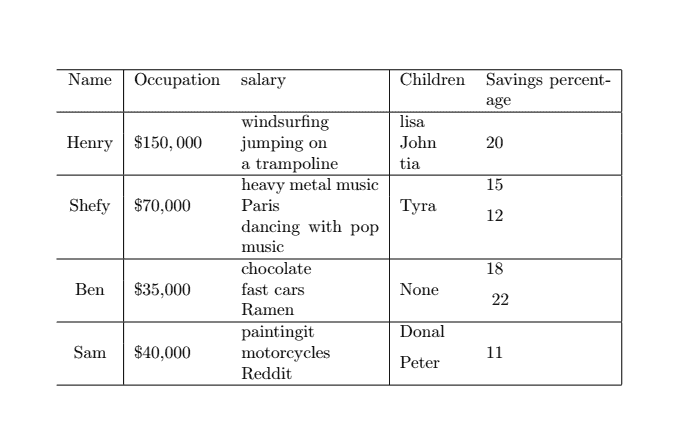

您可以使用 **\hline** 命令绘制任意多的线条。考虑上面类似的图像，有更多的线条:

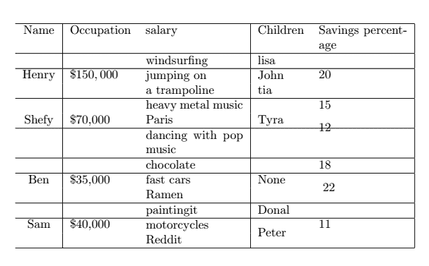

## 带书签的表格

**book tab**命令用于使文档更加专业，因为 **\hline** 命令没有这样做。使用 bookstab 包提供的**顶规**、**中规**、**底规**等命令代替\hline 命令。

bookstab 包的代码如下:

```

\documentclass{article}

\usepackage{booktabs} % For prettier tables
\begin{document} 
\begin{table}[h!]
\begin{center}
\caption{Table using booktabs.}
\label{tab:table1}
\begin{tabular}{l|c|r}

\toprule % Toprule applied here

\textbf{Heading 1} & \textbf{Heading 2} & \textbf{Heading 3}\\
$\alpha$ & $\beta$ & $\gamma$ \\

\midrule % Midrule applied here

 1 & 1.101 & a\\
 2 & 103.145 & b\\
 3 & 289.1 & c\\
 4 & 17.132114 & d\\

\bottomrule % Bottomrule applied here

\end{tabular}
\end{center}
\end{table}
\end{document}

```

**输出:**

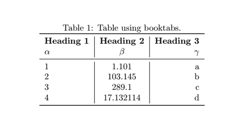

## 多页表格

如果您的表格包含多行，则表格将从底部裁剪。命令**用于生成多个页面，这些页面必须添加到包中。**

 **当使用*长表*命令时，不使用*表*或*表*命令。它取代了表和表格命令的使用，并将两种环境组合成一个环境。因此，相反，环境 longtable 用于表。

上述主题的代码如下:

```

\documentclass[12pt]{article}
\usepackage{longtable}
\begin{document}
\begin{center}
\begin{longtable}{|c|c|c|c|}
\caption{A simple example of longtable}\\
\hline
\textbf{First heading} & \textbf{Second heading} & \textbf{Third heading} &
\textbf{Fourth heading} \\
\hline
\endfirsthead
\multicolumn{4}{c}%
{\tablename\ \thetable\ -- \textit{Continued from previous page}} \\
\hline
\textbf{First heading} & \textbf{Second heading} & \textbf{Third heading} &
\textbf{Fourth heading} \\
\hline
\endhead
\hline \multicolumn{4}{r}{\textit{Continued on next page}} \\
\endfoot
\hline
\endlastfoot
ab & bc & ac & da \\ ef & fg & gh & he \\ ij & jk & kl & lj \\ mn & no & op & po \\
ab & bc & ac & da \\ ef & fg & gh & he \\ ij & jk & kl & lj \\ mn & no & op & po \\
ab & bc & ac & da \\ ef & fg & gh & he \\ ij & jk & kl & lj \\ mn & no & op & po \\
ab & bc & ac & da \\ ef & fg & gh & he \\ ij & jk & kl & lj \\ mn & no & op & po \\
ab & bc & ac & da \\ ef & fg & gh & he \\ ij & jk & kl & lj \\ mn & no & op & po \\
ab & bc & ac & da \\ ef & fg & gh & he \\ ij & jk & kl & lj \\ mn & no & op & po \\
ab & bc & ac & da \\ ef & fg & gh & he \\ ij & jk & kl & lj \\ mn & no & op & po \\
ab & bc & ac & da \\ ef & fg & gh & he \\ ij & jk & kl & lj \\ mn & no & op & po \\
ab & bc & ac & da \\ ef & fg & gh & he \\ ij & jk & kl & lj \\ mn & no & op & po \\
ab & bc & ac & da \\ ef & fg & gh & he \\ ij & jk & kl & lj \\ mn & no & op & po \\
\end{longtable}
\end{center}
\end{document}

```

**说明:**

*   **\endfirsthead** :是第一页作为表格头部出现的那一行。
*   **\endhead** :除第一页外，出现在每一页顶部的一行
*   **\endfoot** :除最后一页外，出现在每一页底部的一行
*   **\endlastfoot** :出现在表格末尾的那一行

**输出:**

上述代码的输出将在两页中列出，如下所示:

这两页被分成三张图片。

图像如下:

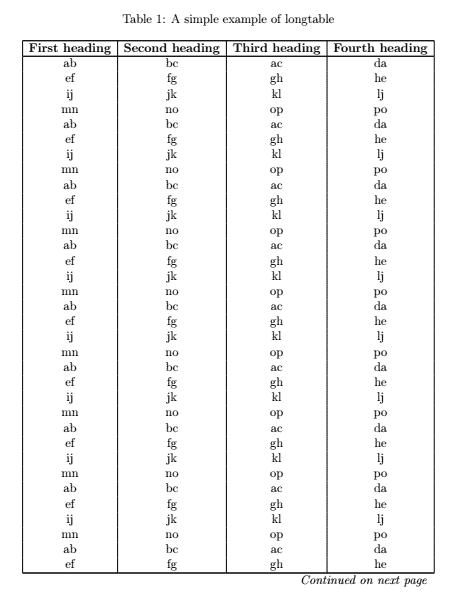
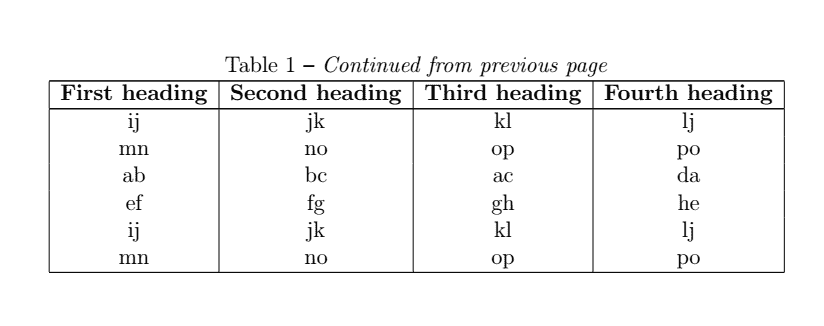

您可以注意到，表格使用*长列*分成了多个页面，没有任何数据丢失。

## 对齐小数点

下面讨论的示例将根据表达式的小数点对齐表达式和相应的值。

代码如下:

```

\documentclass[12pt]{article}
\begin{document}
\begin{tabular}{c |r @{.} l} % @{.} is used to display the decimal point
expression Pi &
\multicolumn{2}{c}{corresponding Value} \\
\hline
$\pi$ & 3&1416 \\
$\pi^{\pi}$ & 36&46 \\
$(\pi^{\pi})^{\pi}$ & 80662&7 \\
\end{tabular}
\end{document}

```

**输出:**

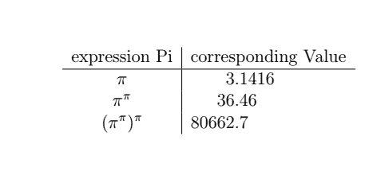

## 表格材料

这两种环境用于表格材料，即制表环境(**\ begin { tabing }…\ end { tabing }**)和表格环境(**\ begin { tabing }…\ end { tabing }**)。

**表格**允许使用用于绘制水平线和垂直线的命令来创建一个奇特的环境。但是，不能将表格分成页面。为此，**表格**命令用于将表格分成多个页面，如上所述。

**制表符**环境用于设置制表符，行为类似于打字机。然后，设置选项卡从一个移动到另一个。因为跳转环境中的每一行都是单独处理的，所以跳转中允许分页。

用于跳转的命令如下所示:

*   **\=** 设置制表位
*   **\ >** 向右移动到下一个制表位
*   **\\** 终止一条线
*   **\kill** 以该命令结尾的一行用于设置标签，但不打印该行

下面给出了 tabbing 环境的两个示例:

1.该示例的代码如下所示:

```

\documentclass[12pt]{article}
\begin{document}
\begin{center}
\begin{tabbing}Heading 1 \= Heading a \= Heading b \= Heading c \\ \\
H 1 \> H 2 \> H 3 \> H 4 \\ \\
FIRST \> SECOND \> THIRD \> FOURTH
\end{tabbing}
\end{center}
\end{document}

```

在这里，我们为两条新线路使用了两条 **\\** 。

**输出:**

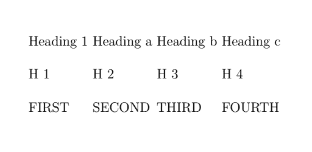

2.第二个例子的代码如下:

```

\documentclass[12pt]{article}
\begin{document}
\begin{center}
\begin{tabbing}\hspace{2in} \= \hspace{2in} \= \kill % you can change the inch spacing according to 
your requirements
First heading \> Second heading \> Third heading \\
\> Second \> Third \\
\hspace{1in} \\ % make a blank line
This Text extends past tab 1 \>\> Third column \\
\> Text spans columns two and three \\xxxxxxxx \= xxxxx \= xxxx \= \kill % set up new tab stops i.e. to set the stops according 
to the number of x
H 1 \> H 2 \> H 3 \> H 4 \\
\end{tabbing}
\end{center}
\end{document}

```

**输出:**

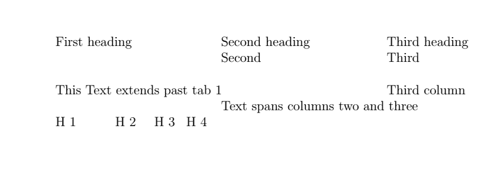

* * ********