# LATEX 图

> 原文：<https://www.javatpoint.com/latex-figures>

Latex 中的图形和图表是使用图形环境创建的，表示为:

```

\begin{figure}[where]
......
\end{figure}

```

这里，**其中**代表图形在**顶部【t】**或**底部【b】**的位置。

所有插入到**图**和**图**环境中的图片将被自动编入索引，并用连续的数字进行标记。它负责文档中图像的定位和编号。您需要包含 **\includegraphics** 命令来插入图像。

Latex 应用了一些原则来排列文本，这通常被称为浮动。

## 漂浮物

浮动解决了在同一/当前页面上容纳不下的文本的问题。浮动是位于页面一部分的独立实体，即顶部、底部、中间、左侧、右侧或设计指定的任何位置。浮动总是有标题和编号，以便可以在文档中的任何地方引用。

浮动是使用图形环境创建的，如下所示:

```

\begin{figure}{placement specifier}
..........
\end{figure}

```

位置说明符是:

*   **h** (与源文本相同的地方)
*   **b** (下)、 **t** (上)
*   **p** (放在专页上，只用于彩车)
*   **！**(超驰)
*   **H** (它将浮子放置在精确的位置)。实现此浮点说明符需要包 **\usepackage{float}** 。

## 标题数字

下面给出了以下示例:

```

\documentclass{article}
\usepackage{graphicx}
\begin{document}

\begin{figure}[h!]
\caption{The picture of the lion}
\begin{center}
\includegraphics[width=0.2\textwidth]{lion}
\end{center}
\end{figure}

\end{document}

```

在这里，我们指定了中心命令，在中心显示图像。 **\textwidth** 命令用于确定图片的宽度。

**输出:**

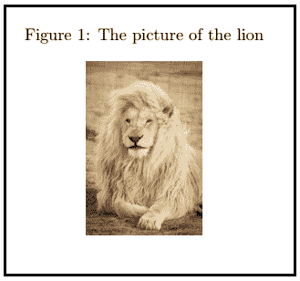

让我们考虑另一个使用 float 包的标题示例。

```

\documentclass{article}
\usepackage{float}
\usepackage{graphicx}
\begin{document}

\begin{figure}[H]
\centering
\includegraphics[scale=0.3]{star1}
\caption{This is the picture of stars}
\end{figure}

\end{document}

```

输出:

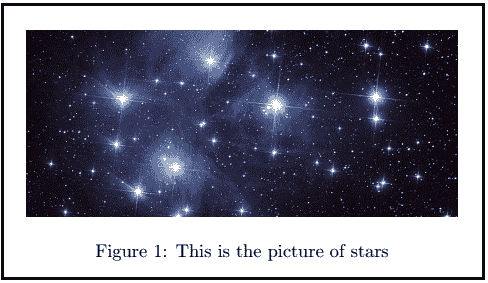

带有一个和两个标题的两个图形如下:

**两图一题**

带有一个标题的两个图形的代码如下所示:

```

\documentclass[12pt]{article}
\usepackage{graphicx}
\usepackage{float}
\begin{document}

\begin{figure}[H]
\centering
\includegraphics[height=1.1in]{traffic}%
\hspace{1.3in}% to add some horizontal spacing
\includegraphics[height=1.1in]{traffic1}%
\caption{Example \LaTeX\ traffic pictures with One Caption} 
\label{fig:traffic logo}
\end{figure}

\end{document}

```

**输出:**

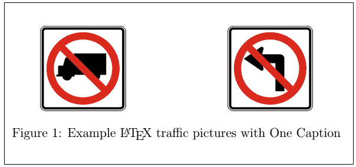

**两个带两个标题的图形**

在这个例子中，我们使用了**迷你页面**命令。该命令写成**\ begin { mini page }[c]{ 0.5 \ text width }**。可以根据要求确定宽度。

**小页面**命令用于将东西放在一起，否则会很难。它用于在现有页面中构建附加页面。比如两张并排的图片。

带有两个标题的两个数字的代码如下所示:

```

\documentclass[12pt]{article}
\usepackage{graphicx}
\usepackage{float}
\begin{document}

\begin{minipage}[c]{0.5\textwidth}
\begin{figure}[H]
\centering
\includegraphics[height=1.2in]{traffic}
\caption{Example traffic logo} 
\label{fig:traffic1}
\end{figure}
\end{minipage}
\begin{minipage}[c]{0.5\textwidth}
\begin{figure}[H]
\centering
\includegraphics[height=1.2in]{traffic1}
\caption{Example traffic logo} 
\label{fig:traffic2}
\end{figure}
\end{minipage}

\end{document}

```

输出:

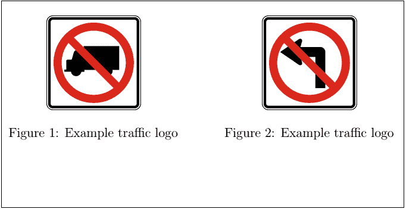

## 图片的标签和参考

标签和参考需要包含 **refstyle** 包。命令写成 **\usepackage{refstyle}** 。让我们用一个例子来理解它。代码如下:

```

\documentclass[12pt]{article}
\usepackage{graphicx}
\usepackage{refstyle}
\usepackage{caption}

\begin{document}
\large A variety of flowers  
\begin{figure}[t]
\includegraphics[width=0.5\textwidth]{flower}
\caption{A picture of bundle of flowers}
\label{fig:flower}
\end{figure}
as shown in \figref{flower}

\end{document}

```

**\figref** 命令用于在文档中进一步引用该图片。参考将自动编号。

**输出:**

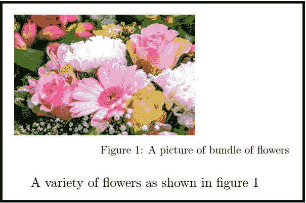

## 计数器

在 Latex 中，表格和数字有独立的计数器。您可以注意到下面示例中给出的代码和输出。

```

\documentclass[a5paper,12pt]{article}
\usepackage{graphicx}
\begin{document}

\begin{figure}
 \caption{A picture of a lion.}
 \centering
 \includegraphics[width=0.2\textwidth]{lion}
 \end{figure}

 \begin{figure}
 \centering
  \includegraphics[width=0.3\textwidth]{star1} % the picture of lion and star1 are saved in the folder where the Latex files are present
 \caption{A picture of stars}
\end{figure}

\begin{table}
\centering
    \begin{tabular}{| l| c |r |}
    \hline
    a & b & c \\
    d & e & f \\
    \hline
    \end{tabular}
  \caption{A simple table}
\end{table}

\end{document}

```

输出:

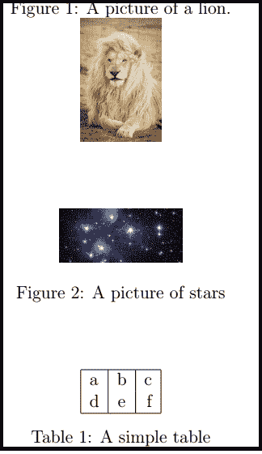

## 反射图像

对于同一画面的反射图像，使用**反射框**命令。该命令被写成**\反射框{ % include graphics }...}}** 。下面的示例给出了代码和输出:

```

\documentclass[a5paper,12pt]{article}
\usepackage{graphicx}
\begin{document}

\begin{figure}
 \caption{A picture of a bird.}
 \centering
 \includegraphics[width=0.5\textwidth]{bird}
 \end{figure}

 \begin{figure}
 \centering
 \reflectbox{%
  \includegraphics[width=0.5\textwidth]{bird}}
 \caption{A reflected picture of same bird}
\end{figure}

\end{document}

```

你可以注意到原始图片和反射图片之间的差异。

**输出:**

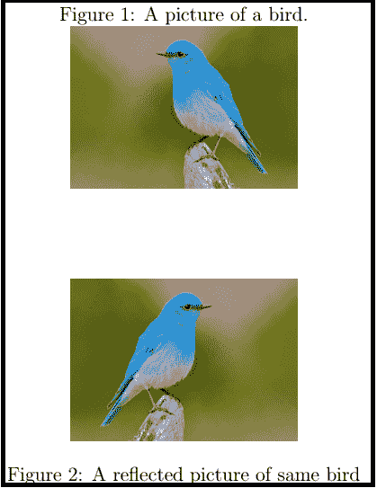

## LATEX 中的亚图

有时需要添加一两张以上的图片。环境**子图**用于显示多幅图像。您需要添加各种子图形环境来进行配置。

代码或程序如下:

```

\documentclass[a5paper,12pt]{article}
\usepackage{graphicx}
\usepackage{subcaption}
\begin{document}

\begin{figure}[h]
 \centering
 \begin{subfigure}[b]{0.4\linewidth} % here, b means bottom
 \includegraphics[width=\linewidth]{coffee}
 \caption{Coffee}
 \end{subfigure}
 \begin{subfigure}[b]{0.4\linewidth}
 \includegraphics[width=\linewidth]{coffee1} % you can specify any picture
 \caption{Another coffee}
 \end{subfigure}
 \caption{The two types of coffee design}
 \label{fig:coffee}
\end{figure}

\end{document}

```

您可以注意到输出中相邻的两张图片。

**输出:**

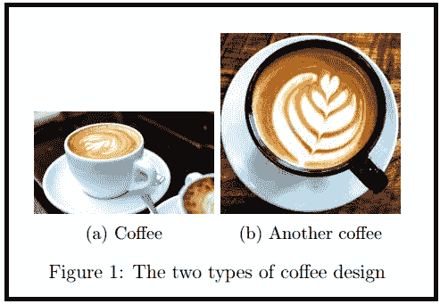

## 图表

表格格式中包含数字的两个示例如下:

**1。**第一个例子的代码如下:

```

\documentclass{article}
\usepackage{graphicx}
\usepackage{xcolor, soul} % this package is added because of the background-color

\begin{document}
\begin{table}
\begin{tabular}{cc}
\pagecolor{pink}
 CD (Compact Disk) & Hard Disk Drive \\
\includegraphics[height=1.4in]{CD} &
\includegraphics[height=1.4in]{HDD} \\
\end{tabular}
\end{table}

\end{document}

```

在这里，我们使用了背景色来增强我们的文档。

**输出:**

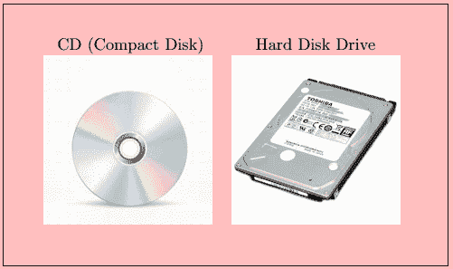

**2。**第二个例子的代码如下:

```

\documentclass{article}
\usepackage{graphicx}

\begin{document}
\begin{table}
\begin{tabular}{|c |c|} \hline
 Time & Flower \\
1s & \includegraphics[height=0.6in]{flower1} \\ \hline % the picture was saved with the flower1 name
2s & \includegraphics[height=0.8in]{flower1} \\ \hline
3s & \includegraphics[height=1.0in]{flower1} \\ \hline
4s & \includegraphics[height=1.2in]{flower1} \\ \hline
\end{tabular}
\end{table}

\end{document}

```

**输出:**

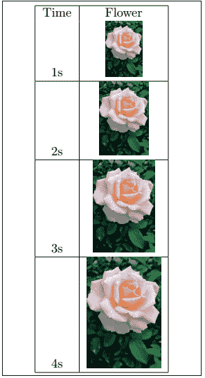

## 列表和种类

使用**列表图**命令显示列表。使用此命令，将自动对列表的页码和名称进行编号。形成**\新命令**物种是为了突出文件中的物种名称。示例如下:

```

\documentclass[12pt,]{article}
\usepackage{graphicx}
\newcommand{\species}[1]{\textit{#1} sp.} % \textit{#1} is used to display the name of species in italics
\begin{document}

\listoffigures
\section{Introduction}

\begin{figure}[h]
\centering
\includegraphics[width=2.5in]{lynx}
\caption[Close up of cat species \species{lynx}]
	{Close up of \species{lynx}, which is part of the cat family. It is the species within the medium size wild cat live in Europe and Africa.}  % \species{lynx} command is used to display the species word in the format declared above, i.e., italics
\end{figure}

\end{document}  

```

您可以使用任何文本格式来显示物种名称。

**输出:**

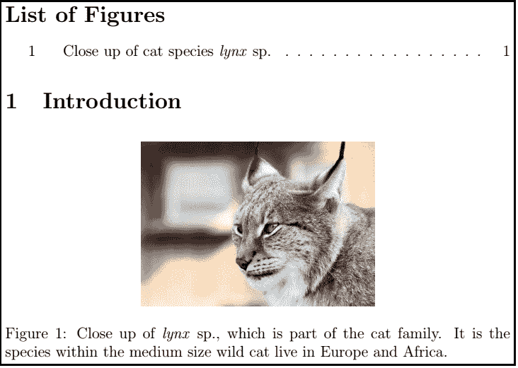

## 文本换行

作者更喜欢将文字环绕在图片周围，这样就不会中断流程。包装数字和文字需要大量的调整。它包括包和特殊命令。

使用的包装是**包装**包装。该命令被写成:

```

\usepackage{wrapfig}.

```

它允许访问命令，即，

```

\begin{wrapfigure}[lineheight]{position}[overhang]{width}

```

让我们用一个例子来理解它。代码如下:

```

\documentclass{article}
\usepackage{graphicx}
\usepackage{wrapfig}

\begin{document}
\begin{wrapfigure}{i}{100mm}
\begin{center}
The Sun is the star that is present at the center of the Solar System. It is considered the most important source of energy for life on Earth. The diameter of the Sun is 109 times that of the Earth, while the mass of Sun is about 330,000 times the mass of the Earth. The Sun every second converts 4 million tones of matter into energy.

\includegraphics[scale=0.1]{sun}
\caption{The Sun}
The Sun consists of the hydrogen and helium with smaller quantities of oxygen, carbon, neon, iron, and some heavier elements. The contribution of hydrogen is approx 73 percent, and helium is about 25 percent.
\includegraphics[scale=0.3]{sun1}

\caption{The Sun cartoon}
\end{center}
\end{wrapfigure}

\end{document}

```

输出:

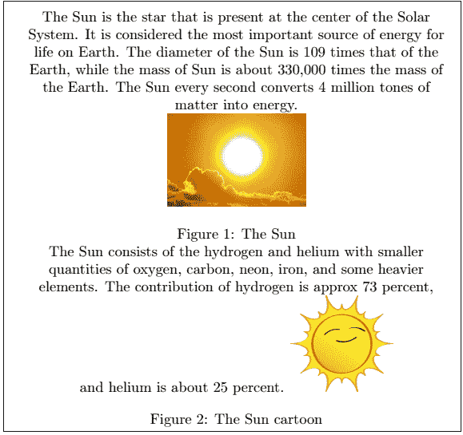

下表给出了使用的全部八个位置:

| 职位名称 | 说明 |
| r，r | 文本的右侧 |
| 我，我 | 内边缘 |
| 哦，哦 | 外侧边缘 |
| l，l | 文本的左侧 |

* * *