# LATEX图

> 原文：<https://www.javatpoint.com/latex-graphs>

图表是数据的可视化表示。以类似的方式，在 Latex 中使用图表来说明。临时模型也是表示被称为节点图的信息的一种方式。这些图表被用来表示 2D 的信息以及三维信息。

该包用于在 Latex 中实现图形。该包声明为:

```

\usepackage[all]{xy}

```

这里，**所有**一次定义包裹， **xy** 是用来绘制图形的轴。

## 基本图形

各种类型的图形用于表示信息，如下所列:

### 项目符号图

在项目符号图中，轴上的点被命名为(x 点，y 点)，其中 x 点是 x 轴上的点，y 点是 y 轴上的点。相应的项目符号点画在这里提到的(x，y)点。

使用 **\bullet_{确定节点的名称..}** 命令。

绘制项目符号图的命令是 **\xygraph...}** 。

该示例的代码如下所示:

```

\documentclass[12pt]{article}
\usepackage[all]{xy}

\begin{document}

\xygraph{
!{<0cm,0cm>;<1cm,0cm>:<0cm,1cm>::} % the first value (0,0) determines the origin for the graph. The second and the third value determines the length and positive or negative x and y axis.
!{(0,0) }*+ {\bullet_{m}} % the point for the bullet vertices is implemented after the (!) command.
!{(0,1) }*+ {\bullet_{n}} % -+- sign is used to add name to the vertex.
!{(2,1) }*+ {\bullet_{o}}
!{(4,-2)}*+ {\bullet_{p}}
}
\end{document}

```

输出:

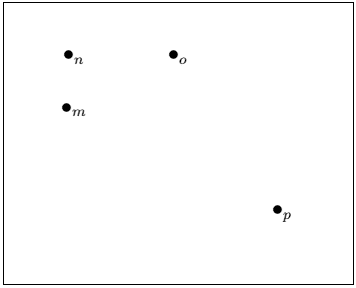

现在，让我们改变点的值。您可以很容易地从上面的输出中比较新的输出。新代码是-

```

\documentclass[12pt]{article}
\usepackage[all]{xy}

\begin{document}

\xygraph{
!{<0cm,0cm>;<1cm,0cm>:<0cm,-1cm>::} % only last point, i.e., y-axis is changed to -1.
!{(0,0) }*+{\bullet_{m}}
!{(0,1) }*+{\bullet_{n}}
!{(2,1) }*+{\bullet_{o}}
!{(4,-2)}*+{\bullet_{p}}
}
\end{document}

```

这个例子的输出是:

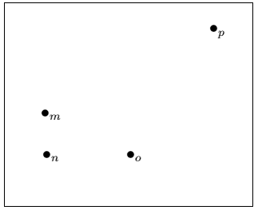

与第一个示例相比，您可以很容易地比较出在上面的示例中 y 轴是反向的。同样，您可以根据需要更改这些值。

让我们考虑另一个例子来更好地理解。现在，将轴的点更改为 0.5。该示例的代码如下所示:

```

\documentclass[12pt]{article}
\usepackage[all]{xy}

\begin{document}

\xygraph{
!{<0cm,0cm>;<0.5cm,0cm>:<0cm,0.5cm>::} % the value is changed to 0.5
!{(0,0) }*+{\bullet_{m}}
!{(0,1) }*+{\bullet_{n}}
!{(2,1) }*+{\bullet_{o}}
!{(4,-2)}*+{\bullet_{p}}
}
\end{document}

```

现在输出将显示为:

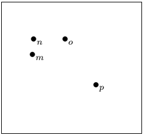

如果您想将项目符号或顶点图包含在一个框架中，那么您需要使用 fbox 命令。

Latex 中的 **fbox** 命令写为:

**\[ \fbox** ...要包含在框架内的文本..... **\]**

该示例的代码如下所示:

```

\documentclass[12pt]{article}
\usepackage[all]{xy}

\begin{document}

\[ \fbox{ \xygraph{
!{<0cm,0cm>;:<0cm,1cm>::} 
!{(0,0) }*+ {\bullet_{m}}
!{(0,1) }*+ {\bullet_{n}}
!{(2,1) }*+ {\bullet_{o}}
!{(4,-2)}*+ {\bullet_{p}}
}} \]
\end{document}

```

输出:

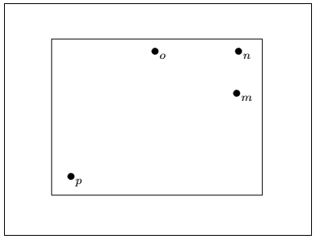

## 有向图

绘制有向图的过程与项目符号图的过程相同。您需要包括从顶点到特定顶点或项目符号的路径。路径确定为“**r”-“s**”，其中 **r** 和 **s** 为具体顶点。

下面给出了该示例的代码:

```

\documentclass[12pt]{article}
\usepackage[all]{xy}

\begin{document}

 \[ \fbox{ \xygraph{
!{<0cm,0cm>;<1cm,0cm>:<0cm,1cm>::}
!{(0,0) }*+{\bullet_{q}}="q"
!{(1,0) }*+{\bullet_{r}}="r"
!{(2,1) }*+{\bullet_{s}}="s"
!{(3,-2)}*+{\bullet_{t}}="t"
"q"-"r" "t"-"q"
"r"-"s"
"s"-"t"
"t"-"s"
} } \]

\end{document}

```

输出:

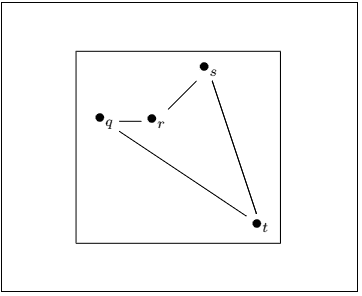

## 箭头边缘

对于边缘的箭头，您需要使用-:-而不是-。-

代码如下:

```

\documentclass[12pt]{article}
\usepackage[all]{xy}

\begin{document}

 \[ \fbox{ \xygraph{
!{<0cm,0cm>;<1cm,0cm>:<0cm,1cm>::}
!{(0,0) }*+{\bullet_{q}}="q"
!{(1,0) }*+{\bullet_{r}}="r"
!{(2,1) }*+{\bullet_{s}}="s"
!{(3,-2)}*+{\bullet_{t}}="t"
"q":"r" "t":"q"
"r":"s"
"s":"t"
"t":"s"
} } \]
\end{document}

```

输出:

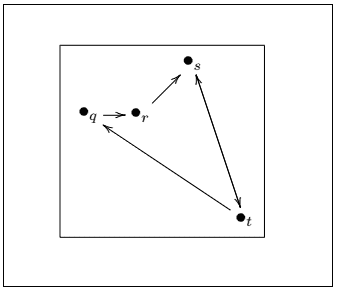

## 弯曲边缘

对于弯曲边，需要在两个顶点之间使用 **[【邮件保护】](/cdn-cgi/l/email-protection) /^/** 。例如，如果要绘制 a 和 b 顶点之间的弯曲边，则需要将命令称为**“a”[【email protected】](/cdn-cgi/l/email-protection)/^/“b”**。

该示例的代码如下所示:

```

\documentclass[12pt]{article}
\usepackage[all]{xy}

\begin{document}

 \[ \fbox{ \xygraph{
!{<0cm,0cm>;<1cm,0cm>:<0cm,1cm>::}
!{(0,0) }*+{\bullet_{q}}="q"
!{(1,0) }*+{\bullet_{r}}="r"
!{(2,1) }*+{\bullet_{s}}="s"
!{(3,-3)}*+{\bullet_{t}}="t"
"q":"r" "t":"q"
"r":"s"
"s"-@/^/"t"
"t"-@/^/"s"
} } \]
\end{document}

```

输出:

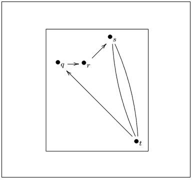

您也可以通过在命令之间指定折弯边来确定折弯边的长度。对于 1cm 的长度，您需要提及为 **[【电子邮件保护】](/cdn-cgi/l/email-protection) /^1cm/** 。

该示例的代码如下所示:

```

\documentclass[12pt]{article}
\usepackage[all]{xy}

\begin{document}

\[ \fbox{ \xygraph{
!{<0cm,0cm>;<1cm,0cm>:<0cm,1cm>::}
!{(0,0) }*+{\bullet_{e}}="e"
!{(1,1) }*+{\bullet_{f}}="f"
!{(2.5,0.5) }*+{\bullet_{g}}="g"
!{(3,-1)}*+{\bullet_{h}}="h"
"e"-"f"
"f"-@/^2cm/"h"
"h"-"g"
"e"-@/^/"h"
"f"-@/^1cm/"g"
} } \]
\end{document}

```

输出:

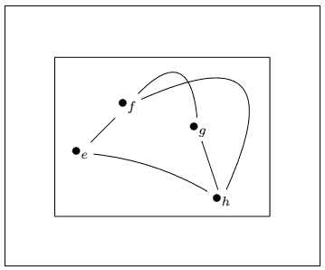

## 边缘标签

您也可以标记图形的边缘。边的标签在定向命令的末尾被指定为来自特定顶点的标签的^(distance)**{ e _ 1 }**。您可以使用任何字符或数字来代替{e_1}命令。

下面给出了该示例的代码:

```

\documentclass[12pt]{article}
\usepackage[all]{xy}
\begin{document}

\[ \fbox{ \xygraph{
!{<0cm,0cm>;<1cm,0cm>:<0cm,1cm>::}
!{(0,0) }*+{\bullet_{e}}="e"
!{(1,1) }*+{\bullet_{f}}="f"
!{(2.5,0.5) }*+{\bullet_{g}}="g"
!{(3,-1)}*+{\bullet_{h}}="h"
"e"-"f"^(0.6){c_1}
"f"-@/^2cm/"h" ^(0.6){e_2} 
"h"-"g" ^(0.8){a_3}
"e"-@/^/"h" ^(0.4){e_4}
"f"-@/^1cm/"g" ^(0.7){b_5}    
} } \]

\end{document}

```

输出:

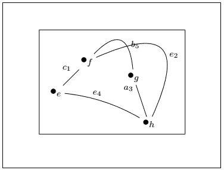

## 给顶点和边着色

你需要在**\项目符号**命令前提到颜色的名称来给顶点着色。如果您要给边缘着色，您需要在定向命令之前提到颜色名称。

您还需要指定 **xcolor** 包来实现边或顶点的颜色。

给**顶点**着色的代码如下:

```

\documentclass[12pt]{article}
\usepackage[all]{xy}
\usepackage{xcolor}
\begin{document}

 \[ \fbox{ \xygraph{
!{<0cm,0cm>;<1cm,0cm>:<0cm,1cm>::}
!{(0,0) }*+[red]{\bullet_{q}}="q"
!{(1,0) }*+{\bullet_{r}}="r"
!{(2,1) }*+[blue]{\bullet_{s}}="s"
!{(3,-3)}*+[green]{\bullet_{t}}="t"
"q":"r" "s":"q"
"r":"s"
"q"-@/^/"t"
"t"-@/^/"s"
} } \]

\end{document}

```

输出:

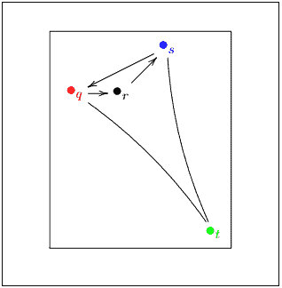

给**边缘**上色的代码如下:

```

\documentclass[12pt]{article}
\usepackage[all]{xy}
\usepackage{xcolor}
\begin{document}

 \[ \fbox{ \xygraph{
!{<0cm,0cm>;<1cm,0cm>:<0cm,1cm>::}
!{(0,0) }*+{\bullet_{q}}="q"
!{(1,0) }*+{\bullet_{r}}="r"
!{(2,1) }*+{\bullet_{s}}="s"
!{(3,-3)}*+{\bullet_{t}}="t"
"q":"r" "s":@[blue]"q"
"r":@[red]"s"
"q"-@/^/@[green]"t"
"t"-@/^/@[orange]"s"
} } \]

\end{document}

```

输出:

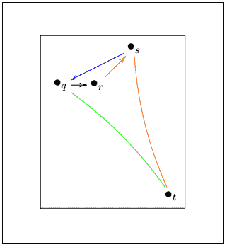

## 极坐标双图

在空对象中，在每个顶点指定原点来绘制图形。您需要根据多边形的边数来确定角度。例如，为具有五条边的多边形指定了 72 度的角度间隙，为具有六条边的多边形定义了 60 度的角度间隙。

公式计算间隙= **360/n**

其中 n=多边形的边数

对于角度的不规则间隙，Latex 会给出一个误差。这张图是在完全一致的情况下画出来的。

指定两个多边形之间的角度、距离和顶点的命令如下:

**！{(0,0);a(0)**{}？(1.0)}*+{\bullet}="a1"**

哪里，

**(0，0)** 为原点
**a(0)** 为角度，起始处为 0。
**(1.0)** 是边的长度。

a1 是顶点的名称

下面给出两个例子来解释上述过程。

第一个例子绘制双图形**三角形**的代码如下:

```

\documentclass[12pt]{article}
\usepackage[all]{xy}
\begin{document}

\[ \fbox{ \xygraph{
!{<0cm,0cm>;<1cm,0cm>:<0cm,1cm>::}
!{(0,0);a(0)**{}?(1.0)}*+{\bullet}="a1"
!{(0,0);a(120)**{}?(1.0)}*+{\bullet}="a2"
!{(0,0);a(240)**{}?(1.0)}*+{\bullet}="a3"
!{(0,0);a(0)**{}?(1.8)}*+{\bullet}="b1"
!{(0,0);a(120)**{}?(1.8)}*+{\bullet}="b2"
!{(0,0);a(240)**{}?(1.8)}*+{\bullet}="b3"
"a1"-"a2" "a2"-"a3" "a3"-"a1" 
"b1"-"b2" "b2"-"b3" "b3"-"b1" 
"a1"-"b1" "a2"-"b2" "a3"-"b3" 
} } \]

\end{document}

```

根据上面的公式，120 度的间隙用于多边形的三条边。

**输出:**

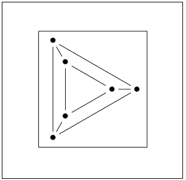

第二个例子绘制双图形**八边形**的代码如下:

```

\documentclass[12pt]{article}
\usepackage[all]{xy}
\begin{document}

\[ \fbox{ \xygraph{
!{<0cm,0cm>;<1cm,0cm>:<0cm,1cm>::}
!{(0,0);a(0)**{}?(1.0)}*+{\bullet}="b1"
!{(0,0);a(45)**{}?(1.0)}*+{\bullet}="b2"
!{(0,0);a(90)**{}?(1.0)}*+{\bullet}="b3"
!{(0,0);a(135)**{}?(1.0)}*+{\bullet}="b4"
!{(0,0);a(180)**{}?(1.0)}*+{\bullet}="b5"
!{(0,0);a(225)**{}?(1.0)}*+{\bullet}="b6"
!{(0,0);a(270)**{}?(1.0)}*+{\bullet}="b7"
!{(0,0);a(315)**{}?(1.0)}*+{\bullet}="b8"
!{(0,0);a(0)**{}?(1.8)}*+{\bullet}="c1"
!{(0,0);a(45)**{}?(1.8)}*+{\bullet}="c2"
!{(0,0);a(90)**{}?(1.8)}*+{\bullet}="c3"
!{(0,0);a(135)**{}?(1.8)}*+{\bullet}="c4"
!{(0,0);a(180)**{}?(1.8)}*+{\bullet}="c5"
!{(0,0);a(225)**{}?(1.8)}*+{\bullet}="c6"
!{(0,0);a(270)**{}?(1.8)}*+{\bullet}="c7"
!{(0,0);a(315)**{}?(1.8)}*+{\bullet}="c8"
"b1"-"b2" "b2"-"b3" "b3"-"b4" "b4"-"b5" "b5"-"b6" "b6"-"b7" "b7"-"b8" "b8"-"b1"   
"c1"-"c2" "c2"-"c3" "c3"-"c4" "c4"-"c5" "c5"-"c6" "c6"-"c7" "c7"-"c8" "c8"-"c1"    
"b1"-"c1" "b2"-"c2" "b3"-"c3" "b4"-"c4" "b5"-"c5" "b6"-"c6" "b7"-"c7" "b8"-"c8"
} } \]

\end{document}

```

在上面的代码中，我们取了多边形的 8 条边。由公式计算的角度间隙将为 45 度。

**输出:**

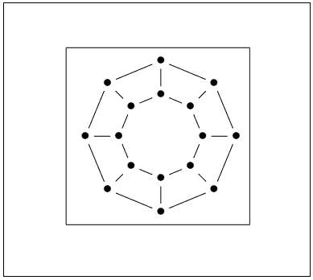

## 图中的循环

循环是在顶点上创建的。开发循环的方法是用**减号**和 **@** (a1，a2)修改边缘命令，其中 a1 和 a2 是入和出方向。方向的选择有 l(左)、u(上)、r(右)、d(下)。方向 **dr，dl，ur，ul** 用于四条对角线。

创建循环的代码如下所示:

```

\documentclass[12pt]{article}
\usepackage[all]{xy}
\begin{document}

\[ \fbox{ \xygraph{
!{<0cm,0cm>;<1cm,0cm>:<0cm,1cm>::}
!{(0,0) }*+{\bullet_{q}}="q"
!{(2,1) }*+{\bullet_{s}}="s"
!{(3,-2)}*+{\bullet_{t}}="t"
"q"-"s" "s"-"t"
"q"-"t"
"q" -@(lu,ld) "q"
"s" -@(ru,rd) "s"
"t" -@(ld,rd) "t"
} } \]

\end{document}

```

输出:

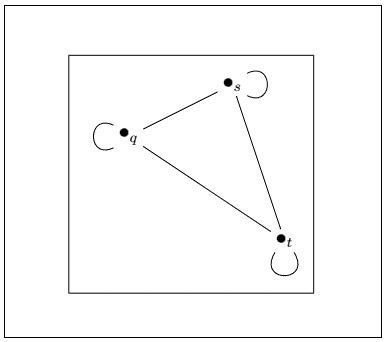

根据您的要求，您可以制作任意多的循环。

* * *