# LATEX 智能图表

> 原文：<https://www.javatpoint.com/latex-smart-diagrams>

Latex 智能图表是用最少的努力制作快速图表的最简单方便的方法。它由按特定顺序排列的块结构组成。

程序中有各种预定义的图表样式。你需要提到那些图里面的文字。

要实现一个图，你首先要加载**智能图**包。Latex 或 Texmaker 中的包装写为**\ use package { smart diagram }**。

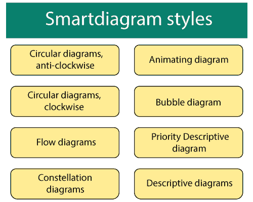

#### 注意:智能图的块内颜色默认。你不需要指定任何特定的颜色。

## 1.流程图

在这个例子中？**流程图**字在智能图包中作为命令使用。

根据要求，流程图可以垂直或水平绘制。

它包含五个区块。你需要提到要写在这五个块中的文本。

一、创建简单水平**智能图**的代码如下:

```

\documentclass[12pt]{article}
\usepackage{smartdiagram}
\begin{document}

\smartdiagram[flow diagram:horizontal]{Customer,
  Scan, Process, Implement, processed}
  % here, the five elements are mentioned together, separated by the comma. You can use any data according to the requirements.
  % the text in the above diagram is explained for your understanding. You can make any changes.

\end{document}

```

输出:

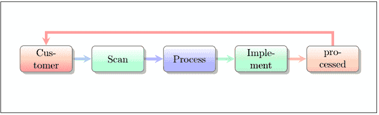

二.创建垂直流程图的代码如下所示:

```

\documentclass[12pt]{article}
\usepackage{smartdiagram}
\begin{document}

\smartdiagram[flow diagram:vertical]{Customer,
  Scan, Process, Implement, Output}

\end{document}

```

输出:

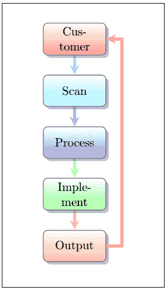

可以根据需要修改文字。

## 2.圆形图

该图的形状也被归类为**圆形**形状。块的形式将与上面的图相同。

圆图有两个方向，顺时针和逆时针。

您可以在循环图中使用许多元素。这些项目将由 Latex 自动调整到图表中。

一、**顺时针**方向圆形图代码如下:

```

\documentclass[12pt]{article}
\usepackage{smartdiagram}
\begin{document}

\smartdiagram[circular diagram:clockwise]{Planning,
  Design, Testing, Maintenance, Assessment}

\end{document}

```

输出:

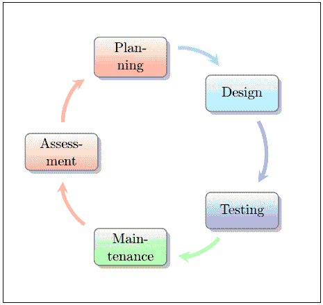

二.**逆时针**方向的圆形图代码如下:

```

\documentclass[12pt]{article}
\usepackage{smartdiagram}
\begin{document}

\smartdiagram[circular diagram:anticlockwise]{Planning,
  Design, Testing, Maintenance, Assessment}

\end{document}

```

Latex 的特殊之处在于，它不仅可以在逆时针方向上反转箭头的方向，还可以改变特定图表的块的方向。

您可以很快注意到以下输出的差异:

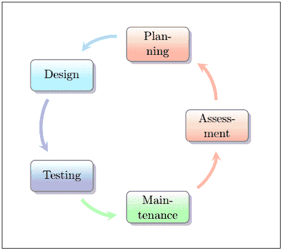

## 3.气泡图

使用气泡图的概念是在主要上下文中呈现一些单词。第一个项目放置在中心圆中，其他项目放置在围绕该中心圆的圆中。

气泡图略有重叠，以可视化密切关系。你需要使用 **\dtklogos** 包来实现气泡图。

代码如下:

```

\documentclass{beamer}
\usepackage{smartdiagram}
\begin{document}

    \smartdiagram[bubble diagram]{ Passive Components, Inductors, Capacitors, Resistors, Transformers}
   % here, the first element is placed at the center, and rest elements are places around that circle in the form of bubbles.

 \end{document}

```

输出:

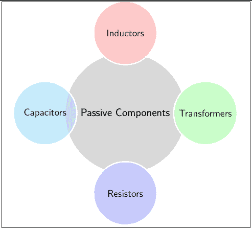

可以在中心圆周围使用任意多的元素。上面的例子包含围绕中心圆的四个元素。

让我们考虑六个元素的例子。

创建包含六个元素的图表的代码如下所示:

```

\documentclass{beamer}
\usepackage{smartdiagram}
\begin{document}

\smartdiagram[bubble diagram]{ Elements, A, B, C, D, E, F}

 \end{document}

```

输出:

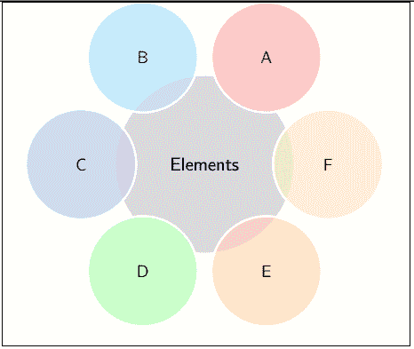

## 4.描述图

描述性图表用于排列带有描述的项目。项目列表是一个以圆圈形式表示的小列表。特定项目的描述性列表以方框或矩形的形式描述。

花括号用于表示代码中的项目及其描述。

下面的示例给出了创建描述性图表的代码:

```

\documentclass{beamer} % beamer class is used commonly for animating the diagram
\usepackage{smartdiagram}
\begin{document}

 \smartdiagram[descriptive diagram]{
 {Beam,{ It is defined as a long piece of timber or metal, which is used as a support in building}},
 {Daffodil, {It is a plant having yellow flowers with a trumpet-shaped center.}},
 {Galaxy, {It is defined as a system consisting of millions or billions of stars}},
 {Legislature, {It is defined as a law-making body of a state.}},
 {Pane, {It is defined as a single sheet of glass in a window or a door}},
 }
% here, the first word is an item, and after the comma is its description. You can use any data and any number of items with their descriptions according to the requirements.

 \end{document}

```

输出:


## 5.星座图

星座图不同于其他图。第一个项目是放置在中心圆中的项目。其他项目也放在与中心相连的彩色圆圈内。

中心项目和外部项目之间的关系以箭头的形式显示。外部环境中的每个项目都与中心项目相关。

让我们考虑一个例子来理解这一点。这种模型的代码如下所示:

```

\documentclass[12pt]{article}
\usepackage{smartdiagram}
\begin{document}

\smartdiagram[constellation diagram]{Cloud Types, Stratus Clouds,
  Cumulus Clouds, Nimbus Clouds, Cirrus Clouds}

 \end{document}

```

输出:

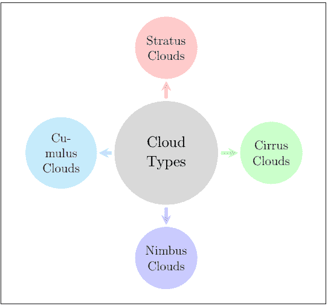

你可以根据需要考虑任何例子。上面的例子只是为了让你更好地理解每一种风格。

## 6.优先级描述图

优先级描述图用于强调描述图的特定顺序。

代码中编写的第一个项目将是图表的底部项目，而代码的最后一个元素将是图表的顶部项目。

让我们考虑一个例子来理解这一点。该案例将是一个模型，包含在计算机屏幕上创建文件夹的步骤。

下面给出了这样一个例子的代码:

```

\documentclass[12pt]{article}
\usepackage{smartdiagram}
\begin{document}

\smartdiagram[priority descriptive diagram]{
Go to the area where you want to create the Folder, % this element will appear at the bottom in the output diagram
Right-click on a blank space,
From the drop-down list click on the 'New' option,
Click on the Folder,
Type the name accordingly and then press Enter,
The Folder is created} % this element will appear at the top in the output diagram
 % the comma should not be present at the end of the last element. Otherwise, the Latex will consider another blank box after the final or top box

\end{document}

```

输出:

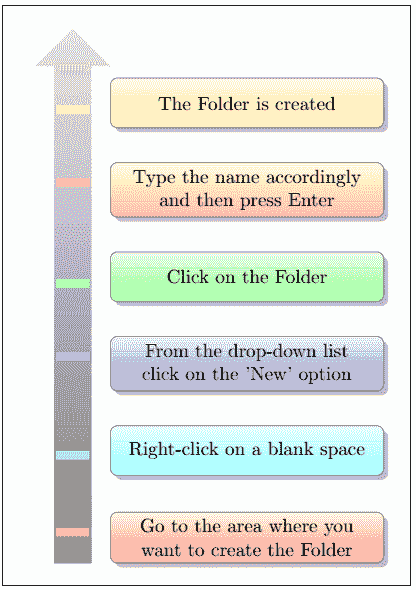

## 7.动画图表

动画图中使用的是**智能图表模拟的**，而不是**智能图表**命令。

它被写成一个**smartdiagrammanimated**{图表样式的名称}。

框架环境用于逐步构建图表。环境被写成:

```

\begin{frame}
......
\end{frame}

```

**文件**环境后面提到环境。

它将图表分成不同的步骤，每个步骤都在单独的页面上提到。例如，如果图片或图表中有六个块，输出将包含七页。

输出页面为 **n+1** ，其中 **n** 为块数。

额外的步骤用于完成特定图表的表示。

第一页将包括第一步，第二页将由第一步和第二步组成。第三页将包括第三步以及第一步和第二步，依此类推。

让我们考虑与循环图中提到的代码相同的代码。

为了更好地理解，下面给出了示例:

在此图中，使用了五个模块。您可以根据需要使用任何样式和任意数量的块。

```

\documentclass{beamer} % the beamer class is used to animate the diagram easily.
\usepackage{smartdiagram}
\begin{document}
\begin{frame}

\smartdiagramanimated[circular diagram]{Planning,
  Design, Testing, Maintenance, Assessment}

\end{frame}
\end{document}

```

输出将有六页，显示在下面给出的六张图片中。

为了让您更好地理解，我们对所有六幅图像进行了编号。

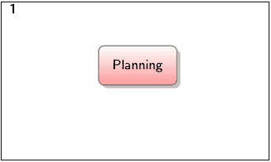
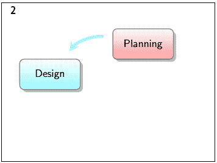
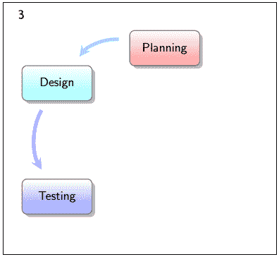
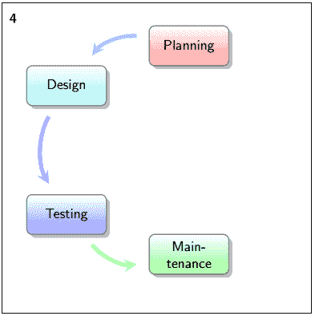
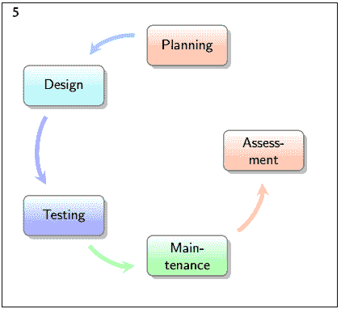
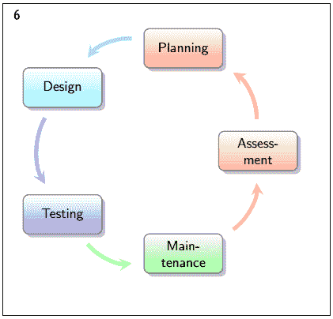

* * *