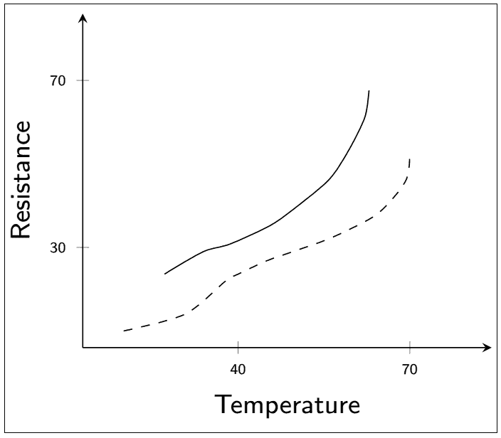
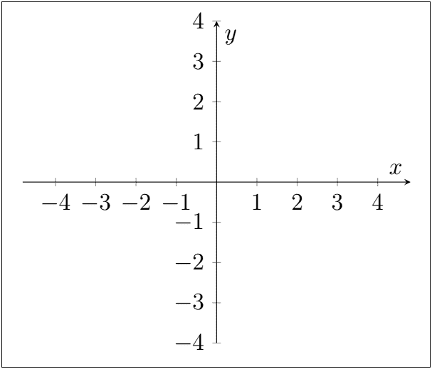
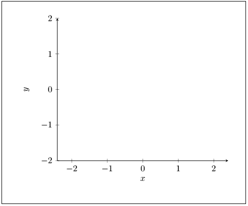
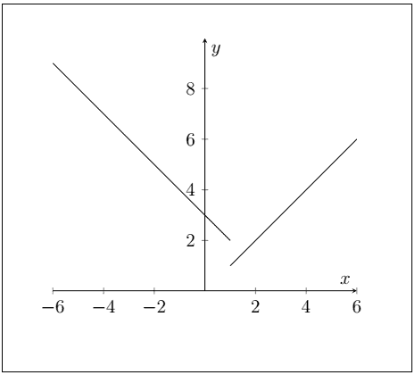
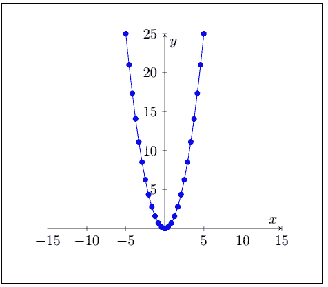
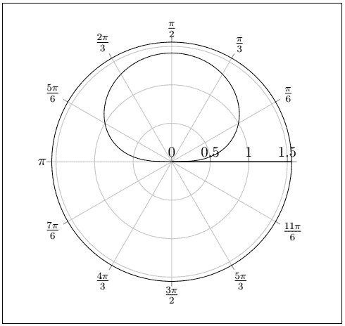

# 用 Tikz 绘制方程的LATEX图

> 原文：<https://www.javatpoint.com/latex-graph-of-equations-using-tikz>

图形是由链接连接的数据的图形表示。图形可以通过 tikz 环境创建，也可以不通过 **tikz** 环境创建。但是使用 **tikz** 环境，带方程的图更好。

在这个主题中，一些例子是方程，一些是只使用顶点的图。

让我们考虑一个绘制温度和电阻图的例子。

每一步都包括相应命令的解释。该命令的描述将以 **%** 开始。

绘制图表的代码如下所示:

```

\documentclass[border=4.6pt]{standalone}% the standalone package is used to overcome the other preambles used in the sub-files.
% the length mentioned above is the length of the border of the whole graph page from the axis.
\usepackage{pgfplots} % the package used to implement the graphs
\pgfplotsset{width = 6.4cm, compat = newest} % it is the width of the graph. The lesser the width, the higher the graph will shrink.
\usepackage{sansmath} % it is the package used in math. It provides the math font.
\pgfplotsset{
% pgfplotsset is used to define the parameters used further to draw a graphs
  tick label style = { font=\tiny\sansmath\sffamily}, ,% it defines the font size of the label
  label style = { font=\small\sansmath\sffamily}
}
\begin{document}   
\begin{tikzpicture}  % tikz environment commonly used
  \begin{axis} [
      domain = 0:100,
      xlabel     = Temperature,  % You can label the axis according to your graph.
      ylabel     = Resistance,
      axis lines = left, % if you  use the right axis line, then the axis will be inverted
      clip       = true, 
      xmin = 0,  xmax = 100,
      ymin = 0, ymax = 100,
      xtick={38,80},  % xtick and ytick are used to determine the range of the drawn graph. The labels will be adjusted according to the xtick and ytick only.
      xticklabels={$40$,$70$},
      ytick={30,80},
      yticklabels={$30$,$70$},
    ]
   \addplot [smooth, dashed] % dashed option draws the dashed curve. You can also use dotted, dashdotted, dashdotdotted.
      coordinates { (10,5) (25,10) (35,20) (38,22) (45,26) (52,29)
                    (61,33) (72,40) (79,50) (80,59)};
    \addplot [smooth]  % the smooth option is used to illustrate the smooth curve
      coordinates { (20,22) (24,25) (30,29) (36,31) (45,36) (50,40)
                    (60,50) (65,59) (69,69) (70,77)};
    % you can include as many curves in your graph according to the requirements.

\end{axis}
\end{tikzpicture}
\end{document}

```

**输出:**



## 图的轴的确定

常用的轴有两种。第一个是简单图，包含**四个象限**，另一个是轴，用于绘制条形图等。

要绘制 x 轴和 y 轴，需要声明一些包、集合和库。这些将在下面给出的代码中列出。

让我们考虑第一个例子，画出四个象限的轴。

```

\documentclass[12pt]{article} 
\usepackage{tikz} % package used for the tikz
\usepackage{pgfplots} % package used to draw plots
\usepgfplotslibrary{polar} % the polar library is used to implement the negative and positive axis
\usepgflibrary{shapes.geometric}
\usetikzlibrary{calc}
\pgfplotsset{my style/.append style={axis x line=middle, axis y line=
middle, xlabel={$x$}, ylabel={$y$}, axis equal }} % used to declare my style command.
% you can also align the axis to the left, right, etc. according to the requirements. But the middle would produce the axis with four quadrants, and the left or right would result in only one quadrant.
\begin{document}
\begin{tikzpicture} % tikz environment 

\begin{axis}
[my style, xtick={-4,-3,-2,...,4}, ytick={-4,-3,-2,...,4}, % you can also expand the points or range of the x-axis and the y-axis.
xmin=-4, xmax=4, ymin=-4, ymax=4]
\end{axis}
\end{tikzpicture}

\end{document}

```

**输出:**



这两个例子只有一个区别，就是确定风格的类型。绘制适合条形图等的轴的代码。仅产生一个象限的**如下:**

```

\documentclass[10pt]{article} 
\usepackage{tikz} 
\usepackage{pgfplots}
\usepgfplotslibrary{polar} 
\usepgflibrary{shapes.geometric}
\usetikzlibrary{calc}
\pgfplotsset{my style/.append style={axis x line=left, axis y line=
left, xlabel={$x$}, ylabel={$y$}, axis equal }} %  the middle would produce the axis with four quadrants, and the left or right would result in only one quadrant.
\begin{document}
\begin{tikzpicture} % tikz environment 

\begin{axis}
[my style, xtick={-2,-1,...,2}, ytick={-2,-1,...,2}, % you can also expand the points or the range of the x-axis and the y-axis.
xmin=-2, xmax=2, ymin=-2, ymax=2]
\end{axis}
\end{tikzpicture}

\end{document}

```

您需要使用**左**或**右**(用于倒轴)来代替**我的风格**类别中的**中间**(用于四象限)选项。你可以注意到变化。

**输出:**



#### 注:点数(..)在-my style 中指定的数字之间，xtick={-2，-1，...，2}，ytick={-2，-1，...，2} -命令应该相等。否则，Latex 将认为是一个错误。

## 方程图

你也可以用方程式画图表。包、集合和库将与用于其他类型图形的包、集合和库相同。

*   **一阶方程**

这个例子是用一阶方程画一个图。

等式如下:


下面给出了绘制这类方程的代码:

```

\documentclass[12pt]{article} 
\usepackage{tikz} 
\usepackage{pgfplots}
\usepgfplotslibrary{polar} % to determine the polar coordinates
\usepgflibrary{shapes.geometric}
\usetikzlibrary{calc}
\pgfplotsset{my style/.append style={axis x line=middle, axis y line=
middle, xlabel={$x$}, ylabel={$y$}, axis equal }} %  the middle would produce the axis with four quadrants, and the left or right would result in only one quadrant.
\begin{document}

\begin{tikzpicture}
\begin{axis}[my style]
\addplot[domain=-6:1] {-x+3}; % the domain signifies the range for the graph
\addplot[domain=1:6] {x};
\end{axis}
\end{tikzpicture}

\end{document}

```

**输出:**



*   **二阶方程**

你也可以画出二阶方程的图形。代码和命令将类似于上述类型的图形。

让我们画出 y=x <sup>2</sup> 的曲线图

这类图形的代码如下:

```

\documentclass[12pt]{article} 
\usepackage{tikz} 
\usepackage{pgfplots}
\usepgfplotslibrary{polar} % to determine the polar coordinates
\usepgflibrary{shapes.geometric}
\usetikzlibrary{calc}
\pgfplotsset{my style/.append style={axis x line=middle, axis y line=
middle, xlabel={$x$}, ylabel={$y$}, axis equal }} %  the middle would produce the axis with four quadrants, and the left or right would result in only one quadrant.
\begin{document}

\begin{tikzpicture}
\begin{axis}[my style]
\addplot {x^2}; % here, the second-order equation is written. To draw a graph for any equation, you need to mention the equation in this section. If you want to specify the domain, then you can include the domain option.

\end{axis}
\end{tikzpicture}

\end{document}

```

**输出:**



同样，您可以使用前面讨论的方法在 Latex 中绘制任何形状和图形。

## 极线

Latex 还提供了绘制极坐标曲线所包围的区域的功能。

这里，代码将类似于上面的方法。

让我们画出曲线包围的区域，r <sup>2</sup> =2 sin？θ

在这种情况下，一些改变是必要的。第一个是包括样本。样本用于绘制平滑的图形。它用于复杂的图形，如极图。

代码中需要包含**个样本=100** 。

另一种是指定域。根据对图形的要求，用户决定一个域的范围。

绘制极坐标曲线需要使用**极轴**环境，而不是**轴**环境，如下图所示:

```

\begin{polaraxis}
............
\end{polaraxis}

```

方程 r <sup>2</sup> =2 sin？θ现在会变成，r=√ 2 罪？θ

用于绘制极坐标曲线的轴不同于通常的轴。

要实现极坐标曲线，必须声明以下序言:

```

\pgfplotsset{my polar style/.append style={xticklabels={,, $\frac{\pi}{6}$, $\frac{\pi}{3}$, $\frac{\pi}{2}$, $\frac{2\pi}{3}$, $\frac{5\pi}{6}$, $\pi$, $\frac{7\pi}{6}$, $\frac{4\pi}{3}$, $\frac{3\pi}{2}$, $\frac{5\pi}{3}$,$\frac{11\pi}{6}$,}, thin }}

```

以上所有参数都是用于确定极曲线的图表的刻度标签。

绘制极坐标图的代码如下所示:

```

\documentclass[12pt]{article} 
\usepackage{tikz} 
\usepackage{pgfplots}
\usepgfplotslibrary{polar} % to determine the polar coordinates
\usepgflibrary{shapes.geometric}
\usetikzlibrary{calc}
\pgfplotsset{my polar style/.append style={xticklabels={,,
$\frac{\pi}{6}$, $\frac{\pi}{3}$, $\frac{\pi}{2}$, $\frac{2\pi}{3}$,
$\frac{5\pi}{6}$, $\pi$, $\frac{7\pi}{6}$, $\frac{4\pi}{3}$,
$\frac{3\pi}{2}$, $\frac{5\pi}{3}$,$\frac{11\pi}{6}$,}, thin }} % you can also mention thick instead of thin.
\begin{document}

\begin{tikzpicture}
\begin{polaraxis}[my polar style ] % the name of style depends on your choice. But make sure that the name used above in the append style should be same as the name used here.
\addplot[domain=0:90, samples=50]{sqrt(2*(sin(x))};
\addplot[domain=90:180, samples=50]{sqrt(2*(sin(x)))}; % you can modify the domain according to the requirements. The polar curve will be adjusted according to the specified domain or range. You can also change the sample size accordingly.
\end{polaraxis}
\end{tikzpicture}

\end{document}

```

**输出:**



* * ***