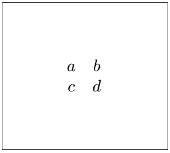
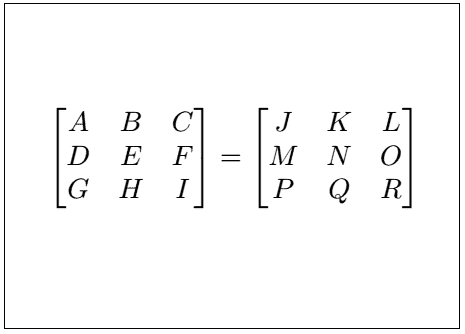
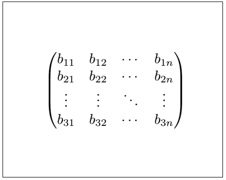
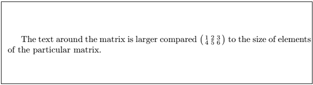
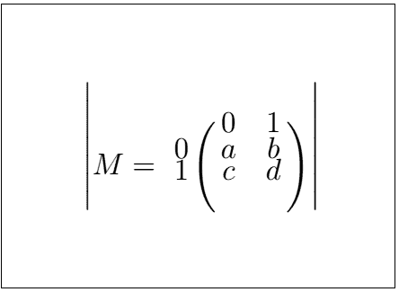
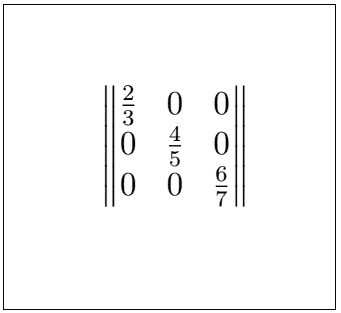
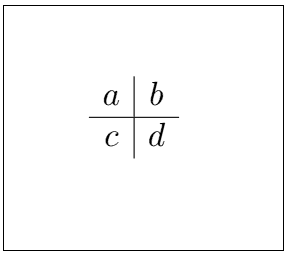
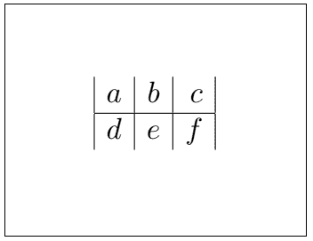
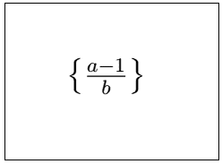
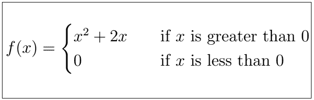

# LATEX 基质

> 原文：<https://www.javatpoint.com/latex-matrix>

矩阵被定义为一组称为元素的数字，以行和列的形式排列，从而形成矩形阵列。它应用广泛，用途广泛。

该环境用于实现矩阵，如下所示:

```

\begin{matrix}
......
\end{matrix}

```

与符号(&)分隔矩阵中的列。

我们可以根据需要在矩阵中添加任意多的行和列。

行由\\命令分隔，该命令通常用于指定新行中的文本。

矩阵环境是使用\和[]实现的。

其内容如下:

```

\[
.....
\]

```

不使用上述环境，Texmaker 会给出错误。

让我们用一个简单的例子来理解。例子是一个**2×2**矩阵。它是一个有两行两列的矩阵。

下面给出了这样一个例子的代码:

```

\documentclass[10pt]{article} 
\usepackage{mathtools}
\begin{document}

\[
\begin{matrix}
a & b \\
c & d 
\end{matrix}
\]

\end{document}

```

**输出:**



有不同的矩阵环境用于为矩阵创建不同样式的括号，如下所示:

| 环境 | 环绕支架 |
| pmatrix | ( ) |
| Bmatrix | { } |
| bmatrix | [ ] |
| VM matrix | &#124;&#124; &#124;&#124; |
| VM matrix | &#124; &#124; |

上述环境的星号版本用于对齐矩阵的列，如下所示:

| 环境 | 环绕支架 |
| pmatrix* | ( ) |
| Bmatrix* | { } |
| bmatrix* | [ ] |
| vmmatrix * | &#124;&#124; &#124;&#124; |
| vmmatrix * | &#124; &#124; |

让我们通过一个例子来理解上面的对齐过程。例如**3×3**矩阵有三行三列。

下面给出了这样一个例子的代码:

```

\documentclass[10pt]{article} 
\usepackage{mathtools}
\begin{document}

\[
\begin{bmatrix} % you can specify any environment according to your choice
A & B & C \\
D & E & F \\
G & H & I 
\end{bmatrix}
=
\begin{bmatrix*}
J & K & L \\
M & N & O \\
P & Q & R
\end{bmatrix*}
\]

\end{document}

```

**输出:**



你也可以设计任意大小的矩阵。可以使用\ddots (⋱)、\vdots (⋮)和\cdots ( &ctdot;)命令指定矩阵之间的点。

创建此矩阵的代码如下所示:

```

\documentclass[10pt]{article} 
\usepackage{mathtools}
\begin{document}

\[
\begin{pmatrix} % you can specify any environment according to your choice
b_{11} & b_{12} & \cdots & b_{1 n} \\
b_{21} & b_{22} & \cdots & b_{2 n} \\ % for more than one digit, we need to enclose the underscore value inside the curly brackets.
\vdots & \vdots & \ddots & \vdots \\
b_{31} & b_{32} & \cdots & b_{3 n} 
\end{pmatrix}
\]

\end{document}

```

**输出:**



* * *

## 带文本的矩阵

在运行文本中，我们可以插入矩阵。这种类型的矩阵称为小矩阵。

用于创建小矩阵的环境如下所示:

```

\begin{smallmatrix}
.....
\end{smallmatrix}

```

但是在这里，我们需要指定文本的大小应该大于矩阵的大小。

让我们用一个例子来理解。

代码如下:

```

\documentclass[10pt]{article} 
\usepackage{mathtools}
\begin{document}

The text around the matrix is larger compared
$\bigl(\begin{smallmatrix}
1 & 2 & 3 \\
4 & 5 & 6
\end{smallmatrix} \bigr)$
to the size of elements of the particular matrix. 
% In this example, we need not specify the \[...\] environment because of the \big command used. It automatically adjusted a matrix between the texts. You can also change the format according to the requirements.

\end{document}

```

**输出:**



* * *

## 边框矩阵

边框矩阵用于创建矩阵周围的边框。 **\bordermatrix** 命令用于实现此类矩阵。

下面给出了这样一个例子的代码:

```

\documentclass[12pt]{article} 
\usepackage{mathtools}
\begin{document}

\[
\begin{vmatrix} % you can specify any matrix environment according to the requirements
M = \bordermatrix{~ & 0 & 1 \cr % the \cr command is used as a extra alignment tab
                  0 & a & b \cr
                  1 & c & d \cr}
\end{vmatrix}
\]

\end{document}

```

**输出:**



* * *

## 分数矩阵

分数矩阵由分数元素组成。我们也可以根据需要插入非分数元素。

让我们用一个简单的例子来理解。这里，我们使用了 **Vmatrix** 环境。

下面给出了这样一个例子的代码:

```

\documentclass[12pt]{article} 
\usepackage{mathtools}
\begin{document}

\[
\begin{Vmatrix}
\frac{2}{3} & 0 & 0 \\ 
0 & \frac{4}{5} & 0 \\
0 & 0 & \frac{6}{7}
\end{Vmatrix}
\]

\end{document}

```

**输出:**



* * *

## 数组

数组类似于矩阵。但是在这里，我们可以在行和列之间插入行。

用于此目的的环境如下:

```

\begin{array}
.......
\end{array}

```

我们用两个例子来理解。

第一个示例的代码如下所示:

```

\documentclass[12pt]{article} 
\usepackage{mathtools}
\begin{document}

\[
\begin{matrix}
\begin{array}{c|c}
  a & b \\ 
  \hline
  c & d
 \end{array}
\end{matrix}
\]
\end{document}

```

**输出:**



第二个例子的代码如下:

```

\documentclass[12pt]{article} 
\usepackage{mathtools}
\begin{document}

\[
\begin{matrix}
\begin{array}{|l|c|r|}
  a & b & c \\ 
  \hline
  d & e & f
 \end{array}
\end{matrix}
\]
\end{document}

```

**输出:**



### 案例

1)数学中的花括号是使用**\左{****\右}** 命令定义的。

让我们通过两个例子来理解。

第一个示例的代码如下所示:

```

\documentclass[12pt]{article} 
\usepackage{mathtools}
\usepackage{xfrac}
\begin{document}

 \begin{math}
 \left\{\frac{a - 1}{b}\right\}
 \end{math}

\end{document}

```

**输出:**



2)是案件的关键部分。这里**用例**环境用来实现这样的方法，写成:

```

\begin{cases}
.....
\end{cases}

```

上面的环境在数学中常用来写两个方程，只在单个括号内有一定的条件。

第二个例子的代码如下:

```

\documentclass[12pt]{article} 
\usepackage{mathtools}
\usepackage{xfrac}
\begin{document}

\[ f(x) =
  \begin{cases}
    x^2 + 2x       & \quad \text{if } x \text{ is greater than 0}\\ % the text command is just used for the formatting
    0  & \quad \text{if } x \text{ is less than 0} % the \quad command maintains the distance between the text and the math variable
  \end{cases}
\]

\end{document}

```

**输出:**



* * *