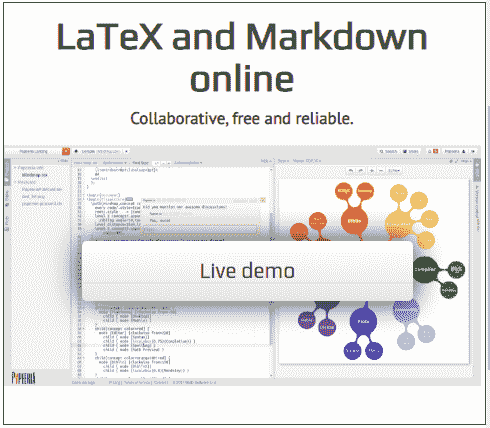
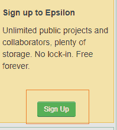
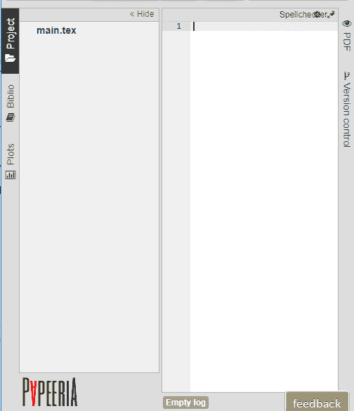
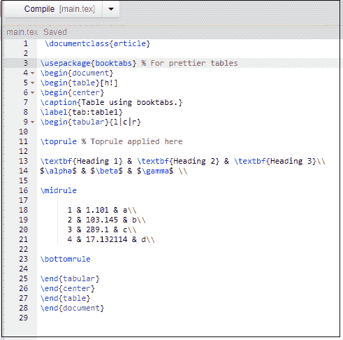
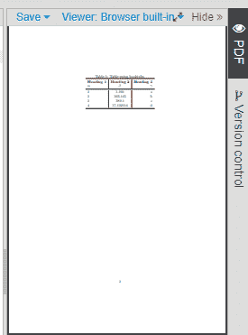
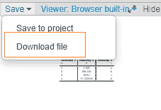
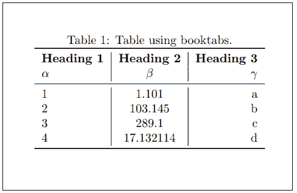
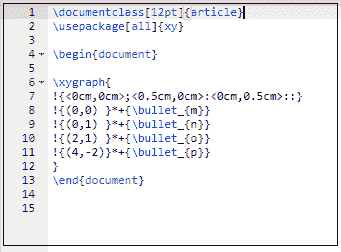
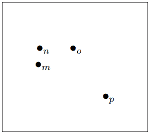

# 乳胶文具

> 哎哎哎:# t0]https://www . javatppoint . com/latex-paper library

**Papeeria** 也是一个在线 Latex 编辑器。代码和命令将与 Latex 教程中讨论的相同。它具有自动编译功能，可以在后台连续编译我们的工作。

Papeeria 是一个实时协作编辑器，具有拼写检查、即时数学预览、自动完成等功能。开始的过程类似于背面。

让我们从帕佩里亚开始。

在 Papeeria 中编写 Latex 代码的过程将在以下步骤中解释:

1)在任何搜索引擎或浏览器上搜索**papeeria.com**。

2)屏幕将如下图所示:

3)点击“**直播演示**选项。

4)您可以直接开始处理您的文档，也可以注册以供进一步使用。

5)点击左上角的注册选项，如下图所示:

6)将出现如下图所示的签名窗口:

7)您可以根据自己的选择选择想要的登录选项。

8)注册后，将出现帕佩里亚窗口，如下图所示:

屏幕左侧显示项目名称等。屏幕的右边部分显示了打印在上面的代码。

9)要编译我们的文档，我们可以点击屏幕顶部的“编译”选项。编译按钮如下图所示:

让我们通过一个例子来理解表的创建。

写完代码后，Papeeria 的左侧屏幕将如下图所示:

输出屏幕位于打印屏幕的右侧，如下图所示:

但是输出屏幕上显示的文本大小很小。

要查看输出，点击输出屏幕顶部的“**保存**”选项。

屏幕将显示为:

点击**下载文件**选项。

该文件现在将显示为 PDF，如给定图像所示:

我们现在可以清楚地查看输出，并可以保存文件以供进一步参考。

让我们考虑另一个创建项目符号图的例子。

写完代码后，帕佩里亚的屏幕将看起来像给定的图像:

下载输出 PDF 的方法将与上面讨论的相同。

上面代码的输出看起来像给定的图像:

* * *