# Inkscape 教程

> 哎哎哎:# t0]https://www . javatppoint . com/inkscape

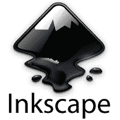

Inkscape 教程提供了 Inkscape 的基本和高级概念。我们的 Inkscape 教程旨在帮助初学者和专业人士。它帮助您清除您的 Inkscape 概念，并提供如何使用 Inkscape 的知识。

在本教程中，我们将讨论以下主题:

*   [什么是墨景？](#What)
*   [什么是 SVG(可伸缩矢量图形)？](#SVG)
*   [什么是矢量图形？](#Vector-Graphics)
*   [墨景历史](#History)
*   [墨景的特点](#Features)
*   [墨景安装](#Installation)
*   喷墨接口
*   [墨景转换](#Conversion)
*   [路径/布尔运算](#Path-Operations)
*   [轨迹位图](#Trace-Bitmap)
*   [墨景示例](#Examples)
*   [Inkscape 诉 Illustrator](#Illustrator)
*   [Inkscape 诉 GIMP](#GIMP)
*   [Inkscape 诉 CorelDRAW](#CorelDRAW)

* * *

## 什么是墨景？

Inkscape 是一个图形软件，用于创建或编辑图形图像，如**插图、线条画、图表、图表、徽标、复杂的网络图形等。**

**“这是一个开源的、功能强大的矢量图形应用程序，用于创建二维可缩放图形图像。”**

它主要是作为一个插画工具，但它也可以用于广泛的计算机图形任务。它可以在 Windows、Mac OS X 和 GNU/ Linux 上运行。

Inkscape 使用 **SVG(可缩放矢量图形)**作为其原始图形格式，尽管它也可以导入或导出各种文件格式，如**AI****(Adobe Illustrator article)、EPS(封装 PostScript)、PDF、PS (PostScript)、**和 **PNG。**

Inkscape 提供了各种矢量形状(正方形、多边形、螺旋形和 3D 框)和文本。这些形状可以在纯色、图案和颜色渐变的帮助下进行变换。我们也可以通过一些变换来改变这些形状，比如**移动、旋转、缩放、**和**倾斜。**

* * *

## 什么是可伸缩矢量图形？

**可伸缩矢量图形(SVG)** 是由 **W3C(万维网联盟)**集团于 **1999 年**开发的开放标准。它是一种基于 XML 的矢量图像格式，用矢量形状、嵌入式光栅图形和文本来说明图像。它还支持交互性、脚本和动画。SVG 文件包含**轻量级**图形。

SVG 矢量图像是在一个 XML 文件中定义的，这意味着它们可以被**索引、搜索、脚本化、**和**压缩**。所有的网络浏览器，包括谷歌 Chrome、Mozilla Firefox、Opera、Safari 等。，支持 SVG 格式。

* * *

## 什么是矢量图形？

矢量图形是根据 2D 点描述的计算机图形图像(数字图像)的创建。它使用数学方程来创建多边形或其他形状的设计，这些方程被转换成通过线或曲线连接的点，这些点也被称为矢量路径。

在矢量图形中，每个点在笛卡尔平面的 **X 轴**和 **Y 轴**上都有一个精确的位置，并指定路径的方向。矢量图形通常以 SVG、EPS、PDF 和 AI 文件格式存在。

* * *

## 水墨历史

Inkscape 是由一个名为 **Ted Gould、Bryce Harrington、Nathan Hurst、**和 **Men TaLguY** 的开发团队在 2003 年开发的，作为**Sodipodi**(Inkscape 的前身)项目的代码分叉。Inkscape 这个词是由 ***墨迹*** 和 ***scape*** 这两个词组合而成的。它遵循所有的 SVG 标准。

在开发 Inkscape 的过程中，开发人员做了一些改变，使其不同于 Sodipodi 项目。他们将编程语言从 **C** 改为 **C++** ，并使用了 **GTK+工具包 C++绑定**。他们还重新设计了用户界面，并增加了一些新功能。

Inkscape 在 2005 年参与了**谷歌代码之夏** ( **GSoC** )项目。

以下是 Inkscape 的发布历史:

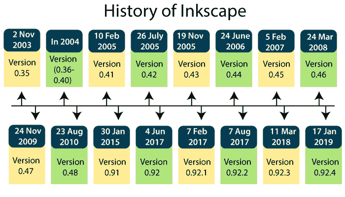

*   2003 年 11 月 2 日和发布了 Inkscape 的初始版本(【0.35 版)。
*   2004 年，Inkscape 的许多版本(**版本 0.36** 到**版本 0.40** )都发布了新功能，如**菜单栏、上下文相关工具栏、布尔路径操作、文本字距调整、字母间距、标记、克隆、多层支持、位图跟踪、**
*   2005 年 2 月 10 日新版本的 Inkscape(**0.41 版**)发布了一些新功能，如**克隆 tiler 工具**和**颜色追踪。**
*   2005 年 7 月 26 日新版本的 Inkscape ( **版本 0.42** )发布了一些新功能，如**流动文本支持、样式文本跨度、**和新的**渐变工具。**
*   2005 年 11 月 19 日发布了新版本的 Inkscape(**0.43 版**)，新增了**连接器工具、协同编辑、**和**平板角度灵敏度等功能。**
*   2006 年 6 月 24 日发布了新版本的 Inkscape(**0.44 版**)，新增了一些功能，如**图层面板、支持裁剪和蒙版、**和 **PDF 透明导出。**
*   2007 年 2 月 5 日，新版本的 Inkscape ( **版本 0.45** )发布了一些新功能，如**高斯模糊、沿路径模式、新的撤销历史面板、改进的位图跟踪、**和**颜色效果。**
*   2008 年 3 月 24 日新版本的 Inkscape ( **版本 0.46** )发布了一些新功能，如**对接用户界面、油漆桶、Tweak 和 3D 工具、实时路径效果、**
*   2009 年 11 月 24 日新版本的 Inkscape(**0.47 版**)发布了一些新功能，如**橡皮擦工具、定时自动保存、路径自动平滑节点、对 SVG 字体的基本支持、**
*   2010 年 8 月 23 日 rd 发布了新版本的 Inkscape ( **版本 0.48 到 0.48.5** )，新增了**多路径节点编辑、追踪、新的 Airbrush (Spray)工具、带有 PDF/PS/EP 的 LaTeX 导出、**等功能
*   2015 年 1 月 30 日新版本的 Inkscape(**0.91 版**)发布了一些新功能，如**测量工具、新的导入/导出格式、灰度模式、对齐模式、**
*   42017 年 1 月日，新版本的 Inkscape(**0.92 版**)发布了一些新功能，如**基础设施聚焦、各种新路径效果、**、**默认分辨率从 90dpi 改为 96 dpi。**
*   2017 年 2 月 7 日，新版本的 Inkscape ( **版本 0.92.1** )发布了一个名为**的新功能，修复了几个错误。**
*   在 2017 年 8 月 7 日发布了新版本的 Inkscape ( **版本 0.92.2** )并增加了一些新功能，如**几个错误修复**和**批量转换 90 到 96 dpi。**
*   在 2018 年 3 月 11 日发布了 Inkscape 的新版本(**版本 0.92.3** )，其中包含了一些新功能，例如为 Linux、Windows 32 位和 64 位、准备的**快照包**
*   2019 年 1 月 17 日，最新版本的 Inkscape ( **版本 0.92.4** )发布了一些新功能，如**增加稳定性**和 **bug 修复。**

* * *

## 墨景的特征

Inkscape 提供了多种功能，如下所示:

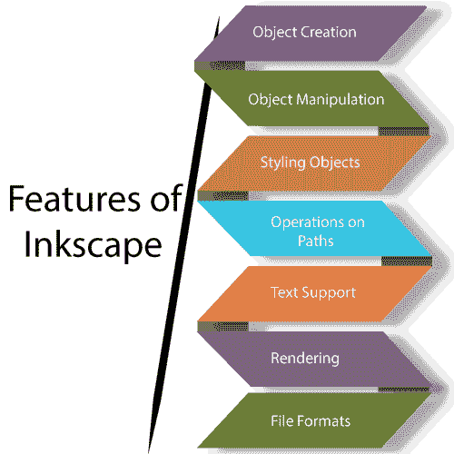

### 1.对象创建

它定义了在 Inkscape 中创建一个**对象**。Inkscape 中的对象可以称为文本、路径、形状或绘图。

以下是 Inkscape 中的基本对象创建:

*   **绘图-** 是对象创建的初级模块，进一步分为**铅笔工具、钢笔(*贝塞尔*工具、**和**书法工具等多种工具。**铅笔工具**允许用户徒手画线条。**钢笔工具**用于在同一路径上创建一条贝塞尔曲线和一条线段。一个**书法工具**用来创作一个写意的书法或毛笔状的笔画。**
*   **造型工具-造型工具**也分为多种工具，如**矩形&方形工具、3D 盒子工具、圆/椭圆工具、星星&多边形工具、**和**螺线工具。**

#### 注意- 长方形和正方形的角可以是圆形的。

*   **文本工具-** 用于创建文本(单行或多行)，可以使用任意操作系统轮廓和 Unicode 字体。**普通、粗体、斜体、简体字、对齐、竖排、**和**横排**类型的文本在 Inkscape 中实现。我们可以通过**行距、字母间距、字间距、水平字距、**和**垂直移位来转换书写文本。**

#### 注意- 项目符号列表、编号列表和带下划线的文本不支持旧版本(在【0.92 版下方)。

*   **克隆-** 克隆对象与其父对象相同。可以通过**副本、喷涂工具、**或**菜单界面创建。**对克隆对象的变换包括**大小、颜色、位置、旋转、模糊、**和**布局**。
*   **光栅图形-** 在 Inkscape 中，可以使用特定的命令嵌入选定对象的位图。它支持导出整个图表的位图图像(PNG)。

### 2.对象操作

它定义了对对象的修改和转换。

以下是对象操作模块的子部分:

*   **变换-** 在 Inkscape 中，可以对图像的任何对象进行变换。一些主要的变换是缩放、移动、旋转和倾斜。它们还可以捕捉到其他对象的网格、角度和节点。变换的参数可以在“变换”对话框中用数字指定。
*   **Z-order -** 指定对象在画布上的绘制顺序**。**Z 阶较低的对象绘制在画布的顶部，而 Z 阶较高的对象绘制在最后。对象的顺序可以通过图层或手动移动(向上&向下)对象来管理。
*   **对象的分组-** 在 Inkscape 中，对象可以任意分组在一起。可以使用**进入组**命令编辑分组的对象，而无需取消对象的分组。“输入组”命令通过使组成为临时图层来编辑组。
*   **对象的分层-** 执行对象的分层以管理对象的顺序。图层可以锁定、隐藏或排列，避免修改和随机选择。

### 3.造型对象

在 Inkscape 中，样式定义了对象的样式、模式或布局。

以下是造型模块的子部分:

*   **填充-** 用于填充对象中的实体**颜色、**图案、**线性**或**径向渐变**、**样本**。它通过颜色选择器来选择颜色，颜色选择器由许多颜色选项组成，如 **RGBA(红绿蓝阿尔法)、HSL、色轮、**和 **CMS** ( **颜色管理系统)。**
*   **笔画-** 一条素线或一维线称为笔画进一步分为两部分:一是**笔画填充，**二是**笔画样式。**描边填充可以具有与**填充**相同的值，但仅适用于对象的描边。而笔画样式用于设置笔画的样式。样式可以通过九种不同的度量(像素、英寸、米等)来设置。).
*   **滤镜-** 可以对图像应用多种滤镜。Inkscape 的所有滤镜都是 SVG 滤镜的组合。

#### 注意- 可以通过蒙版和裁剪路径进一步改变对象的外观。

### 4.路径上的操作

Inkscape 包含一个基本的工具集来编辑矢量文件的路径。以下是在路径上执行的操作/工具:

*   **编辑(节点编辑)-** 允许编辑单个路径或多个路径，或编辑它们相关的节点。Inkscape 中有四种类型的路径节点:**尖点、平滑、对称、**和**自动平滑。**可以编辑节点及其相关贝塞尔手柄(角度和长度)的移动或定位。它还负责节点的对齐和分布。
*   **调整工具(雕刻)-** 用于对对象、路径和颜色进行微小的更改。它提供了一个对象的节点编辑区域，可以执行推送、排斥/吸引、收缩/放大、旋转、复制/删除和随机定位所选对象。使用该工具，可以在需要时动态创建或删除节点。
*   **路径-偏移-** 偏移有四种类型:**开始，插入，链接，**或**动态(未链接)。**偏移也用于扩展或收缩在 Inkscape 中制作的形状。路径偏移可以创建动态插入或链接插入。它还会创建对象现有路径的起点。
*   **路径-转换-**Inkscape 中有两种转换:一种是**对象到路径的转换，**另一种是**笔画到路径的转换。**对象到路径转换用于转换形状(正方形、矩形、多边形等)等对象。)或文本到路径中。笔画到路径包括将形状的笔画转换为路径。
*   **路径-简化-** 它减少给定对象路径的节点数，同时保持形状。
*   **路径-操作(布尔操作)—**Inkscape 支持在对象路径上执行的各种操作。它使用多个对象来**合并、差异、交集、排除、除法、**和**剪切**

### 5.文本支持

在 Inkscape 中，文本支持模块突出显示图形图像中使用的文本的属性。Inkscape 支持的一些主要文本属性是**多行文本、使用已安装的轮廓字体、字距、字母间距、行距、路径上的文本、**和形状中的**文本。**

它支持多行文本(SVG 的<text>元素)和流动文本(非标准的<flowroot>元素)。它还支持斜体和粗体文本，以及上标和下标字符属性。</flowroot></text>

#### 注意-文本的下划线在 Inkscape 中还没有实现。

### 6.翻译

Inkscape 没有使用 GTK 库，而是使用自己的名为“T0”libnr 的库来创建图形图像。从 0.91 版或以上版本开始，使用 **Cairo** 编程库渲染图形图像，导致应用渲染速度提高。它支持完全抗锯齿显示，使多边形的边缘(**锯齿**)看起来平滑。它还支持图像显示和 PNG 导出的 alpha 透明度。

### 7.文件格式

Inkscape 使用 SVG(可缩放矢量图形)作为其原始图形格式。SVG 是用于创建和生成图形图像的最灵活的文件格式。Inkscape 可以导入(转换为 SVG)或导出(从 SVG 转换而来)任何其他文件格式，如**Adobe Illustrator article(AI)、CorelDRAW (CDR)、Microsoft Visio Drawing (VSD)、可移植文档格式(PDF)、SVG Zip (SVGZ)、** **光栅格式、**等。

* * *

## 安装 Inkscape 软件

Inkscape 是一个开源的免费矢量图形软件。按照以下步骤在您的系统中安装 Inkscape:

**第一步:**从[https://inkscape.org/](https://inkscape.org/)下载墨景。点击**下载**标签的**当前版本**选项，如下图。

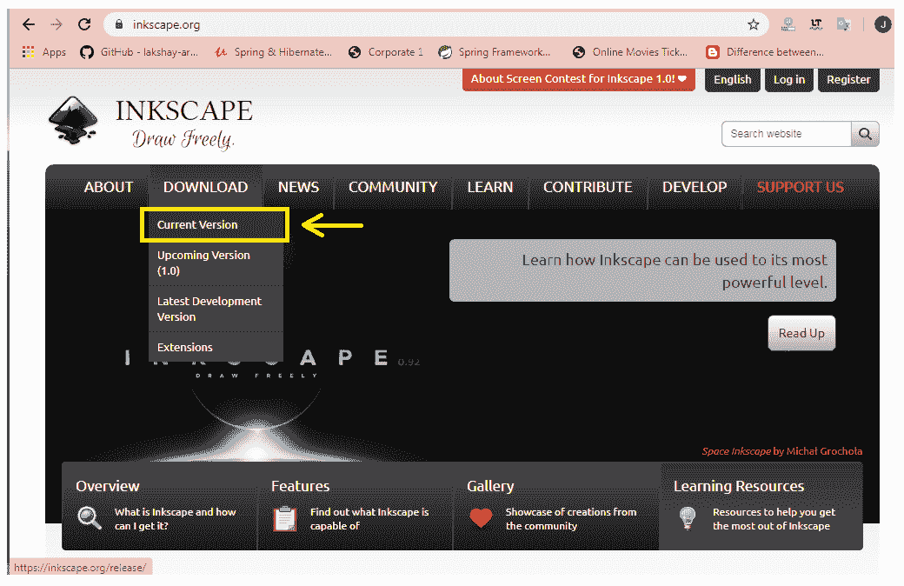

**第二步:**根据你系统的操作系统，点击相应的 GNU/Linux、Windows 或 macOS 按钮，如下图所示。

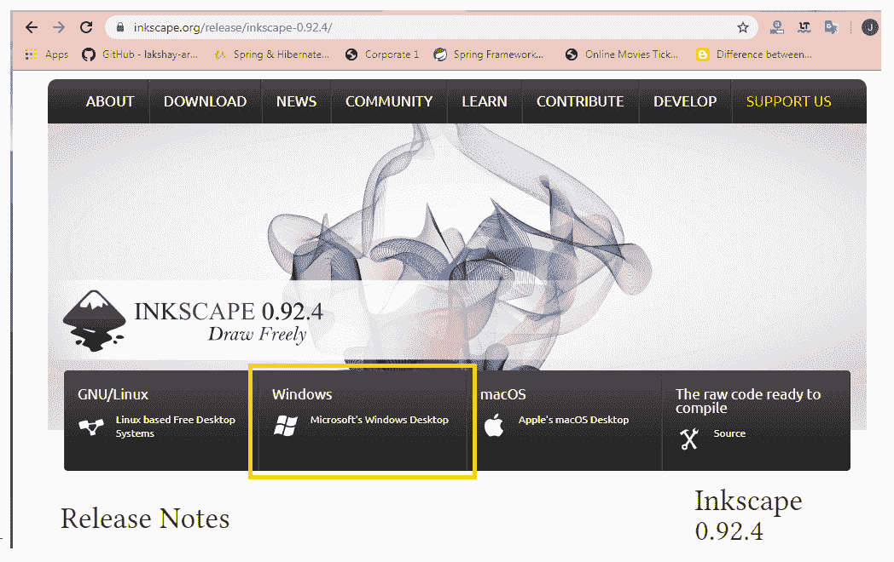

**第三步:**根据你的系统配置，点击相应的按钮，如下图。

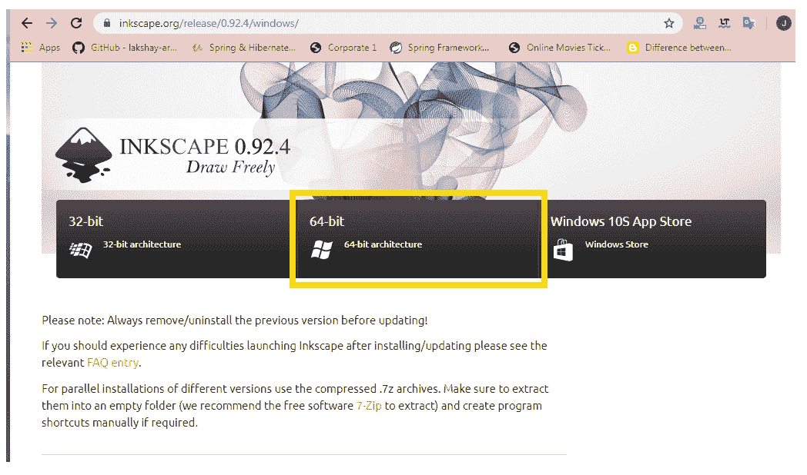

**第四步:**现在点击**安装程序**或 **Windows 安装程序包**按钮下载如下图所示的 Inkscape。

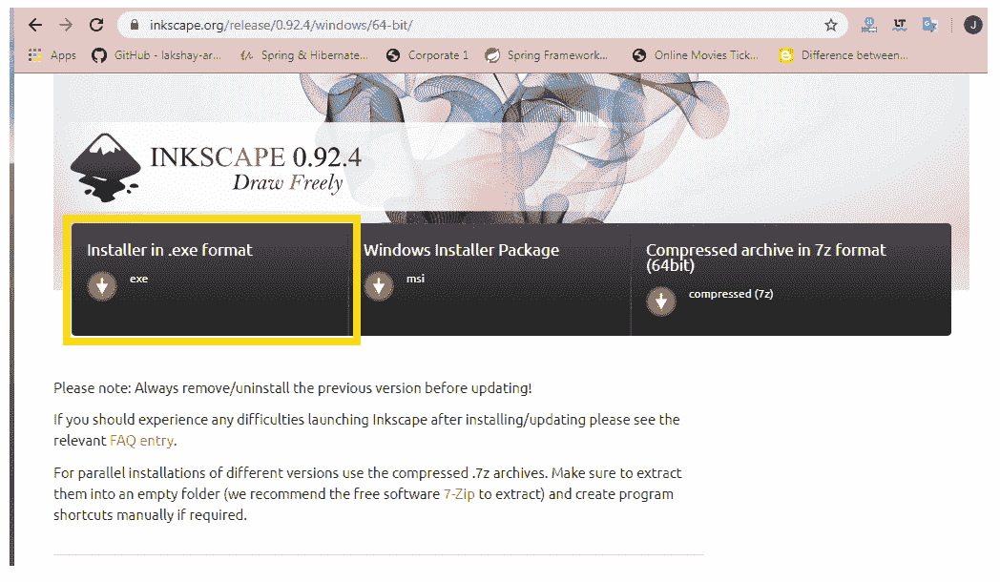

**第五步:**下载完成后，需要为安装程序选择语言。之后，将打开**许可协议**对话框。点击**下一步**按钮，如下图。

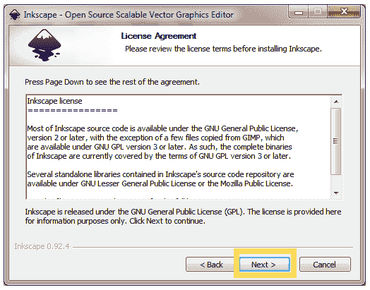

**第 6 步:**现在，一个新的窗口**选择组件**将打开，其中出现一个组件列表，您可以从中选择您想要安装的组件。点击**下一步**按钮，如下图。

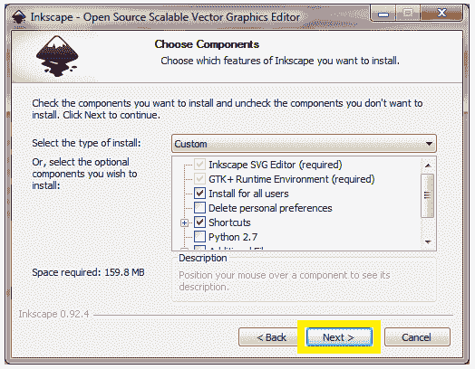

**第 7 步:**这里将打开**选择安装位置**窗口。您可以根据自己的选择选择目标文件夹或位置，点击**浏览**按钮即可。选择目的文件夹后，点击**安装**按钮，如下图。

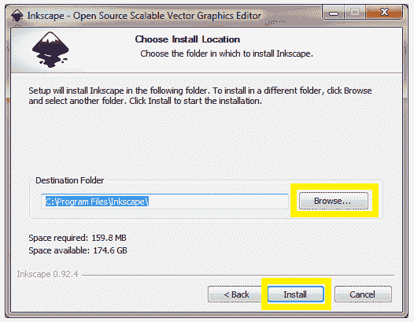

**第 8 步:**安装完成后，屏幕上会出现如下窗口。现在点击**完成**按钮，如下图所示。

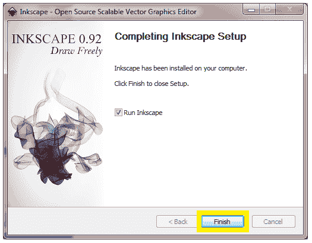

* * *

## Inkscape 接口

**Inkscape 界面**由几个元素组成，用于轻松开发矢量图形图像。它基于 **GNOME 人机界面指南(HIG)** 标准。

Inkscape 通常由单个窗口组成，在该窗口上创建和操作绘图或图像。默认窗口元素进一步分为八个主要区域，如下所示:

*   菜单栏
*   命令栏
*   工具箱
*   工具控制栏(也称为控制栏)
*   画布
*   标尺、参考线和网格
*   调色板
*   状态栏

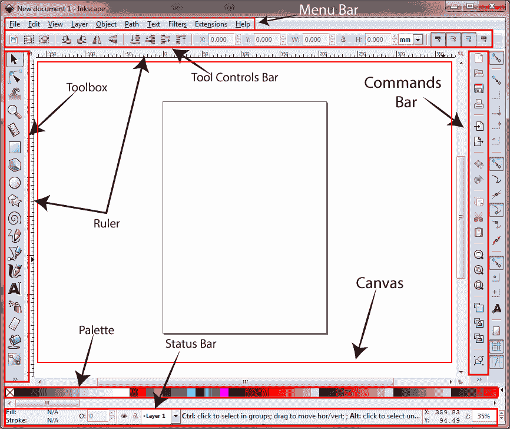

### 菜单栏

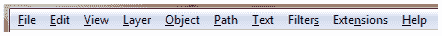

窗口顶部出现**菜单栏**。包含**文件、编辑、查看**等基本菜单。，这些菜单包含操作的下拉列表。菜单栏中还提供了与图形相关的功能。

菜单栏的大多数命令都可以通过键盘直接访问，使用**访问键**(带下划线的字母)或**键盘快捷键**。比如我们以 ***文件*** 下拉列表展示列表的访问键和键盘快捷键，如下图。

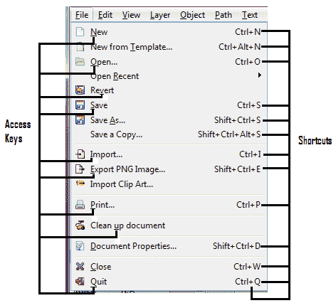

### 命令栏

**命令栏**垂直位于用户界面的右侧。它包含的图标是命令的快捷方式，可以从菜单或快捷键中访问。它还包含用于操作绘图对象和文档的其他控件，如**文件选项、缩放级别、撤消、剪切、分组**等。相关功能的图标组合在一起，用一条水平线隔开。

下表显示了命令栏的简要说明:

| 核标准情报中心 | 行动 | 描述 |
|  | 从默认模板创建新文档 | 用于打开新的 Inkscape 画布。 |
|  | 打开现有文档 | 它用于打开现有文件或将光栅或矢量图形图像导入画布。 |
|  | 保存文档 | 它用于以 SVG 格式保存现有文档。 |
|  | 打印文件 | 用于打印当前文档。 |
|  | 将位图或 SVG 图像导入此文档 | 它用于将 SVG 文件或其他格式的图像导入到当前文档中。 |
|  | 将此文档或所选内容导出为 PNG 图像 | 它用于将当前文档导出为 PNG 或其他文件格式。 |
|  | 撤消最后一个操作 | 它用于撤消最后一个操作。 |
|  | 再次执行上一次未完成的操作 | 它执行**撤销按钮**的反向功能。 |
|  | 将所选内容复制到剪贴板 | 它用于将对象复制到剪贴板。 |
|  | 将所选内容剪切到剪贴板 | 它用于切割物体。 |
|  | 将对象从剪贴板粘贴到鼠标点，或粘贴文本 | 它用于粘贴对象。外部图像无法粘贴到 Inkscape 画布中。 |
|  | 缩放以适应窗口中的选择 | 它缩放选定的部分以适合窗口。 |
|  | 缩放以适应窗口中的绘图 | 它只缩放画布的绘图部分以适合窗口。 |
|  | 缩放以适合窗口中的页面 | 它用于缩放页面以适合窗口。 |
|  | 复制选定的对象 | 它用于复制选定的对象。 |
|  | 创建选定对象的克隆 | 它用于创建选定对象的克隆。克隆创建原始对象的“**从属对象**，而复制创建独立对象。 |
|  | 将选定克隆的链接剪切到其原始链接 | 它用于从原始对象中剪切选定克隆的链接。 |
|  | 将选定的对象分组 | 它用于对需要大量移动的高度复杂的形状进行分组。 |

### 工具箱和工具控件栏

**工具箱**

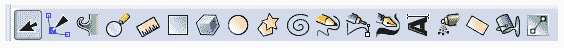

**工具箱**垂直位于窗口左侧。它包含一组基本的实用程序。它用于创建和编辑形状和图像。这些工具可用于**几何**形状以及**自由形状**形状、线条、文本和**填充**(颜色和**渐变**)。

下表显示了工具箱的简要说明:

| 带图标的名称 | 行动 | 描述 |
| 选择工具 | 选择和变换对象 | 它用于操作 Inkscape 中的基本组件。它还用于选择、移动、旋转、翻转、升高、降低、改变宽度/高度和倾斜对象。 |
| 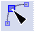编辑工具 | 按节点编辑路径 | 它用于在给定时间准确编辑对象的形状。它修改对象的节点、路径或曲线的形状。 |
| 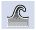调整工具 | 通过雕刻或绘画来调整对象 | 它用于通过模糊对象来编辑绘图。当它接触到调整画笔时，它会平滑地改变对象的形状或大小。 |
| 缩放工具 | 放大或缩小 | 它允许我们进行广泛的缩放操作。在 Inkscape 中，屏幕路径的质量不会随着我们放大或缩小而降低。 |
| 测量工具 | 测量物体 | 它允许我们更新长度和角度的测量。 |
| 矩形工具 | 创建矩形和正方形 | 它用于创建和编辑矩形和正方形，并带有圆角选项。 |
| 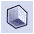 3D 箱式工具 | 创建三维框 | 它用于创建以三维形式出现的图形。 |
| 圆形工具 | 创建圆、椭圆和圆弧 | 它允许我们创建圆、椭圆和圆弧。在 Inkscape 中，使用圆形工具创建的对象可以从椭圆转换为圆弧，也可以转换为其他形状。 |
| 星形工具 | 创建星形和多边形 | 它允许我们在文档中轻松地绘制像星星和多边形这样的形状。 |
| 螺旋刀具 | 创建螺旋 | 这是一类特殊的工具，用于创建动态形状，如螺旋弧等。 |
| 徒手工具 | 徒手画线条 | 它用于绘制手绘线条、形状和绘图。 |
| 线工具 | 绘制贝塞尔曲线和直线 | 它用于绘制形状，如贝塞尔曲线、直线、螺线、旁轴线、多段线和创建点。 |
| 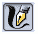书法工具 | 画书法和毛笔 | 它用于使用动态绘画技术来绘制书法和笔触。 |
| 文本工具 | 创建和编辑文本对象 | 它允许我们在 SVG 绘图中编写文本。 |
| 喷涂工具 | 通过雕刻或绘画喷涂物体 | 它用于通过像喷枪一样喷射来创建对象的副本或克隆。 |
| 橡皮擦工具 | 擦除现有路径 | 它用于擦除绘图的一部分。 |
| 填充(铲斗)工具 | 填充有界区域 | 它用于用颜色填充对象的区域。 |
| 渐变工具 | 创建和编辑渐变 | 它用于创建和编辑对象笔划的径向线或渐变线。 |

**工具控制条**

**工具控制栏**(也称为**控制栏**)位于**菜单栏下。**包含特定于所选工具的图标或可点击按钮。当在工具箱中选择每个工具时，工具控制栏中显示的图标会发生变化，以显示与该工具相关的图标。其中一些选项会影响选定的对象，而其余选项会在创建新对象时生效。

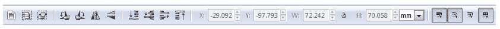

### 画布

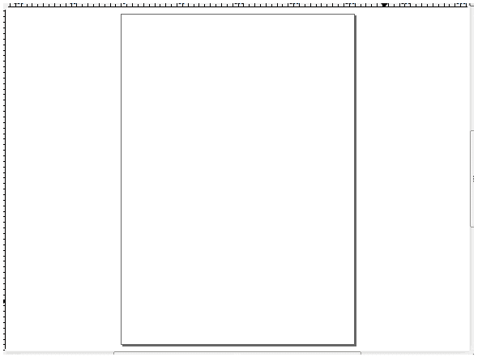

**画布**是主工作区，也是 Inkscape 界面必不可少的一部分。它是创建和查看图形的主要绘图区域。它位于 Inkscape 窗口的中间。画布可以延伸到窗口的可视区域之外，并且可以平移(上下滚动和左右滚动)和缩放。

### 标尺、网格和指南

**尺子**

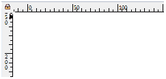

**标尺**位于画布的顶部和左侧。第一把尺子水平放置**在画布顶部，代表 **X 轴**坐标。相比之下，第二个垂直放置**在左侧，代表 **Y 轴**坐标。标尺可以用几个**测量单位来表示距离。******

 ****我们可以使用下面的菜单栏命令***<u>F</u>ile-><u>D</u>文档属性- >页面*** 选项卡 **- >显示单位，**如下所示。

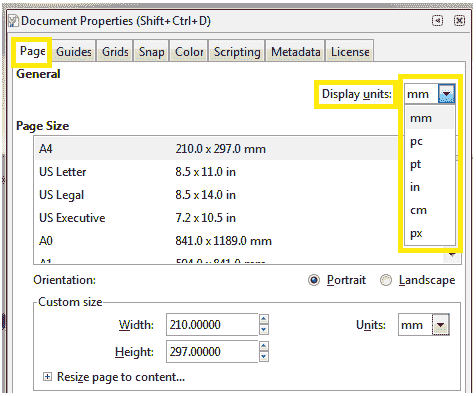

**网格**

**网格**是一组纵横线条。它用于引导绘图对象和图像。网格有两种类型:**矩形**和**轴测图**网格。矩形网格是最常用的网格之一，由水平线和垂直线组成。轴测网格允许用户定义任何类型的倾斜网格。

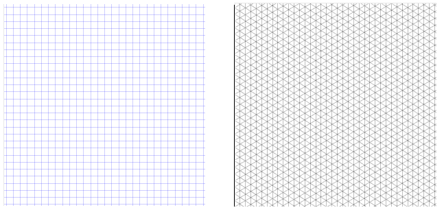

上图分别显示了**矩形**和**轴测图**网格。

**导轨**

**参考线**是**用户自定义的**线。它提供了与对象的简单对齐。要使用参考线，请单击并从标尺拖动到要插入和释放参考线的位置。单击并拖动水平标尺会产生一个**水平参考线。**同样，点击并拖动垂直标尺会产生**垂直参考线。**

在下图中，画布上的垂直和水平蓝线代表参考线。

### 调色板栏

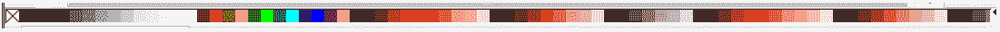

**调色板条**位于窗口底部(位于**状态栏**上方)。它提供了许多填充和描边样式(颜色、渐变、图案)选项。此外，这是在形状或图表上应用颜色的快速方法。颜色可以从调色板中拖动并放到对象上，以更改其填充。通过单击调色板最右侧的箭头图标，可以更改调色板中的颜色。

### 状态栏

**状态栏**位于窗口底部。它为所有编辑任务提供常规编辑设置和合适的焦点。状态栏看起来像一个多余的栏，因为它的大部分功能可以从其他菜单中访问。

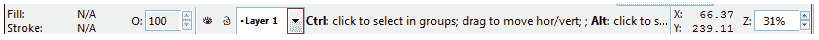

下表描述了状态栏的简要说明:

| 图标 | 名字 | 描述 |
| 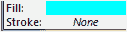 | 填充和描边颜色 | 它显示对象的填充和描边颜色。双击这些颜色板中的任何一个都会调用**填充&描边**窗口。 |
| 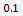 | 笔画宽度 | 它显示所选对象笔画的宽度。 |
|  | 主不透明度 | 它显示所选**路径的不透明度。** |
|  | 切换当前图层的可见性 | 它是图层管理工具之一。点击眼睛按钮，它将隐藏(显示的图层 **)** 或**显示(**隐藏的图层 **)** 图层。 |
|  | 锁定或解锁当前图层 | 用于**锁定**或**解锁**图层切换中显示的当前图层。 |
| 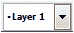 | 图层切换 | 用于选择我们要工作的**图层**。 |
| 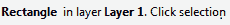 | 描述 | 这是**状态栏**最有用的功能。显示所选**对象、工具、**和**手柄**的描述和快捷方式信息。 |
| 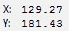 | 光标坐标 | 它显示光标的精确 X 和 Y 坐标。 |
|  | 一款云视频会议软件 | 用于将中的**或**从画布中放大**。** |

* * *

## 墨迹中的转换

在 Inkscape 中，转换被称为“为编辑目的将一种形式转换成另一种形式。”Inkscape 支持两种类型的转换:

*   **对象到路径的转换**
*   **笔划到路径的转换**

*   **对象到路径的转换-** 它将形状或文本对象转换为路径，而不改变对象的外观。但是它移除了该特定对象的所有功能。转换后的路径无法用制作它的工具编辑。只能用**节点工具**编辑。

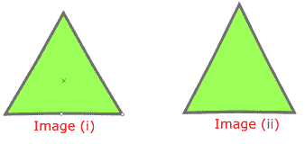

上图显示了**对象到路径**的转换。**图像(i)** 是**物体**的图像，而**图像(ii)** 是**路径**的图像。

*   **笔画到路径转换-** 它将笔画转换为路径。这意味着对象的轮廓从笔画转换为路径。转换后的路径只能由**节点工具**编辑。

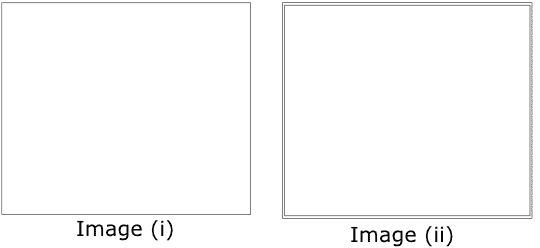

以上两幅图显示了**笔划到路径**的转换。在第一张图片中，我们展示了笔画，在第二张图片中，我们展示了路径。斯托克和路径的基本区别是对象的**轮廓**。

* * *

## 路径操作(布尔操作)

在 Inkscape 中，有许多命令可用于从两个或多个现有路径中形成新路径。在新路径中，最重要的是路径的 **Z 阶**。几乎在所有路径操作中，**顶部**路径都被认为是在**底部**路径上运行。表示**底**路径不变，**顶**路径被扔掉。

让我们简单讨论一下路径操作的概念。

**1。并集(Ctrl+)-**提供一条或多条路径的并集。创建新路径时，它由原始路径的所有区域组成。它删除自相交，并为每个部分创建单独的子路径。

下图显示了路径的并集:

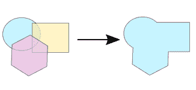

**2。差异(Ctrl+-) -** 它提供两条或多条路径之间的差异。两条或多条路径之间的差异被定义为从底部路径(正方形)移除顶部(星形)路径的区域。

下图显示了两条路径之间的差异。

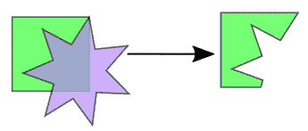

**3。交点(Ctrl+*) -** 它产生两条或多条路径的交点。交叉点被定义为所有对象之间的公共区域，这提供了新的路径。

下图显示了路径的交点。

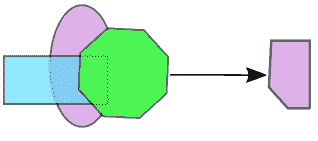

**4。排除(Ctrl+^) -** 它提供两条或多条路径的排除。根据**奇偶**填充规则，通过组合多个子路径来创建新路径。这叫做排除路径。

下图显示了路径排除:

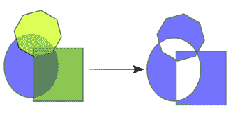

**5。除法(Ctrl+/) -** 提供两条或多条路径的除法。底部路径被顶部路径分开，从而产生两个或更多新路径。

下图显示了路径的划分:

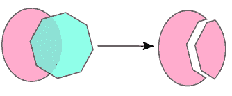

**6。切割路径(Ctrl+Alt+/) -** 提供路径切割。底部路径被顶部路径切割，从而产生两个或更多新路径。新路径被创建**而没有填充**。

下图显示了路径的切割:

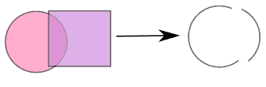

* * *

## 跟踪位图

在 Inkscape 中，位图图像通过追踪转换为*路径*。它使用由**彼得·塞林格**开发的 **Potrace** 位图跟踪引擎。Potrace 是一个工具，用于跟踪位图图像并将其转换为平滑、可缩放的图像。它采用位图图像(。pbm，。bmp 格式)作为输入，并给出各种矢量文件格式之一作为输出。它提供了一组曲线，从而产生图像。

我们可以通过按键 **Shift+Alt+B** 打开**轨迹位图**窗口。窗口有三个标签:**模式，选项，**和**信用。****模式**选项卡用于选择跟踪模式。**选项**选项卡包含选项列表，**学分**选项卡提供了关于 Potrace 作者的信息。所有窗口如下所示。

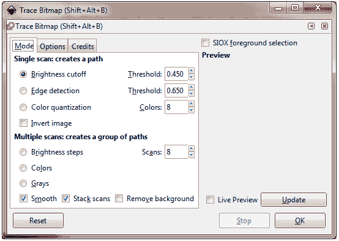

上图为**轨迹位图**窗口的**模式**选项卡。

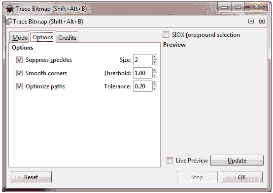

上图显示了**轨迹位图**窗口的**选项**选项卡。

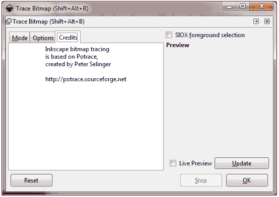

上图显示了**轨迹位图**窗口的**积分**标签。

有以下三种跟踪模式:

*   亮度截止
*   边缘检测
*   颜色量化

**亮度截止**

它稍微使用一个像素的红、绿、蓝(带有灰色阴影)量作为指示器。它指示给定的图像，黑色或白色。阈值可以设置为 0.0 到 1.0(白色到黑色)。在最大阈值的情况下，少数像素被认为是“白色”，并且产生的图像将更暗。

下图显示了亮度截止。

**边缘检测**

它使用了由 **J. Canny** 设计的边缘检测算法。它提供了一种快速找到一组相似对比度的线条的方法。像亮度截止一样，阈值可以设置为 0.0 到 1.0。它调整输出中边缘的暗度或厚度。

下图显示了边缘检测。

**颜色量化**

这是一种复杂的方法，其中算法识别颜色变换，而不是亮度和边缘的修改。

下图显示了颜色量化。

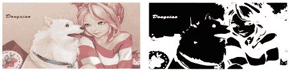

* * *

## 墨景的例子

在以下示例中，我们对图像执行了不同的操作，并且绘制了不同的形状。

### 1.创建箭头

让我们在 Inkscape 中画一个箭头。

**第一步:**打开墨景，点击**钢笔工具**画一条直线，如图。

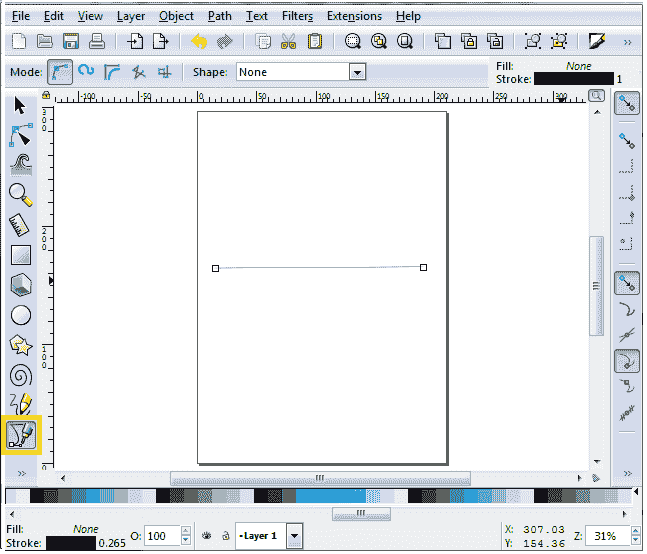

**第二步:**点击**对象菜单**，从下拉列表中选择**填充和描边**(或按 Shift+Ctrl+F)。

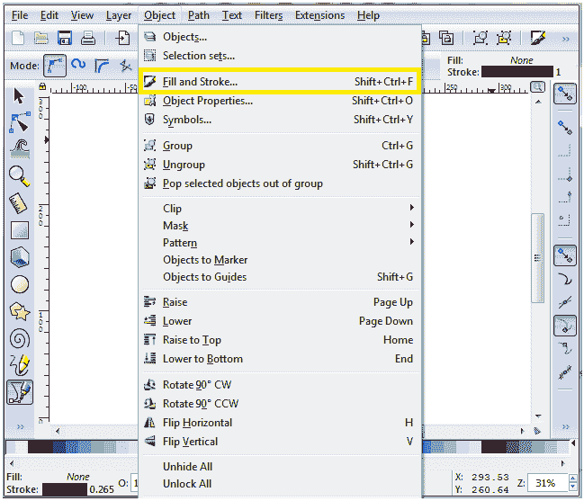

**第三步:****填充和描边**窗口将在您点击填充和描边按钮后打开，如图所示。

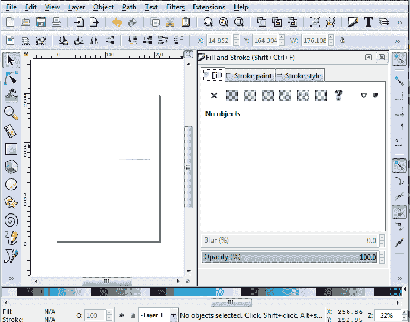

**第 4 步:**选择线条，点击填充和描边窗口的**描边样式**按钮。选择箭头类型，并将其添加到箭头的任一侧，如图所示。

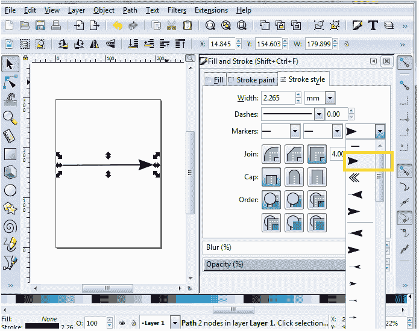

同样，我们可以创造不同的箭头设计。

### 2.在 Inkscape 中裁剪图像

#### 注意:在进入下一步之前，确保每个对象都分组在一起。

**步骤 1:要对每个对象进行分组，请执行以下操作:**

全选->点击对象->分组或按 Ctrl+G

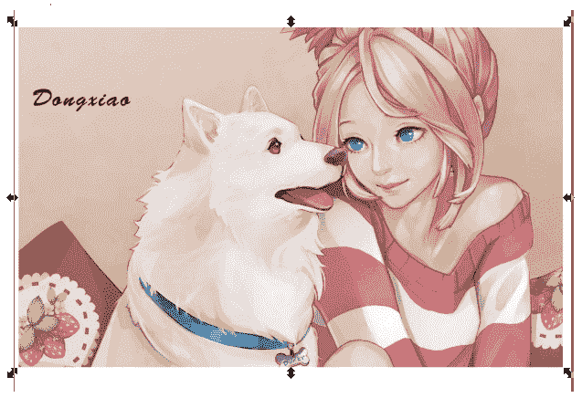

**第二步:**现在，点击**圆工具**，在你要裁剪的区域画一个圆，如下图。您可以选择任何形状来裁剪图像。

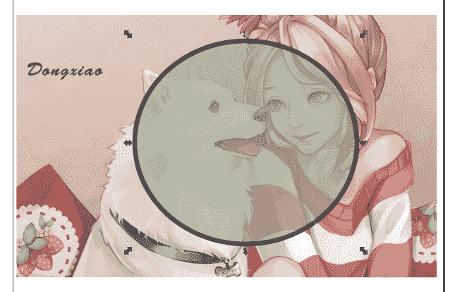

**第三步:**选择圆圈和场景。现在点击**对象菜单- >裁剪- >设置**裁剪图像。

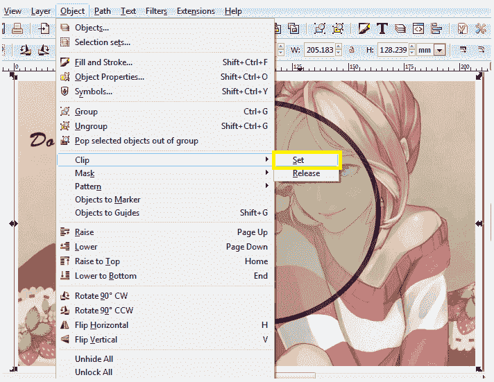

**步骤 4:** 裁剪后的图像如下所示。

### 3.在 Inkscape 中创建徽标

按照步骤在 Inkscape 中创建徽标。

**第一步:**打开墨景，点击**查看**菜单，选择**自定义**。

**第二步:**现在，点击**多边形工具**，在**工具控制栏**中选择多边形。之后，将角的数量设置为 3，如下所示。

**第三步:**现在我们要为 logo 绘制一个图案中的三个三角形，如下图所示。

**第四步:**在这一步中，我们将使用**圆工具**在图形的中间(所有三角形的交点)创建一个圆，如下图所示。

**第五步:**在这一步中，我们将借助**文字工具**在我们的 logo 设计中添加文字。我们也可以在**工具控制栏**中设置字体、字体样式和字体大小。

同样，我们可以在 Inkscape 中创建不同类型的徽标。

* * *

## Inkscape 与 Illustrator

**Inkscape** 是矢量图形软件。初学者和专业人士使用它来创建插图、徽标、图表、3D 图像、地图等。

**Adobe Illustrator** 是一款矢量图形应用。它是为专业平面设计师打造的。它是 Adobe 家族的一部分( **Adobe 创意云**)。它允许我们创建标识、绘图、草图和排版。

| 因素 | 插图画家 | 红宝石红宝石红宝石红宝石红宝石红宝石红宝石红宝石红宝石红宝石红宝石红宝石红宝石红宝石红宝石红宝石红宝石红宝石红宝石红宝石红宝石红宝石红宝石红宝石 |
| 灵活性 | Illustrator 是一个非常灵活的软件，因为它支持几乎所有类型的文件格式。 | Inkscape 也是一个图形软件。不支持**。eps** 文件格式。它不能在**导出文件。jpeg** 格式，但可以借助扩展添加到 Inkscape 中。 |
| 费用 | Illustrator 是一款昂贵的软件，拥有广泛的客户支持。它提供了几个教程和视频，很多聊天和通话选项。 | Inkscape 是一个开源的免费软件，它为用户提供了一个开放的社区论坛。在论坛中，用户可以讨论问题。 |
| 多才多艺 | Illustrator 无法在 Linux 系统上运行。我们只能在 Windows 和 Mac OS 上使用。 | Inkscape 运行在所有操作系统上，如 Windows、Linux/ GNU 和 Mac OS。 |
| 跨平台 | 使用 Adobe Illustrator 创建的矢量图形文件可以导入到 After Effects、Premiere Pro 等。 | 使用任何其他图形软件创建的图像都不能在 Inkscape 中导入。 |
| 使用方便 | Illustrator 为专业人士提供了一个非常完美、精致和过于简单的界面。 | Inkscape 为初学者和专业人士提供了一个组织良好的管理界面。 |
| 硬件要求 | 它需要高性能硬件。 | Inkscape 可以在低端计算机和过时软件上运行得足够好。 |

* * *

## Inkscape 诉 GIMP 案

**GIMP (GNU 图像处理程序)**是一款光栅图形软件。它用于图像编辑、变换、自由形式绘制等。它为编辑、各种图像格式之间的转换等提供了许多复杂的工具。它是在 **GPLv3+** 下发布的，可以在 **Linux、Mac OS、**和 **Windows** 上运行。

**Inkscape** 是一款矢量图形软件。它用于创建图形图像、插图、图标、徽标、3D 图像等。它可以在任何平台上运行。

| 因素 | 红宝石红宝石红宝石红宝石红宝石红宝石红宝石红宝石红宝石红宝石红宝石红宝石红宝石红宝石红宝石红宝石红宝石红宝石红宝石红宝石红宝石红宝石红宝石红宝石 | GIMP |
| 描述 | 这是一款用于创建和编辑图形图像的**矢量**图形软件。 | 这是一个用于创建和编辑图像的**光栅**或**位图**图形编辑器软件。 |
| 创建逻辑 | 它使用**数学方程、点、线的几何图形、**和**曲线**来创建矢量图形图像。 | 它使用**像素**来创建光栅或位图图形图像。 |
| 图像质量 | 当我们放大时，图像的质量保持不变。 | 当我们进入动物园时，它降低了图像的质量。 |
| 使用 | 当我们想画基本或简单的设计时，它就被使用了。 | 当我们想要创建复杂的图像时，就会用到它。 |

* * *

## 墨水匣 vs .科德勒夫

**Inkscape** 是一款开源的矢量图形应用。它用于创建和编辑 2D 和 3D 图像，如徽标、图标、插图、图案等。

**CorelDRAW** 是由 **Corel 公司**开发的强大矢量图形软件。图形设计师和专业人士使用它来编辑 2D 图像，如徽标、图案、插图、图标等。它为图像编辑提供了几种设计工具，帮助我们更智能、更快速地工作。

| 因素 | 红宝石红宝石红宝石红宝石红宝石红宝石红宝石红宝石红宝石红宝石红宝石红宝石红宝石红宝石红宝石红宝石红宝石红宝石红宝石红宝石红宝石红宝石红宝石红宝石 | CorelDRAW |
| 费用 | Inkscape 是一个开源的免费矢量图形软件。 | CorelDRAW 是一款付费软件，价格实惠。 |
| CMYK 输出 | Inkscape 无法输出 CMYK 颜色格式的图像，这是一个错误的选择。 | CorelDRAW 可以输出 CMYK 颜色格式的图像。 |
| 多才多艺 | Inkscape 是一个多功能软件。它可以在任何平台上运行。 | CorelDRAW 只在 Windows 平台上运行。它与 Linux 和苹果操作系统不兼容 |

* * *

## 先决条件

学习 Inkscape，不需要有任何平面设计的先验知识，因为 Inkscape 很容易学习和理解。

## 观众

我们的 Inkscape 教程旨在帮助初学者和专业人士。

## 问题

我们向您保证，您不会发现我们的 Inkscape 教程有任何问题。但是如果有任何问题或错误，请在我们的联系表格中发布。

* * *****