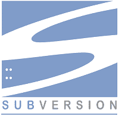
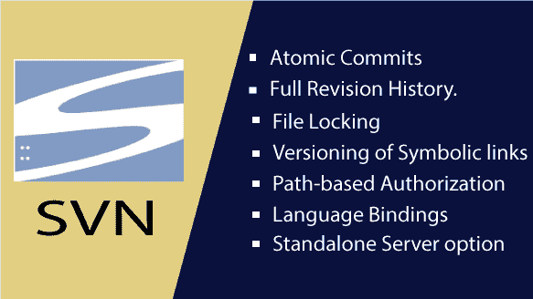
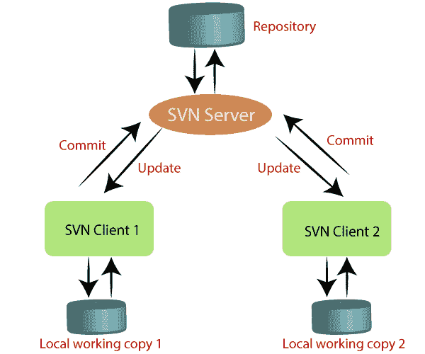

# SVN 教程

> 原文：<https://www.javatpoint.com/svn>

SVN 教程提供了 SVN 的基本和高级概念。我们的 SVN 教程是为初学者和专业人士设计的。

SVN 是一个开源的集中式版本控制系统，每个人都可以零成本使用。它旨在快速高效地处理小到大项目。它是为了协调程序员之间的工作而开发的。版本控制允许您在同一个工作区跟踪团队成员并与其一起工作。

本教程帮助您理解集中式版本控制系统。这些例子是在 windows 上完成的，但也应该适用于其他操作系统，如 Linux (Ubuntu)和 Mac。

## 什么是 SVN(颠覆)？

SVN 代表**颠覆**。它被称为 svn 是因为它的命令(它的命令名为 SVN)。这是一个**集中版本控制系统**。这是一个用于版本控制的**开源**工具。

SVN 用于管理当前和以前版本的文件，如源代码、文档和文件。它充当了开发人员的时间机器，允许他们返回并浏览项目的历史。

其他一些流行的版本控制系统，比如 [Git](https://www.javatpoint.com/git) 现在已经成为趋势，但是还有大量的项目还在 Subversion 上运行。

**Subversion** 是**开源**，隶属于 **Apache License** ，由**collabonet Inc .**于 2000 年开发。它的操作很像 CVS(并发版本系统)。2009 年，**阿帕奇孵化器**接受，将其打造为顶级阿帕奇产品。

## SVN 的特色

SVN 的特点如下:

*   它支持原子提交(要么发生，要么不发生)。
*   它保留了完整的修订历史。
*   它支持国际化程序消息。
*   它为不能合并的文件提供文件锁定。
*   它提供符号链接的版本控制。
*   它支持基于路径的授权。
*   它有一些编程语言的语言绑定，比如 C#、Perl、Ruby、PHP、Python 和 Java。
*   它有一个独立的服务器选项(svnserver)。

## SVN 的组成部分

SVN 有两个核心组成部分；它们如下:

*   SVN 服务器
*   SVN 客户端

这些组件可以被认为是网络服务器和网络浏览器。客户端充当浏览器，访问服务器上的数据。

**SVN 服务器:**

它是安装在用户机器上的工具。它可以将整个项目 CRS 存储或保存在集中式远程设备中。服务器对数据库中项目的中央主副本进行操作。

SVN 服务器的用法如下:

*   它为客户提供安全性。
*   它提供远程访问。
*   它通过 SVN 客户端-服务器提供对多个目的地的读写访问。
*   它可以存储需求的完整版本。

SVN 客户端:

它是安装在用户机器上与 SVN 服务器通信的工具。它提供了帮助并允许我们与服务器交互的界面。SVN 客户端是免费和开源的。

SVN 客户端的用法如下:

*   它与 SVN 服务器通信。
*   它提供远程和手动访问。
*   它提供了接口。
*   它是免费和开源的。

目前支持的客户端有**乌龟 SVN、Collabnet、**和**视觉 SVN** 客户端。

## 先决条件

SVN 不是编程语言，所以你不需要太担心基本知识。您对 Windows 命令有基本的了解。SVN 也是如此。

在 SVN，你将处理所有级别的基于编程的项目。因此，最好能接触一些软件开发生命周期(SDLC)和开发基于网络和非基于网络的应用的工作知识。

## 观众

我们为初学者和专业人士开发了这个 SVN 教程。我已经从头开始了这个教程。所以它会帮助你快速学习 SVN。

## 问题

我们向您保证，您在我们的 SVN 教程中不会发现任何困难。但是，如果你发现任何错误，你可以在我们的评论区发布。

* * *