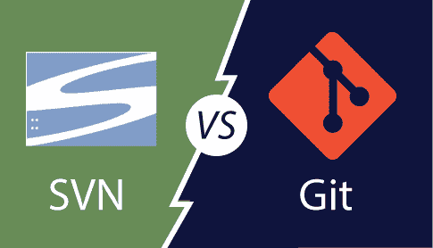

# SVN 与 SVN。去吧

> 哎哎哎:# t0]https://www . javatppoint . com/SVN-vs-git

Apache Subversion 或 SVN 是最受欢迎的**集中式版本控制系统**之一。现在，SVN 的受欢迎程度下降了，但仍有数百万个项目存储在其中。它可以继续由开源社区积极维护。在 SVN，您可以签出该存储库的单个版本。它将数据存储在中央服务器中。SVN 的缺点是，它在本地存储库中保存了整个历史，这限制了您。您只能进行提交、区分、日志、分支、合并、文件注释等操作。

而 Git 是一个流行的**分布式版本控制系统**，这意味着您可以克隆您的存储库，因此您可以获得该项目整个历史的完整副本。这意味着您可以访问您的所有提交。

Git 比 SVN 更有优势。对于那些不总是连接到主存储库的开发人员来说，这要好得多。而且，它比 SVN 快得多。

为了更好地理解 Git 和 Subversion 之间的区别，让我们来看看以下几个重要点。

| 版本控制 | 饭桶 |
| 这是一个集中式版本控制系统 | 这是一个分布式版本控制系统。 |
| 这是修订控制。 | Git 是一个 SCM(源代码管理)。 |
| 它不保存克隆的存储库。 | 它有一个克隆的存储库。 |
| SVN 的分支是存储库中的一个文件夹。合并分支需要一些特殊的命令。 | Git 分支工作起来很熟悉。Git 系统有助于快速合并文件，也有助于找到未合并的文件。 |
| 它有一个国际化的修订号。 | 它没有全局修订号。 |
| SVN 不包含任何加密散列的内容。 | 它具有加密散列的内容，可保护内容免受因网络问题或磁盘故障而导致的存储库损坏。 |
| SVN 将内容存储为文件。 | Git 将内容存储为元数据。 |
| SVN 的内容不如 Git 安全。 | Git 比 SVN 有更多的内容保护 |
| SVN 的内容不如 Git 安全。 | Git 比 SVN 有更多的内容保护。 |
| CollabNet 公司开发了 SVN。 | Linus Torvalds 为 Linux 内核开发了 git。 |
| SVN 是在开源许可下发布的。 | Git 是在 GNU(通用公共许可证)下分发的。 |

* * *