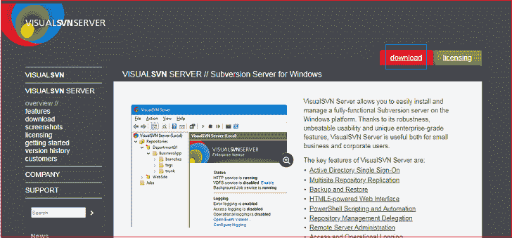
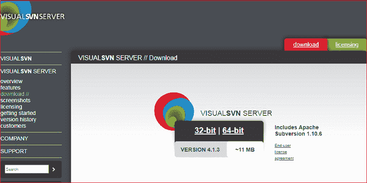
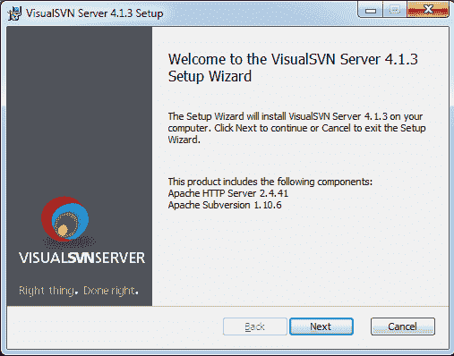
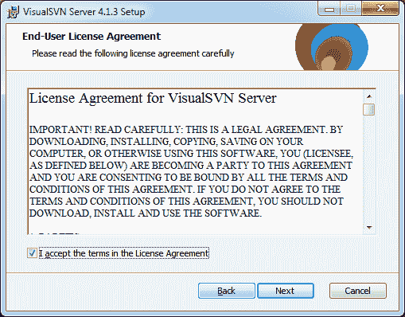
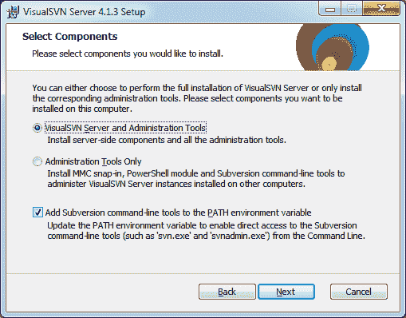
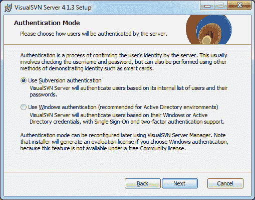
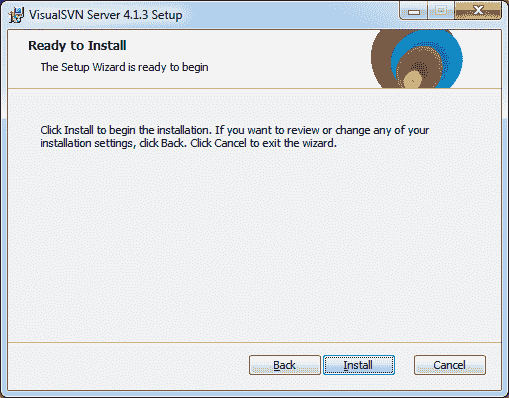

# Windows 上的 SVN 安装

> 原文：<https://www.javatpoint.com/svn-installation-for-windows>

为了合作使用 SVN 的项目，我们必须安装 SVN 客户端。subversion 是一款 Apache 产品。

所以，要完成 SVN 的安装，我们必须安装 SVN 服务器和 SVN 客户端。让我们看看如何为 windows 安装 SVN 服务器。

## 在 windows 上安装可视化服务器

视觉服务器已经完成了几乎 3M 的下载。这是在 Windows 平台上设置和维护 Apache Subversion 服务器最有利的方式。

VisualSVN Server 易于安装，因为它分布在单个软件包安装程序下。它包含最新版本所需的所有组件。在我们的机器上运行设置和配置 SVN 服务器很容易；这只是几个步骤。

根据社区许可证，VisualSVN 服务器是免费和开源的，可用于商业用途。这种类型的许可证不需要任何注册。它允许无限数量的存储库和最多 15 个用户。

让？让我们看看如何安装虚拟服务器。

要安装 VisualSVN 服务器，请下载安装包。要下载 VisualSVN 服务器，请访问官方 [VisualSVN 服务器](https://www.visualsvn.com/server/)。请考虑下图:

点击官方页面右上角的下载选项。在这个选项下，我们可以找到 32 位和 64 位的 windows 配置选项。请看下图:

点击我们需要的平台。它将开始下载安装程序文件。

运行安装程序文件。它将提示安装选项。点击**下一步**继续。

现在，它将要求我们提供最终用户许可协议。通过在给定的框上打勾接受条款和条件，然后单击下一步继续。

作为下一步，它将要求我们选择我们想要安装的组件。选择**可视化 SVN 服务器和管理工具**，然后点击**下一步**继续。请考虑下图:

现在，我们即将完成安装过程。在这一步中，我们必须选择系统文件和存储库的位置。浏览我们喜欢的位置，点击**下一步**继续安装。

下一步是身份验证模式。选择使用**颠覆认证**，点击**下一步**继续。

在这里，我们已经完成了安装 VisualSVN 所需的所有步骤。单击安装选项将其安装在我们的机器上。请看下图:

这里我们已经成功安装了 SVN 服务器。现在，我们将安装用于与 SVN 服务器通信的 SVN 客户端。我们将安装乌龟 SVN 进行客户端通信。

* * *