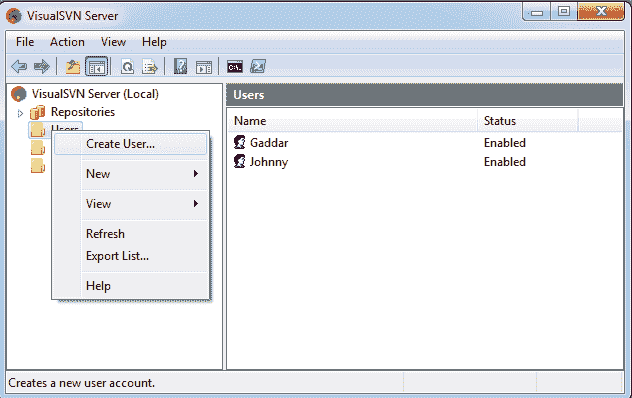
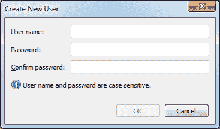
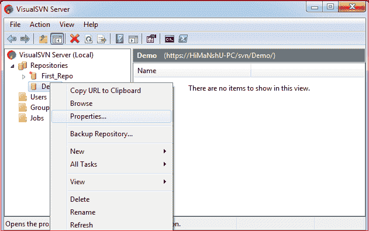
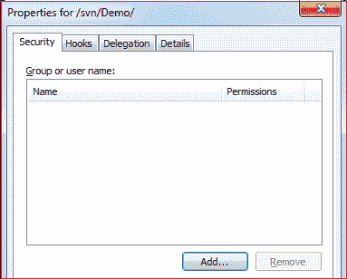
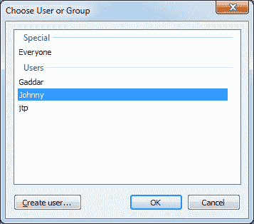
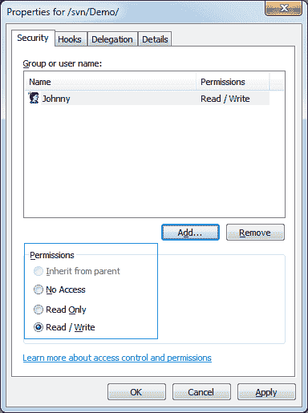

# 用户和访问权限

> 原文：<https://www.javatpoint.com/visualsvn-users-and-access-permission>

VisualSVN 服务器允许您设置对选定用户的访问权限。VisualSVN 服务器中的访问控制看起来类似于 Windows 文件系统。然而，有一些主要的差异给初学者造成了困难。

我们可以创建我们想要授予其访问 SVN 服务器的权限的用户。此外，我们可以为每个用户设置可访问性。

让我们看看如何创建用户并为他们设置可访问性。

要在 VisualSVN 服务器上创建用户，请打开 VIsualSVN 服务器管理器。右键单击**用户**选项，然后单击**创建用户。**考虑下图:

当我们单击创建用户选项时，将打开一个表单，我们可以在其中创建用户及其密码。请考虑下图:

我们可以在 VisualSVN 中创建多个用户。

让我们看看如何设置用户的读写权限。

## VisualSVN 中的访问权限

需要为私有存储库设置访问权限。如果我们想要共享一个私有存储库，我们必须授予该特定用户访问权限。要向特定用户提供对存储库的访问，右键单击我们想要共享的私有存储库。打开仓库的**属性**。请看下图:

在属性选项下，点击**添加**选项。

它将列出可用的用户。选择我们要共享存储库的用户。请看下图:

我们已经选择了用户**张诗钟**，现在设置可访问性。请看下图:

我们可以看到权限，并根据自己的需要进行选择。单击**应用**进行最后一次更改。

* * *