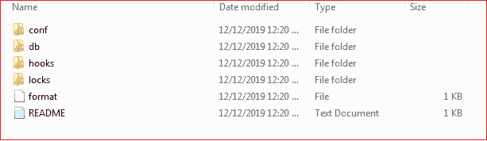
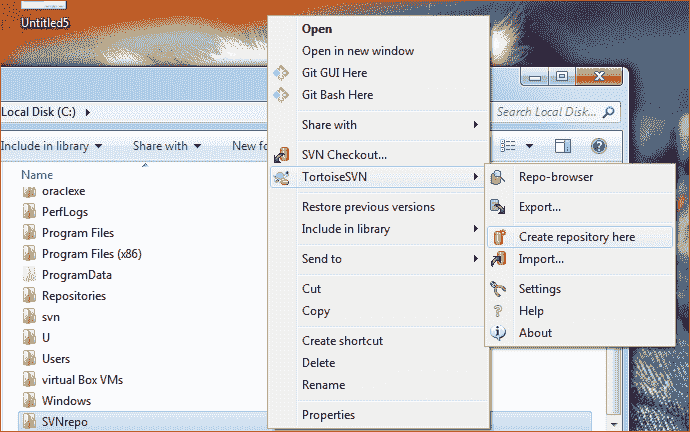
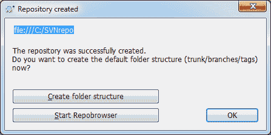
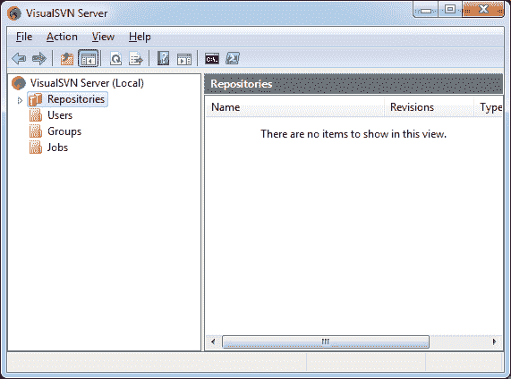
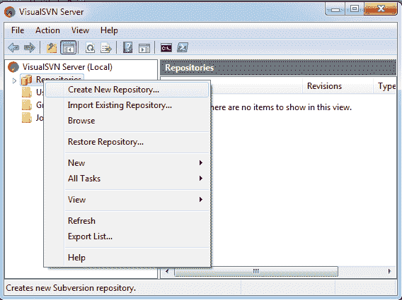
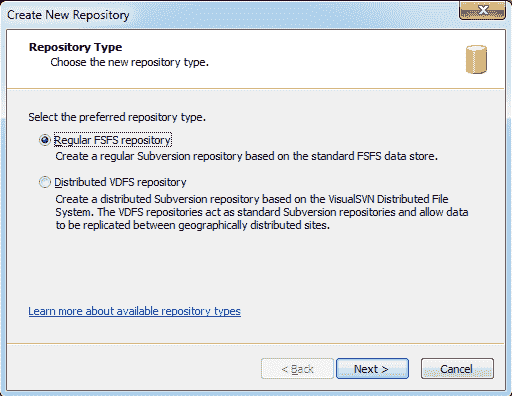
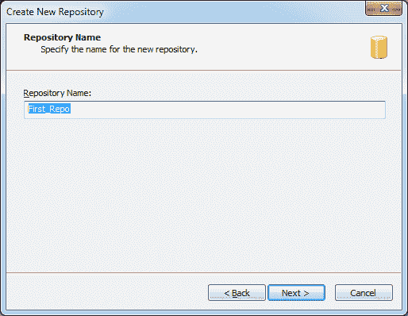
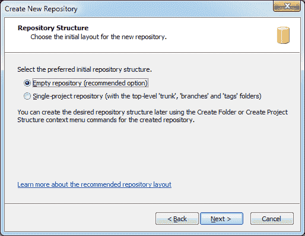
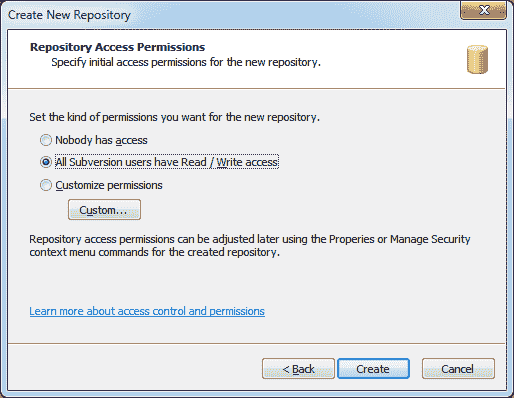
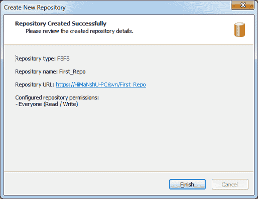

# SVN 知识库

> 原文：<https://www.javatpoint.com/svn-repository>

SVN 存储库是文件和目录的集合。这些文件和目录捆绑在一个特定的数据库中。SVN 还记录了所有修改这些文件的完整历史。

通常，SVN 存储库可以被认为是我们计算机上的一个文件夹或目录。这些存储库可能包含不同或相似类型文件的集合。SVN 存储库通常存储单个项目或相关项目集合的所有文件和目录。

## 使用命令行创建存储库

在 SVN 有很多方法可以创建存储库。我们还可以使用命令行创建一个存储库。

要使用命令行客户端创建 SVN 存储库，请执行以下步骤:

**步骤 1:** 创建一个名为 svn 的空文件夹(如 C:\svn\)。但是，我们可以用任何名称创建它。它被用作我们所有存储库的根。

**步骤 2:** 在 C:\svn\

**步骤 3:** 打开命令提示符，将目录更改为 D:\svn\newrepo，并键入以下命令:

```

svnadmin create --fs-type fsfs newrepo

```

现在我们已经创建了一个名为 **newrepo** 的新存储库，位于 **C:\svn\newrepo** 。考虑以下输出:


newrepo 存储库如下所示:



## 使用乌龟创建存储库

我们还可以使用 SVN 客户端创建一个存储库。要使用玳瑁创建存储库，请执行以下步骤:

**步骤 1:** 打开 windows 资源管理器，创建一个新文件夹并命名，例如 **SVNrepo** 。

**步骤 2:** 右键单击新创建的文件夹，并在此选择选项**陆龟→创建** **存储库**。请看下图:



已经创建了一个 SVN 存储库。现在，它会询问您默认的文件夹结构。请看下图:



选择**创建文件夹结构**选项。

在 SVNrepo 中创建了一个新的存储库。不要编辑默认存储库文件。如果它显示任何错误，请确保文件夹是空的并且没有写保护。

当陆龟创建一个存储库来识别本地存储库时，它会设置一个默认的文件夹图标。如果我们通过任何其他选项创建存储库，则不会分配此文件夹图标。

## 使用可视化服务器创建存储库

我们还可以使用 VisualSVN 服务器创建一个存储库。要创建存储库，请打开 **VisualSVN 服务器管理器**并导航至**存储库**选项。请考虑下图:



右键单击存储库选项以浏览存储库选项。在这里，我们可以找到许多选项，如创建、导入、浏览、恢复等。

点击**新建仓库**新建仓库。请考虑下图:



选择要创建的存储库类型。然后单击“下一步”继续。



现在，它将询问存储库名称。键入一个**存储库名称**，点击**下一步**继续。



在这一步中，选择存储库布局，无论您想要创建一个空的还是单项目的存储库。建议创建一个空的存储库，这样您就可以根据需要创建它。点击**下一步**继续。



我们即将创建我们的第一个存储库。在这一步中，我们将为新的存储库设置初始访问权限。请选择您想要的访问权限。但是，我们可以随时编辑它。点击**完成**完成流程。



现在，我们已经使用 VisualSVN 成功地创建了我们的存储库。



它将显示存储库类型、存储库名称、存储库 URL 和访问权限。

* * *