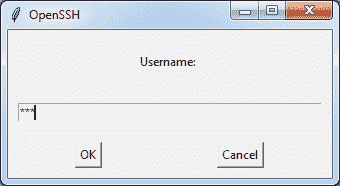
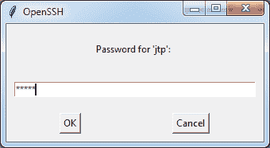
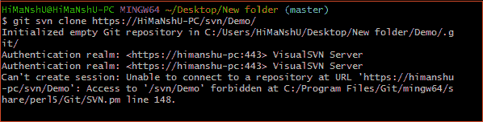

# SVN 到 Git 的迁移

> 原文：<https://www.javatpoint.com/svn-to-git-migration>

SVN 是一个流行的代码托管工具。它用于管理不同版本的文件，如源代码、文档等。它保存历史和项目数据。Subversion 是一个开源工具，属于 Apache 许可证。它的操作很像 CVS(并发版本系统)。

其他一些流行的版本控制系统，如 [Git](https://www.javatpoint.com/git) 现在已经成为趋势，但是许多项目仍然在 Subversion 上运行。

Git 是分布式版本控制系统的开源免费工具。它快速高效地处理项目。它用于协调程序员之间的工作。

如果你想把你的项目从 SVN 转移到 Git，这是一个直接的过程。您可以将 SVN 存储库作为 Git 存储库。在 Git 项目中，有许多技术可以迁移 SVN 项目。这里我们将讨论通过 Git 本机命令的迁移。

## 如何将一个项目从 SVN 迁移到 Git

要将项目从 SVN 转移到 Git，请执行以下步骤:

**步骤 1:打开 Git 存储库**

移动 SVN 项目的主要步骤是打开一个现有的 Git 存储库。如果没有 Git 存储库，创建一个新的。要创建存储库，请执行以下命令:

```

$ git init

```

上面的命令将初始化一个空的 Git 存储库。我们将在这里迁移 SVN 存储库。下一步是复制 SVN 存储库的网址。

**步骤 2:复制 SVN 知识库的网址**

在这一步中，我们将复制 SVN 存储库的网址。要复制回购网址，请打开 **SVN 服务器**管理器(在 VisualSVN 中为 VisualSVN 服务器管理器)。**右键单击存储库中的**，并选择回购网址的**副本。**

**步骤 3:运行“git svn 克隆”命令:**

要将 SVN 存储库克隆为 Git 存储库，请运行 **git svn 克隆**命令。它将按如下方式执行:

```

$ git svn clone <SVN repo URL>

```

上面的命令将创建 SVN 存储库的 Git 副本。它将提示 SVN 用户访问。请考虑下图:



填写用户名，然后单击“确定”继续。接下来，它会询问密码。输入密码。



单击**确定**开始复制 SVN 存储库。考虑以下输出。



上面的命令将在 Git 存储库中创建 SVN 项目的副本。现在我们可以将其发送到 Git 远程服务器。

要添加像 GitHub 这样的远程服务器，请运行以下命令:

```

$ git remote add origin <remote URL>

```

在上面的命令中，远程 URL 可以是任何 Git 服务 URL (GitHub 或 GitLab)。

现在，要在远程服务器上推送该项目，请运行以下命令:

```

$ git push origin master

```

因此，我们将一个 SVN 项目转移到了 Git。从 SVN 迁移到 Git 是一个很好的方法。但是这种方法有两个缺点。

*   这种方法不会为我们创建分支来推送到远程存储库。
*   这种方法不支持标签；我们必须将标签作为分支签出，然后从中创建一个标签。没有任何过程可以让我们将标签从 SVN 转移到 Git。

如果要克隆所有中继、标签和分支，请按如下方式运行命令:

```

$ git svn clone <SVN_URL> -T trunk -b branches -t tags

```

* * *