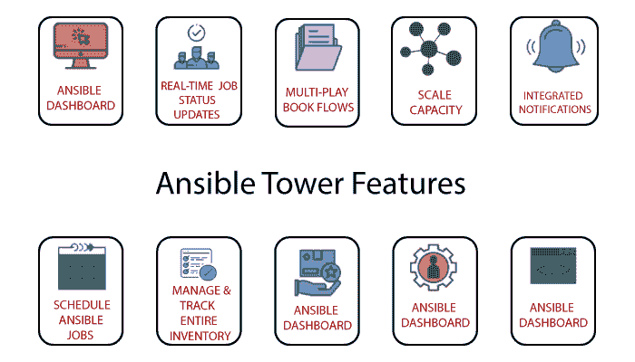

# 可折叠塔

> 原文：<https://www.javatpoint.com/ansible-tower>

Ansible Tower 更像是企业级的 Ansible。它是一个基于网络的解决方案，用于管理您的组织，具有简单的用户界面，提供了一个仪表板，其中包含所有主机的所有状态摘要。允许快速部署，并监控所有配置。

该塔允许我们共享 **SSH** 凭证而不暴露它们，记录所有作业，以图形方式管理库存，并将它们与各种云提供商同步。

此前，安易宝塔称之为 **AWX** 项目，就是解决这个问题的方法。尤其是那些呈现更好的图形输出，而不是基于文本的输出，如实时节点监控。

## 安装可拆卸塔架的先决条件

安装可拆卸塔架有以下先决条件，例如:

*   以下操作系统支持 Ansible Tower
    *   红帽企业版 Linux 6 64 位
    *   红帽企业版 Linux 7 64 位
    *   CentOS 6 64 位
    *   CentOS 7 64 位
    *   Ubuntu 12.04 lt 64 位
    *   Ubuntu 14.04 lt 64 位
    *   Ubuntu 16.04 lt 64 位
*   你应该有 Ansible 的最新稳定版本。
*   它需要 64 位支持内核、运行时和 20 GB 硬盘。
*   至少需要 2 GB 内存(建议使用 4 GB 内存)。
    *   建议游民试用安装至少 2 GB 内存
    *   并且推荐 4 GB 内存/100 个叉子

## 可平移的塔特征

以下是 Ansible Tower 的一些特性，例如:

**1。Ansible 塔式仪表板:**它显示您的 Ansible 环境中正在发生的一切，例如库存状态、最近的作业活动、主机等。

**2。多行动手册工作流程:**它允许链接任意数量的行动手册、任意方式的不同库存使用、运行不同的用户或利用各种凭证。

**3。实时作业更新:** Ansible 可以自动化整个基础架构。此外，您还可以看到实时作业更新，如按每台机器细分的播放和任务，这些更新是成功的还是失败的。因此，您可以看到自动化的状态，并知道队列中的下一步是什么。

**4。通过集群扩展容量:**随着集群增加冗余和容量，您可以将多个可扩展塔式节点连接到一个可扩展塔式集群中，这允许在整个企业范围内扩展可扩展自动化。

**5。自助服务:**您只需点击一下此功能，即可推出行动手册。

**6。远程命令执行:**使用此命令，您可以在清单中的任何主机或主机组上运行简单的任务，例如重新启动任何出现故障的服务、添加用户、重置密码。

**7。管理和跟踪库存:**它通过从公共云提供商(如微软 Azure、亚马逊网络服务等)提取库存来管理您的整个基础架构。

**8。集成通知:**当一个作业在整个组织中同时成功或失败时，或者在作业前进行定制时，它会通知您。

**9。调度可执行作业:**它根据需要调度不同类型的作业，如剧本运行、云库存更新和源代码管理更新。

**10。REST API 和 Tower CLI 工具:**Ansible Tower 中存在的每个功能都可以通过 ansi ble Tower 的 REST API 获得，REST API 为系统管理基础架构提供了理想的 API。Ansible Tower 的命令行界面工具可用于从詹金斯等配置项系统启动作业，或者当您需要与其他命令行工具集成时。

* * *