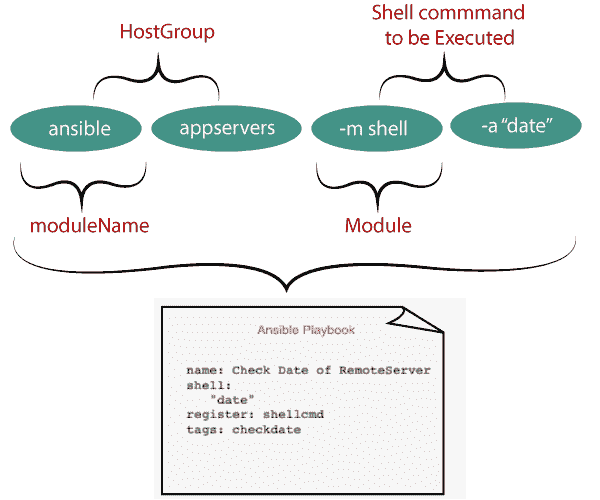
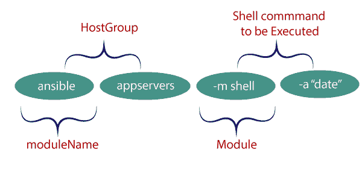

# 可折叠外壳

> 原文：<https://www.javatpoint.com/ansible-shell>

Ansible shell 模块旨在针对基于 UNIX 的目标主机执行 shell 命令。Ansible 可以运行，除了任何高复杂命令与管道，重定向。您还可以使用 Ansible 外壳模块执行外壳脚本。

Ansible shell 的主要优点是，除了任何带有管道和分号的高度复杂的命令之外，从安全性的角度来看，这可能是一个缺点，因为一个错误就可能花费很多，并破坏系统的完整性。

*   Ansible shell 模块设计为仅适用于基于 LINUX 的机器，不适用于 windows。对于窗口，应该使用 **win_shell**
*   Ansible shell 模块可用于执行 shell 脚本。Ansible 有一个名为 script 的专用模块，用于将 shell 脚本从控制机器复制到远程服务器。

让我们看看如何在行动手册和 Adhoc 中使用 Ansible shell 模块的语法:

### 剧本中可解释外壳模块的语法

剧本的美在于它的外观和写作方式。剧本是在 YAML 写的，所以很容易理解。

下图展示了一个即席命令如何转变为一个可执行剧本。



### Adhoc 中可转换外壳模块的语法

下图以即席方式显示了 Ansible 外壳模块的快速语法。



### 例子

使用 Shell 或命令模块在单个任务中执行单个命令。假设您想要获取远程服务器的日期。远程服务器位于名为 testservers 的主机组下。

**步骤 1:** 登录到 Ansible 服务器。

**步骤 2:** 下面是在远程主机中使用 Shell 模块执行单个命令的示例。

```

---
-name: Shell command example 
Hosts: testservers
tasks:
-name: check date with the shell command
shell:
"date"
register: datecmd
tags: datecmd
-debug: msg= "{{datecmd.stdout}}"

```

在上面的例子中，我们针对名为 **testservers** 的主机组运行我们的剧本，并执行一个简单的日期命令，并将该命令的输出保存到名为 **datecmd** 的 **Register** 变量中。

在最后一行，我们检索注册的变量，并且只打印存储在 **datecmd** 的 **stdout** 属性中的日期命令输出。

### 示例 2:在一个外壳中执行多个命令:

外壳可以在一次外壳播放中一起接受各种命令。此外，您可以使用 Ansible shell 模块编写 shell 脚本。

在下面的例子中，我们对一些 shell 命令进行了分组，以执行受控的干净的 tomcat 重启。

行动手册旨在按顺序执行以下步骤，例如:

*   停止 tomcatServer
*   清除缓存
*   截断日志文件
*   启动实例

```

---
  - name: Shell Examples
    hosts: testservers
    tasks:
    - name: Clear Cache and Restart tomcat
      become: yes
      delay: 10
      async: 10
      poll: 50
      shell: |
        echo -e "\n Change directory to the Tomcat"
        cd tomcat8/
        echo -e "\n Present working directory is" `pwd`

        echo -e "\n Stopping the tomcat instance"
        bin/shutdown.sh
        echo -e "\n Clearning the tmp and work directory of tomcat"
        rm -rfv tmp/*
        rm -rfv work/*
        echo -e "\nTruncate the log file"
        > logs/catalina.out
        echo -e "\nDirectory listing"
        ls -lrtd logs/catalina.out
        echo -e "\nStarting the instance"
        bin/startup.sh    
      args:
        chdir: "/apps/tomcat/"
      register: fileout
      tags: fileout 
    - debug: msg="{{ fileout.stdout_lines }}"

```

* * *