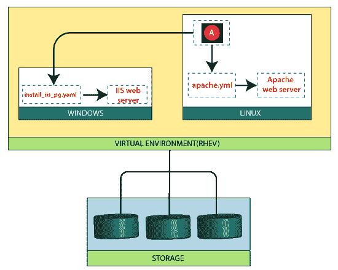

# 可折叠窗户

> 原文：<https://www.javatpoint.com/ansible-windows>

使用 Ansible 管理 Windows，许多适用于 Unix/Linux 主机的语法和规则也适用于 Windows。尽管如此，在路径分隔符和特定于操作系统的任务等组件方面还是有一些差异。本文档涵盖了使用 Ansible for Windows 的具体细节。

## 它是如何工作的

默认情况下，Ansible 使用 SSH 管理 Linux/Unix 机器。

从 1.7 版本开始，Ansible 包含对管理 Windows 机器的支持。这使用本机 PowerShell 远程处理，而不是 SSH。

Ansible 仍将从 Linux 控制机器上运行，并使用“winrm”Python 模块与远程主机对话。虽然不被微软或 Ansible 支持，但这款 Linux 控制机可以是一个 Windows 子系统 for Linux (WSL) bash shell。

Ansible 不需要在远程机器上安装额外的软件来管理它们，并且它仍然保持无代理属性，这使得它在 Linux/Unix 上很受欢迎。

请注意，对 Ansible 有一个基本的了解是很重要的，所以如果你没有先写一个 Linux 剧本，可能对你来说很难。

## 像 Linux 一样的 Linux，像 Windows 一样的 Windows

用户更喜欢 Ansible，它是一种简单、无代理、功能强大的自动化工具，允许他们跨其 IT 基础架构建模和交付任何配置、部署和环境。

Ansible 知道，关键是将同样简单、无代理的范例引入到管理 Windows 中，同时仍然让 Windows 管理员感到自己是本地的。Ansible 本机 Windows 支持使用 Windows PowerShell 远程处理来管理类似 Windows 的 Windows，其方式与 Ansible 管理类似 Linux 的 Linux 的方式相同。

通过 Ansible 的本机窗口支持:

*   在 Windows 主机上收集事实
*   安装和卸载 MSIs
*   启用和禁用窗口功能
*   启动、停止和管理 Windows 服务
*   创建和管理本地用户和组
*   通过巧克力包管理器管理 Windows 包
*   管理和安装 Windows 更新
*   从远程站点获取文件
*   推送并执行您编写的任何 PowerShell 脚本

您可以使用本地或域用户连接和自动化 Windows，并且您将能够使用 Windows“runas”支持以管理员身份执行操作，就像 Linux 上的“sudo”或“su”一样。

你可以用 Ansible 的易扩展性在 PowerShell 中编写你的模块。并扩展 Ansible 以实现您需要的任何其他功能。Ansible 用户已经编写了管理文件系统 ACL、管理 Windows 防火墙、管理主机名、域成员资格等模块。

* * *