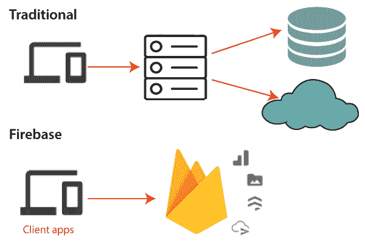
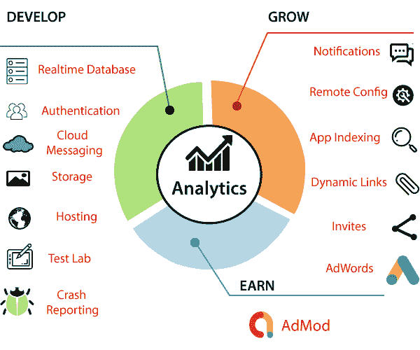
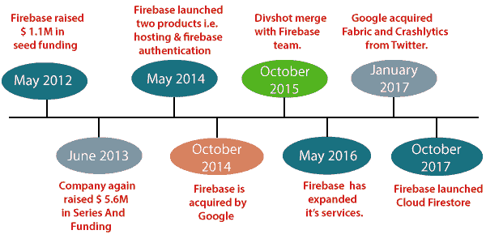

# 介绍

> 原文：<https://www.javatpoint.com/firebase-introduction>

在快速原型时代，我们可以得到很好的想法，但有时如果花费太多精力，这些想法就不适用了。通常，后端是限制因素——由于缺乏知识或时间，许多考虑从来不适用于服务器端编码。

Firebase 是一个后端即服务(BaaS)，它是从 YC11 启动开始的。它成长为谷歌云平台上的下一代应用开发平台。Firebase(一个 NoSQLjSON 数据库)是一个实时数据库，允许以树的形式存储对象列表。我们可以在不同的设备之间同步数据。

谷歌 Firebase 是谷歌支持的应用开发软件，允许开发者开发**安卓、IOS、**和**网络应用**。为了报告和修复应用崩溃，跟踪分析，创建营销和产品实验，firebase 提供了几个工具。

Firebase 有三个主要服务，即实时数据库、用户身份验证和托管。我们可以在 Firebase iOS SDK 的帮助下使用这些服务来创建应用程序，而无需编写任何服务器代码。

## Firebase地的历史

**Firebase**由**进化而来**。Envolve 是由**詹姆斯·坦普林**和**安德鲁·李**于 2011 年创立的一家初创公司。Envolve 为开发人员提供了一个允许将在线聊天功能集成到他们的网站中的应用编程接口。在发布聊天服务后，它发现 envlove 被用来传递应用程序数据，这些数据不是聊天消息。开发人员使用 Envolve 来同步应用程序，以分离实时架构和为其提供动力的聊天系统。2011 年 9 月，塔普林和李作为一家独立公司成立了 firebase。最后一次向公众推出是在 2012 年 4 月。

Firebase 实时数据库是 firebase 的第一个产品。这是一个跨安卓、iOS 和网络设备同步应用数据的应用编程接口。它存储在 Firebase 的云上。然后 firebase 实时数据库帮助开发人员构建实时的协作应用程序。

*   2012 年 5 月，在推出测试版后，Firebase 从 Greylock Partners、风险投资家 Flybridge Capital Partners、New Enterprise Associates 和方正集体筹集了 110 万美元的种子资金。
*   2013 年 6 月，该公司再次从 Flybridge Capital 和风险投资家 Union Square Ventures 筹集了 560 万美元的 A 系列融资。
*   Firebase 在 2014 年推出了两款产品，分别是 Firebase 托管和 Firebase 认证。它将公司定位为移动后端即服务。
*   Firebase 于 2014 年 10 月被谷歌收购。
*   2015 年 10 月，谷歌推动 Divshot 与 Firebase 团队合并。
*   2016 年 5 月，Firebase 扩大服务范围，成为移动开发者的统一平台。现在，它已经与其他各种谷歌服务集成，包括 AdMob、谷歌云平台和谷歌广告，为开发者提供更广泛的产品和规模。
*   谷歌在 2017 年 1 月从推特上收购了 Fabric 和 Crashlytics，为 Firebase 增加 Fabric 和 Crashlytics 服务。
*   Firebase 于 2017 年 10 月推出了 Cloud Firestore。它是一个实时文档数据库，是原始 Firebase 实时数据库的后续产品。

## 为什么要用 Firebase？

*   Firebase 管理数据库中的实时数据。因此，它可以方便快捷地与数据库交换数据。因此，用于开发移动应用，如直播、聊天消息等。，我们可以使用 Firebase。
*   Firebase 允许在所有设备(iOS、安卓和网络)之间同步实时数据，而无需刷新屏幕。
*   Firebase 提供与谷歌广告、AdMob、数据工作室、BigQuery 双击、Play Store 和 Slack 的集成，以高效、准确的管理和维护来开发我们的应用程序。
*   从数据库、分析到崩溃报告的一切都包含在 Firebase 中。因此，应用开发团队可以专注于改善用户体验。
*   Firebase 应用程序可以通过到 firebase 服务器的安全连接进行部署。
*   Firebase 提供了一个简单的控制面板。
*   它提供了许多有用的服务可供选择。

## Firebase 的优缺点

Firebase 有很多优点。除了优点，它也有缺点。让我们来看看这些优点和缺点:

### 赞成的意见

*   Firebase 是一个实时数据库。
*   它具有巨大的存储容量潜力。
*   Firebase 是无服务器的。
*   它非常安全。
*   它是最先进的托管 BaaS 解决方案。
*   它的设置很少。
*   它通过角火提供三向数据绑定。
*   它提供了简单的应用程序状态序列化。
*   我们可以轻松地访问数据、文件、授权等。
*   用数据驱动应用程序不需要服务器基础设施。
*   它有 JSON 存储，这意味着数据和对象之间没有障碍。

### 骗局

*   Firebase 没有被广泛使用，也没有经过企业的考验。
*   它的查询和索引非常有限。
*   它不提供聚合。
*   它没有地图缩小功能。
*   它不能查询或列出用户或存储的文件。

* * *