# Android Studio

> 哎哎哎:# t0]https://www . javatppoint . com/fire base-Android 工作室

安卓工作室是一个用于开发安卓应用的 IDE，由谷歌官方支持。它基于 **IntelliJ IDEA** 提供了强大的代码编辑器和开发工具。它是谷歌安卓平台的集成开发环境。

安卓工作室使用基于 Gradle 的构建系统、仿真器、代码模板和 Github 集成来支持安卓操作系统中的应用开发。安卓工作室中的每个项目都有一个或多个带有源代码和资源文件的模式。这些模式包括库模块、安卓应用模块和谷歌应用引擎模块。

## 下载安卓工作室

安卓工作室适用于视窗、苹果 OS X 和 Linux 平台。我们将从安卓工作室主页下载安卓工作室。在这里，我们还会发现带有安卓工作室命令行工具的传统 SDK。

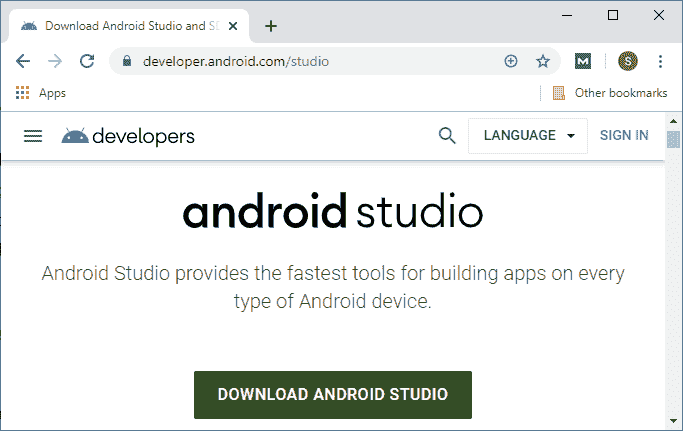

让我们看看安装安卓工作室的要求是什么:

### Windows 要求

*   您的系统中必须有 32 位或 64 位的微软视窗 7/8/10。
*   最低应该有 3 GB 内存，推荐 8 GB 内存。
*   至少应有 2 GB 的可用磁盘空间，建议为 4 GB。
*   最低屏幕分辨率应为 1200 * 800。

**在 Windows 10(64 位)上安装 Android Studio**

现在，我们将通过启动下载的开始安装安卓工作室。exe 文件。当我们推出这个。exe 文件，它呈现了 Android Studio 设置对话框。

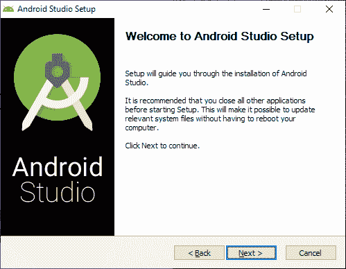

当我们点击下一步时，它会显示一个新的面板，提供拒绝和安装安卓虚拟设备的选项。

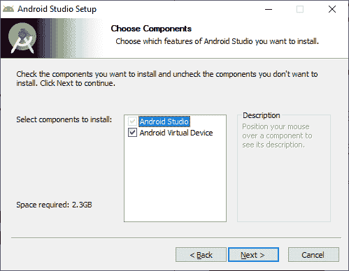

当我们点击下一步时，我们将跳转到配置设置面板，在其中我们设置安装安卓工作室的位置。

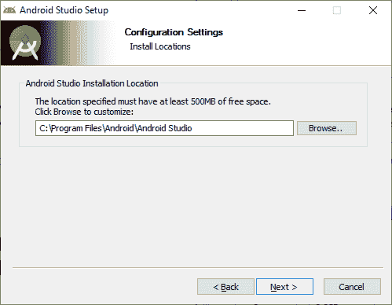

点击下一步，我们将看到选择开始菜单文件夹。

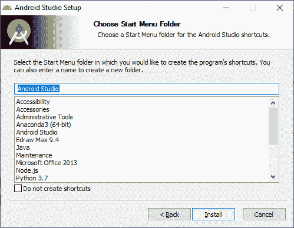

当我们点击安装，然后安装将开始。

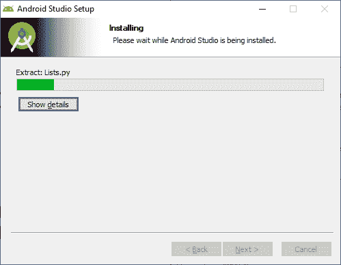
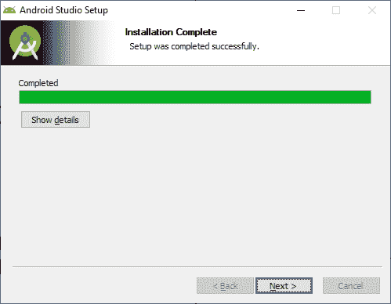
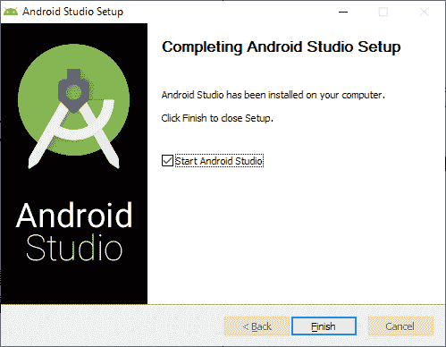

## 开始新项目

我们通过点击**创建一个新的项目，从**开始一个新的安卓工作室项目**，欢迎来到安卓工作室**对话框。

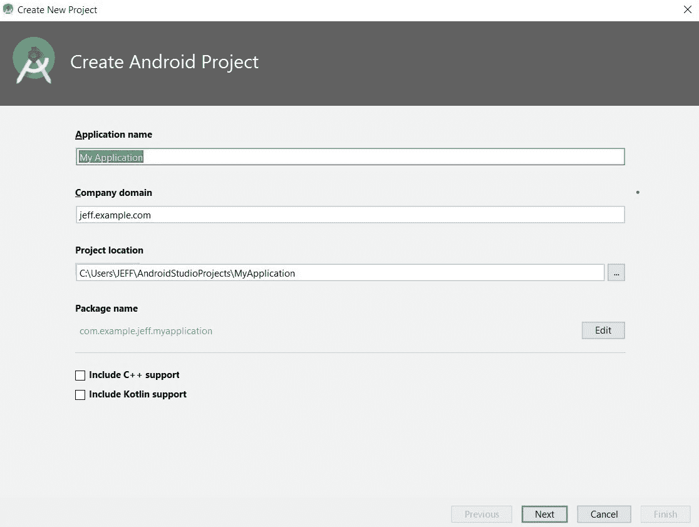
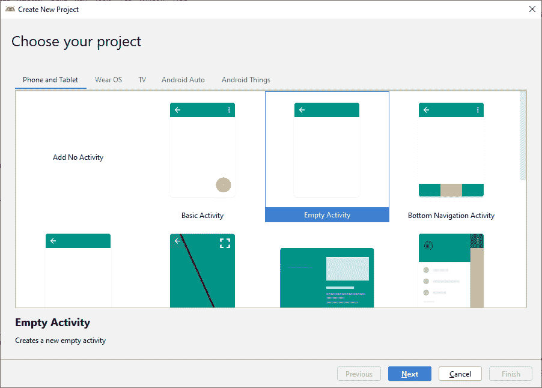
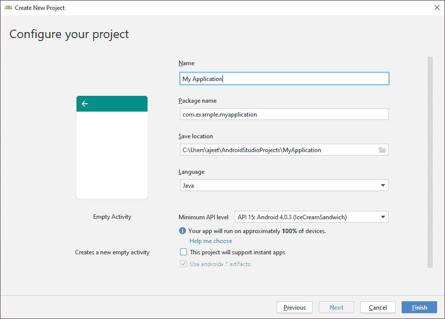
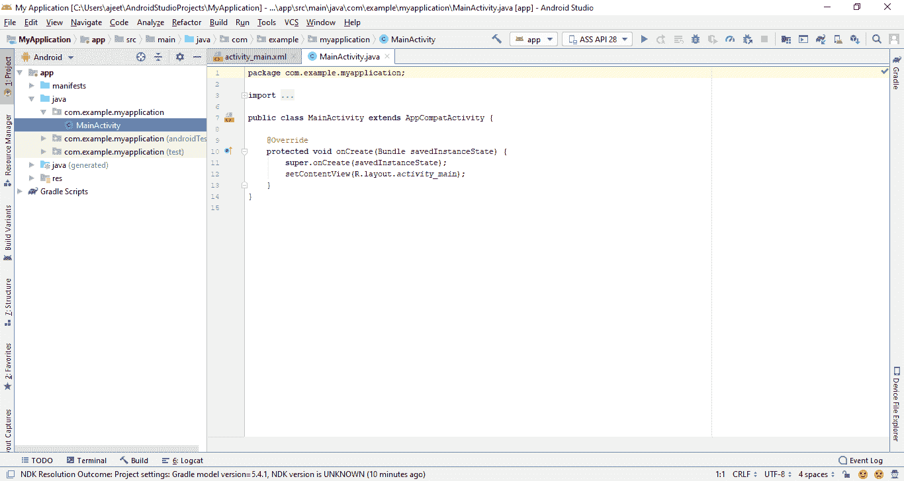

* * *