# 将 Firebase 添加到应用程序

> 原文：<https://www.javatpoint.com/adding-firebase-to-app>

Firebase 是为移动应用程序开发的。安卓工作室是开发安卓应用的最佳平台。Firebase 是一个后端即服务，它允许我们以树的形式存储对象列表。

要将数据存储到 Firebase 中，我们首先必须将 Firebase 添加到我们的安卓应用程序中。在将 Firebase 添加到我们的安卓应用程序之前，我们需要了解一些先决条件。这些必要条件如下:

*   它要求我们应该有一个谷歌帐户与 Firebase 合作。
*   我们还需要一个运行在安卓 4.0 或更新版本上的设备或模拟器。
*   我们还要求安卓工作室的最新版本，即 1.5 版或更高版本。
*   该应用程序必须使用 Gradle 4.1 或更高版本。

有两种方法可以将 Firebase 添加到我们的应用程序中:

1.  一个是通过 Firebase 助手，这是安卓工作室里面一个不错的小向导。它将连接我们现有的项目或为我们创建一个新的项目，并自动安装任何必要的渐变依赖。它需要一些额外的配置。
2.  第二个是，我们可以通过 Firebase 控制台手动将 Firebase 添加到我们的安卓应用程序中。这是向我们的应用程序添加 Firebase 的推荐方式。

让我们开始了解如何将 Firebase 手动添加到我们的安卓应用程序中:

**第一步:**

在第一步中，我们必须使用以下链接进入 firebase 控制台[https://firebase.google.com/](https://firebase.google.com/)

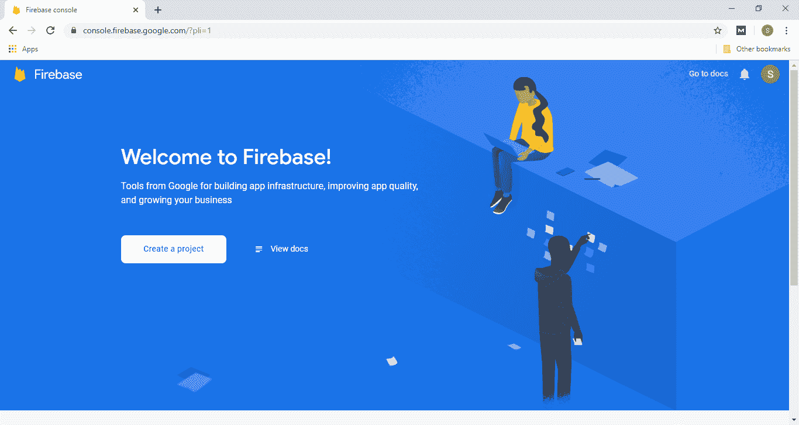

**第二步:**

现在，我们首先要创建一个 Firebase 项目。Firebase 项目将通过并描述它是什么。这让我们可以添加一个应用程序，该项目可以有许多项目内的 Firebase。

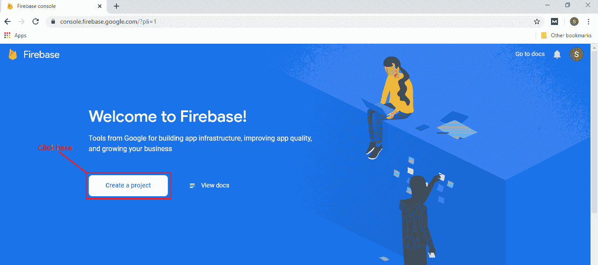

**第三步:**

现在，我们必须给出项目的名称和 id，为项目启用谷歌分析，设置分析位置，并接受所有条款和条件。Firebase 控制台自动为项目创建一个唯一的 id。

**1)给项目命名**

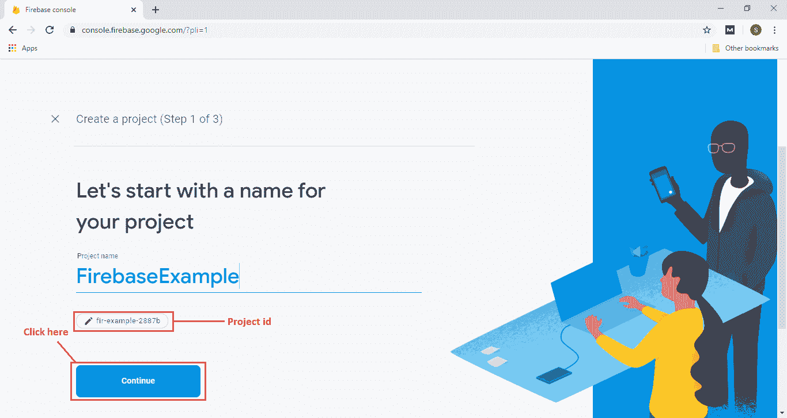

**2)为项目启用谷歌分析**

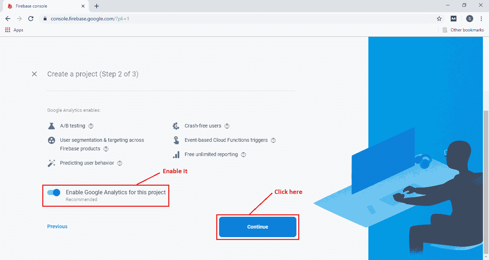

**3)设置分析位置并接受条款和条件**

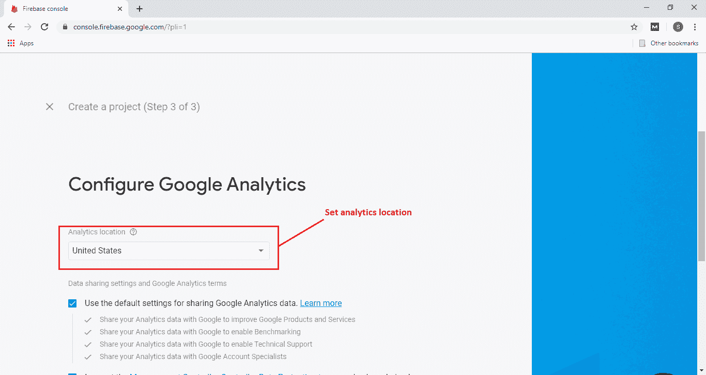
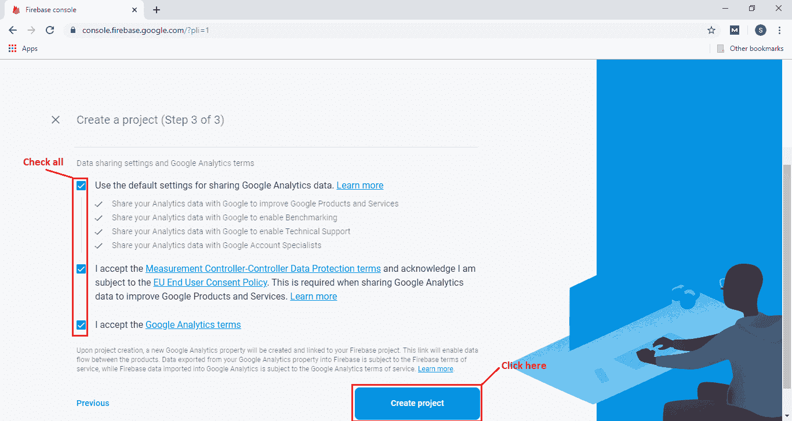

当我们点击创建项目时，Firebase 项目的创建就开始了，一旦我们的项目被创建，我们就必须点击继续进入我们的项目。

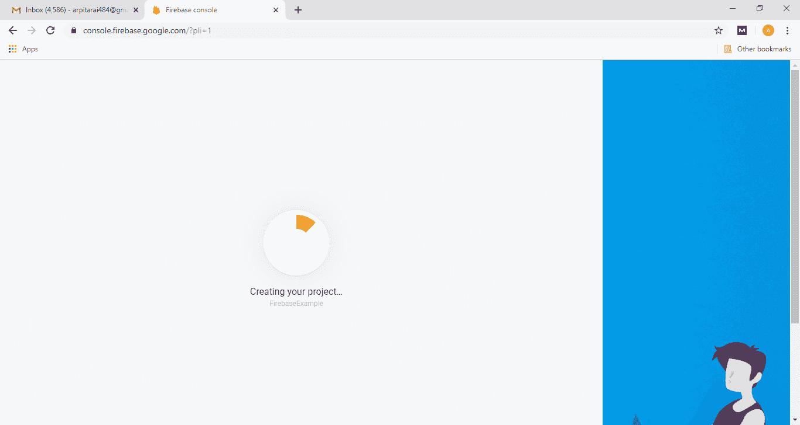
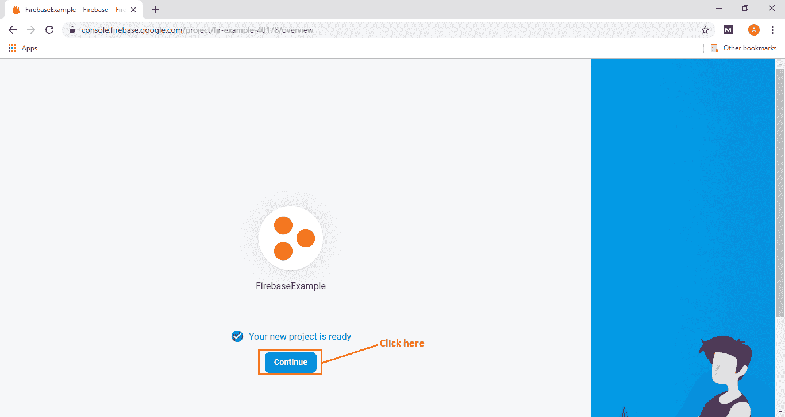

**第四步:**

在下一步中，我们必须选择将 Firebase 添加到我们的应用程序中的平台。平台可以是安卓、iOS、网络和统一。

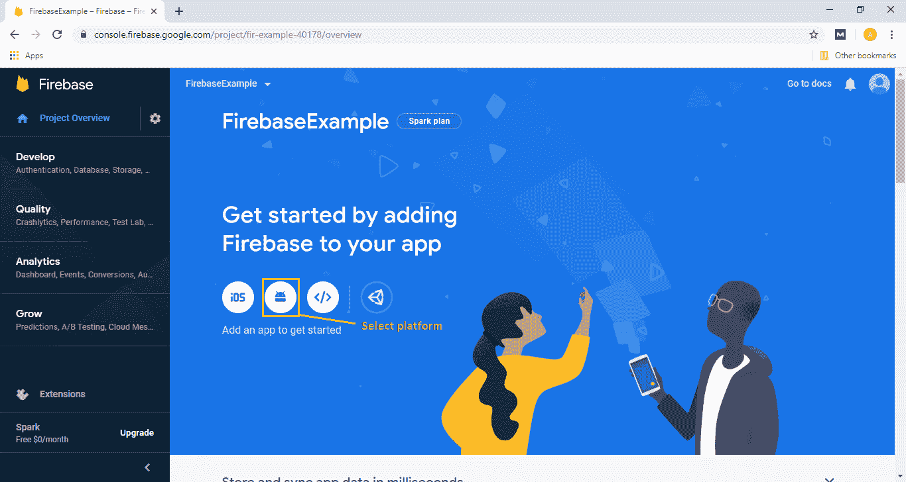
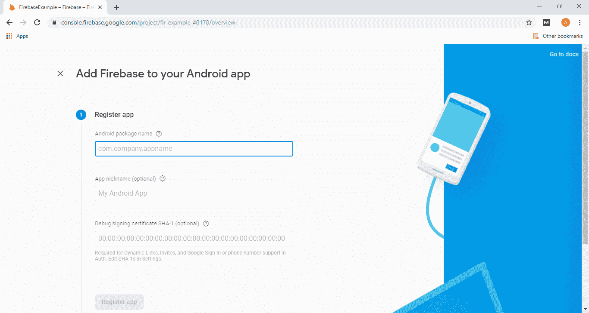

**第五步:**

下一步，我们要提到包名，包名是必不可少的重要东西。包名应该与我们的安卓应用包名相匹配。我们可以在任何一个 Java 类或清单文件中找到我们应用程序的包名。

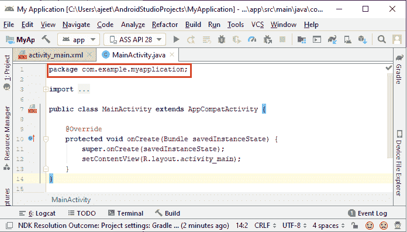

**第六步:**

在下一步中，我们将为我们的应用程序赋予一个昵称。这是一个可选字段。SHA-1 还有另一个可选字段，这是某些功能所必需的。我们可以通过点击**签署报告**找到 SHA-1。

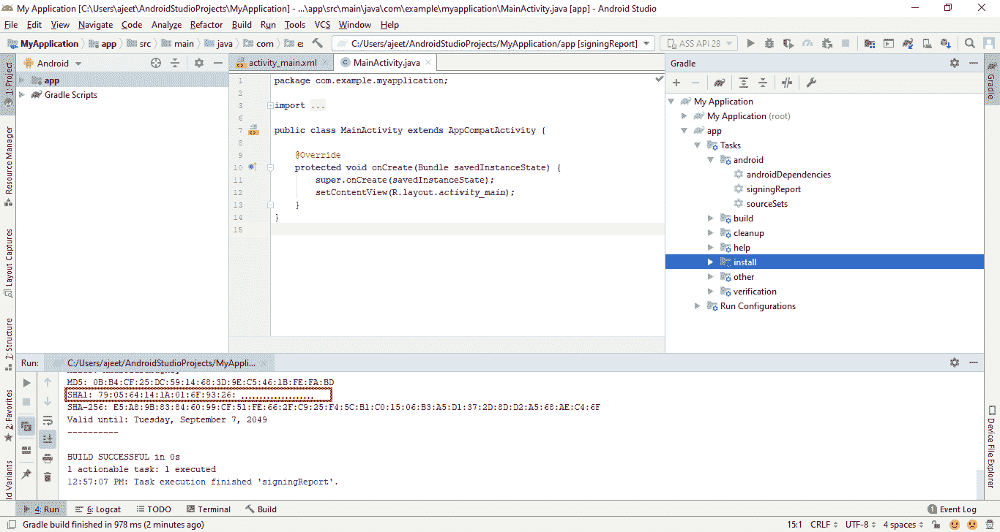
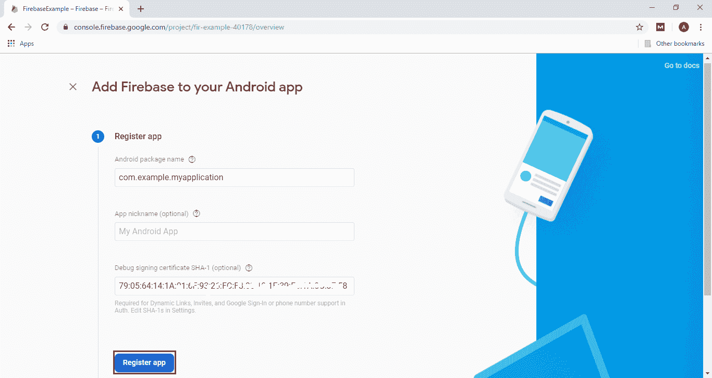

当我们点击**注册应用**时，我们将进入下一个字段，即**下载配置文件**。

**第七步:**

这是最重要的步骤之一。在这一步中，我们必须下载 google-services.json 文件。这个文件是由 Firebase 提供的，让我们可以将它放在应用程序的应用程序文件夹中。这是我们的应用程序连接 Firebase 所需的必要文件。

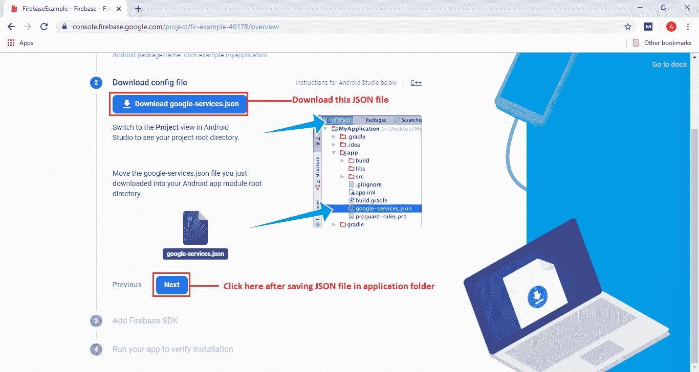
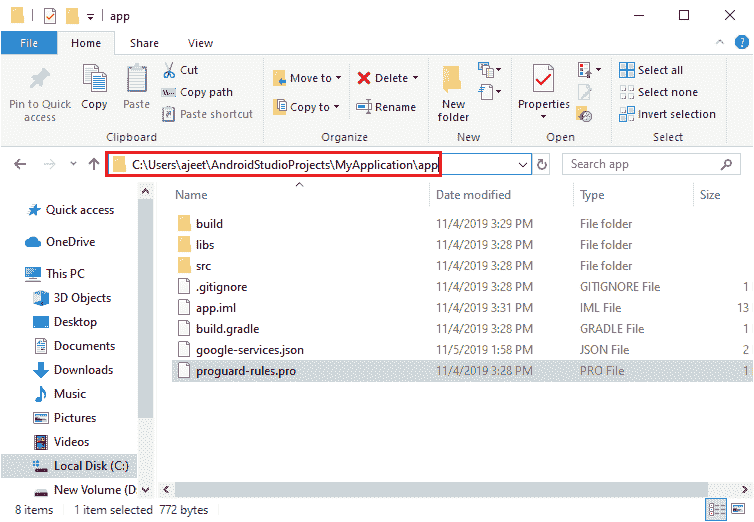

当我们点击下一步时，我们将切换到下一个字段，即添加 **Firebase SDK** 。

**第八步:**

在下一步中，我们将添加 Firebase SDK。这是在安卓工作室内部完成的。我们必须修改构建。用下面几行代码在项目中创建一次 Gradle 文件。

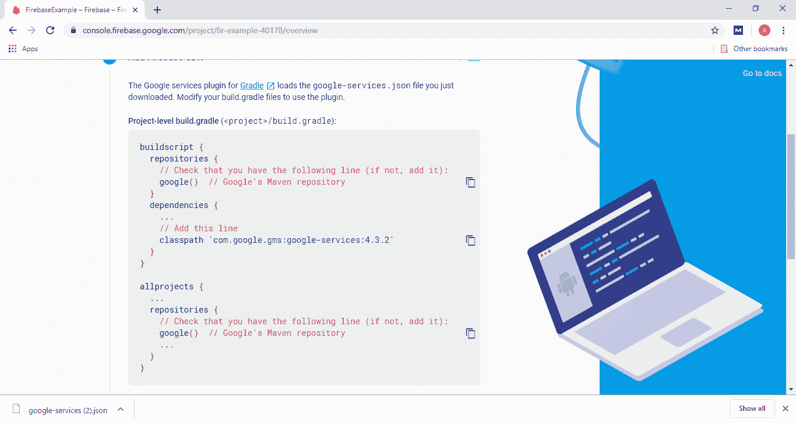
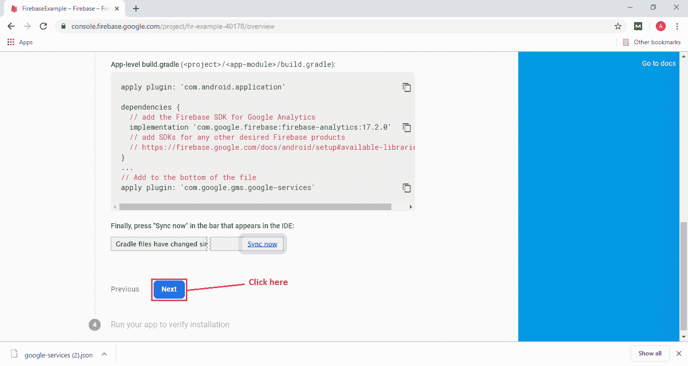

我们将跳过四个字段，即**运行您的应用程序来验证安装**。

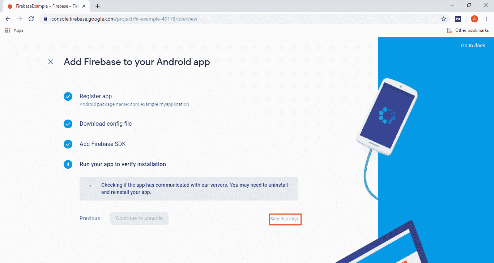

点击跳过后，我们将切换到概览页面，在那里我们可以看到我们的应用程序。

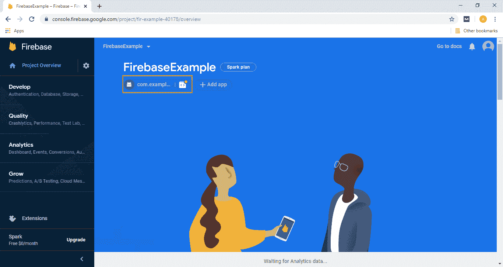

当我们的应用程序在设备上运行时，我们将检查 Firebase 控制台，以确保我们的应用程序是否与 Firebase 通信。

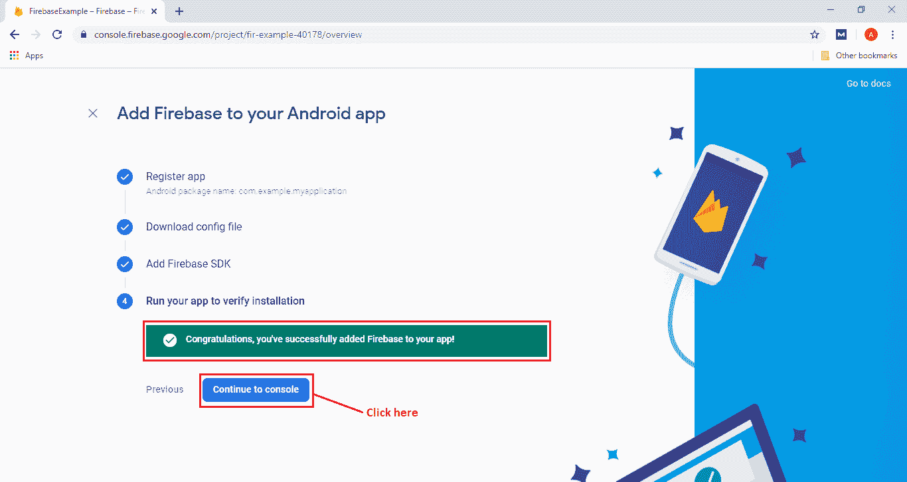

* * *