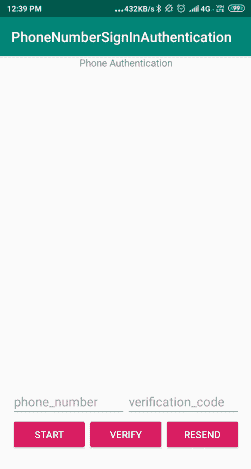
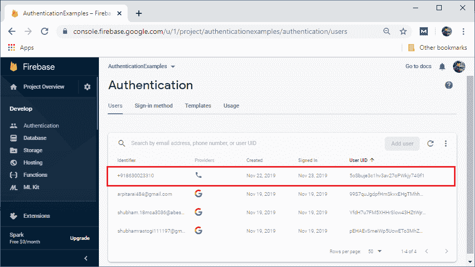

# 使用电话号码的登录身份验证

> 原文：<https://www.javatpoint.com/sign-in-authentication-using-phone-number>

电话号码身份验证是最后一种登录方法，我们将在身份验证部分讨论。许多组织广泛使用这些身份验证方法。

我们可以通过向登录用户的手机发送一条文本消息来使用 Firebase 身份验证。

用户将使用他们在消息框中收到的一次性代码登录。

我们将通过整个流程来验证它，并为此编写所有代码。对于使用电话号码的登录身份验证，我们也可以使用 Firebase UI，我们之前已经讨论过了。

开始的步骤是一样的，比如创建一个 firebase 项目，创建一个 Android Studio 项目，将 Firebase 添加到我们的 Android 应用程序中，添加 firebase-auth 和 firebase-core 依赖项，添加 SHA-1 和 SHA-256 密钥，添加 JSON 文件，以及应用插件。接下来的步骤是在 Firebase 控制台中启用电话号码身份验证。完成这些初步步骤后，我们必须执行以下步骤:

**第一步:**

现在，我们将在清单文件中添加使用互联网的权限。

**第二步:**

现在，我们将修改我们的‘activity _ main . XML’文件来进行电话号码验证。布局设计如下:



**第三步:**

现在，我们将为电话号码验证编码。我们将修改我们的“MainActivity.java”文件。下面是电话号码认证的代码。

```

//Implementing onClickListener
public class MainActivity extends AppCompatActivity implements View.OnClickListener {

    private static final String TAG = "PhoneAuthActivity";

    //Adding a member variable for the key verification in progress
    private static final String KEY_VERIFY_IN_PROGRESS = "key_verify_in_progress";

    //Creating FirebaseAuth member variable
    private FirebaseAuth mAuth;

    //Adding a bunch of member variables for view groups, edit text, and buttons.
    private ViewGroup mPhoneNumberViews;
    private ViewGroup mSignedInViews;

    private EditText mPhoneNumberField;
    private EditText mVerificationField;

    private Button mStartButton;
    private Button mVerifyButton;
    private Button mResendButton;
    private Button mSignOutButton;

    //Setting Boolean to say whether or not we are in progress. 
    private boolean mVerificationInProgress = false;

    //Adding verification id as a member variable. 
    private String mVerificationId;

    //Adding a member variable for PhoneAuthProvider.ForceResendingToken callback. 
    private PhoneAuthProvider.ForceResendingToken mResendToken;

    //Adding a member variable for a callback which is our PhoneAuthProvider.OnVerificationStateChangeCallbacks.
    private PhoneAuthProvider.OnVerificationStateChangedCallbacks mCallbacks;

    @Override
    protected void onCreate(Bundle savedInstanceState) {
        super.onCreate(savedInstanceState);

        setContentView(R.layout.activity_main);

        // Restoring the instance state
        if (savedInstanceState != null) {
            onRestoreInstanceState(savedInstanceState);
        }

        // Assigning all the views
        mPhoneNumberViews = findViewById(R.id.phoneAuthFields);
        mSignedInViews = findViewById(R.id.signedInButtons);

        mPhoneNumberField = findViewById(R.id.fieldPhoneNumber);
        mVerificationField = findViewById(R.id.fieldVerificationCode);

        mStartButton = findViewById(R.id.buttonStartVerification);
        mVerifyButton = findViewById(R.id.buttonVerifyPhone);
        mResendButton = findViewById(R.id.buttonResend);
        mSignOutButton = findViewById(R.id.signOutButton);

        // Setting all the click listeners
        mStartButton.setOnClickListener(this);
        mVerifyButton.setOnClickListener(this);
        mResendButton.setOnClickListener(this);
        mSignOutButton.setOnClickListener(this);

        // Initialize Firebase Auth
        mAuth = FirebaseAuth.getInstance();

        // Initializing phone auth callbacks  (For verification, Not entering code yet, To get text send to device)
        mCallbacks = new PhoneAuthProvider.OnVerificationStateChangedCallbacks() {

            @Override
            public void onVerificationCompleted(PhoneAuthCredential credential) {
                // It will be invoked in two situations, i.e., instant verification and auto-retrieval:
               // 1 - In few of the cases, the phone number can be instantly verified without needing to  enter or send a verification code.
              // 2 - On some devices, Google Play services can automatically detect the incoming verification SMS and perform verification without
              //     user action.
                Log.d(TAG, "onVerificationCompleted:" + credential);
                mVerificationInProgress = false;

                //Calling signInWithPhoneAuthCredential.
                signInWithPhoneAuthCredential(credential);
            }

            //Creating onVerificationFailed() method.
            @Override
            public void onVerificationFailed(FirebaseException e) {
                // It is invoked when an invalid request is made for verification.                 //For instance, if the phone number format is not valid.
                Log.w(TAG, "onVerificationFailed", e);
                mVerificationInProgress = false;

                if (e instanceof FirebaseAuthInvalidCredentialsException) {
                    // Invalid request
                    // Setting error to text field
                    mPhoneNumberField.setError("Invalid phone number.");
                } else if (e instanceof FirebaseTooManyRequestsException) {
                    // The SMS quota has been exceeded for the project                     Toast.makeText(getApplicationContext(), "Quota exceeded", Toast.LENGTH_SHORT).show();
                }
            }
             // Creating onCodeSent() method called after the verification code has been sent by SMS to the provided phone number.   
            @Override
            public void onCodeSent(String verificationId,
                                   PhoneAuthProvider.ForceResendingToken token) {
                 // The SMS verification code will be sent to the provided phone number
                // Now need to ask the user for entering the code and then construct a credential
                // through integrating the code with a verification ID.
                Log.d(TAG, "onCodeSent:" + verificationId);

                // Save the verification ID and resend token to use them later
                mVerificationId = verificationId;
                mResendToken = token;
            }
        };
    }
    // Creating onStart method.
    @Override
    public void onStart() {
        super.onStart();

        // Checking if the user is signed in or not. If signed in, then update UI accordingly.
        FirebaseUser currentUser = mAuth.getCurrentUser();

        if (currentUser != null) {
            Log.d(TAG, "Currently Signed in: " + currentUser.getEmail());
            Toast.makeText(MainActivity.this, "Currently Logged in: " + currentUser.getEmail(), Toast.LENGTH_LONG).show();
            mPhoneNumberViews.setVisibility(View.GONE);
            mSignedInViews.setVisibility(View.VISIBLE);
        }
        else {
            mPhoneNumberViews.setVisibility(View.VISIBLE);
            mSignedInViews.setVisibility(View.GONE);
        }

        //check if a verification is in progress. If it is then we have to re verify.
        if (mVerificationInProgress && validatePhoneNumber()) {
            startPhoneNumberVerification(mPhoneNumberField.getText().toString());
        }
    }
    //Implementing SaveInstanceState to save the flag.
    @Override
    protected void onSaveInstanceState(Bundle outState) {
        super.onSaveInstanceState(outState);
        outState.putBoolean(KEY_VERIFY_IN_PROGRESS, mVerificationInProgress);
    }

    //Implementing RestoreInstanceState to restore the flag.
    @Override
    protected void onRestoreInstanceState(Bundle savedInstanceState) {
        super.onRestoreInstanceState(savedInstanceState);
        mVerificationInProgress = savedInstanceState.getBoolean(KEY_VERIFY_IN_PROGRESS);
    }

    // Creating startPhoneNumberVerification() method
   //Getting text code sent. So we can use it to sign-in.    
   private void startPhoneNumberVerification(String phoneNumber) {
        PhoneAuthProvider.getInstance().verifyPhoneNumber(
                phoneNumber,        // Phone number to verify
                60,                 // Timeout duration
                TimeUnit.SECONDS,   // Unit of timeout
                this,               // Activity (for callback binding)
                mCallbacks);        // OnVerificationStateChangedCallbacks

        //Setting flag to say that the verification is in process.
        mVerificationInProgress = true;
    }

     //Creating a helper method for verification of phone number with code.
    // Entering code and manually signing in with that code
    private void verifyPhoneNumberWithCode(String verificationId, String code) {
        PhoneAuthCredential credential = PhoneAuthProvider.getCredential(verificationId, code);
        signInWithPhoneAuthCredential(credential);
    }

    // Creating helper method signInWithPhoneAuthCredential(). 
    //Use text to sign-in. 
    private void signInWithPhoneAuthCredential(PhoneAuthCredential credential) {

         //Adding onCompleteListener to signInWithCredential.  
         mAuth.signInWithCredential(credential)
                .addOnCompleteListener(this, new OnCompleteListener<AuthResult>() {
                    @Override
                    public void onComplete(@NonNull Task<AuthResult> task) {
                        if (task.isSuccessful()) {
                            //Sign-In is successful, update the UI with the signed-in user's information
                            Log.d(TAG, "signInWithCredential:success");
                            FirebaseUser user = task.getResult().getUser();
                            mPhoneNumberViews.setVisibility(View.GONE);
                            mSignedInViews.setVisibility(View.VISIBLE);
                        } else {
                            // If the Sign-In fails, it will display a message and also update the UI                              
                            Log.w(TAG, "signInWithCredential:failure", task.getException());
                            if (task.getException() instanceof FirebaseAuthInvalidCredentialsException) {
                                // The verification code entered was invalid
                                mVerificationField.setError("Invalid code.");
                            }
                        }
                    }
                });
    }
    // Creating helper method for validating phone number. 
    private boolean validatePhoneNumber() {
        String phoneNumber = mPhoneNumberField.getText().toString();
        if (TextUtils.isEmpty(phoneNumber)) {
            mPhoneNumberField.setError("Invalid phone number.");
            return false;
        }

        return true;
    }

    //Creating helper method for resending verification code. 
    private void resendVerificationCode(String phoneNumber,
                                        PhoneAuthProvider.ForceResendingToken token) {
        PhoneAuthProvider.getInstance().verifyPhoneNumber(
                phoneNumber,        // Phone number to verify
                60,                 // Timeout duration
                TimeUnit.SECONDS,   // Unit of timeout
                this,               // Activity (for callback binding)
                mCallbacks,         // OnVerificationStateChangedCallbacks
                token);             // ForceResendingToken from callbacks
    }
    //Adding onClick method which handles the button clicks.
    @Override
    public void onClick(View view) {
        switch (view.getId()) {
            case R.id.buttonStartVerification:
                if (!validatePhoneNumber()) {
                    return;
                }
                //Calling startPhoneNumberVerification helper method for verifying phone number.
                startPhoneNumberVerification(mPhoneNumberField.getText().toString());
                break;
            case R.id.buttonVerifyPhone:
                String code = mVerificationField.getText().toString();
                if (TextUtils.isEmpty(code)) {
                    mVerificationField.setError("Cannot be empty.");
                    return;
                }
                //Call the verifyPhoneNumberWithCode () method.
                verifyPhoneNumberWithCode(mVerificationId, code);
                break;
            case R.id.buttonResend:
                //Call the resendVerificationCode () method.
                resendVerificationCode(mPhoneNumberField.getText().toString(), mResendToken);
                break;
            case R.id.signOutButton:
                //Call the signOut() method.
                signOut();
                break;
        }
    }
    //Create the signOut() method. 
    private void signOut() {
        mAuth.signOut();
        mPhoneNumberViews.setVisibility(View.VISIBLE);
        mSignedInViews.setVisibility(View.GONE);
    }
}

```

**输出:**



[Click here to download project](https://static.javatpoint.com/tutorial/firebase/download/PhoneNumberSignInAuthentication.zip)

* * *