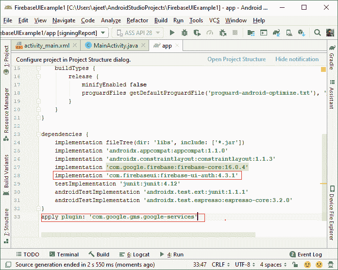
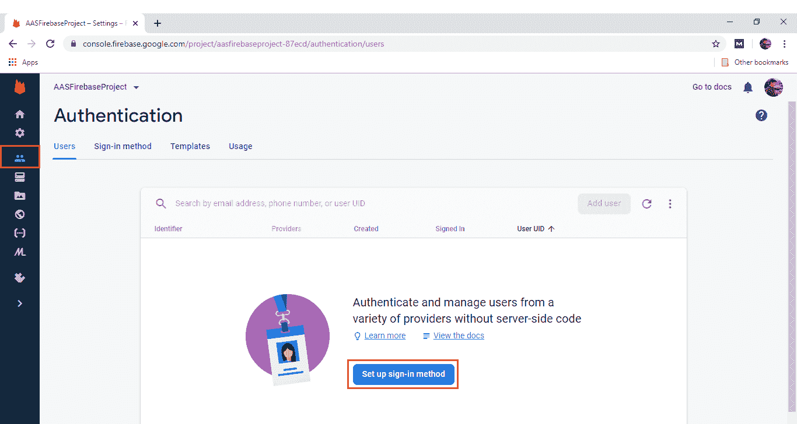
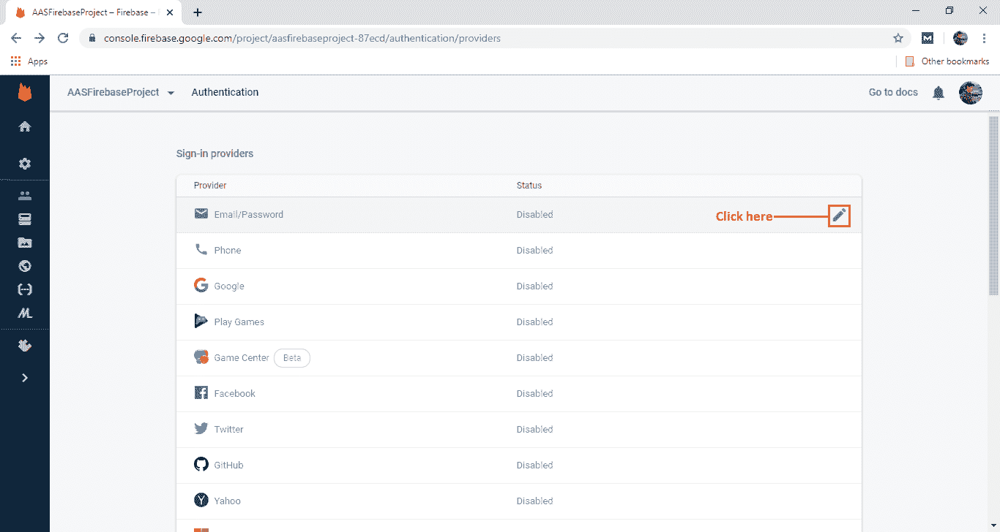
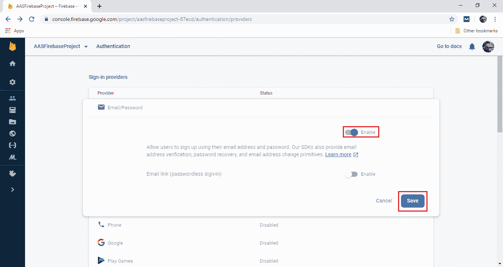
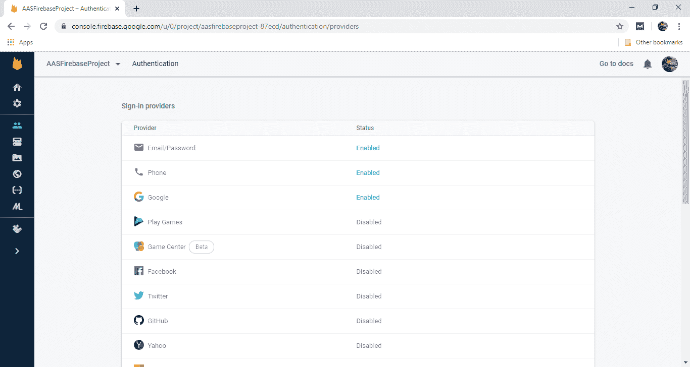
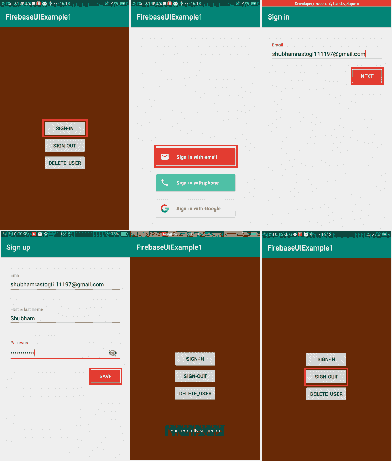
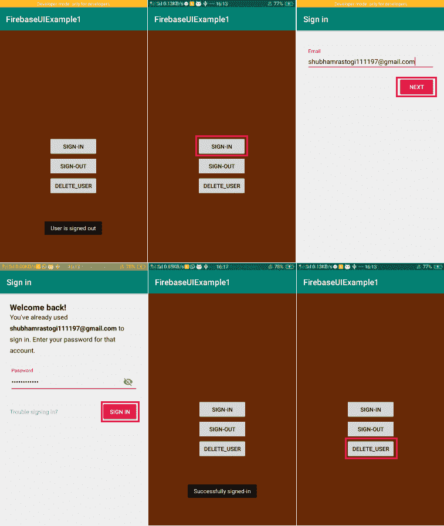
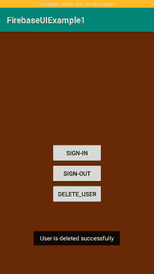

# Firebase 用户界面:使用电子邮件/密码进行身份验证

> 原文：<https://www.javatpoint.com/firebase-ui-authentication-using-email-password>

正如我们之前所讨论的，有两种身份验证方法，即 Firebase UI 和 Firebase SDK。在本节中，我们将学习如何使用 Firebase 用户界面方法使用电子邮件/密码执行身份验证。

Firebase UI 是一个开源库，使用起来非常简单。我们可以定制它，因为它是开源的。它消除了样板代码(代码的一部分必须包含在许多地方，很少或没有改变)，并促进了用户体验和安全性的最佳实践。一个非常简单的API提供了一个简单的删除和身份验证。它可以处理从电子邮件地址和密码到电话号码类型身份提供商(如谷歌)的所有不同身份验证技术来源。它是建立在 Firebase Auth 库之上的。

当我们使用这个库时，最好的做法是最大化我们的应用的登录和注册转换。它为我们的应用为返回的用户启用所有自动点击签名，还处理帐户恢复，帐户链接。

让我们开始一步一步理解这个完整的过程:

**第一步:**

在第一步中，我们将把我们的应用与 firebase 控制台连接起来。要将应用与 Firebase 连接，请通过以下链接[https://www.javatpoint.com/adding-firebase-to-app.](https://www.javatpoint.com/adding-firebase-to-app)

**第二步:**

一旦我们的应用连接到 Firebase，我们的下一步就是导入 Firebase UI 所需的库。

```

implementation 'com.firebaseui:firebase-ui-auth:4.3.1'
apply plugin: 'com.google.gms.google-services'

```



**第三步:**

在下一步中，我们需要设置或启用身份验证方法。为此，我们必须在 Firebase 控制台中启用电子邮件密码身份验证。






**第四步:**

下一步，我们将前往安卓工作室，创建一个登录和注销活动。

**第五步:**

接下来，我们将修改我们的 MainActivity.java 文件。在调用 Firebase 身份验证流之前，我们必须确保我们的应用检查用户是否已经从以前的会话登录。为此，我们必须检查 Firebase 实例，看看是否有人登录。

```

FirebaseAuth auth=FirebaseAuth.getInstance();
if(auth.getCurrentUser()!=null){
    //Already signed in 
}else{
    //Not signed in
}

```

**第六步:**

接下来我们要做的是实际上开始使用 Firebase 用户界面库进行签名。身份验证流的入口点是身份验证用户界面类。我们可以通过**authui . getinstance()**来检索一个 Auth UI 的实例。因此，我们要做的是首先创建登录代码，如下所示:

```

//Creating a sign-in function which is called on button sign-in button click
public void sign_in(View view) {
    FirebaseAuth auth = FirebaseAuth.getInstance();
    if (auth.getCurrentUser() != null) {
        Toast.makeText(getApplicationContext(), "User already sign in signout first", Toast.LENGTH_SHORT).show();
    }else{
        //Choosing Authentication provider
        List providers= Arrays.asList(new AuthUI.IdpConfig.EmailBuilder().build());

        //Creating and launching sign-in intent
        startActivityForResult(AuthUI.getInstance().createSignInIntentBuilder().setAvailableProviders(providers).build(),12345);
    }
} 
```

**第七步:**

我们必须创建 onActivityResult()，因为身份验证用户界面的流有几个响应代码。在这个函数中，我们将检查请求和响应代码。如果它们匹配，用户将成功登录。

```

//Creating onActivityResult and checking response code to make sure we get the right request.
protected void onActivityResult(int requestCode, int resultCode, Intent data) {
    super.onActivityResult(requestCode, resultCode, data);
    //Checking for request code
    if(requestCode==12345){
        //Successfully signed-in
        if(resultCode==RESULT_OK){
            //Getting the current user
            FirebaseUser user=FirebaseAuth.getInstance().getCurrentUser();
            //Showing toast
            Toast.makeText(getApplicationContext(),"Successfully signed-in",Toast.LENGTH_SHORT).show();
        }
    }else{
        //Signed-in failed. If response is null the user canceled the sign-in flow using the back button.
        //respose.getError().getErrorCode() handle the error.
        Toast.makeText(getApplicationContext(),"Unabled to sign in",Toast.LENGTH_SHORT).show();
    }
}

```

**第八步:**

在下一步中，我们将执行注销功能。因为如果用户登录，那么也需要注销。我们将以下列方式创建注销功能:

```

//Creating sign-out function which is called on button sign-out button click
public void sign_out(View view) {
    AuthUI.getInstance().signOut(this).addOnCompleteListener(new OnCompleteListener<Void>() {
        @Override
        public void onComplete(@NonNull Task<Void> task) {
            //User is now signed out
            Toast.makeText(getApplicationContext(),"User is signed out",Toast.LENGTH_SHORT).show();
        }
    });
}

```

**第九步:**

除了登录和注销，我们还可以删除用户。为此，我们需要实现 delete()函数，该函数在按钮单击时调用。这将如下所示:

```

public void delete_user(View view) {
    AuthUI.getInstance().delete(this).addOnCompleteListener(new OnCompleteListener<Void>() {
        @Override
        public void onComplete(@NonNull Task<Void> task) {
            if (task.isSuccessful()) {
                Toast.makeText(getApplicationContext(), "User is deleted successfully", Toast.LENGTH_SHORT).show();
            } else {
                Toast.makeText(getApplicationContext(), "Unsuccessful", Toast.LENGTH_SHORT).show();
            }
        }
    });
}

```

**第十步:**

此步骤用于添加新的提供程序。以前我们使用电子邮件提供商，但我们可以添加更多的提供商，如谷歌，电话号码。这是通过以下方式完成的:

```

List<AuthUI.IdpConfig> providers= Arrays.asList(
        new AuthUI.IdpConfig.EmailBuilder().build(),
        new AuthUI.IdpConfig.PhoneBuilder().build(),
        new AuthUI.IdpConfig.GoogleBuilder().build());

```

为此，我们必须在 Firebase 控制台中启用手机和谷歌提供商。



**输出:**




[Click here to download project](https://static.javatpoint.com/tutorial/firebase/download/FirebaseUIExample1.zip)

* * *