# Firebase 用户界面:使用电子邮件链接进行身份验证

> 原文：<https://www.javatpoint.com/firebase-ui-authentication-using-email-link>

在前一节中，我们学习了如何使用 Firebase 用户界面库来提供电子邮件、电话和谷歌身份验证。同样，我们将学习如何使用 Firebase 用户界面库来提供电子邮件链接/无密码身份验证。

因此，让我们看看一步一步的过程，以了解我们如何使用电子邮件链接/无密码来执行身份验证。这些步骤如下:

**第一步:**

在第一步中，我们将创建一个新项目，并使用手动或谷歌辅助的任何方法向其中添加 Firebase。要将 Firebase 连接到项目，请通过以下链接:[https://www.javatpoint.com/adding-firebase-to-app.](https://www.javatpoint.com/adding-firebase-to-app)

**第二步:**

将 Firebase 连接到我们的应用程序并应用插件后，我们必须在 Firebase 控制台中启用电子邮件链接身份验证。

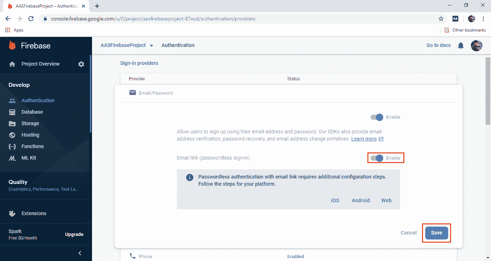

**第三步:**

在下一步中，我们将为电子邮件链接启用动态链接。为此，我们需要添加一个链接。所以只要点击开始。

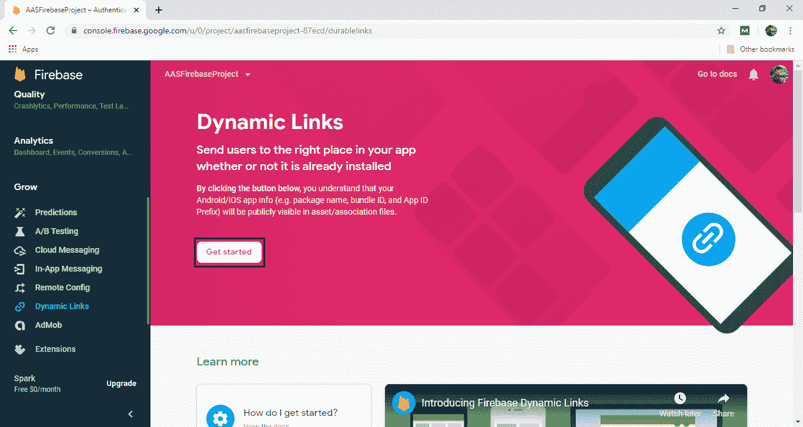

点击开始后，将显示一个新的弹出框。添加一个网址前缀，并确保页面链接在过去没有被使用过。

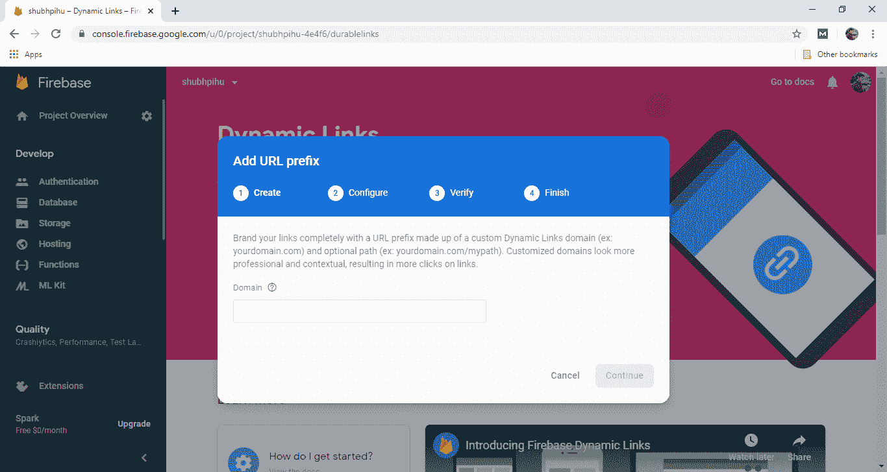
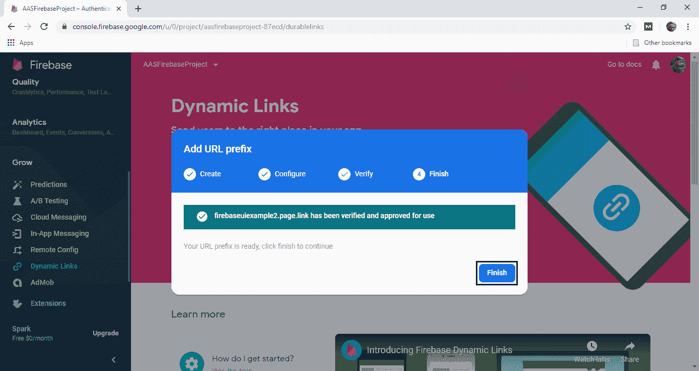

单击“完成”后，将成功创建动态链接

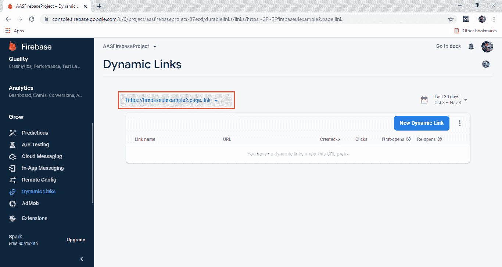

**第四步:**

我们需要做的下一件事是，将域添加到身份验证中。

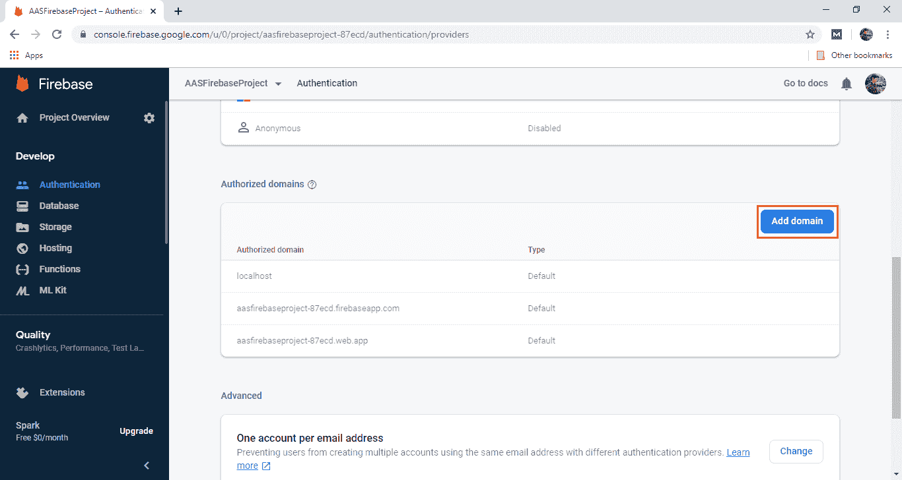

该域将与我们的代码匹配，我们将在 firebase 控制台中添加该代码。/p> 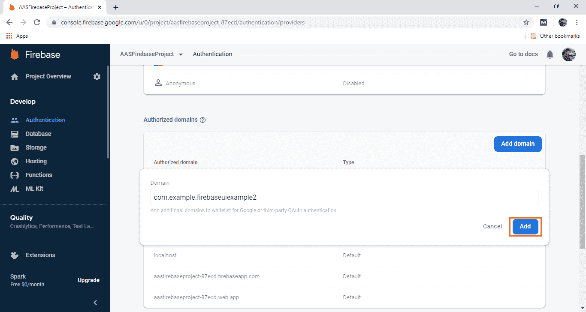

**第五步:**

为了能够抓住链接，我们需要做的最后一件事是设置 SHA-1 和 SHA-256。要了解如何找到这些键，[点击这里](https://www.javatpoint.com/adding-firebase-to-app)。我们将进入我们项目的设置，点击添加指纹。这将用于添加 SHA-1 和 SHA-256。

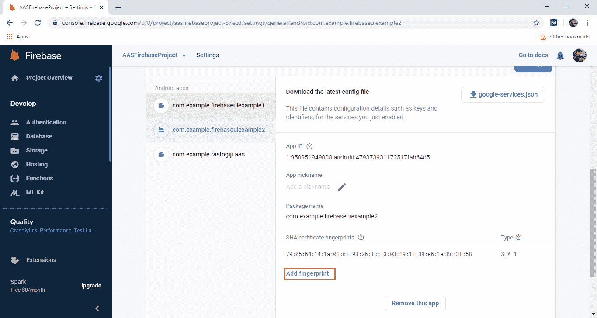
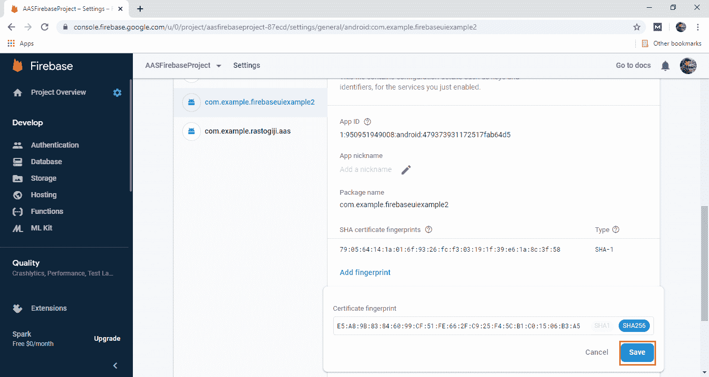
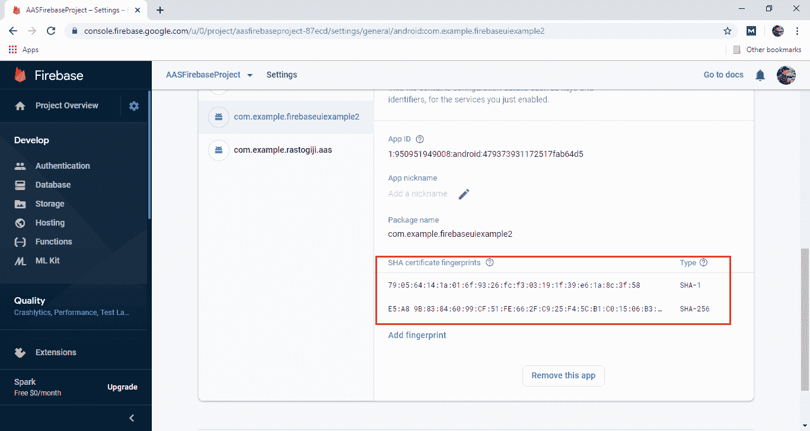

**第六步:**

在下一步中，我们将转到安卓工作室，创建一个用于登录的活动，即一个带有单个按钮的活动。

**第七步:**

我们将为日志创建一个标签。在事件处理程序中，我们将设置我们的动作代码设置对象。这是密码列表登录和电子邮件的主要逻辑。

```

ActionCodeSettings actionCodeSettings = ActionCodeSettings.newBuilder()
        .setAndroidPackageName(getPackageName(),
                true, /* install if not available? */
                null   /* minimum app version */)
        .setHandleCodeInApp(true)
        .setUrl("https://fire.example.com/emailSignInLink")
        .build();

```

**第八步:**

现在，我们将处理回调。我们使用 start activity 以下列方式解决它:

```

startActivityForResult(AuthUI.getInstance()
                .createSignInIntentBuilder()
                .setAvailableProviders(Arrays.asList(new      AuthUI.IdpConfig.EmailBuilder().enableEmailLinkSignIn().
setActionCodeSettings(actionCodeSettings).build())).build(), 1234);

```

**第九步:**

在下一步中，我们将像以前一样创建 onActivityResult():

```

@Override
protected void onActivityResult(int requestCode, int resultCode, Intent data) {
    super.onActivityResult(requestCode, resultCode, data);

    if (requestCode == 12345) {
        if (resultCode == RESULT_OK) {
            // Successfully signed in
            FirebaseUser user = FirebaseAuth.getInstance().getCurrentUser();
            Toast.makeText(getApplicationContext(), "Successfully signed in!", Toast.LENGTH_SHORT).show();

        } else {
            // Sign in failed. If response is null the user canceled the sign-in flow using the back button. Otherwise check
            // response.getError().getErrorCode() and handle the error.
            // ...
            Toast.makeText(getApplicationContext(), "Sign in FAILED", Toast.LENGTH_SHORT).show();
        }
    }
}

```

**第十步:**

我们要做的最后一件事是捕捉动态链接。我们将捕捉 onCreate()函数内部的动态链接。

```

if (AuthUI.canHandleIntent(getIntent())) {
    String link = getIntent().getData().toString();

    List<AuthUI.IdpConfig> providers = Arrays.asList(
            new AuthUI.IdpConfig.EmailBuilder().build());

    Log.d(TAG, "got an email link: " + link);

    if (link != null) {
        startActivityForResult(
                AuthUI.getInstance()
                        .createSignInIntentBuilder()
                        .setEmailLink(link)
                        .setAvailableProviders(providers)
                        .build(),
                12345);
    }
}

```

现在一切都准备好了，是时候运行我们的应用程序了。当我们运行该应用程序时，它将显示以下输出:

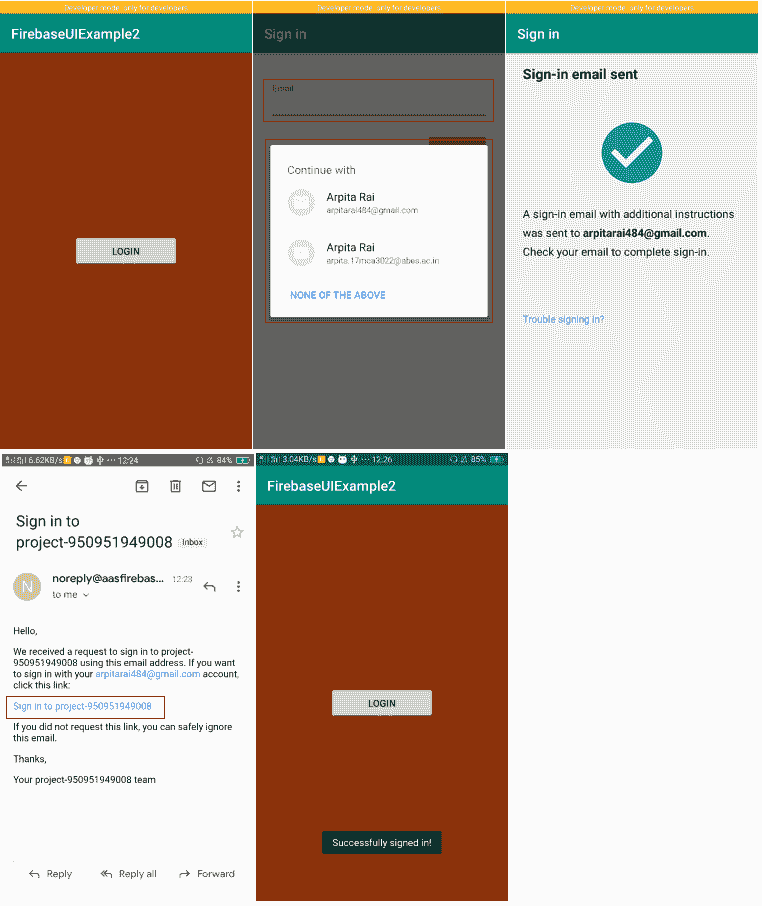
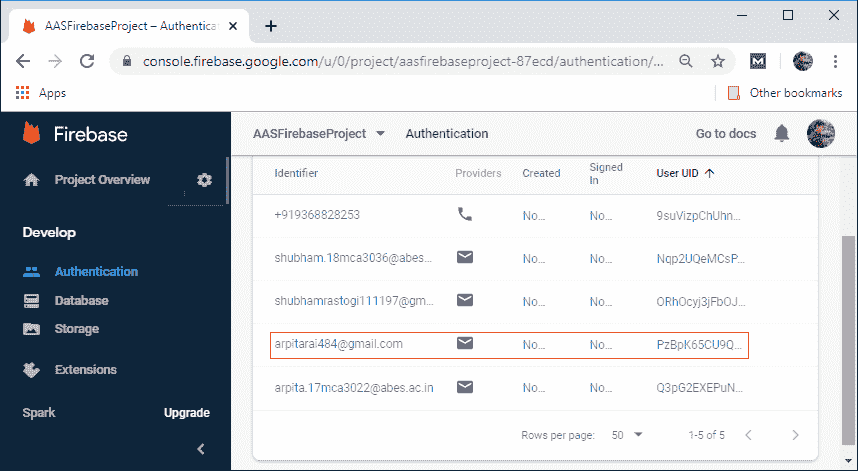
[Click here to download project](https://static.javatpoint.com/tutorial/firebase/download/FirebaseUIExample2.zip)

* * *