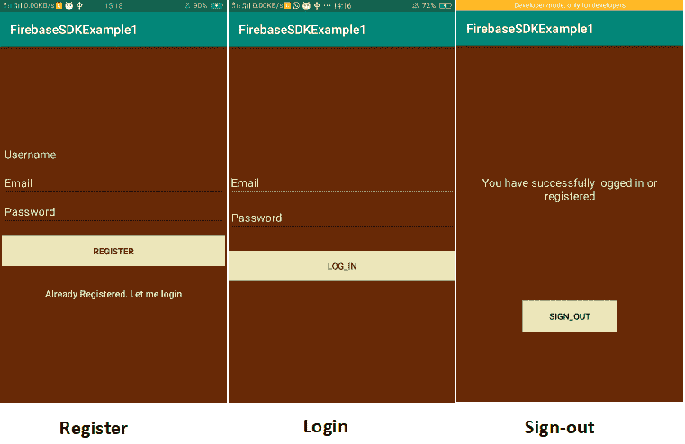
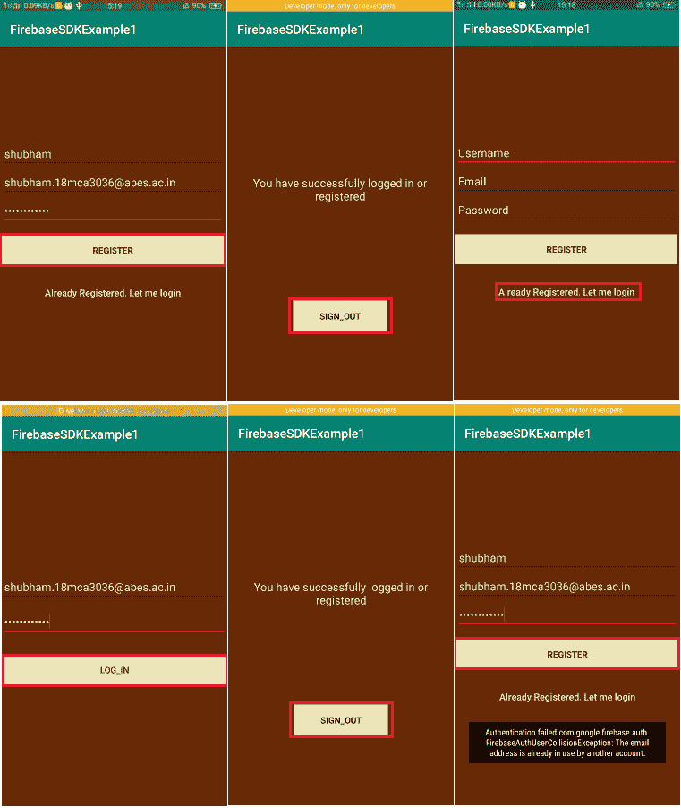
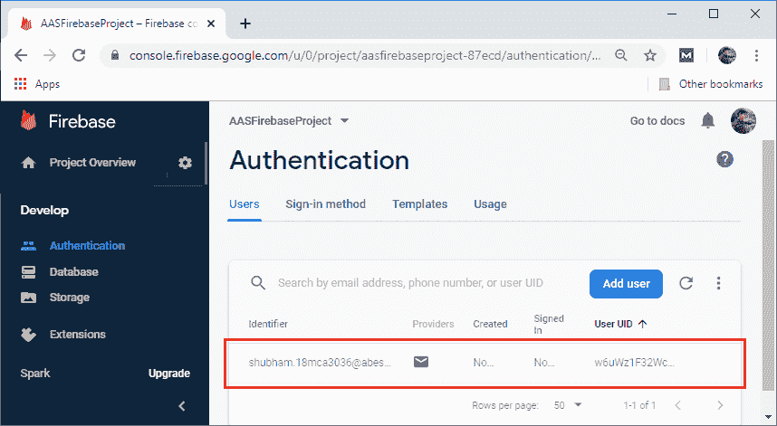

# Firebase SDK:使用电子邮件/密码进行身份验证

> 原文：<https://www.javatpoint.com/firebase-sdk-authentication-using-email-password>

在前面的部分中，我们已经学习了如何使用 Firebase 用户界面对电子邮件/密码或电子邮件链接/无密码进行身份验证。在本节中，我们将了解 Firebase SDK 如何用于身份验证。Firebase SDK 与 Firebase UI 略有相同。让我们看看使用 Firebase SDK 实现电子邮件/密码身份验证的步骤。

**第一步:**

在第一步中，我们必须执行以下初步步骤:

1.  创建一个安卓项目。
2.  创建一个 Firebase 项目。
3.  将 Firebase 添加到安卓项目或应用中，无论是手动还是 Firebase Assistance。
4.  添加所需的库和 JSON 文件。
5.  在 Firebase 控制台中启用电子邮件/密码登录方法。

**第二步:**

完成初步步骤后，我们将创建注册、登录和注销活动。



**第三步:**

下一步，我们将为注册活动编码。代码如下:

**注册**

```

public class MainActivity extends AppCompatActivity {

//Initialization section
EditText email,pass,username;
ProgressBar progressBar;
String userid,Email;
FirebaseAuth auth;	//FirebaseAuth Instance
    @Override
    protected void onCreate(Bundle savedInstanceState) {
        super.onCreate(savedInstanceState);
        setContentView(R.layout.activity_main);
        email=(EditText)findViewById(R.id.email);
        pass=(EditText)findViewById(R.id.password);
        username=(EditText)findViewById(R.id.username);
        progressBar=(ProgressBar)findViewById(R.id.progressBar);
        auth=FirebaseAuth.getInstance();	//Getting instance of FirebaseAuth
    }
    // Checking the current all state
    @Override
    public void onStart() {
        super.onStart();

        // if user logged in, go to sign-in screen
        if (auth.getCurrentUser() != null) {
            startActivity(new Intent(this, Sign_out.class));
            finish();
        }
    }
    @Override
    protected void onResume(){
        super.onResume();
        progressBar.setVisibility(View.GONE);
    }
    // Register button click 
    public void onRegisterClicked(View view) {

        //Fetching data
        String emailInput = email.getText().toString().trim();
        String password = pass.getText().toString().trim();
        final String user = username.getText().toString().trim();

        //Validation check 
        if (TextUtils.isEmpty(user)) {
            Toast.makeText(getApplicationContext(), "Enter username!", Toast.LENGTH_SHORT).show();
            return;
        }
        if (TextUtils.isEmpty(emailInput)) {
            Toast.makeText(getApplicationContext(), "Enter email address!", Toast.LENGTH_SHORT).show();
            return;
        }
        if (TextUtils.isEmpty(password)) {
            Toast.makeText(getApplicationContext(), "Enter password!", Toast.LENGTH_SHORT).show();
            return;
        }
        if (password.length() < 6) {
            Toast.makeText(getApplicationContext(), "Password too short, enter minimum 6 characters!", Toast.LENGTH_SHORT).show();
            return;
        }
        progressBar.setVisibility(View.VISIBLE);

        //create user with email/password by adding complete listener
        auth.createUserWithEmailAndPassword(emailInput, password)
                .addOnCompleteListener(MainActivity.this, new OnCompleteListener<AuthResult>() {
                    @Override
                    public void onComplete(@NonNull Task<AuthResult> task) {
                        Toast.makeText(MainActivity.this, "createUserWithEmail:onComplete:" + task.isSuccessful(), Toast.LENGTH_SHORT).show();
                        progressBar.setVisibility(View.GONE);

                        // If sign-in fails, display a message to the user. If sign-in succeeds
                        // the auth state listener will be notified and logic to handle the
                        // signed in user can be handled in the listener.
                        if (!task.isSuccessful()) {
                            Toast.makeText(MainActivity.this, "Authentication failed." + task.getException(),
                                    Toast.LENGTH_LONG).show();
                            Log.e("MyTag", task.getException().toString());
                        } else {

                            startActivity(new Intent(MainActivity.this, Sign_out.class));
                            finish();
                        }
                    }
                });
    }
    //Login button click 
    public void onLoginClicked(View view) {
        startActivity(new Intent(this, login.class));
    }
}

```

**第四步:**

之后，我们将分别为登录和注销活动编码。代码如下

**登录**

```

public class login extends AppCompatActivity {
    //Declaration section
    EditText email, password;
    ProgressBar progressBar;
    FirebaseAuth auth;

    @Override
    protected void onCreate(Bundle savedInstanceState) {
        super.onCreate(savedInstanceState);
        setContentView(R.layout.activity_login);
        email = (EditText) findViewById(R.id.email);
        password = (EditText) findViewById(R.id.password);
        progressBar = (ProgressBar) findViewById(R.id.progressBar);
        auth = FirebaseAuth.getInstance();	//Getting instances of FirebaseAuth 
    }
    //Checking current user is logging or not 
    @Override
    public void onStart() {
        super.onStart();
        // If user logged in, go to sign-in screen
        if (auth.getCurrentUser() != null) {
            startActivity(new Intent(this, Sign_out.class));
            finish();
        }
    }

    @Override
    protected void onResume() {
        super.onResume();
        progressBar.setVisibility(View.GONE);
    }
    //Login button click
    public void loginButtonClicked(View view) {
        String Email = email.getText().toString();
        final String pass = password.getText().toString();

        //Validation section
        if (TextUtils.isEmpty(Email)) {
            Toast.makeText(getApplicationContext(), "Enter email address!", Toast.LENGTH_SHORT).show();
            return;
        }
        if (TextUtils.isEmpty(pass)) {
            Toast.makeText(getApplicationContext(), "Enter password!", Toast.LENGTH_SHORT).show();
            return;
        }
        progressBar.setVisibility(View.VISIBLE);
        if (password.length() < 6) {
            password.setError("Should be greater than 6");
        }
        //authenticate user with email/password by adding complete listener 
        auth.signInWithEmailAndPassword(Email, pass)
                .addOnCompleteListener(login.this, new OnCompleteListener<AuthResult>() {
                    @Override
                    public void onComplete(@NonNull Task<AuthResult> task) {
                        if (!task.isSuccessful()) {
                            // there was an error
                            Toast.makeText(login.this, "Authentication failed." + task.getException(),
                                    Toast.LENGTH_LONG).show();
                            Log.e("MyTag", task.getException().toString());

                        } else {
                            Intent intent = new Intent(login.this, Sign_out.class);
                            startActivity(intent);
                            finish();
                        }
                    }
                });
    }
}

```

**注销**

```

public class Sign_out extends AppCompatActivity {

    @Override
    protected void onCreate(Bundle savedInstanceState) {
        super.onCreate(savedInstanceState);
        setContentView(R.layout.activity_sign_out);
    }
    public void onLogout(View view){
        FirebaseAuth.getInstance().signOut();
        startActivity(new Intent(this,MainActivity.class));
    }
}

```

**输出:**




[Click here to download project](https://static.javatpoint.com/tutorial/firebase/download/FirebaseSDKExample1.zip)

* * *