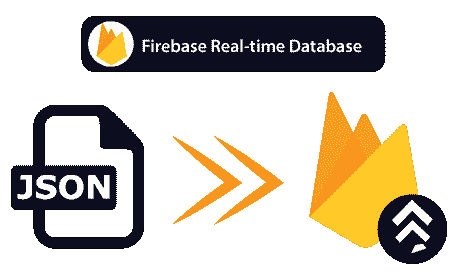

# 实时数据库中的数据组织

> 原文：<https://www.javatpoint.com/data-organization-in-firebase-real-time-database>

在前一节中，我们了解了如何设置 Firebase 控制台和安卓应用来使用实时数据库。在本节中，我们将讨论如何在 Firebase 或 Firebase 实时数据库中组织数据。我们已经知道 Firebase 中的数据是以 JSON 文件格式存储的。那么，JSON 格式在 Firebase 实时数据库中的意义是什么呢？



## 数据库的结构

创建一个结构良好的数据库需要相当多的预先考虑。这意味着我们需要计划如何保存和稍后检索数据，以使该过程尽可能简单。

在 Firebase 实时数据库中，数据存储为 JSON 对象。我们可以将数据库视为云托管的 JSON 树。没有表格和记录，这意味着它是一个 NoSQL 数据库。存储的数据可以表示为数据库中与可用的 JSON 类型相对应的某些本机类型，以帮助我们编写更易维护的代码。当我们向 JSON 树中添加数据时，它会成为现有 JSON 结构中的一个节点，并带有一个关联的键。我们可以提供自己的密钥，如用户 id 或姓名，也可以使用 push()函数提供给我们。

让我们看一个例子来理解 JSON 树的 Firebase 实时数据库中的数据是什么样子的。让我们考虑为聊天应用存储数据的例子。这个聊天应用允许用户存储基本的个人资料和联系人列表。用户配置文件将位于用户/$uid 这样的路径上。用户是其中的一个节点，它有一种与标识相关联的主键。所以，我们可以唯一地访问每一个。

```

{
  "Users": {
         "Student":{
                   "name":"Shubham Rastogi",
	       "contacts":{"Faculty":true},
        },
        "Faculty":{?},
        "Staff":{?}       
  }
} 

```

“用户”下的所有内容对于用户来说都是一个特定的节点，我们将使用像“用户”这样的引用来访问它们。学生，用户。学生和用户。Tsudent 等。这是基本的树结构，它看起来像什么，我们注意到它有很多嵌套。在 Cloud 中，Firestore 没有那么多嵌套，嵌套会导致一些性能问题。

因此，在上面的例子中，学生是用户下的一个节点。姓名和联系人是学生和教师下的节点，而员工是用户下的节点。

## 避免嵌套数据

嵌套会导致某些性能下降。所以，我们要尽可能避免嵌套数据。这是必要的，但我们会避免它，尤其是如果我们有一个大数据集，因为可能会影响性能。我们必须努力使我们的数据结构尽可能扁平。

示例:

```

{
     "Chats":{
          "One":{
               "title":"JavaTpoint",
               "message":{
               "m1":{
                      "sender":"Shubham", "message":"Send your weakly report"
	   }
               "m2":{?}
               //A very long list of messages
               }
          },
          "Two":{?}
     }
}

```

这是一个嵌套性很差的数据结构，因为迭代 Chats 节点的子节点的子节点需要获得一个对话标题列表。因此，这可能需要数百兆字节的消息。在这个例子中，如果我们对数据进行迭代，那么将会有很大的问题。

## 展平数据结构

为了避免嵌套数据，请尝试展平我们的数据结构。将数据分成单独的路径会是更好的方法。因此，它可以根据需要有效地下载单独的呼叫。

```

{
  //Chats contain only meta info about each conversation
  "chats":{
    "one":{
      "title":"JavaTpoint",
      "lastMessage":"Student:whatever",
      "timestamp":1459754193228
    },
    "Two":{...},
    "Three":{...}
  },
  //Messages are seperate from data we may want to iterate quickly but still easily
  // numbered the messages and queried, and organized by chat conversation ID
  "messages":{
    "one":{
      "m1":{
        "name":"Faculty",
          "message":"Send your Report",
          "timestamp":1459754195874
      },
      "m2":{...},
      "m3":{...}
    },
    "Two":{...},
    "Three":{...}
  }  
}

```

* * *