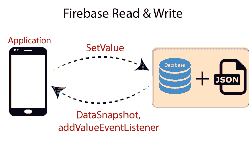
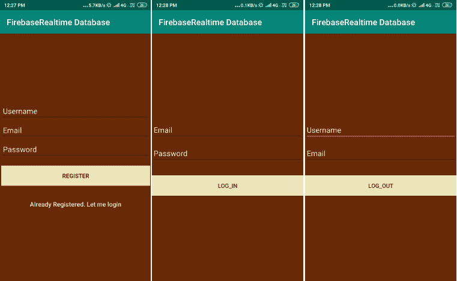
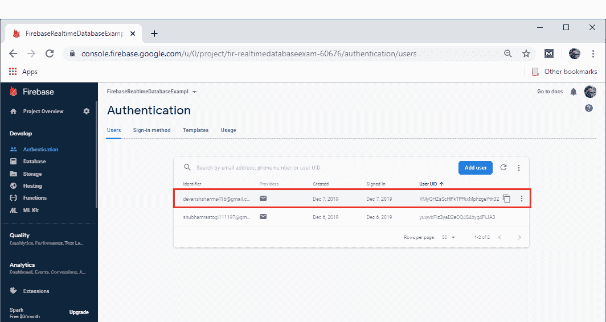
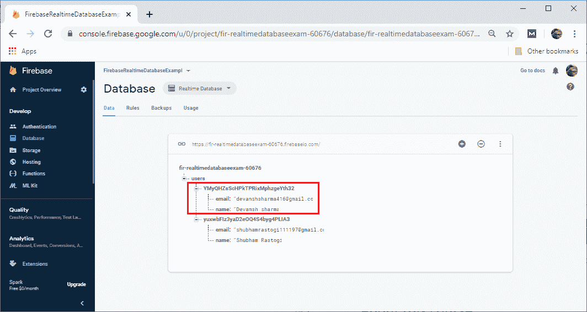

# Firebase:实时数据库读写

> 原文：<https://www.javatpoint.com/firebase-realtime-database-reading-and-writing>

在本节中，我们将学习如何在安卓应用中读写 Firebase 实时数据库。在我们前面的部分，我们创建了一个 android 应用，并添加了 Firebase。我们已经实现了所有需要的库和插件。有一个数据库是我们在命名为 fir-realtimedatabaseexam-60676 之前创建的。



## 写入数据库

在我们的代码中，我们必须使用 getInstance()方法检索数据库的实例，然后引用我们必须写入的位置。我们必须记住，数据库是围绕 JSON 节点组织的。

我们将为引用附加一个异步侦听器。对于数据的初始状态，监听器被触发一次，并且在数据改变时再次被触发。

```

Private lateinit var database:DatabaseReference
//??.
Database=FirebaseDatabase.getInstance().reference
myRef=database.getReference("message")

myRef.setValue("Hello,World!")

```

我们可以保存一系列数据类型(字符串、长整型、双精度型和布尔型等)。)的数据库。这样，我们就可以保存 Kotlin 对象。当我们保存一个对象时，来自任何 getters 的响应将被保存为这个位置和 JSON 格式的子对象。

将用户定义为自定义 java 对象的类带有一个默认构造函数，该构造函数不接受任何参数，并具有要分配的属性的公共 getters。

## 写一个对象

我们将编写一个实际的对象，即用户对象。我们的 User.kotlin 类和签名或注册活动中的用户编写该对象。因此，当我们使用 Kotlin 对象时，对象的内容会以嵌套的方式自动映射到子位置。使用对象，我们使我们的代码更易读、更容易维护，并且更好地编写对象。

```

data class User(
     var username:String?=null,
     var email:String?=null
)

```

我们可以用 setVaue()函数添加用户对象

```

private fun writeNewUser(userId:String, name:String,email:String?)){
     val user=User(name,email)
     database.child("users").child(userId).setValue(user)
}

```

我们可以使用 set value 方法来编写新用户。我们仍然可以在不重写整个对象的情况下更新子对象。

```

databse.child("users").child(userId).child("username").setValue(name)

```

## 读入数据库

要读取路径上的数据，并在数据发生更改时侦听任何更改，我们必须使用 addValueEventListener()或 addListenerForSingleValueEvent()方法向数据库引用添加 ValueEventListener。这两个方法将向数据库引用添加一个 valueEventListener。

我们可以使用 onDataChange()方法读取给定路径上内容的静态快照。它在连接侦听器时触发一次，并在每次数据(包括子级)更改时再次触发。它传递包含该位置所有数据的快照，包括子数据。如果没有数据，当我们调用 exists()时快照将返回 false，当我们调用 getValue()时快照将返回 null

在少数情况下，我们可能希望回调被调用一次，然后立即移除。它对于只需加载一次且预计不会频繁更改或需要主动侦听的数据非常有用。听力确实有一些开销，所以如果我们只需要读一遍，就不需要做回调。

例如，当初始化用户界面元素时，我们并不希望改变它，但是我们希望仅在需要读取数据的一部分时使用 addlistener for single evalueevent()。它不会只改变一次法律。

**示例:**

我们正在实现一个安卓应用。这是一个用户登录和注册应用，有三个 xml 文件和四个 Kotlin 文件。activity_main.xml 用于注册页面。activity_signing.xml 用于登录，activity_welcome.xml 用于从数据库中检索数据。同样，有四个 Kotlin 文件，即主活动、签名、欢迎和用户。

当用户自己注册时，他们被添加到 firebase console 用户部分，相应的数据被存储到数据库中。签名功能与我们在身份验证部分所做的相同。当用户成功注册或注册时，他将切换到欢迎页面，在那里他找到了他的数据。

**activity_main.xml，activity_signing，activity_welcome**



**MainActivity.kt**

```

package com.example.firebaserealtimedatabase

import android.content.Intent
import androidx.appcompat.app.AppCompatActivity
import android.os.Bundle
import android.text.TextUtils
import android.util.Log
import android.view.View
import android.widget.Toast
import com.google.firebase.auth.FirebaseAuth
import com.google.firebase.database.DatabaseReference
import com.google.firebase.database.FirebaseDatabase
import kotlinx.android.synthetic.main.activity_main.*

class MainActivity : AppCompatActivity() {

    //Creating member variables of FirebaseAuth
    private var mAuth: FirebaseAuth?=null

    //Creating member variables of FirebaseDatabase and DatabaseReference
    private var mFirebaseDatabaseInstances: FirebaseDatabase?=null
    private var mFirebaseDatabase: DatabaseReference?=null

    //Creating member variable for userId and emailAddress
    private var userId:String?=null
    private var emailAddress:String?=null

    override fun onCreate(savedInstanceState: Bundle?) {
        super.onCreate(savedInstanceState)
        setContentView(R.layout.activity_main)

        //Get Firebase Instances
        mAuth=FirebaseAuth.getInstance()

        //Get instance of FirebaseDatabase
        mFirebaseDatabaseInstances= FirebaseDatabase.getInstance()

        //if already logged in go to sign in screen
        if(mAuth!!.currentUser!=null){
            startActivity(Intent(this,welcome::class.java))
            finish()
        }
    }

    fun onLoginClicked(view: View) {
        startActivity(Intent(this,Signing::class.java))
        finish()
    }
    //calling onRegisterClicked button
    fun onRegisterClicked(view: View) {
         //Validation checking
        if(TextUtils.isEmpty(username.text.toString())){
            Toast.makeText(applicationContext,"Enter Username!",Toast.LENGTH_LONG).show()
        }
        if(TextUtils.isEmpty(email.text.toString())){
            Toast.makeText(applicationContext,"Enter email address!",Toast.LENGTH_LONG).show()
        }
        if(TextUtils.isEmpty(password.text.toString())){
            Toast.makeText(applicationContext,"Enter password!",Toast.LENGTH_LONG).show()
        }
        if(password.text.toString().length<6){
            Toast.makeText(applicationContext,"Password is too short",Toast.LENGTH_LONG).show()
        }
        //Making progressBar visible
        progressBar!!.visibility=View.VISIBLE

        //creating user
        mAuth!!.createUserWithEmailAndPassword(email.text.toString(),password.text.toString())
            .addOnCompleteListener(this){task ->
                Toast.makeText(this,"createUserWithEmail:onComplete"+task.isSuccessful,Toast.LENGTH_SHORT).show()
                progressBar.visibility=View.GONE

                // When the sign-in is failed, a message to the user is displayed. If the sign-in is successful, auth state listener will get notified, and logic to handle the signed-in user can be handled in the listener. 
                if(task.isSuccessful){

                    //Getting reference to ?users? node
                    mFirebaseDatabase=mFirebaseDatabaseInstances!!.getReference("users")

                    //Getting current user from FirebaseAuth 
                    val user=FirebaseAuth.getInstance().currentUser

                    //add username, email to database
                    userId=user!!.uid
                    emailAddress=user.email

                    //Creating a new user
                    val myUser=User(username.text.toString(),emailAddress!!)

                     //Writing data into database using setValue() method
                    mFirebaseDatabase!!.child(userId!!).setValue(myUser)

                    startActivity(Intent(this,welcome::class.java))
                    finish()
                }else{
                    Toast.makeText(this,"Authentication Failed"+task.exception,Toast.LENGTH_SHORT).show()
                    Log.e("MyTag",task.exception.toString())
                }
            }
    }
}

```

**欢迎. kt**

```

package com.example.firebaserealtimedatabase

import android.content.Intent
import android.nfc.Tag
import androidx.appcompat.app.AppCompatActivity
import android.os.Bundle
import android.util.Log
import android.view.View
import androidx.constraintlayout.solver.widgets.Snapshot
import com.google.firebase.auth.FirebaseAuth
import com.google.firebase.database.*
import kotlinx.android.synthetic.main.activity_main.*

class welcome : AppCompatActivity() {

    //Creating member variables
    private var mFirebaseDatabase: DatabaseReference?=null
    private var mFirebaseInstance: FirebaseDatabase?=null

    var userId:String?=null

    override fun onCreate(savedInstanceState: Bundle?) {
        super.onCreate(savedInstanceState)
        setContentView(R.layout.activity_welcome)

        //Getting instances of FirebaseDatabase
        mFirebaseInstance= FirebaseDatabase.getInstance()

        //get reference to 'users' node
        mFirebaseDatabase=mFirebaseInstance!!.getReference("users")

        val user=FirebaseAuth.getInstance().currentUser

        //add it only if it is not saved to database
        if (user != null) {
            userId=user.uid
        }
        addUserChangeListener()
    }
    private fun addUserChangeListener(){

        //User data change Listener
        mFirebaseDatabase!!.child(userId!!).addValueEventListener(object: ValueEventListener{
            override fun onDataChange(dataSnapshot: DataSnapshot){
                val user=dataSnapshot.getValue(User::class.java)

                //Check for null
                if(user==null){
                    Log.e(TAG,"User data is null")
                    return
                }
                Log.e(TAG,"User data is changed!"+user.name+","+user.email)

                //Display newly updated name and email
                email.setText(user.email)
                username.setText(user.name)

            }
            override fun onCancelled(error: DatabaseError){
                //Failed to read value
                Log.e(TAG,"Failed to read user",error.toException())
            }
        })
    }
    fun onLogout(view: View) {
        FirebaseAuth.getInstance().signOut()
        startActivity(Intent(this, MainActivity::class.java))
    }
    companion object{
        private val TAG=database::class.java.simpleName
    }
}

```

**User.kt**

```

package com.example.firebaserealtimedatabase

import androidx.appcompat.app.AppCompatActivity
import android.os.Bundle

class User{

    lateinit var name:String
    lateinit var email:String

    //Default constructor required for calls to
    //DataSnapshot.getValue(User.class)
    constructor(){

    }

    constructor(name:String,email:String){
        this.name=name
        this.email=email
    }
}

```

**签约. kt**

```

package com.example.firebaserealtimedatabase

import android.content.Intent
import androidx.appcompat.app.AppCompatActivity
import android.os.Bundle
import android.text.TextUtils
import android.util.Log
import android.view.View
import android.widget.Toast
import com.google.firebase.auth.FirebaseAuth
import kotlinx.android.synthetic.main.activity_main.*

class Signing : AppCompatActivity() {

    private var mAuth: FirebaseAuth?=null

    override fun onCreate(savedInstanceState: Bundle?) {
        super.onCreate(savedInstanceState)
        setContentView(R.layout.activity_signing)

        //Initialize Firebase Auth
        mAuth=FirebaseAuth.getInstance()
    }

    public override fun onStart() {
        super.onStart()

        //if user logged in, go to sign in screen
        if(mAuth!!.currentUser!=null){
            startActivity(Intent(this,welcome::class.java))
            finish()
        }
    }

    override fun onResume() {
        super.onResume()
        progressBar.visibility= View.GONE
    }

    fun loginButtonClicked(view: View){
        if(TextUtils.isEmpty(email.text.toString())){
            Toast.makeText(applicationContext,"Enter Username!", Toast.LENGTH_LONG).show()
            return
        }
        if(TextUtils.isEmpty(password.text.toString())){
            Toast.makeText(applicationContext,"Enter password!", Toast.LENGTH_LONG).show()
            return
        }
        progressBar.visibility=View.VISIBLE

        //Authenticate user
        mAuth!!.signInWithEmailAndPassword(email.text.toString(),password.text.toString())
            .addOnCompleteListener(this){task ->

                progressBar.visibility=View.GONE

                if(task.isSuccessful){
                    val intent=Intent(this,welcome::class.java)
                    startActivity(intent)
                    finish()
                }else{
                    if(password.text.toString().length<6){
                        password.error="Password is too short, enter minimum 6 characters"
                    }
                    Toast.makeText(this,"Authentication Failed"+task.exception,Toast.LENGTH_SHORT).show()
                }
            }
    }
}

```


[Click here to download project](https://static.javatpoint.com/tutorial/firebase/download/Read and write.zip)

* * *